# 基于RGBD视觉信息的异常行为识别

## 1. 三维相机

### 1.1 概念

[RGB-D｜深度图像 - 知乎 (zhihu.com)](https://zhuanlan.zhihu.com/p/344043024)

- 3D相机又称RGB-D相机。3D相机通常有多个摄像头+深度传感器组成，不仅能够获得平面图像，还可以获得拍摄对象的深度信息，即三维位置及尺寸等。

- 深度图像 = 普通RGB三通道彩色图像 + 深度图

- 深度图：包含与视点场景对象表面距离有关信息的图像通道，通道本身类似于灰度图像，每个像素值是物体到离摄像头平面最近的距离（**相机坐标系的z值**）

  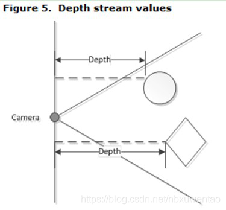

- RGB图和深度图之间需要对齐，保证像素之间一一对应
  如kinect2获得的数据：RGB图像大小：（1080, 1920） 深度图像大小：（424, 512）

  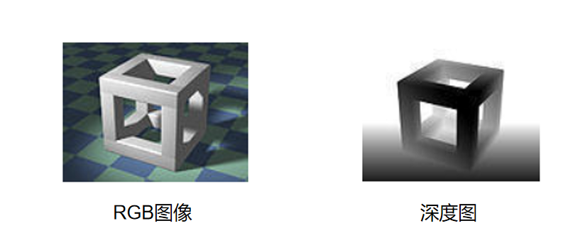

### 1.2 分类（根据原理）

[清华创业团队发布 3D 视觉技术白皮书，万字长文详述ToF | 附PDF完整版下载 - AMiner](https://www.aminer.cn/research_report/5e9676eaab6e30e67b2c7856)

#### 1.2.1 双目视觉

- 原理：根据块匹配方法（SGBM），得到每个像素在两幅图中的一一对应关系。在已知两个相机间距等相对位置关系的情况下，即可通过相似三角形的原理计算出被摄物到相机的距离。
- 缺点：依赖于被拍摄物体的表面纹理和环境光照。如下情况会遇到无法找到匹配的对应像素的问题：
  - 在表面没有任何纹理的物体时，例如拍摄一面白墙
  - 或者当拍摄环境的光照很弱的情况下，例如黑灯环境下

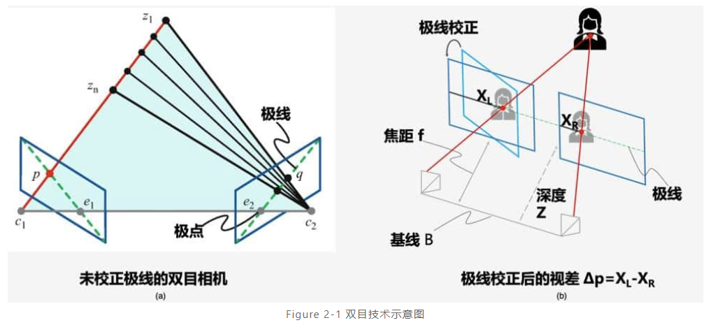


#### 1.2.2 结构光

- 原理：结构光技术就是使用提前设计好的具有特殊**结构的图案**（比如离散光斑、条纹光、编码结构光等），然后将图案投影到三维空间物体表面上，使用另外一个相机观察在三维物理表面成像的畸变情况。如果结构光图案投影在该物体表面是一个平面，那么观察到的成像中结构光的图案就和投影的图案类似，没有变形，只是根据距离远近产生一定的尺度变化。但是，如果物体表面不是平面，那么观察到的结构光图案就会因为物体表面不同的几何形状而产生不同的扭曲变形，而且根据距离的不同而不同，根据已知的结构光图案及观察到的变形，就能根据算法计算被测物的三维形状及深度信息。

  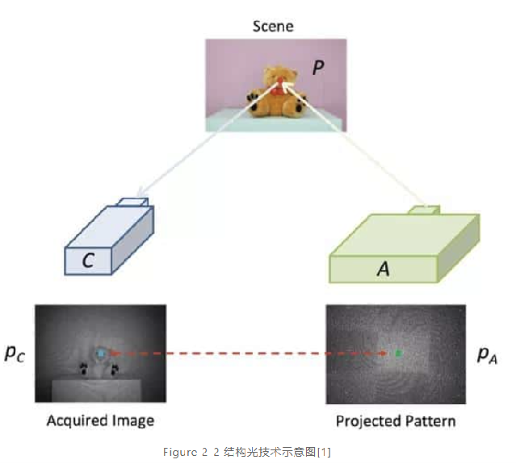

- 结构化图案：

  - 直接编码（光谱）
  - 时分复用编码
  - 空分复用编码

#### 1.2.3 光飞行时间法(TOF）

- 原理：连续发射不可见光脉冲到被测物体上，接受从物体反射回的光脉冲，探测光脉冲的飞行时间计算被测物体距离。

- i-ToF，即 indirect ToF，通过传感器在不同时间窗口采集到能量值的比例关系，解析出信号相位，间接测量发射信号和接收信号的时间差，进而得到深度。

  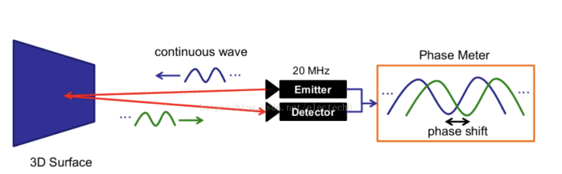

- d-ToF 即 direct ToF，相比于 i-ToF 技术用测量信号的相位来间接地获得光的来回飞行时间，d-ToF (direct time-of-flight) 技术直接测量光脉冲的发射和接收的时间差。

  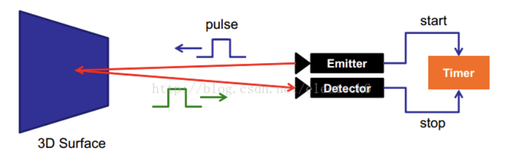

- 优点：可调节发射脉冲的频率改变测量距离；测量精度不会随着测量距离增大而降低；抗干扰能力强；适合距离比较远的(无人驾驶

- 缺点：功耗大；分辨率低深度图质量差

### 1.3 总结

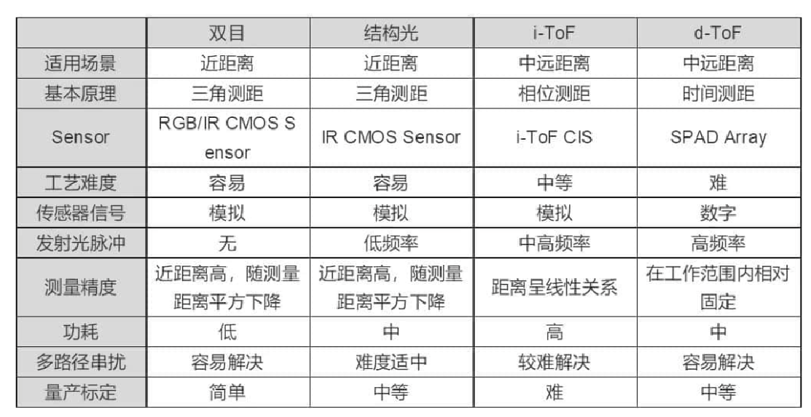

## 补充1 3D数据表示

图中是3D数据的不同表示类型:（a）点云（Point clouds）；(b) 体素网格(Voxel grids)； (c) 多边形网格(Polygon meshes)； (d) 多视图表示(Multi-view representations)

其中：

- a. 点云是三维空间(xyz坐标)点的集合。
- b. 体素是3D空间的像素。量化的，大小固定的点云。每个单元都是固定大小和离散坐标。
- c. mesh是面片的集合。
- d. 多视图表示是从不同模拟视点渲染的2D图像集合。

理解：体素网格是用固定大小的立方块作为最小单元，来表示三维物体的一种数据结构。
体素可以看成粗略版的点云。

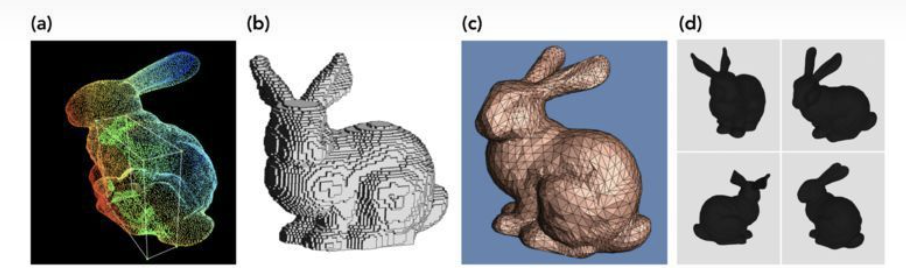


## 补充2 相机四大坐标系

[相机标定（1）——四个坐标系_白水煮蝎子-CSDN博客_相机主点坐标](https://blog.csdn.net/weixin_44278406/article/details/112986651)

> 版权声明：本文为博主原创文章，遵循 CC 4.0 BY-SA 版权协议，转载请附上原文出处链接和本声明。
> 本文链接：https://blog.csdn.net/weixin_44278406/article/details/112986651

### 1. 前言

为了描述相机的几何成像关系，需要进行数学建模，这些几何模型参数就是相机参数，包括内参和外参，而求解参数的过程就称为相机标定。所介绍的相机模型是计算机视觉中广泛使用的针孔模型。这种模型在数学上是三维空间到二维平面的中心投影。

### 2. 四个坐标系

- **图像像素坐标系：**表示三维空间物体在图像平面上的投影，像素是离散化的，其坐标原点在CCD图像平面的左上角，u轴平行于CCD平面水平向右，v轴垂直于u轴向下，坐标使用( u , v )来表示。图像宽度W，高度H。
- **图像物理坐标系：**坐标原点在CCD图像平面的中心，x , y 轴分别平行于图像像素坐标系的( u , v )轴，坐标用( x , y ) 表示。
- **相机坐标系：**以相机的光心为坐标系原点， 轴平行于图像坐标系的x , y 轴，相机的光轴为Z c 轴，坐标系满足右手法则。相机的光心可理解为相机透镜的几何中心。
- **世界坐标系：**用于表示空间物体的绝对坐标，使用**( X w , Y w , Z w )** 表示，世界坐标系可通过旋转和平移得到相机坐标系。

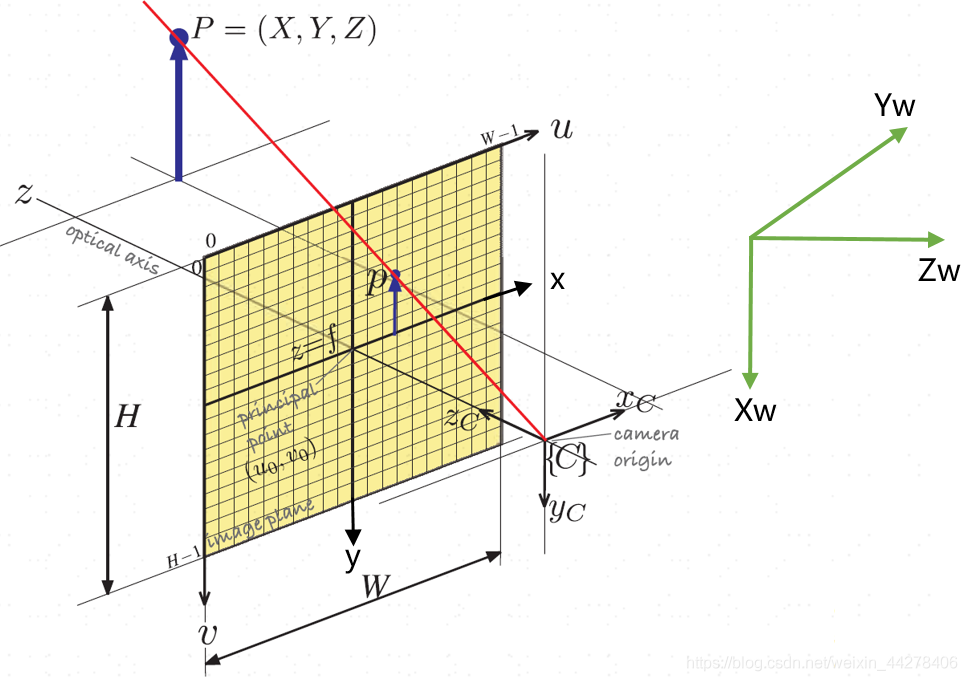

### 3. 世界坐标系-相机坐标系

刚体变换只改变物体的空间位置(平移)和朝向(旋转)，而不改变其形状的变换，可用两个变量来描述：正交单位旋转矩阵R RR，三维平移矢量t 。平移比较好理解，世界坐标系原点移动到相机坐标系；旋转一共有三个自由度，即绕x , y , z旋转，根据旋转角度可以分别得三个方向上的旋转矩阵R x , R y , R z，而旋转矩阵即为他们的乘积，R = R x × R y × R z

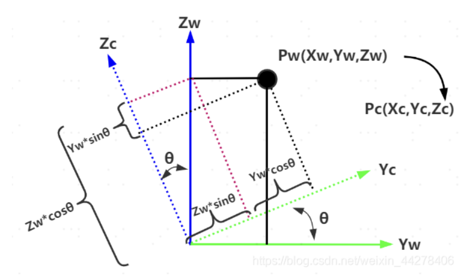

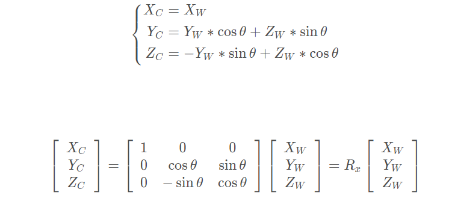

同理可求的Ry,Rz，于是可得旋转矩阵R = R x R y R z ，其中**[*R*∣*t*]为外参**，总的转换公式：

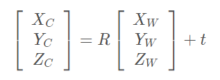

写成齐次坐标系形式为：

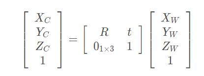

### 4. 相机坐标系-图像坐标系

**以图象中心为坐标系：**相机坐标系到图像坐标系是透视关系，利用相似三角形进行计算：

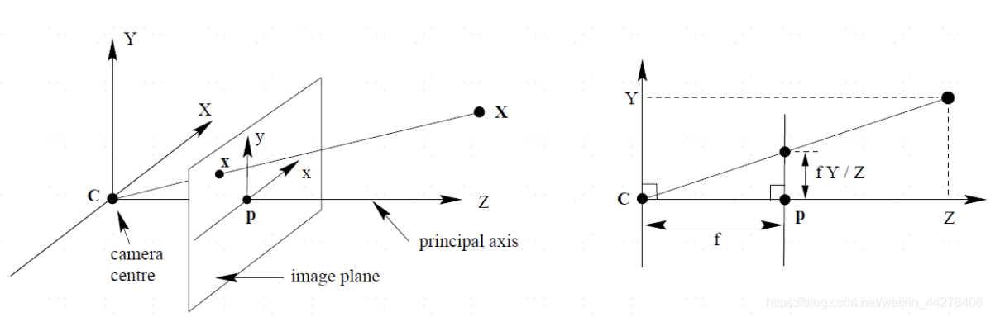

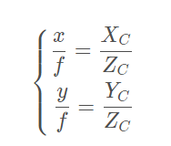

写成齐次坐标形式的矩阵相乘为，其中**K 称为相机内参数矩阵**。

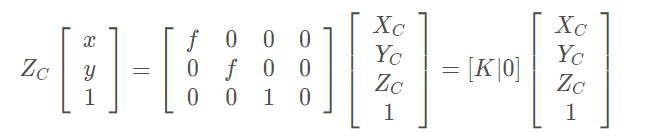

**当主点不是坐标系原点时**，相机内参数矩阵形式如下：

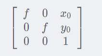

### 5. 图像坐标系-像素坐标系

像素坐标系是图像坐标系的离散化表示，实际CCD相机每个像素对应一个感光点，是个矩形，假设其物理尺寸为**dx宽**，**dy高**。以CCD传感器的左上角为坐标原点建立的坐标系与以成像平面中心建立的坐标系的转换关系如下。

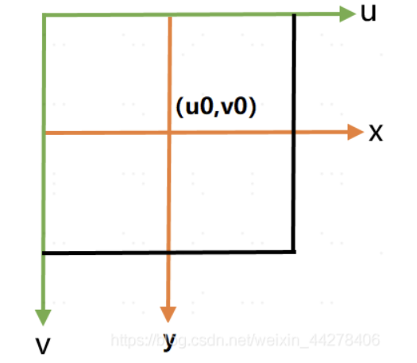

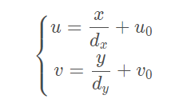

齐次坐标矩阵形式为：

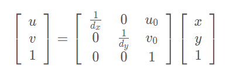

### 6. 综合（像素坐标系-世界坐标系）

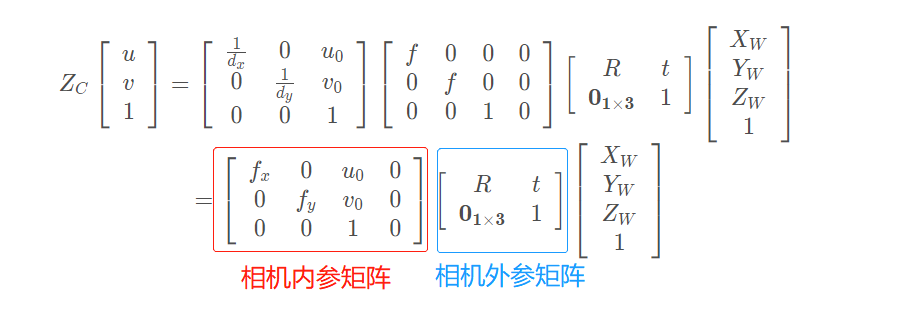

## 2. 点云数据

### 2.1 概念

[绪论：什么是点云？ - 知乎 (zhihu.com)](https://zhuanlan.zhihu.com/p/22581673)

- 点云数据是指在一个三维坐标系统中的一组**向量的集合**。这些向量通常以X,Y,Z三维坐标的形式表示，而且一般主要用来代表一个物体的外表面形状。不经如此，除**（X,Y,Z）**代表的几何位置信息之外，点云数据还可以表示一个点的RGB颜色，灰度值，深度，分割结果等。
- 来源：三维激光雷达扫描、深度相机
- 应用：三维重建、自动驾驶、城市规划、考古文物保护、医学影像、测绘等领域
- 点云有三个主要特征：
  - **无序性**：虽然输入的点云是有顺序的，但是显然这个顺序不应当影响结果。
  - **点之间的交互**：每个点不是独立的，而是与其周围的一些点共同蕴含了一些信息，因而模型应当能够抓住局部的结构和局部之间的交互。
  - **变换不变性**：比如点云整体的旋转和平移不应该影响它的分类或者分割

### 2.2 深度图像转点云

解读：

[Computer Vision Group - File Formats (tum.de)](https://vision.in.tum.de/data/datasets/rgbd-dataset/file_formats)

[相机标定(2)---摄像机标定原理_不系之舟的专栏-QQ讨论群331590339-CSDN博客](https://blog.csdn.net/lixianjun913/article/details/10032019)

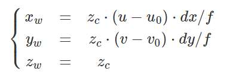

```python
fx = 525.0  # focal length x
fy = 525.0  # focal length y
cx = 319.5  # optical center x
cy = 239.5  # optical center y

factor = 5000 # for the 16-bit PNG files
# OR: factor = 1 # for the 32-bit float images in the ROS bag files

for v in range(depth_image.height):
  for u in range(depth_image.width):
    Z = depth_image[v,u] / factor;
    X = (u - cx) * Z / fx;
    Y = (v - cy) * Z / fy;
```

### 2.3 点云数据预处理

[点云数据预处理 FAQ - 知乎 (zhihu.com)](https://zhuanlan.zhihu.com/p/89114456)

[PCL(Point Cloud Library)学习指南&资料推荐（2022版） - 知乎 (zhihu.com)](https://zhuanlan.zhihu.com/p/268524083)

（可以使用现成库对点云数据处理）

#### 2.3.1 采样

[Python点云数据处理(四)点云下采样 - 知乎 (zhihu.com)](https://zhuanlan.zhihu.com/p/353761080)

由于点云的海量和无序性，直接处理的方式在对邻域进行搜索时需要较高的计算成本。一个常用的解决方式就是对点云进行下采样，将对全部点云的操作转换到下采样所得到的点上，降低计算量。

点云采样有很多方法，一般有体素网格采样，均匀采样，曲率采样，随机采样，曲面采样，泊松磁盘采样等。

- **体素网格下采样**

  体素下采样就是把三维空间体素化，每个小体素包含了若干个点，取中心点或重心为采样点（可取平均值）。需要注意的是：有些grid内可能没有点，所以，downsample后，点的个数，一般小于grid的个数。

  采样后点数不固定，可以使用随机取样方法：

  ```python
  np.random.choice(num, NUM_POINT, replace=True)  #当前点云个数<需要个数，replace为true重复采样
  np.random.choice(num, NUM_POINT, replace=False) #当前点云个数>需要个数，replace为false重复采样
  ```

- **均匀下采样**

  均匀下采样有多种不同的采样方式，其中**最远点采样**是较为简单的一种，首先需要选取一个种子点，并设置一个内点集合，每次从点云中不属于内点的集合找出一点距离内点最远的点，如下图，这里的距离计算方式为**该点至内点所有点的最小距离**。这种方式的下采样点云分布均匀，但是算法复杂度较高效率低。**采样点一般先分布在边界附近**。

  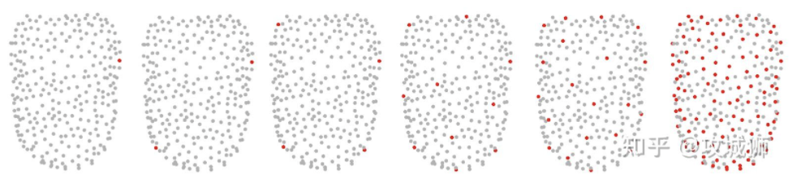

- **曲率下采样**

  稳定性高，通过几何特征区域的划分，使得采样结果抗噪性更强

  在点云曲率越大的地方，采样点个数越多。输入是一个点云，目标采样数S，采样均匀性U。具体方法如下：

  1. 点云曲率计算比较耗时，这里我们采用了一个简单方法，来近似达到曲率的效果：**给每个点计算K邻域，然后计算点到邻域点的法线夹角值。曲率越大的地方，这个夹角值就越大。**

  2. 设置一个角度阈值，比如5度。点的邻域夹角值大于这个阈值的点，被放入几何特征区域G。这样点云就分成了两部分，几何特征区域G和其它区域。

  3. 均匀采样几何特征区域G和其它区域，采样数分别为S * (1 - U)，S * U。

     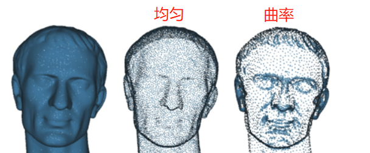

#### 2.3.2 归一化

数据归一化后，最优解的寻优过程明显会变得平缓，更容易正确的收敛到最优解。

- **xyz坐标**：

1. 在3d空间中找一个能包含所有点的最小的立方体，立方体的三条边与xyz轴平行。找到这个立方体的下表面的中心点，以这个点作为归一化的参考点。所有点的坐标，减去参考点的坐标。**（找参考点算相对坐标）**
2. 可以进一步将x、y、z归一化到[-1, 1]之间。

- **颜色值：**

1. 一般归一化到[-1, 1]之间。

- **pointnet源码归一化及反归一化：**

  [PointNet系列点云归一化与反归一化_m0_37718643的博客-CSDN博客](https://blog.csdn.net/m0_37718643/article/details/122144764)

```python
def pc_normalize(pc):
    """
    对点云数据进行归一化
    :param pc: 需要归一化的点云数据
    :return: 归一化后的点云数据
    """
    # 求质心，也就是一个平移量，实际上就是求均值
    centroid = np.mean(pc, axis=0)
    pc = pc - centroid
    m = np.max(np.sqrt(np.sum(pc ** 2, axis=1)))
    # 对点云进行缩放
    pc = pc / m
    return pc


"""
点云的反归一化：
由于点云的归一化操作，会使得PointNet预测的结果比原始点云尺寸不同，
为了恢复原始大小，可以将预测得到的点云进行反归一化，即使得到的点云乘上缩放尺寸m，再加上平移尺寸centroid。
"""
ret = pred × m + centroid
```

#### 2.3.3 数据增强

Data augmentation可以增强模型的范化能力。一般的方式有：

- 一个batch内，选一定比例的点云，绕z轴随机旋转(0 - 360)度
- 一个batch内，选一定比例的点云，分别绕x、y、z随机旋转一个小的角度，比如20度左右
- 一个batch内，所有点进行随机抖动（jitter）

#### 2.3.4 常用点云处理库

- **open3D**

  - [ ] TOLEARN

  [爆肝5万字❤️Open3D 点云数据处理基础（Python版）_NOIF-CSDN博客](https://blog.csdn.net/weixin_46098577/article/details/120167360)

  [python点云处理算法汇总(长期更新版)_点云侠的博客-CSDN博客_python 点云](https://blog.csdn.net/qq_36686437/article/details/113407090)

  [Open3D 点云处理方法示例 - Python版 - 知乎 (zhihu.com)](https://zhuanlan.zhihu.com/p/266428745)

  [教程：Python Open3d 完成 ICP 点云配准_成畅的博客-CSDN博客_open3d点云配准](https://blog.csdn.net/weixin_42488182/article/details/105196148#:~:text=Open3D 是一个在Python和C%2B%2B平台上的三维数据处理与可视化库。 它由 Qian-Yi Zhou，Jaesik Park， 以及 Vladlen,其中 Zhou 博士在中国清华大学取得硕士学位，并分别在 USC 和Stanford 取得了博士以及博士后学位，目前在在旧金山的 Forma 公司担任首席研发官。)

- **PCL**

  

### 2.4 点云处理相关算法

[3D点云模型总结_一只不出息的程序员的博客-CSDN博客_点云模型](https://blog.csdn.net/qq_43232556/article/details/106653145)

#### 2.4.1 Farthest Point Sampling（FPS）

[Farthest Point Sampling (FPS)算法核心思想解析 - 知乎 (zhihu.com)](https://zhuanlan.zhihu.com/p/114522377)

- 目前很多流行的点云模型结构里面，都用到了FPS算法，如pointnet++ 。
- 最远距离采样，同上均匀采样，点云有n个点，去掉重复计算优化后算法复杂度为 O(n^2)
- **步骤：**
  1. 以点云第一个点，作为查询点，从剩余点中，取一个距离最远的点；
  2. 继续以取出来的点，作为查询点，从剩余点中，取距离最远的点。此时，由于已经取出来的点的个数大于1，需要考虑已经选出来的点集中的每个点。计算逻辑如下：
     - 对于任意一个剩余点，计算该点到已经选中的点集中所有点的距离；
     - 取最小值，作为该点到点集的距离；
     - 计算出每个剩余点到点集的距离后，取距离最大的那个点。
  3. 重复第2步，一直采样到目标数量N为止。

#### 2.4.2 PointNet（2017 CVPRR）

> PointNet: Deep Learning on Point Sets for 3D Classification and Segmentation

[细嚼慢咽读论文：PointNet论文及代码详细解析 - 知乎 (zhihu.com)](https://zhuanlan.zhihu.com/p/264627148)

- **步骤：**

1. 输入为一帧的全部点云数据的集合，表示为一个nx3的2d tensor，其中n代表点云数量，3对应xyz坐标。
2. 输入数据先通过和一个T-Net学习到的转换矩阵相乘来对齐，保证了模型的对特定空间**转换的不变性。**
3. 通过多次mlp对各点云数据进行特征提取后，再用一个T-Net对特征进行对齐。
4. 在特征的各个维度上执行maxpooling操作来得到最终的全局特征。**（针对点云无序性使用对称函数）**
5. 对分类任务，将全局特征通过mlp来预测最后的分类分数；对分割任务，将全局特征和之前学习到的各点云的局部特征进行串联，再通过mlp得到每个数据点的分类结果。

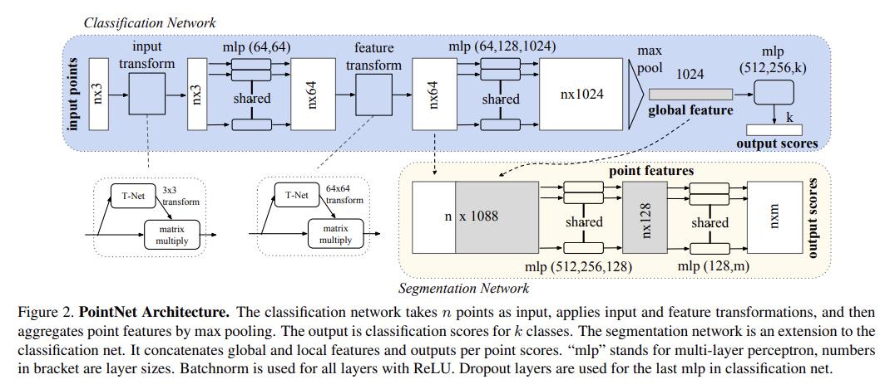

- **两个定理：**

  - [ ] TOLEARN

  - 定理1证明了PointNet的网络结构能够拟合任意的连续集合函数。
  - 定理2说明对于任何输入数据集，都存在一个关键集和一个最大集，使得对和之间的任何集合，其网络输出都和一样。

#### 2.4.3 PointNet++（2017 NIPS）

> PointNet++: Deep Hierarchical Feature Learning on Point Sets in a Metric Space

[搞懂PointNet++，这篇文章就够了！ - 知乎 (zhihu.com)](https://zhuanlan.zhihu.com/p/266324173)

- encoder-decoder结构

- PointNet因为是只使用了MLP和max pooling，没有能力捕获局部结构，因此在细节处理和泛化到复杂场景上能力很有限。PointNet++改进：
  - point-wise MLP，仅仅是对每个点表征，对局部结构信息整合能力太弱 --> **PointNet++的改进：sampling和grouping整合局部邻域**
  - global feature直接由max pooling获得，无论是对分类还是对分割任务，都会造成巨大的信息损失 --> **PointNet++的改进：hierarchical feature learning framework，通过多个set abstraction逐级降采样，获得不同规模不同层次的local-global feature**
  - 分割任务的全局特征global feature是直接复制与local feature拼接，生成discriminative feature能力有限 --> **PointNet++的改进：分割任务设计了encoder-decoder结构，先降采样再上采样，使用skip connection将对应层的local-global feature拼接**

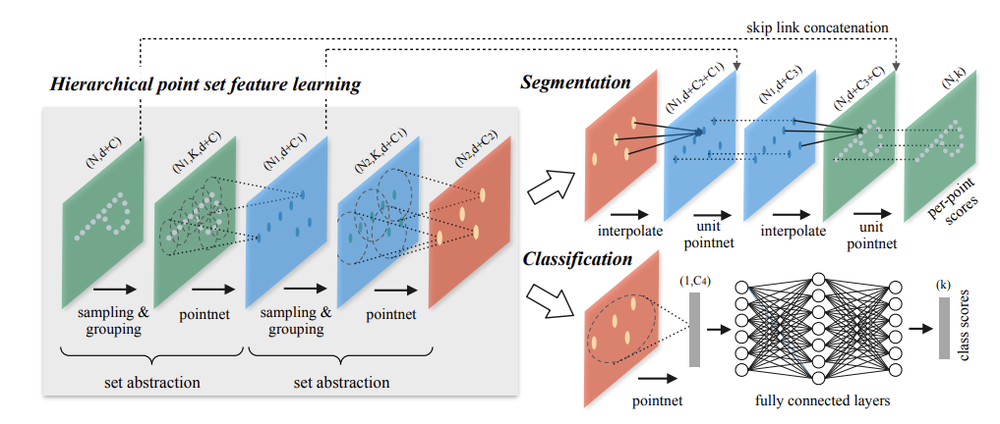

- **网络参数说明**

  - N表示点集中点的数量
  - d表示点的坐标维度，d=3
  - C表示点的其他特征（比如法向量等）维度，刚开始c=0（输入是只有坐标信息的点云）

- **Sampling Layer**

  采样层使用farthest point sampling (**FPS**)采样算法，从初始点云中采样出有限个点进行后续处理，**(N->N1采样)**。

- **Grouping layer**

  分别以每个采样点为球心，在一个特定半径的球体范围内，找出落在该球体范围内的特殊数目K个点，构成一个group。（**根据点的坐标来聚合**）

  找邻域这里有两种方式：KNN和query ball point.

  - 其中前者KNN就是大家耳熟能详的K近邻，找K个坐标空间最近的点。
  - 后者query ball point就是划定某一半径，找在该半径球内的点作为邻点。多就取前K个，少就重采样。

- **PointNet layer**

  Grouping layer得出的每个group，可以看做是一个“**局部点云**”，用PointNet网络来计算出这个局部点云的feature。

  输入**（N1,K,d+C）**到网络中获得**（N1,C1）**特征，然后拼接**d维**坐标信息，得**（N1,d+C1）**

- **Segmentation-interpolate**

  interpolate前后点集分别以**P1,P2**表示

  P2的的每一个点x，找在原始点云坐标空间下，在P1点集中找到与x最近的k个点。

  对k个点的特征加权求和，得到x的特征。其中这个权重是与x和P1中点的距离成反向相关的，意思就是距离越远的点，对x特征的贡献程度越小。

  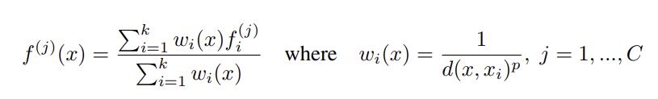

- **unit pointnet**

  1x1conv与Relu层

- 面对挑战：non-uniform sampling density，也就是在稀疏点云局部邻域训练可能不能很好挖掘点云的局部结构，解决：

  - **Multi-scale grouping（MSG）**

    对当前层的每个中心点，取不同radius的query ball，可以得到多个不同大小的同心球，也就是得到了多个相同中心但规模不同的局部邻域，分别对这些局部邻域表征，并将所有表征拼接。

  - **Multi-resolution grouping（MRG）**

    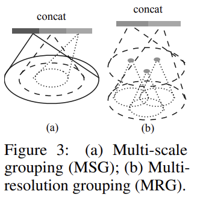

  

#### 2.4.4 DGCNN（2019 ACM TOG）

> Dynamic Graph CNN for Learning on Point Clouds

[Dynamic Graph CNN for Learning on Point Clouds 笔记 - 知乎 (zhihu.com)](https://zhuanlan.zhihu.com/p/85857744)

论文提出了两个新的概念：**EdgeConv**和**Dynamic Graph**，EdgeConv主要实现对点云中节点的feature的更新操作，改进了PointNet中缺少局部信息的缺点。Dynamic Graph主要是对点云中的点使用knn算法是基于点的特征而不是起初的三维坐标，特征是改变的，每一层都会得到一个不同的图。


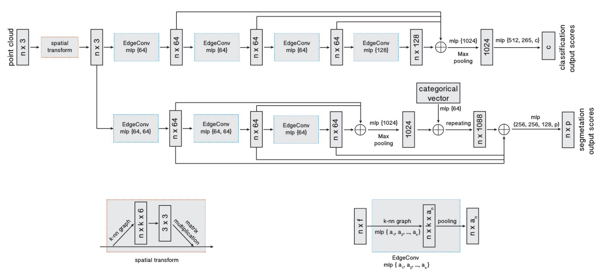

- **EdgeConv**

  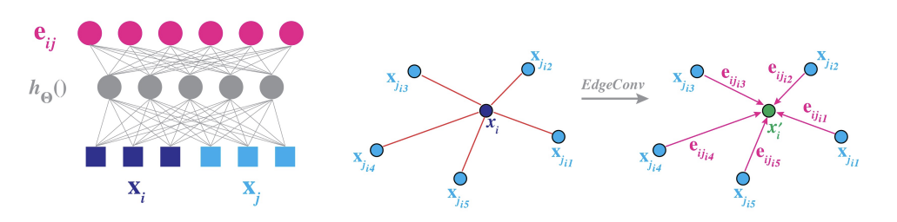

  > 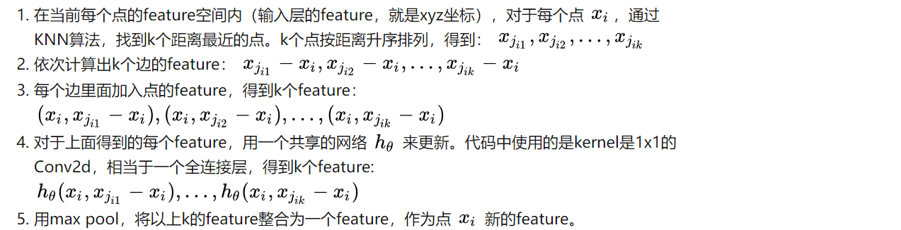

- **Dynamic Graph**

  - 从edgeConv的计算过程可以看出，每更新一次feature，重新用KNN找K个最近点时，由于是按照新的feature的距离来找，所以每次KNN的结果都会不同，每次构建的局部图都会动态的更新。
  - 通过堆叠EdgeConv模块或循环使用，可以提取到全局形状信息。

#### 补充3 PointNet++ 与DGCNN

两者都是针对PointNet网络缺少局部信息等的改进。

- PointNet++算法在FPS采样、球体Grouping时，使用的是每个点的xyz坐标，这些坐标始终没有变化，相当于每个点是**固定**的。
- DGCNN中，除第一层使用xyz坐标系计算外，后续使用计算出来的feature在feature空间KNN内采样、构建局部图，相当于每个点是**动态变化**的。

#### 2.4.5 PVCNN（2019 NIPS）

> Point-Voxel CNN for Efficient 3D Deep Learning

[[PointCloud\]PVCNN论文阅读 - 知乎 (zhihu.com)](https://zhuanlan.zhihu.com/p/209229692)

- PVCNN针对Voxel-based与point-based的缺点进行融合。PVConv由低分辨率的基于体素的分支和高分辨率的基于点的分支组成。 基于体素的分支提取粗粒度的邻域信息，并从基于点的分支中对单个点的特征进行细粒度的补充。
  - Voxel-based的缺点已经是为人所熟知的，主要就是在将点云变为voxel的过程中，信息的丢失程度与resolution的大小有关。但随着resolution的增加，计算和内存要求是三次方增加的。
  - point-based的方法的输入是无序的点云，在前向计算过程中，需要找出某些点邻域内的点，由于点云是无序的，所以不能通过其在点云中的位置进行索引，需要使用KNN方法去计算寻找，而这个计算过程则是非常慢的。

  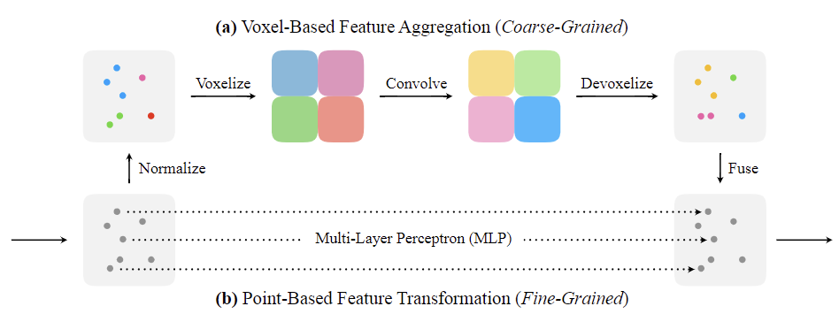

- **Point-Based**

  不再使用邻域的点，而是使用MLP直接计算每个点的feature。

- **Voxel-Based**

  - 尺度归一化后将点云变为体素，然后使用3D卷积核卷积提取特征。

  - Devoxelize：认为每个体素的特征是对应每个体素的中心，然后使用三维线性插值来恢复每个点的特征。

    [线性插值与双/三线性插值 - 知乎 (zhihu.com)](https://zhuanlan.zhihu.com/p/77496615)

- **Feature Fusion**

  将两个分支的结果直接相加，就得到了最终结果

  Point-Based方法在特征聚合时由于点云的不规则分布，特征聚合的耗时明显高于Voxel-Based方法，所以特征聚合是转换为体素进行的。

## 3. 3D人体姿态估计

### 3.1 3D人体姿态表示

> Ce Zheng, Wenhan Wu, Taojiannan Yang, Sijie Zhu, Chen Chen, Ruixu Liu, Ju Shen, Nasser Kehtarnavaz and Mubarak Shah. “Deep Learning-Based Human Pose Estimation: A Survey” arXiv: Computer Vision and Pattern Recognition (2020): n. pag.

#### 3.1.1 skeleton-based model

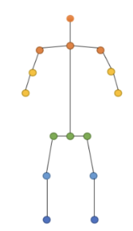

#### 3.1.2 Volumetric models

**3D human body models：**

[SMPL论文解读和相关基础知识介绍 - 知乎 (zhihu.com)](https://zhuanlan.zhihu.com/p/256358005)

- **SMPL**(Skinned Multi-Person Linear model)是一种裸体的蒙皮，基于顶点的人体三维模型，能够精确地表示人体的不同**形状和姿态**。常用于人体三维重建。

  SMPL模型是一个统计模型，其通过两种类型的统计参数对人体进行描述，分别有：

  1. **形状参数β：**代表人体高矮胖瘦、头身比等比例的10个参数。

  2. **姿态参数θ：**一组姿态参数有着24 ×3维度的数字，去描述某个时刻人体的动作姿态，其中的24表示的是24个定义好的人体关节点，其中的3并不是如同识别问题里面定义的(x,y,z)空间位置坐标，而是指的是**该节点针对于其父节点的旋转角度的轴角式表达**。

     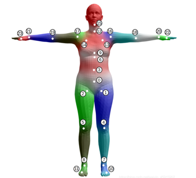

- **DYNA:** Dynamic Human Shape in Motion model

- **Stitched Puppet Model**

- **Frankenstein & Adam:** The Frankenstein model

- **GHUM & GHUML(ite)**

### 3.2 3D人体姿态估计目标

#### 3.2.1 输入

基于不同数据输入不同：

- 基于RGB图像的3D人体姿态估计：输入RGB图像，维度（H,W,3）
- 基于深度图像的3D人体姿态估计：输入深度图像，维度（H,W）
- 基于RGB-D图像的3D人体姿态估计：输入RGB图像（H,W,3）+深度图（H,W）
- 基于点云的3D人体姿态估计输入点云数据，维度（N,3+c）,N表示点云中点数，3是指三维坐标，c是指其他点云特征（颜色、法向量等）

#### 3.2.2 输出

类似于2D姿态估计，3D姿态估计模型输出可以有多种表示。最常见两种：**坐标表示与热图。**

- 输出关键节点坐标维度（n,3）,n表示节点个数；3是指三维坐标（x,y,z）

- 热图输出维度（n,H,W,D）,n个关键节点，立体热图（H,W,D）中值最大点表示改关键节点位置（选择方法不止这个）

  如下是2D姿态估计的每个关键节点热图，3D类似：

  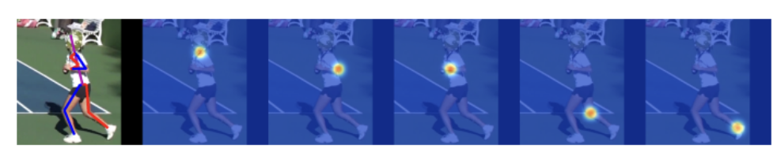

基于RGB图像与其他输入（点云等）的3D人体姿态估计输出区别：（大多数情况，不绝对）

- 基于RGB图像的3D人体姿态估计预测的关键节点坐标（x,y,z），之中**（x,y）为图像像素坐标，z为深度值（相机坐标系相对root点的位置值）**

- 基于点云等输入的3D人体姿态估计预测的关键节点坐标（x,y,z），之中**（x,y,z）一般为世界坐标或相机坐标（相对于根点的值）**

  

### 3.3 基于RGB图像的3D人体姿态估计

#### 3.3.1 单目

##### 3.3.1.1 Coarse-to-Fine（2017 CVPR）

> Coarse-to-Fine Volumetric Prediction for Single-Image 3D Human Pose

[3D人体姿态估计--Coarse-to-Fine Volumetric Prediction for Single-Image 3D Human Pose_AI小作坊 的博客-CSDN博客](https://blog.csdn.net/zhangjunhit/article/details/75338260)

- 直接预测（x,y,z），不依赖2D-HPE
- 第一个使用端到端学习范式将3D人体姿势估计作为体素空间中的3D关键点定位问题
- 类似于2D Pose Estimation中的stacked Hourglass结构
- 对三维空间进行网格划分，将问题转换为主体周围离散化空间中的 3D 关键点定位
- Coarse-to-Fine 渐进优化，主要是针对 第三维度深度 z 而言的，d 的取值为 {1,2,4,8,16,32,64}

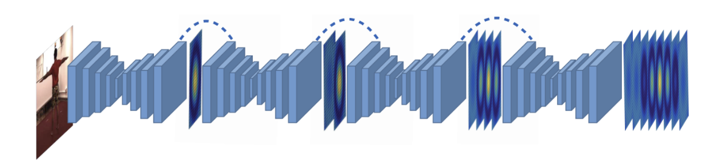

##### 3.3.1.2 Simple-baseline-3D（2017 ICCV）

> A simple yet effective baseline for 3d human pose estimation

[【论文读后感】：A simple yet effective baseline for 3d human pose estimation_艾与代码-CSDN博客](https://blog.csdn.net/kid_14_12/article/details/86713412)

- 2D-to-3D Lifting，第一步，从RGB图像中获取到二维的重要关节点坐标。第二步，训练一个网络，该网络输入是一系列二维关节点坐标，输出是一系列三维关节点坐标。
- 结论：大多数的3d姿态估计的错误来自于上述第一步
- 使用2d/3d姿态的坐标分别作为输入与输出
- RGB图像到2D关键节点使用stacked hourglass，微调

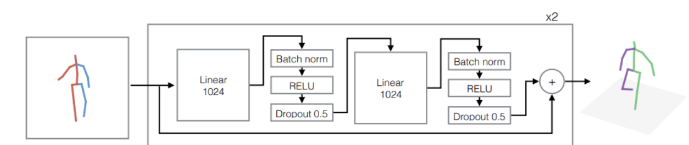


##### 3.3.1.3 RepNet（2019 CVPR）

> RepNet:Weakly Supervised Training of an Adversarial Reprojection Network for 3D Human PoseEstimation

- 一种基于二维重投影的三维人体姿势估计神经网络（RepNet）的对抗训练方法。通过GAN进行3D人体姿态估计。


#### 3.3.2 多目（Multi-view Methods）


#### 3.3.3 时序信息(video)


### 补充4 基于RGB图像进行3D人体姿态估计的不足

- 单视角2D到3D的映射中存在的深度模糊性、高度非线性（一个2D骨架可以对应多个3D骨架）

- 仅使用2D图像的人体姿势估计仍然存在一些限制。额外的深度信息可以提供丰富的 3D 数据，以克服 2D 数据的局限性

  

### 3.4 基于深度图的3D人体姿态估计

#### 3.4.1 RF（2011 CVPR）

> Real-time human pose recognition in parts from single depth images


#### 3.4.2 RFW（2015 CVPR）

> Random tree walk toward instantaneous 3D human pose estimation


#### 3.4.3 V2V-PoseNet（2018 CVPR）

> V2V-PoseNet: Voxel-to-Voxel Prediction Network for Accurate 3D Hand and Human Pose Estimation from a Single Depth Map

[V2V-PoseNet算法和应用详解（3D关节点估计领域）_不精，不诚，不足以动人-CSDN博客](https://blog.csdn.net/weixin_42118657/article/details/119779935)

- 传统方法是基于2D深度图直接回归关节点坐标，而该模型是把2D深度图投影到3D空间，然后用3D卷积去操作，这能解决2D深度图的透视畸变问题。

- 该模型不是直接回归关节点坐标，而是估计每个点云所属某关节点的概率值。（用热图表示）

  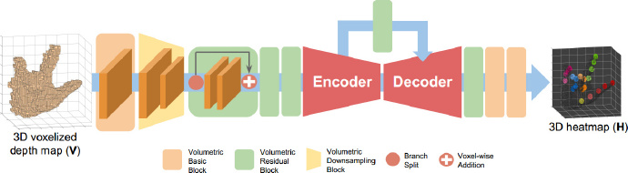

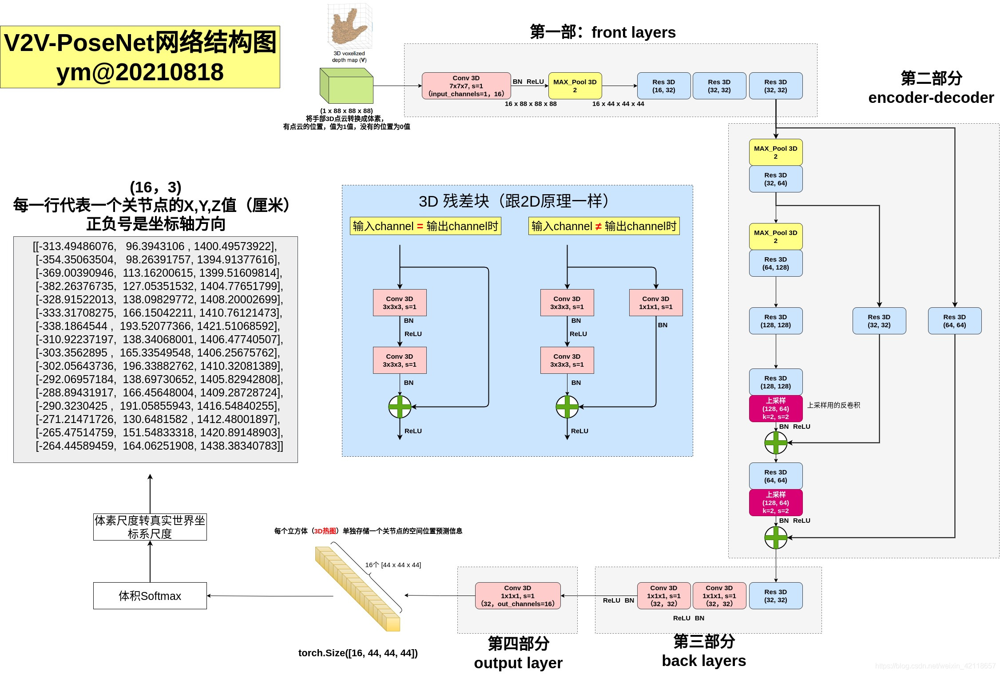

- 作者认为3D识别关节点的好处：
  - 第一个是2D深度图中的透视失真。由于2D深度图的像素值表示物体与深度相机的物理距离，因此深度图本质上是3D数据。然而，大多数先前的方法仅将深度图作为2S图像形式，其可以通过将其投影到2D图像空间来扭曲3D空间中的实际对象的形状。因此，网络看到一个扭曲的对象，并负担执行失真不变的估计。
  - 第二个缺点是深度图与3D坐标之间的高度非线性映射。这种高度非线性的映射妨碍了学习过程，并阻止网络精确估计关键点的坐标。


#### 3.4.4 A2J（2019 ICCV）

> A2J: Anchor-to-Joint Regression Network for 3D Articulated Pose Estimation from a Single Depth Image


#### 3.4.5 Weakly Supervised Adversarial Learning for 3D Human Pose Estimation from Point Clouds（2020 TVCG）

[Weakly Supervised Adversarial Learning for 3D Human Pose Estimation from Point Clouds | IEEE Journals & Magazine | IEEE Xplore](https://ieeexplore.ieee.org/document/8998337)

- 利用深度图像或点云的2D和3D表示来实现精确的3D人体姿势估计。模型既利用了**仅注释2D人类关节的弱监督数据**，也利用了**带有3D人类关节注释的完全监督数据**。为了缓解由于监督不力而导致的人类姿势模糊性，采用**对抗性学习**来确保恢复的人体姿势是有效的。包含两个模块：

  - **Point Clouds Proposal Module**，我们使用紧凑而有效的全卷积网络，通过2D热图从输入深度中提取2D人体姿势，并使用2D人体姿势对点云进行采样。然后，使用估计的根关节对采样的点云进行归一化;
  - **3D Pose Regression Module**，我们根据生成对抗网络（GAN）恢复3D人体姿势。对于生成器，我们使用分层的基于 PointNet 的回归（以采样的点云作为输入）来恢复人体姿势。对于鉴别器，我们使用完全连接的神经网络来区分估计的人类姿势和真实人体姿势。

  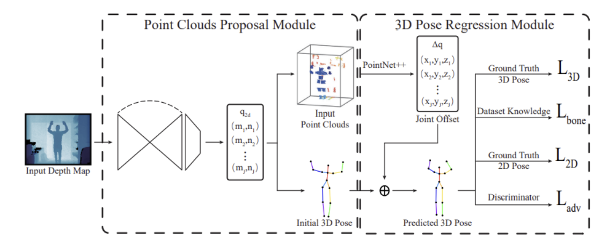

- **Point Clouds Proposal Module**

  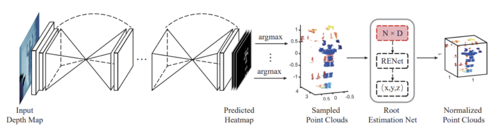

  

  1. 使用**Stacked hourglass networks**进行2D人体姿势估计，从预测的热图上通过的 argmax 操作来获得**J**个2D关键节点。argmax 操作不是连续的或可微的（单独训练）

  2. 我们从深度图中以检测到的 **2D 关节为中心**裁剪**d=20*20**像素的边界框，通过深度摄像头参数转换成点云，总采样点数**N=d*J**

  3. 通过将采样的点云馈送到具有ResNet骨干网（称为根估计网络（RENet））的微小回归网络，从而获得根关节Root的位置。采样的点云可以归一化为 [−1， 1]^3由，**L**是预定义边界框的大小（实验为**[1.5,1.5,2]**）。

     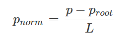

     **注意：**此转换同样应用于采样的点云、真实关键节点坐标和**初始 3D 人体姿势**，保证一致性。

  4. 初始3D姿态为预测的2D关键节点回溯投影到点云中的坐标，并将每个关节的深度设置为我们估计的根关节深度。(如上标准化处理)

- **3D Pose Regression Module**

  包括偏移量估计、2D关节投影损失，3D关节损失、骨长比损失以及判别器。

  使用**PointNet++**估计3D关键节点偏移量，整个模型对抗学习，这里可以理解成GAN的**生成器**

- ##### Discriminator

  判别器旨在判断恢复的3D人体姿势是真假的。该网络使用预测的 3D 关节位置作为输入，并预测预测的 3D 关节位置是真实的还是假的。判别器由两个具有Leaky RELU 功能和跳过连接的全连接层 （FC）、一个具有Leaky ReLU 功能的完全连接层、另一个全连接层和一个 softmax 功能组成。

  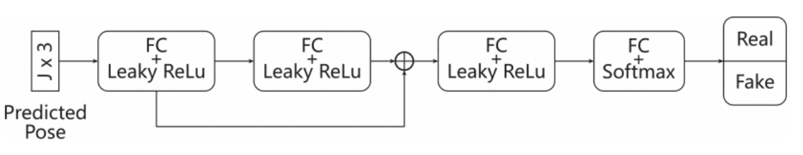

- **损失函数**

  **表示真实值*

  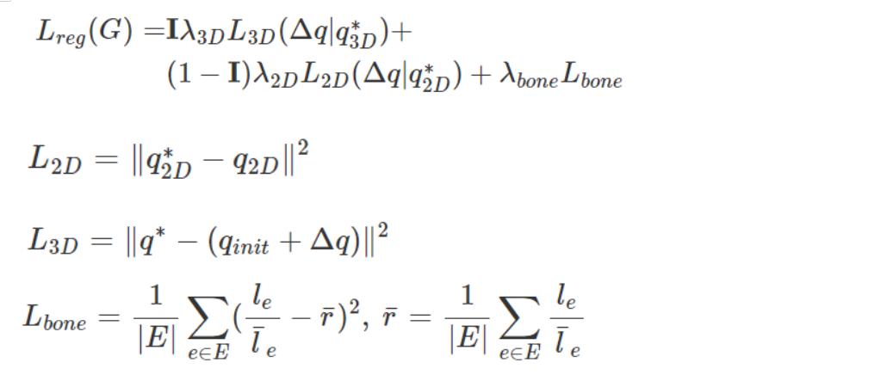

  为了惩罚不合逻辑的骨长度比，我们添加了骨长度比正则化损失:

  > 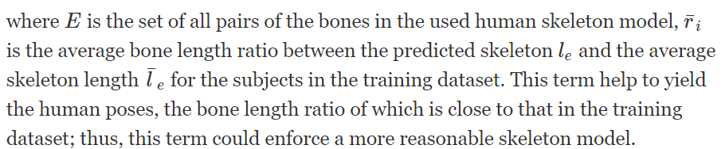

- **对抗学习**

  在训练阶段，按照 GAN 的典型训练程序，我们交替地在判别器D与生成器G之间训练更新网络参数。

  

  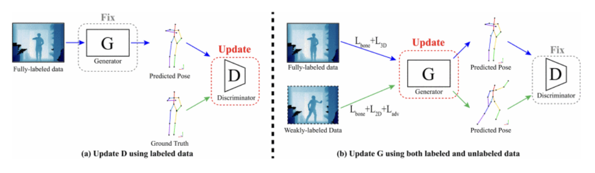

  （a） 使用固定的3D姿势生成器的参数来训练判别器;

  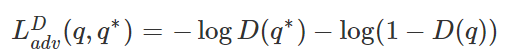

  （b） 通过同时使用完全标记的数据和弱标记的数据来训练3D姿态生成器。总损失：

  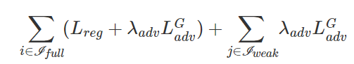

#### 补充 5 Leaky ReLU函数

[机器学习中的数学——激活函数（四）：Leaky ReLU函数_冯·诺依曼实验室-CSDN博客_leakyrelu函数公式](https://blog.csdn.net/hy592070616/article/details/120617996)

Leaky ReLU函数的特点：

- Leaky ReLU函数通过把x 的非常小的线性分量给予负输入0.01 x 来调**整负值的零梯度问题**。
- Leaky有助于扩大ReLU函数的范围，通常α的值为0.01左右。
- Leaky ReLU的函数范围是负无穷到正无穷。

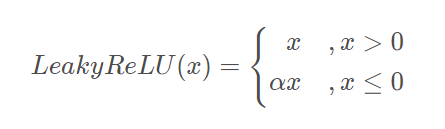

#### 3.4.6 Learning to Estimate 3D Human Pose From Point Cloud（2020 JSEN）

[Learning to Estimate 3D Human Pose From Point Cloud | IEEE Journals & Magazine | IEEE Xplore](https://ieeexplore.ieee.org/document/9107101)

- 将图像作为输入并将其转换为3D点云。根据深度阈值和欧几里得聚类提取，我们从这些3D点中提取人。人体的点在被转移到深度学习网络之前，将人的高度和宽度进行标准化。

- 基于DGCNN和PointNet的网络架构，直接从3D点云中估计人体关键关节。与其他从深度图像中回归3D关键点的方法不同，该算法将3D姿势估计问题从单个深度图像投射到点云。

- 使用DGCNN网络提出的EdgeConv，学习点云的领域信息，通过堆叠EdgeConv模块或循环使用，可以提取到全局形状信息。

- **对点云数据预处理，消除背景。**

  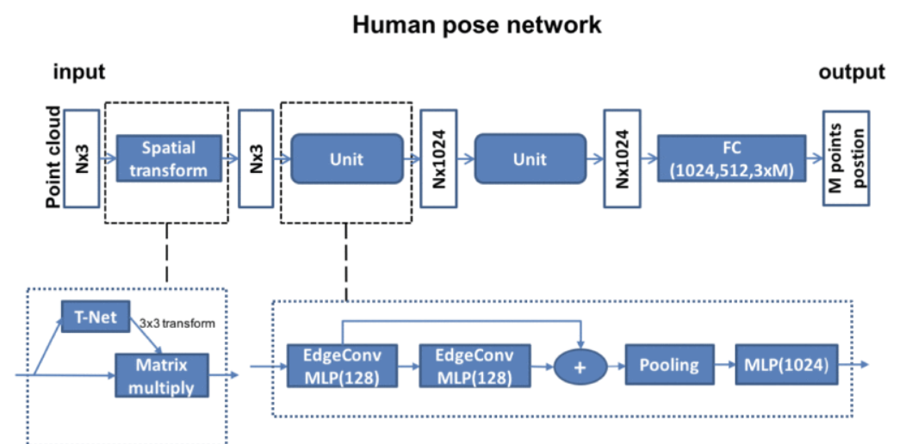

  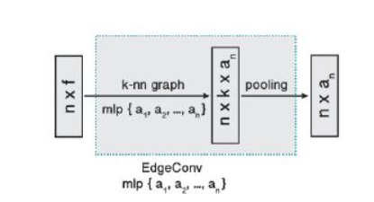

### 3.5 基于RGBD数据的3D人体姿态估计

#### 3.5.1 Research on 3D Human Pose Estimation Using RGBD Camera（2019 ICEIEC）

- **出发点：**由于技术的限制，RGBD相机读取的彩色图像与深度图像之间的对齐会存在一定偏差

- **修正对齐：**我们将彩色图像上的特征点与相应深度图上的特征点进行匹配，**以获得准确的转换参数**。特征点之前已匹配。我们使用具有恒定尺度的SURF算法来提取图像的特征点。SURF 是一种高度改进的 SIFT 计算。获得特征点后，用尺度不变特征变换的描述符描述特征点，得到每个特征点i的深度向量和描述向量。我们使用 k 均值聚类算法来匹配彩色图像和深度图像的描述向量。尽管深度图像和彩色图像中的特征点通过欧氏距离比较进行了匹配和比较，但特征点集中仍然存在一些不匹配的点对。RANSAC算法用于消除不匹配，从而进一步提高匹配精度。最后，我们可以通过获得的高质量匹配点对精确计算转换参数。

- **模型：**首先使用Faster-RCNN从彩色图像中提取人类边框，然后通过堆stacked hourglass network获得关节点的2D坐标。为了解决彩色图像缺乏深度信息的问题，将2D姿势估计的结果映射到深度图像上，因此可以轻松获得人体关节点的3D信息，从而实现3D姿态估计。

  对于这个方法的一点想法：

- **2D关键点映射到深度图获得z值的3D人体姿态估计方法的缺点：**

  > 3D Human Pose Estimation Using RGBD Camera

  由于RGBD相机的激光成像原理，深度信息代表了**人体身体表面的深度**。由2D关键点和深度图像生成的3D关键点都将落在人体模型的表面上。因为人体模型的关键点是基于人体骨骼关节，这种现象显然不符合事实。

#### 3.5.2 3d human pose estimation in rgbd images for robotic task learning（2018 ICRA）

- 模型目标是预测世界坐标系的**J**个人体三维关键节点坐标。这里模型输出**(KxKxKxJ)**大小的热图，其中K是体素的大小决定。

  > **拼接由⊗表示，⊕是逐元素添加操作。**

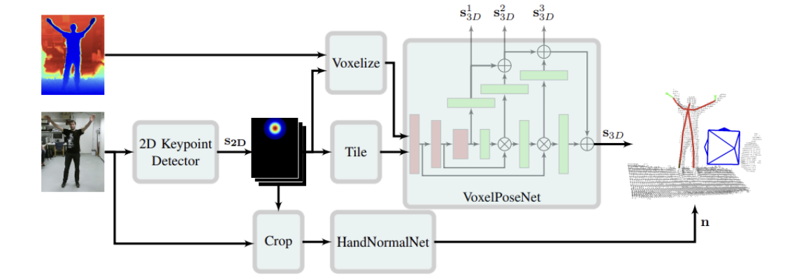

-  **Color Keypoint Detector**

  使用2D-HPE模型（openpose）检测人体关键点，输出热图（H,W,J），然后沿着z轴平铺得（H,W,D,J）。这里H,W,D=64，与跟体素网格相同大小。

- **Voxelize**

   预测的2D"颈部"关键点的反向投影到世界坐标中（计算使用的深度是3个有效邻居节点的深度值取平均）作为**体素中心**。将深度图像转换为**点云**，再计算**体素V**。我们选择体素网格的分辨率约为3厘米。当点云中至少有一个点位于所表示的区间内时，将**V**中元素设置为 1，否则为0。体素大小**KxKxK**，论文中K=64。

- **VoxelPoseNet**

  输入是平铺后的热图与体素拼接。**（B,K,K,K,J+1）**,B是batch_size。（这是我暂时的理解，不完全确定）

  Voxel-PoseNet是一种编码器解码器架构，灵感来自**U-net**。先3D卷积编码，再反卷积解码，在解码为全分辨率分数图时，合并了多个中间预测。

  > U-Net: Convolutional Networks for Biomedical Image Segmentation
  >
  > 网络是一个经典的全卷积网络（即网络中没有全连接操作）

- **HandNormalNet**

  手部法线预测（这里暂不细看）

- **训练**

  通过启发式方法来生成两种预测结果。一种是模型输出得热图做argmax操作获得的3D关键节点坐标；另一种是使用2D预测的二维节点坐标与方法一中获得的3D节点坐标z值，通过相机参数映射到世界坐标作为第二种预测结果，.对于这些坐标，x 和 y 方向的精度不受体素大小等的限制。最终两种方法根据**节点预测热图位置得分**选择最优。

- **行动学习**

#### 3.5.3 3D Human Pose Estimation Using RGBD Camera（2021 CEI）

- **AlphaPose**

  使用SSD算法进行人体检测，再使用Stacked Hourglass network估计目标的2D关键点，然后通过Simple-baseline-3D模型进行3D人体姿态估计。（另一种方式将2D关键点映射到相应的深度图，以获得相应的3D关键点。论文描述模糊，不确定这一步）

- 介于**2D关键点映射到深度图获得z值方法的缺点**以及**受2D关键点精度和图像对齐误差的影响，生成3D模型时，3D关键点偶尔会无法与深度图中的实际位置对齐**。为了解决这个问题，我们使用FrankMocap生成SMPL模型作为人体测量学的先验，以提高pode估计的鲁棒性。

- FrankMocap是一个使用SMPL模型的3D人体动作捕捉系统。首先，分别使用两个回归模块从输入图像中估计人体和人手的3D姿势，然后通过积分模块将预测结果组合在一起，得到最终的3D人体。

  > FrankMocap: Fast Monocular 3D Hand and Body Motion Capture by Regression and Integration

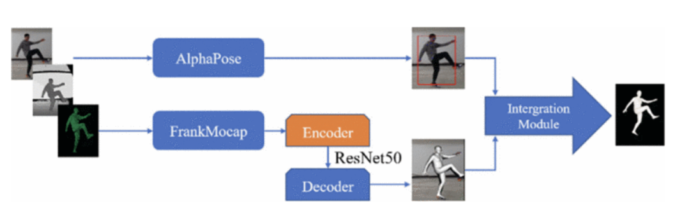

#### 3.5.4 RGB-D FUSION FOR POINT-CLOUD-BASED 3D HUMAN POSE ESTIMATION（2021 ICIP）

- 模型由三个模块组成。**2D fusion module**首先通过2D姿态估计模型从 RGB 图像生成热图。热图充当初步但有用的预测，有助于在后期阶段进行3D估计。接下来，2D 融合模块将热图与深度图像融合，并输出一个点云，其中每个点都赋予了一个颜色特征矢量。然后将缩减采样的点馈送到**3D learning module**中，以生成逐点特征。最后，为了更好地利用局部特征，设计了一个逐点投票机制**Dense prediction module**，可以预测从每个点到目标关键点的接近度分数和偏移向量，最终结果由所有积分投票选出。

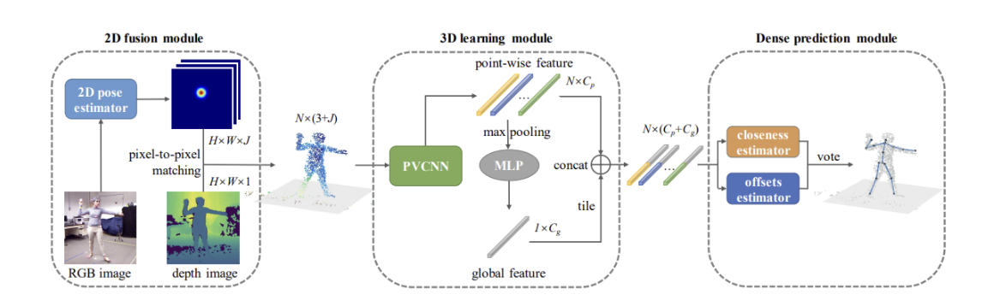

- **2D fusion module**

  采用2D姿势估计器（SimpleBaseline ）从RGB图像生成热图（颜色特征），热图上采样为原始图像大小，然后颜色特征以点云的形式与深度图像集成。在馈送到下游模块之前，点云被随机下采样到固定大小的*N*。

- **3D learning module**

  利用PVCNN来提取点云中的几何信息。PVCNN是一种高效的3D深度学习方法，对于每个点，PVCNN 都会生成一个要素向量，该要素向量嵌入了涵盖不同空间大小的上下文信息。

  逐点特征通过全局池化层和 MLP 获取全局特征向量。然后将其平铺并连接到逐点要素。此步骤旨在使每个点都能够"感知"全局。

- **Dense prediction module**

  **密集预测有利于网络的收敛。**（论文提到试过直接回归未能收敛）

  - 第一个分支输出每个点与目标关键点的**接近度分数**。具体而言，它预测点是否位于关键点的邻域。真实接近度分数生成为：

    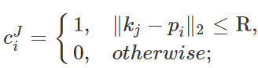

  - 另一个分支计算从每个点到每个关键点的偏移量：

    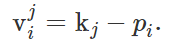

  - **左膝关节的网络输出示例**

    （a） 红点表示左膝的相邻点。（b） 箭头表示从不同点到目标关键点的偏移量。为了获得更好的可视化效果，仅可视化了一部分矢量。

    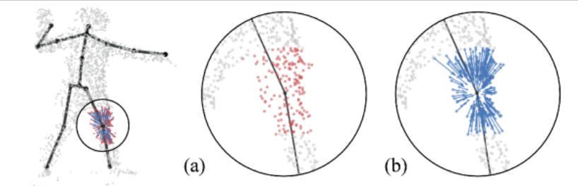

  - 最后预测的关键节点坐标：

    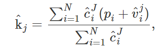

- **损失函数**

  损失函数由三个项组成

  - 预测的3D人体姿态与真实值：

    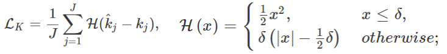

    选择Huber loss而不是MSE loss，因为它对**异常值不太敏感**，同时将强凸性保持在零附近。该功能将更侧重于减少小错误，并有助于生成尽可能准确的结果。

  - 接近度估计误差：

    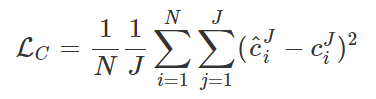

  - 使用 Huber loss的偏移分支：

    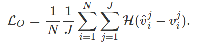

  - 整体损失函数是上述三项的加权和：

    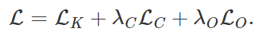

  

- 一点总结，跟上面3.52算法对比：

  - **相同点：**两者都使用2D人体姿态估计提取RGB图像特征，直接使用输出的热图信息作为颜色特征；将深度图像构建点云。

  - **不同点：**
    - 前者使用**体素**的结构输入到后续网络预测，将点云转换成体素结合RGB分支的热图特征。
    - 本模型使用**点云**的结构输入到后续网络预测。


#### 3.5.5 Real-time RGBD-based Extended Body Pose Estimation（2021 WACV）

- 使用参数化 3D 可变形人体网格模型 （SMPL-X） 作为表示

  

### 3.6 基于点云数据3D人体姿态估计

基于深度图或RGBD图像的3D人体姿态估计大部分可归为基于点云数据的模型

#### 3.6.1 A Review: Point Cloud-Based 3D Human Joints Estimation（2021 Sensors）

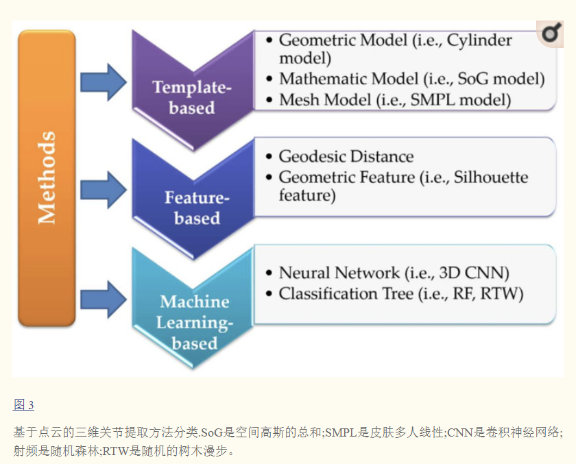

- **不同方法特点：**
  - 基于模板的方法首先需要建立模板库或参数化模板，然后比较人体点云与模板库或目标模型中的样本之间的相似性。这种方法相对粗糙且耗时。鉴于样本数据的多样性和多尺度结构，人体的相同姿势在空间中可能非常不同。因此，基于模板的方法的准确性非常有限。
  - 基于特征的方法需要提取点云的全局或局部特征，结合一些先验知识来获得人体的3D关节。这种方法依赖于特征点的选择，使其不适合自遮挡和改变姿势。因此，有必要进一步优化算法的鲁棒性，以尽可能地覆盖人体的姿势。
  - 基于机器学习的方法主要利用网络从点云中自动学习所需的特征，然后将学习到的特征视为提取人体关节的判断条件。与上述两种方法相比，有了很大的改进。一方面，获得的关节可以通过在大型训练集中学习样本特征来实现更高的精度，另一方面，它对尺度处理也非常健壮。基于机器学习的方法可以弥补上述两种方法的缺点，但它受到训练集样本丰富性的限制，因此训练集的构建对于基于机器学习的方法非常重要。

#### 3.6.2 A 3D-point-cloud feature for human-pose estimation（2013 ICRA）


#### 3.6.3 Point-to-pose voting based hand pose estimation using residual permutation equivariant layer（2019 CVPR）

[Point-to-Pose Voting based Hand Pose Estimation using Residual Permutation Equivariant Layer总结 - 简书 (jianshu.com)](https://www.jianshu.com/p/ed5f0b685d79)

- 近年来，基于三维输入数据的手部姿态估计方法显示出最先进的性能，因为三维数据比深度捕捉更多的空间信息。而基于三维体素的方法需要大量计算量，基于PointNet的方法需要冗长的预处理步骤，如计算曲面法线向量，分组时使用k-最近邻搜索。

- 本文提出了一种新的基于无序点云的手势估计方法。采用1024个三维点作为输入，不需要额外的信息。本文以置换等变层(PEL)为基本单元，提出一个PEL版本的ResNet用于手势识别任务。此外，还提出了一个基于投票的方案(Voting-Based Scheme)，合并各个点的信息用于最终手势预测。

- 我们的方法取N个任意阶三维点P∈R^N×3作为输入，最后输出矢量化的三维手部姿态y∈R^J，其中**J = 3 × #关节**

  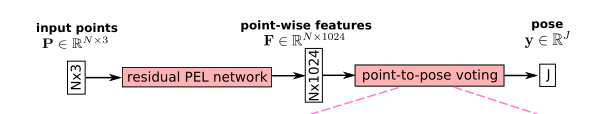

-  **预处理**

  1. 将深度图像素转换为3D点云
  2. 为手点创建一个3D包围框，以获得这些点的规范化坐标。通常简单地创建一个与摄像机坐标系统对齐的边界框。
  3. 归一化视角
     - 问题：相同的手势由于不同的视图方向导致不同的观测结果，因此得到的训练样本将包含一对多映射。
     - 解决：把质心旋转到z轴上。

- **Residual Permutation Equivariant Layers(RPEL)残差置换等变层**

  - **PEL**

    > Deep learning with sets and point clouds（2016）

    > 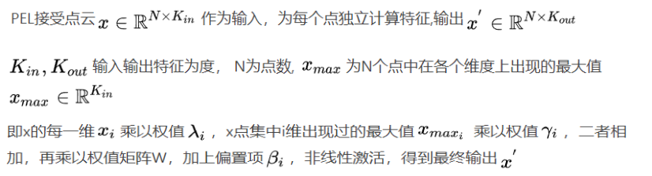

    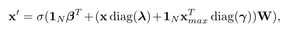

    **注意到权值γ和λ是共享的**，因为每个点使用自己的输入特征和各个特征维度上的最大值计算自己的特征。所以PEL能处理无序数据，而且各个点在一定程度上相当于使用Xmax交换信息。

  - **Residual network of permutation equivariant layer**

    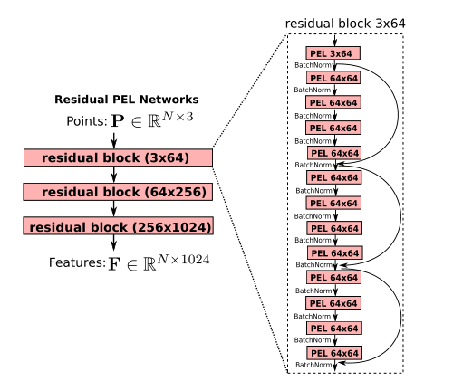

- **Point-to-pose voting**

  通过ResNet-PEL得到NxF维特征，每一行F维向量表示一个点的局部特征。使用Point-to-Pose voting方式估计关节点坐标，文章提出了检测和回归两种版本(回归效果更好)。

  - Regression version

    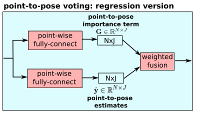

    G表示3D点n对于关节点j预测的贡献程度(置信水平)，y`为网	络输出的每个3D点预测的关节点j的坐标激励值，根据每个3D点对每个关节点的贡献程度及自身估计的坐标激励值，综合归一化得到最终的估计值。

    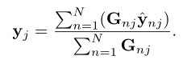

  - Detection version

    首先检测出各位姿维数的概率分布，然后将分布积分得到位姿。两个完全连接的模块的最后一层是sigmoid函数。G和D的值范围是 [0, 1]。

    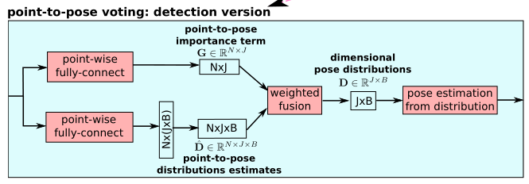

    **weighted fusion：**

    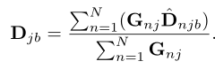

    D表示输出构成分布，其中每个点对J输出维度做出自己的预测。每个输出姿态维用一个B bins表示为离散分布，表示[−r， +r]的值范围，每个桶的分辨率∆d = 2r/B。对于输出姿态**yj**，其本身对应的bin索引是：

    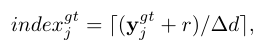

    真实训练分布，真实姿势周围的三个**bin**i被设为1，其他**bin**被设为0。：

    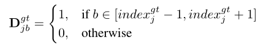

    最终的姿态y是通过对分布的积分来估计的：**（存疑）**

    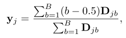

- **损失函数**

  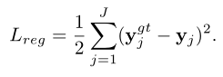

- **结果**

  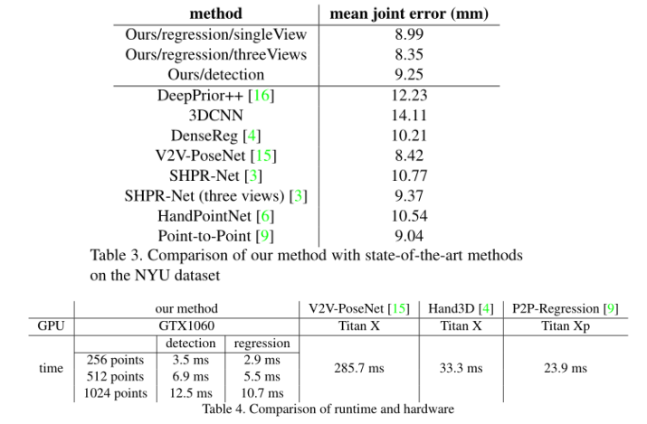

#### 3.6.4 Skeleton-Aware 3D Human Shape Reconstruction From Point Clouds（2019 ICCV）


#### 3.6.5 Sequential 3D Human Pose and Shape Estimation From Point Clouds（2020 CVPR）


#### 3.6.6 Sequential 3D Human Pose Estimation Using Adaptive Point Cloud Sampling Strategy（2021 IJCAI）


### 3.7 数据集


### 3.8 评价指标


## 4. 行为识别

### 4.1 综述

**行为识别Action Recognition**是指对视频中人的行为动作进行识别，即读懂视频。

- 划分：

  - **Hand gesture**：集中于处理视频片段中单人的手势
  - **Action**：短时间的行为动作，场景往往是短视频片段的单人行为，比如Throw，catch，clap等
  - **Activity**：持续时间较长的行为，场景往往是较长视频中的单人或多人行为

- 行为识别算法分类：

  [一文了解通用行为识别ActionRecognition：了解及分类 - 知乎 (zhihu.com)](https://zhuanlan.zhihu.com/p/103566134)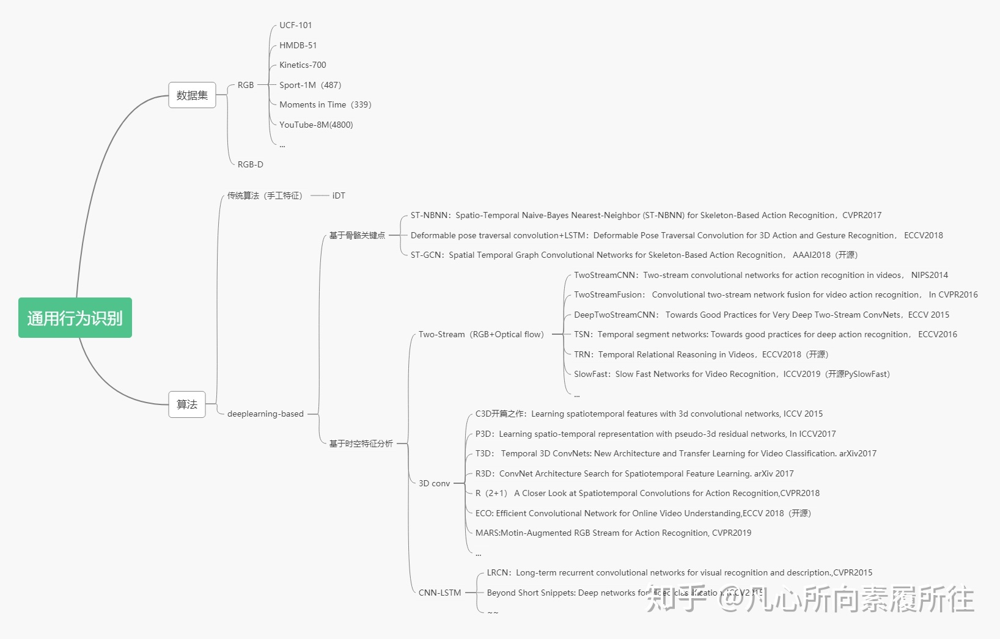

- 框架：

  [open-mmlab/mmaction2: OpenMMLab's Next Generation Video Understanding Toolbox and Benchmark (github.com)](https://github.com/open-mmlab/mmaction2)

- 3D-Conv与CNN+LSTM算法参考代码（PyTorch）

  [MRzzm/action-recognition-models-pytorch: The models of action recognition with pytorch (github.com)](https://github.com/MRzzm/action-recognition-models-pytorch)

- 基于RGB-D的行为识别综述

  [基于RGB-D的深度学习人体运动识别：|调查深爱 (deepai.org)](https://deepai.org/publication/rgb-d-based-human-motion-recognition-with-deep-learning-a-survey)

- **本文整理分类**

  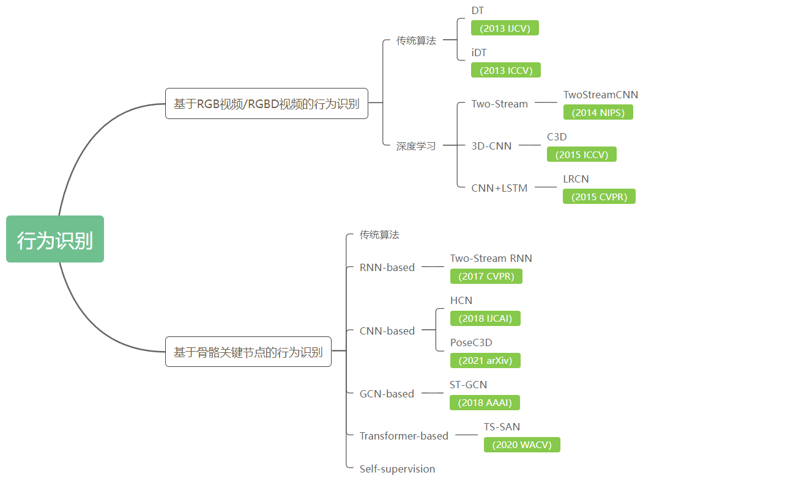

### 4.2 基于RGB/RGBD视频

#### 4.2.1 传统算法

##### 4.2.1.1 DT（2013 IJCV）

> Dense Trajectories and Motion Boundary Descriptors for Action Recognition

- **解读：**

- [行为识别笔记：improved dense trajectories算法（iDT算法） - 知乎 (zhihu.com)](https://zhuanlan.zhihu.com/p/27528934)

  框架包括密集采样特征点、特征点轨迹跟踪和基于轨迹的特征提取三部分，后续再进行特征编码和分类。

  在得到视频对应的特征后，DT算法采用SVM分类器进行分类，采用one-against-rest策略训练多类分类器。

- **模型：**

  

##### 4.2.1.2 iDT（2013 ICCV）

> Action Recognition with Improved Trajectories

- **解读：**

  iDT算法的基本框架和DT算法相同，主要改进在于对光流图像的优化，特征正则化方式的改进以及特征编码方式的改进。

  - 通过估计相机运动估计来消除背景上的光流以及轨迹
  - 对于HOF,HOG和MBH特征采取了与DT算法（L2范数归一化）不同的方式——L1正则化后再对特征的每个维度开平方
  - 使用效果更好的Fisher Vector特征编码


#### 补充4 光流

- **光流**是空间运动物体在**观察成像平面**上的像素运动的**瞬时速度**，是利用图像序列中像素在时间域上的变化以及相邻帧之间的**相关性**来找到上一帧跟当前帧之间存在的对应关系，从而计算出相邻帧之间物体的运动信息的一种方法。

- 光流之所以生效是依赖于这几个假设：

  1. 物体的像素强度不会在连续帧之间改变；
  2. 一张图像中相邻的像素具有相似的运动。

- **光流的计算方法**

  假设第一帧图像中的像素 *I(x, y, t)* 在时间 *dt* 后移动到第二帧图像的 *(x+dx, y+dy)* 处。根据上述第一条假设：灰度值不变，我们可以得到：

  

  对等号右侧进行泰勒级数展开，消去相同项，两边都除以 *dt* ，得到如下方程：

  

  

  fx,fy均可由图像数据求得，而**(u,v)即为所求光流矢量**。

  上述一个等式中有两个未知数。有几个方法可以解决这个问题，其中的一个是 Lucas-Kanade 法 。增加有一个假设：

  这里就要用到上面提到的第二个假设条件，领域内的所有像素点具有相同的运动。Lucas-Kanade法就是利用一个3x3的领域中的9个像素点具有相同的运动，就可以得到9个点的光流方程(即上述公式)，用这些方程来求得*(u, v)* 这两个未知数，显然这是个约束条件过多的方程组，不能解得精确解，一个好的解决方法就是使用最小二乘来拟合。

  opencv提供函数计算，参考[OpenCV小例程——光流法_xiao_lxl的专栏-CSDN博客_opencv 光流算法](https://blog.csdn.net/xiao_lxl/article/details/95330541)

#### 4.2.2 Two-Stream

Two-Stream将动作识别中的特征提取分为两个分支，一个是RGB分支提取空间特征，另一个是光流分支提取时间上的光流特征，最后结合两种特征进行动作识别。

- 解读：

  [论文笔记——基于深度学习的视频行为识别/动作识别（一） - 知乎 (zhihu.com)](https://zhuanlan.zhihu.com/p/40964492)

##### 4.2.2.1 TwoStreamCNN（2014 NIPS）

> Two-stream convolutional networks for action recognition in videos

- **解读：**

  - 多任务学习
  - 一个密集光流可以看做是在连续的帧t和帧t+1之间的一个位移矢量场dt的集合。通过dt(u,v)，我们表示在帧t的(u,v)位置的位移矢量，他表示移动到在下一个帧t+1相对应的点。矢量场的水平和垂直部分是dtx和dty，可以视为图像的通道（如图2所示），在卷积网络中可以用来识别。为了表示一系列帧之间的运动，我们叠加了L个连续帧的流通道dtxy，行成了2L的输入通道。
  - [(1条消息) 【论文学习】Two-Stream Convolutional Networks for Action Recognition in Videos_I am what i am-CSDN博客](https://blog.csdn.net/liuxiao214/article/details/78377791)
- **模型：**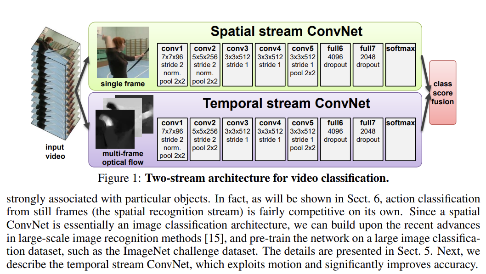

##### 4.2.2.2 其他模型

Christoph Feichtenhofer等人对双流网络中空间和时间特征的融合进行优化。

Limin Wang等人提出时域分割网络，采取了稀疏时间采样策略和基于视频监督的策略解决了普通双流网络只能处理短期运动问题。

#### 4.2.3 3D-Conv

3D convolution 直接将2D卷积扩展到3D（添加了时间维度），直接提取包含时间和空间两方面的特征。

- 解读：

  [论文笔记——基于的视频行为识别/动作识别算法笔记(三) - 知乎 (zhihu.com)](https://zhuanlan.zhihu.com/p/41659502)

##### 4.2.3.1 C3D（2015 ICCV）

> Learning spatiotemporal features with 3d convolutional networks

- 视频输入是C×L×H×W，C为图像通道(一般为3)，L为视频序列的长度，kernel size为3x3x3，stride为1，padding=True，滤波器个数为K的3D卷积后，输出的视频大小为K∗L∗H∗W。文章认为不那么过早地池化时间信息，可以在早期阶段保留更多的时间信息。网络的输入的视频长度为16帧，输入的视频帧尺寸为 112 × 112。

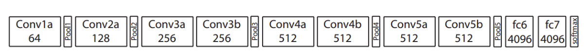

##### 4.2.3.2 其他模型

Zhaofan Qiu等人受Inception v3启发将3D卷积核拆成了空间的2D卷积(1x3x3)和时间的1D卷积(3x1x1)并以不同的串并联方式结合获得了显著效果。


#### 4.2.4 CNN+LSTM

这种方法通常使用CNN提取空间特征，使用RNN（如LSTM）提取时序特征，进行行为识别。

- 解读：

  [论文笔记——基于深度学习的视频行为识别/动作识别（二） - 知乎 (zhihu.com)](https://zhuanlan.zhihu.com/p/41125934)

##### 4.2.4.1 LRCN（2015 CVPR）

> Long-term recurrent convolutional networks for visual recognition and description

- CNN的部分仍然用传统的AlexNet，但实验中发现全连接层fc6和fc7差距较小，舍弃了fc7，将fc6的结果作为LSTM的输入；
- LSTM的部分隐藏单元数量分别使用了256、512、1024，但数量增多效果增益不明显，最后隐藏单元数RGB输入时256个，光流输入时1024个。

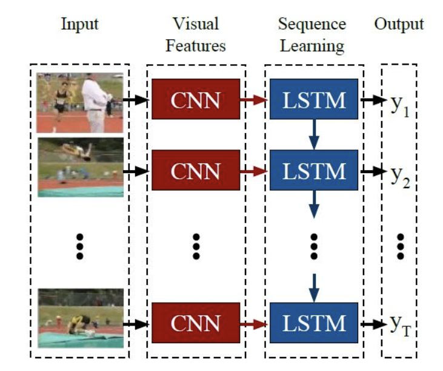

### 4.3 基于骨骼关键节点

基于骨架（Skeleton-based）的行为识别目前基本都是在用图卷积GCN

一般来说，人体骨架序列有三个显著的特征:

- 每个节点与其相邻节点之间具有很强的相关性，因此骨架框架包含了丰富的人体结构信息。
- 时间连续性不仅存在于相同的关节(如手、腕、肘)，也存在于身体结构中。
- 时空域之间存在共现关系。

#### 4.3.1 基于骨骼关键节点的行为识别综述

- [【骨骼行为识别】论文与数据集列表 - 知乎 (zhihu.com)](https://zhuanlan.zhihu.com/p/330856233)

- [行为识别综述之 基于3D骨架的深度学习行为识别综述 - 知乎 (zhihu.com)](https://zhuanlan.zhihu.com/p/107983551)

- 根据基于模型的不同可以划分为RNN 、CNN 、GCN

  > A Survey on 3D Skeleton-Based Action Recognition Using Learning Method（2020）

  1. RNN-based：在基于RNN的方法中，骨架序列是关节坐标的自然时间序列，这可以被视为序列向量，而RNN本身就适合于处理时间序列数据。此外，为了进一步改善学习到的关节序列的时序上下文信息，一些别的RNN(LSTM,GRU)方法也被用到骨架行为识别中。
  2. CNN-based：当使用CNN来处理这一基于骨架的任务的时候，可以将其视为基于RNN方法的补充，因为CNN结构能更好地捕获输入数据的空间cues，而基于RNN的方法正缺乏空间信息的构建。需要平衡且更充分利用空间信息和时域信息
  3. GCN-based：相对新的方法图卷积神经网络GCN也有用于骨架数据处理中，因为骨架数据本身就是一个自然的拓扑图数据结构（关节点和骨头可以被视为图的节点和边），而不是图像或序列那样的格式。这个方法最重要的问题仍然与骨架数据的表示有关，即如何将原始数据组织成特定的图形。
  
- 本文整理分类：传统算法、RNN-based、CNN-based、GCN-based、Transformer-based、Self-supervision

  **（分类不完全互斥，有很多融合模型）**

#### 4.3.2 传统算法

传统的基于骨骼的动作识别方法主要分为两类：**基于关节的方法**和**基于身体部位**的方法。

##### 4.3.2.1 View invariant human action recognition using histograms of 3d joints（2012 CVPRW）

基于手工制作的低级特征，采用相对简单的时间序列模型，例如隐马尔可夫模型。

##### 4.3.2.2 Joint angles similarities and hog2 for action recognition（2013 CVPRW）

基于身体部位的方法将人体骨骼视为一组连接的片段，然后专注于单个或连接的身体部位对和关节角度。

##### 4.3.2.3 Cov3DJ（2013 IJCAI）

> Human action recognition using a temporal hierarchy of covariance descriptors on 3d joint locations

- 我们解决了骨骼关节运动序列在一段时间内以一种紧凑和高效的方式表示的问题，这对人类动作识别具有高度的鉴别性。

  我们提出了一种新的**基于协方差矩阵的人体动作识别描述符**。描述符是通过计算人体骨架关节坐标上随时间采样的协方差矩阵来构建的。为了对关节位置的时间依赖性进行编码，我们使用了多个协方差矩阵，每个协方差矩阵以一种**分层的方式覆盖输入序列的子序列**。

- **协方差描述符**

  - 协方差

    [形象理解协方差矩阵 - 知乎 (zhihu.com)](https://zhuanlan.zhihu.com/p/349802953)

    一组N个随机变量的协方差矩阵是一个**N × N**的矩阵，其元素是每一对变量之间的协方差。设X是N个随机变量的向量。随机向量X的协方差矩阵定义为**COV(X) = E[(X−E(X))(X−E(X))‘]**，其中E()为期望算子。**协方差矩阵编码关于随机变量集合的联合概率分布形状的信息**。（**‘**表示转置）

  - 假设体由K个关节表示，设S为单个骨架所有关节位置的向量，即**S = [x1，…， xK, y1，…， yK, z1，…， zK]’**，有N = 3K的元素。然后，该序列的协方差描述符为COV(S)。通常情况下，S的概率分布是未知的，我们用样本协方差代替，它是由方程给出的

    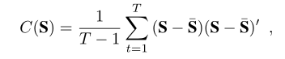

    其中¯S是S的样本均值，对于描述符，我们只使用它的**上三角形**（协方差矩阵对称）。例如，对于有20个关节的骨骼，N = 3 × 20 = 60。在这种情况下，协方差矩阵的上三角形是**N(N + 1)/2 = 1830**，这是描述符的长度。

- **时间层次结构**

  Cov3DJ描述符捕获操作执行期间不同关节位置之间的依赖关系。然而，**它不能捕捉到运动的时间顺序**。因此，如果给定序列的帧被随机打乱，协方差矩阵不会改变。这可能会有问题，例如，当两个活动的时间顺序是相反的，例如“推”和“拉”。

  为了**将时间信息添加到Cov3DJ中**，我们使用了Cov3DJ的层次结构，顶级Cov3DJ是在整个视频序列上计算的。较低的层次是在整个序列的较小窗口(重叠或不重叠)上计算的。

  下图只显示了层次结构中的两个级别。顶层矩阵覆盖整个序列，用C00表示。在序列的T /2l帧上计算第l级的协方差矩阵。从一个窗口到下一个窗口的步骤要么是窗口的长度，要么是窗口的一半。如果步骤是窗口长度的一半，则窗口相互重叠。在图中，第二层的协方差矩阵重叠。**添加更多级别并允许重叠增强了分类器使用描述符区分操作的能力**。然而，我们添加的层越多，允许重叠的层越多，描述符的长度就越长。对于图中的描述符配置，用20个关节表示的骨架将得到长度为4 × 1830 = 7320的描述符。

  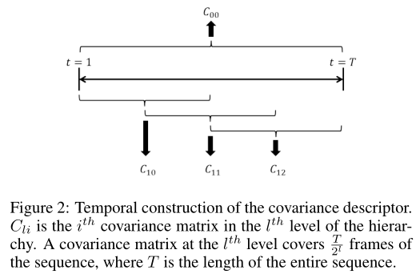

- 使用一种动态规划方法加速Cov3DJ描述符的计算。✏

- 使用线性**SVM**分类器。在训练或测试之前，描述符被规范化为具有L2单元规范。协方差矩阵本质上是移动不变的。为了使其尺度不变，在计算描述符之前，我们将序列上的关节坐标归一化，使其在所有维度上的范围从0到1。

- **实验结果**

  时间层次中不同级别的分类精度。一般来说，我们可以推断，添加更多的级别可以增强描述符的识别能力，从而提高分类的准确性。重叠也提高了分类精度。

  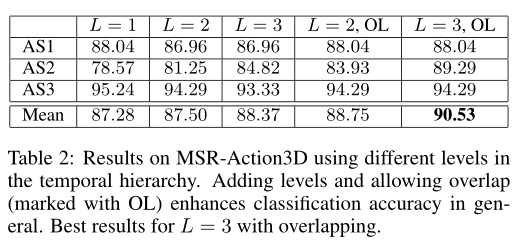

  

##### 4.3.2.4 Human action recognition by representing 3d skeletons as points in a lie group（2014 CVPR）

- 大多数现有的基于骨骼的方法使用**关节位置**或**关节角度**来表示人类骨骼。

  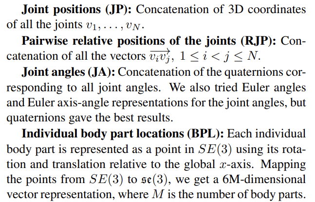

- 提出了一种新的**骨架表示**，该表示在3D空间中使用旋转和平移显式地模拟了各种身体部位之间的3D几何关系。由于3D刚体运动是特殊欧几里得群SE（3）的成员，因此建议的骨架表示位于李群SE（3）×...×SE（3），它是一个弯曲的流形。使用所提出的表示，人类行为可以建模为这个李群中的曲线。由于在这个**李群中对曲线进行分类不是一件容易的事**，所以我们将动作曲线**从李群映射到它的李代数**，这是一个向量空间。然后，我们使用动态时间扭曲，傅里叶时间金字塔表示和线性SVM的组合进行分类。

- **李群与李代数**

  [第四讲：李群和李代数 - 知乎 (zhihu.com)](https://zhuanlan.zhihu.com/p/33156814)

  - 特殊欧几里得群，由 **SE（3）** 表示，是以下形式的所有 4 x 4 矩阵的**集合**，R是旋转矩阵，d是平移向量

    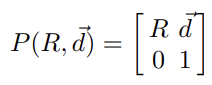

  - 在单位矩阵**I**与 SE（3） 的切线平面被称为 SE（3） 的李代数，表示为se（3）.它是一个 6 维向量空间，由以下形式的所有 4 x 4 矩阵形成

    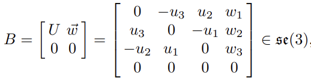

    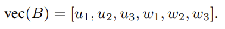

  - 李群与李代数转换

    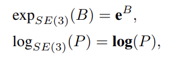

- **李群李代数骨架表示**

  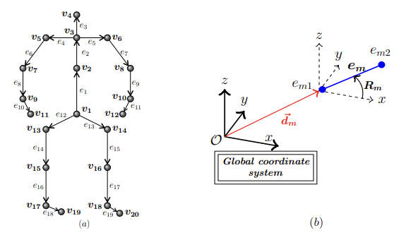

  - 给定一对身体部位em和en，为了描述它们的相对几何形状，我们在附加到另一个的局部坐标系中表示它们中的每一个。

  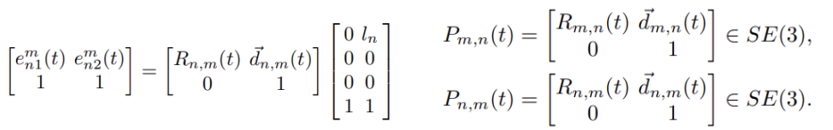

  - 使用所有身体部位对之间的相对几何形状，我们表示在时间实例t中骨架S：**M**是身体部位个数，如上图是19（e1~e19）

  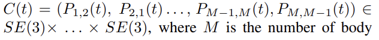

  - 使用建议的骨架表示，描述动作的骨骼序列可以表示为曲线{C(t），t∈[0，T]}在SE(3）×...×SE(3).弯曲空间中动作曲线的分类SE(3）×...×SE(3)这不是一项微不足道的任务。此外，**SVM等标准分类方法和傅里叶分析等时间建模方法并不直接适用于这一空间。**为了克服这些困难，我们从SE(3）×...×SE(3)到它的李代数se（3）×...×（3），这是单位元素处的切线空间。对应于的李代数曲线（以向量表示形式）C(t)由

    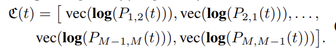

    C（t）是维度的向量**6M(M−1)**，因此，我们将行为表示为6M(M−1)-维向量

- **时态建模和分类**

  😵

  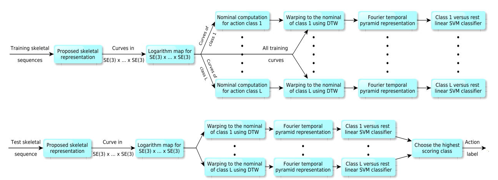

  - 由于各种问题，如速率变化，时间错位，噪声等，将李代数中的曲线分类为不同的动作类别并不简单。我们使用 **DTW**来处理速率变化。

  - 在训练期间，对于每个动作类别，我们使用下面描述的算法**计算一条标称曲线**，并使用 DTW 将所有训练曲线扭曲为该标称曲线。我们使用李代数中的平方欧几里得距离来表示 DTW。请注意，要计算标称曲线，所有曲线都应具有相等数量的样本。为此，我们使用插值算法。

    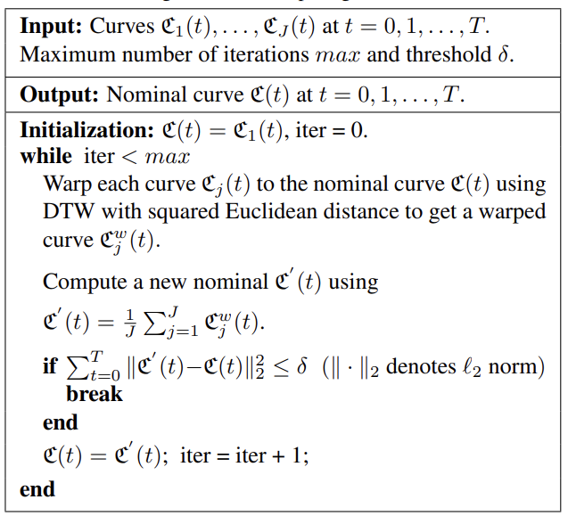

  - 为了处理时间不对中和噪声问题，我们使用最近提出的**傅里叶时间金字塔表示来表示扭曲曲线**，从而消除了高频系数。我们分别对每个维度应用 **FTP**，**并连接所有傅里叶系数以获得最终的特征向量**。

  - 行为识别是通过使用一对全线性 **SVM** 对最终特征向量进行分类来执行的。

#### 4.3.3 RNN-based

##### 4.3.3.1 Two-Stream RNN（2017 CVPR）

> Modeling Temporal Dynamics and Spatial Configurations of Actions Using Two-Stream Recurrent Neural Networks

- **出发点：**基于手工制作特征的传统方法仅限于表示运动模式的复杂性。使用递归神经网络（RNN）处理原始骨架的最新方法仅关注时间域中的上下文依赖性，而**忽略了铰接骨架的空间配置**。在本文中，我们提出了一种新的双流RNN架构，用于模拟基于骨架的动作识别的时间动力学和空间配置。
- 我们引入了一种新颖的双流RNN架构，该架构结合了空间和时间网络，用于基于骨架的动作识别。
  - 时态流使用基于RNN的模型从关节的坐标中学习不同时间步长的时间动态。我们采用两种不同的 RNN 模型，即**堆叠 RNN 和分层 RNN**。与堆叠RNN相比，分层RNN是根据人体运动学设计的，参数更少。
  - 空间流学习关节的空间依赖性。我们提出了一种简单有效的方法来模拟空间结构，该结构首先将铰接骨架的空间图转换为关节序列，然后将该结果序列馈送到RNN结构中。探索了不同的方法，将图形结构转换为序列，以更好地维护空间关系。**包括链序列RNN和遍历序列RNN**
  - 然后，这两个通道通过后期融合进行组合，整个网络是端到端可训练的。
- 为了避免过度拟合和改进泛化，我们利用数据增强技术，使用3D变换，即旋转变换，缩放变换和剪切变换来变换训练期间骨架的3D坐标。
- RNN使用"LSTM"

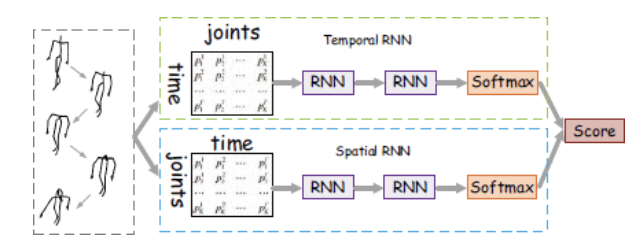

- **时间堆叠式 RNN**

  此结构为每个时间步长的所有关节的**串联坐标**馈送RNN网络。在这里，我们堆叠两层RNN，发现添加更多层不会显着提高性能。

- **时间分层 RNN**

  人体骨骼可分为五部分，即两条胳膊、两条腿和一条躯干。我们观察到，一个动作是由一个独立的部分或几个部分的组合来执行的。

  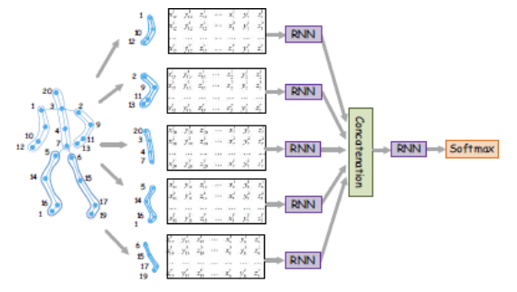

- **空间链序列RNN**

  我们假设关节按照手臂，躯干和腿的顺序排列成链条状序列。躯干放在中间，因为它连接着手臂和腿。**下图b**

- **空间遍历序列RNN**

  一种图遍历方法，根据邻接关系访问序列中的关节，访问顺序将图表排列成一系列关节。**遍历序列通过在正向和反向方向上两次访问大多数关节来保证图形中的空间关系。下图c**
  
  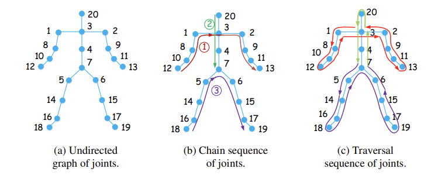
  
- **实验结果**

  - 双流RNN的表现始终优于单个时间RNN和空间RNN，这证实了空间和时间通道既有效又互补。

  - 时态 RNN 的结果比空间 RNN 的结果要好得多。这一观察结果与以下事实一致：以前大多数基于 RNN 的方法都采用时态 RNN 来识别操作。

  - 对于时态 RNN，**分层结构通常比堆叠结构的性能更好。**

  - 对于空间RNN，***遍历序列*的结果优于*链序列*的结果**，因为遍历方法通过在正向和反向方向上访问大多数关节两次来保持图形结构的更好的空间关系。
  - 3D变换技术为基于骨架的识别带来了显著的性能提升，因为旋转变换会从不同的视图随机生成新的骨架，从而使我们的双流RNN对视点变化具有鲁棒性。

  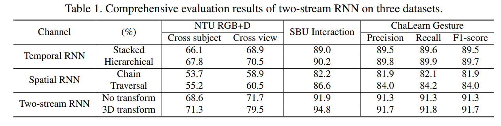

##### 4.3.3.2 Ensemble TS-LSTM v2（2017 ICCV）

> Ensemble Deep Learning for Skeleton-based Action Recognition using Temporal Sliding LSTM networks


##### 4.3.3.3 ARRN-LSTM（2018 ICME）

> Relational Network for Skeleton-Based Action Recognition


##### 4.3.3.4 AGC-LSTM（2019 CVPR）

> An Attention Enhanced Graph Convolutional LSTM Network for Skeleton-Based Action Recognition

- 如何有效地提取有区别的时空特征仍然是一个具有挑战性的问题。本文提出了一种新的注意增强图卷积LSTM网络(AGC-LSTM)，图卷积LSTM在这一任务中的首次尝试，用于从骨骼数据中识别人体动作。所提出的AGC-LSTM不仅能捕获**空间形态和时间动态的判别特征**，而且能探索**时空域间的共现关系**。我们还提出了一种**时间层次结构**来增加顶层AGC-LSTM层的时间接受域，提高了高级语义表示的学习能力，并显著降低了计算成本。此外，利用**注意机制**对AGC-LSTM各层的关键节点信息进行增强，以选择有区别的空间信息。

- 图卷积神经网络

  利用邻接矩阵表示，同ST-GCN

  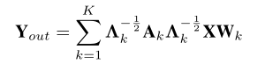

- **LSTM**

  [（译）理解长短期记忆(LSTM) 神经网络 - 知乎 (zhihu.com)](https://zhuanlan.zhihu.com/p/24018768)

- **模型**

  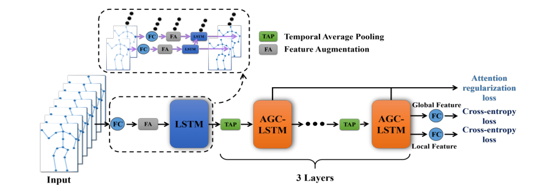

  - **首先利用线性层和LSTM层将每个关节的三维坐标映射到高维特征空间：**将每个关节的坐标转化为具有线性层（关节共享）的位置特征（N×256）；**位置特征**是有益的学习空间结构特征图模型。两帧连续帧间的**帧差特征**有助于AGC-LSTM的动态信息获取。为了考虑到这两种优势，将两个特征连接起来作为一个增强特征来丰富特征信息。为了消除两个特征之间的**尺度差异**，采用共享LSTM对每个关节序列进行处理。

    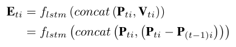

    Eti为关节i在t时刻的增强特征。

  - 接下来，我们应用三个**AGC-LSTM层**来建模时空特征。

    - 输入：**{E1, E2，…ET}**将作为节点特征馈送到以下GC-LSTM层。

    - 如下AGC-LSTM单元的结构。与LSTM相比，AGC-LSTM的内部算子是图卷积计算。

      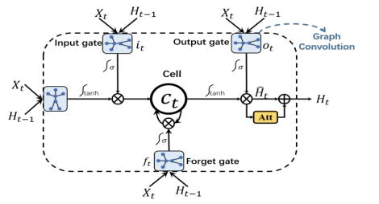

      AGC-LSTM也包含三个门:一个输入门**i<sub>t</sub>**，一个遗忘门**f<sub>t</sub>**，一个输出门**o<sub>t</sub>**。**∗g表示图卷积算子**，att表示注意力机制

      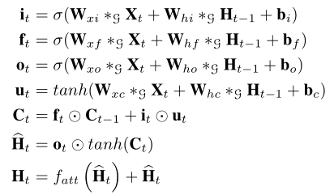

  - 该方法采用了一种软注意机制

    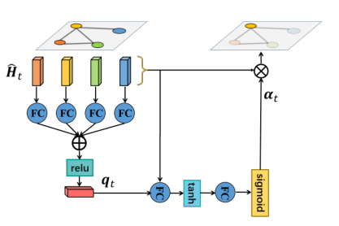

    W是可学参数矩阵

    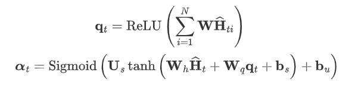

    节点vti的隐藏状态**Hti**也可以表示：

    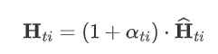
  
  - 受CNN空间池化的启发，我们提出了一种**基于时间平均池化的时间层次结构**，以增加顶层AGC-LSTM的时间接受域。通过时间层次结构，AGC-LSTM顶层的每次时间输入的时间接受域都变成了一个帧的短期剪辑，对时间动态的感知更加敏感。此外，在提高性能的前提下，可以显著降低计算成本。

  - 在最后的AGC-LSTM层，**将所有节点特征的聚合作为全局特征**，**聚焦节点的加权和作为局部特征:**
  
    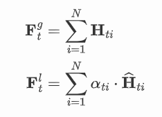
  
  - 最后，我们利用最后一层AGC-LSTM中所有关节的全局特征和聚焦关节的局部特征来预测人类行为的类别。将每个时间步长的全局特征$\mathbf{F}_{t}^{g}$和局部特征$\mathbf{F}_{t}^{l}$转化为C类的评分$\mathbf{O}_{t}^{g}$和$\mathbf{O}_{t}^{l}$，其中$\mathbf{O}_{t}=\left(o_{t 1}, o_{t 2}, \ldots, o_{t C}\right)$。则预测概率为第i类:

    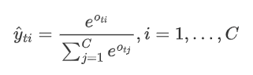

- 在训练过程中，考虑到AGC-LSTM顶部每个时间步长的隐藏状态包含一个短期动态，我们用以下**损失函数**:

  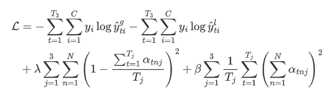

  其中y = (y1，…yC)是groundtruth标签。Tj为第j AGC-LSTM层的时间步长。第三项的目标是对不同的关节给予同等的关注。最后一项是限制感兴趣节点的数量。λ和β是重量衰减系数。预测时使用两者**概率和**来预测人类行为的类别。

- 虽然基于关节的模型达到了最先进的结果，我们也探索了所提出的模型在零件层面上的性能。**根据人体的身体结构，人体可分为几个部分。类似于基于关节的AGC-LSTM网络，**我们首先用线性层和共享LSTM层捕获部分特征。然后将作为节点表示的零件特征送入三个AGC-LSTM层，对时空特征进行建模。此外，基于关节和部件的双流模型可以进一步提高性能。

  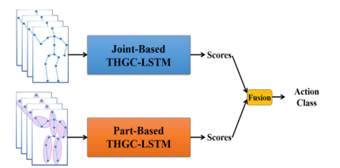

- **实验结果**

  - TH表示时间层次结构。与LSTM和GC-LSTM相比，LSTM+TH和GC-LSTM+TH可以增加顶层各时间步长的时间接受野。改进后的性能证明了时间层次结构能够有效地表达时间动态。用GC-LSTM替代LSTM, GCLSTM+TH在NTU数据集上的准确率分别提高到2.5%、4.9%和10.9%。性能的显著提高验证了GC-LSTM的有效性，它可以从骨架数据中捕获更有区别的时空特征。与GC-LSTM相比，AGC-LSTM可以利用空间注意机制来选择关键节点的空间信息，提高了特征表示能力。此外，基于零件和基于关节的AGC-LSTM的融合可以进一步提高性能。

    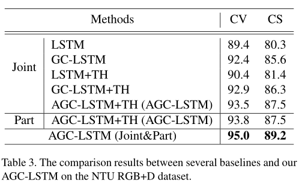

#### 4.3.4 CNN-based

##### 4.3.4.1 P-CNN（2015 ICCV）

> P-CNN: Pose-based CNN Features for Action Recognition


##### 4.3.4.2 CNN+Motion+Trans（2017 ICMEW）

> Skeleton-based action recognition with convolutional neural networks

- 本文主要整理“分类任务”的行为识别。

- **出发点：**目前最先进的基于骨骼的行为识别方法主要基于递归神经网络（RNN）。在本文中，我们提出了一种基于卷积神经网络（CNN）的新型框架，用于行为分类和检测。原始骨架坐标以及骨架运动直接馈送到 CNN 中以进行标签预测。新型骨架变压器模块设计用于自动重新排列和选择重要的骨架接头。

  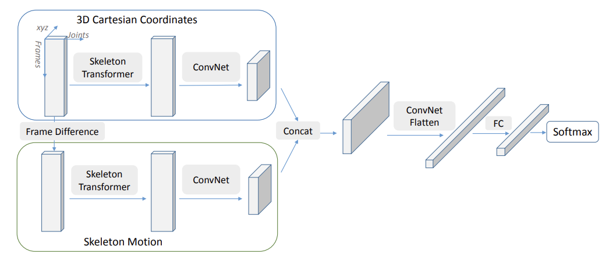

- **双流CNN**

  **原始骨架坐标S和骨架运动M用作我们网络的两个输入流。**骨架序列T帧可以表示为T×N×3数组，它被视为T×N大小的 3 通道图像。视频中的操作可能跨越不同的帧长度。由于骨架数据被视为图像数据，因此我们通过简单的图像大小调整操作将所有视频规范化为固定长度。**请注意，我们不执行任何规范化。**

  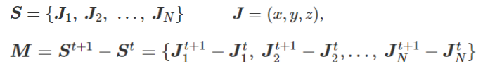

- **Skeleon Transformer**

  对于图像，像素的语义连续性至关重要。例如，如果我们随机随机地随机排列所有像素的位置，则生成的图像将是无意义的，并且对于人类和机器都难以识别。对于T×N×3骨架图像数据，排序N关节是任意选择的（例如左眼，右眼，鼻子等），这可能不是最佳的.

  为了解决这个问题，我们提出了一个骨架变压器模块。给定一个**N×3骨架S**，我们执行如下线性变换，**W是一个N×M**重量矩阵。S′是M新的插值接头。

  请注意，关节的顺序和位置都是重新排列的。该网络自动选择重要的身体关节，这可以解释为**注意力机制的简单变体。**

  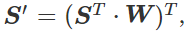

- **Multi-Person Maxout**

  > Maxout networks（2013 ICML）

  上述方法专为单人情况而设计。对于那些涉及人与人互动的活动（例如拥抱，握手），将有多个人。文献中常见的选择是**将不同人的骨架连接起来作为网络输入。需要零填充来处理不同数量的人。**

  在本文中，我们采用多人的**maxout方案**。不同人的骨架经过相同的网络层，**其特征图在最后一个卷积层之后通过元素最大操作进行合并**。优点是双重的。首先，无需零填充即可优雅地解决人数不一的问题。其次，通过重量共享，我们的方法可以从两个人扩展到更多的人，而无需增加模型尺寸。

- **网络架构**

  我们设计了一个微小的7层网络，由3个卷积层和4个完全连接的层组成（此时性能饱和）。我们的网络仅包含130万个参数。它可以从头开始轻松训练，无需任何预训练。
  
- **实验结果**

  - Ablation study

    对NTU RGB + D数据集进行了烧蚀研究。使用普通的CNN，我们已经优于STA-LSTM（一个强大的LSTM基线）

    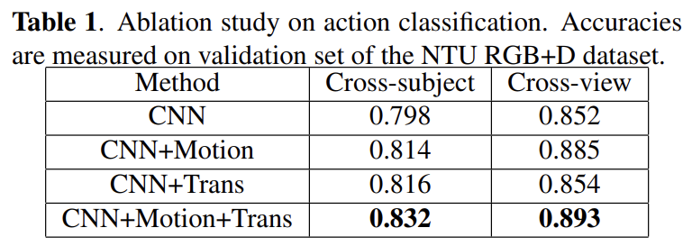

  - **NTU RGB+D**

    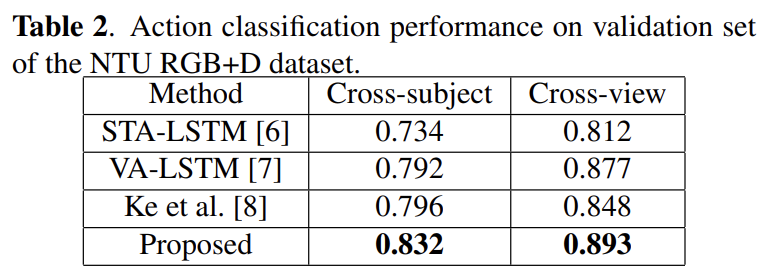

##### 4.3.4.3 HCN（2018 IJCAI）

> Co-occurrence Feature Learning from Skeleton Data for Action Recognition and Detection with Hierarchical Aggregation

- **同现特征：**也就是看除了自身特征，某些位置是否同时出现了某一特征来加强判断。

- **出发点：**之前基于CNN的方法通过将时间动力学和骨骼关节分别编码为行和列，将骨骼序列表示为图像，然后将其输入CNN以识别底层动作，就像图像分类一样。然而，在这种情况下，**仅考虑卷积核内的相邻关节来学习共现特征**。尽管在随后的卷积层中，感受野覆盖了骨骼的所有关节，但很难从所有关节有效地挖掘共现。==>>**设计一个能够从所有关节获得全局响应的模型，以利用不同关节之间的相关性。**

- **本文创新思路：**👏

  - **卷积层的输出是来自所有输入通道的全局响应。**卷积运算可以分解为两个步骤：即跨空间域（宽度和高度）的局部特征聚合**和**跨通道的全局特征聚合。然后，我们可以得出一个简单但非常实用的方法来根据需求调节聚合程度。将T表示为d1×d2×d3三维张量。我们可以通过重组（转置）张量来分配不同的上下文。如果将维度di指定为通道，而另两个维度对本地上下文进行编码，那么来自维度di的任何信息都可以全局聚合。
  - 用到本文模型中：**如果将骨架的每个关节视为一个通道，那么卷积层可以很容易地从所有关节学习共现特征。**更具体地说，我们将骨架序列表示为形状为f rames×joints×3（最后一个维度为channel）的张量。我们首先使用核大小为n×1的卷积层独立地学习每个关节的点级特征。然后我们转换卷积层的输出，使关节的尺寸成为通道。在转置操作之后，后续层将按层次聚合来自所有关节的全局特征。

  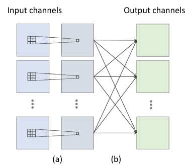

  将3×3卷积分解为两步。（a） 每个输入通道的空间域中的独立二维卷积，其中特征从3×3邻域局部聚集。（b） 跨通道的元素求和，其中特征从所有输入通道全局聚合。

- **本文贡献：**

  - 提出使用CNN模型从骨架数据中学习**全局共现**，该模型优于局部共现。
  - 我们设计了一个新颖的**端到端分层特征学习网络**，其中特征从点级特征逐渐聚合到全局共现特征
  - 我们全面开发了**多人特征融合策略**，使我们的网络能够很好地扩展到可变人数
  - 该框架在动作识别和检测任务的基准测试上都优于所有现有的最先进的方法。 

- **模型**

  分层共现网络。绿色块是卷积层，其中最后一个维度表示输出通道的数量。尾随的“\/2”表示在卷积后附加了跨步为2的MaxPooling层。转置层根据顺序参数排列输入张量的维数。ReLU激活函数附加在conv1、conv5、conv6和fc7之后，以引入非线性。

  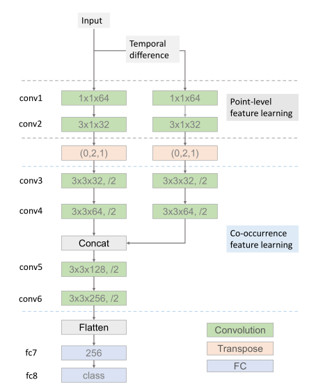

- **输入：**

  除了关节共现外，关节的时间运动也是识别潜在动作的关键线索。原始骨架坐标**S**和骨架运动**M**通过双流模式独立输入网络。骨架序列X可以用T×N×D张量表示，其中T是序列中的帧数，N是骨架中的关节数，D是坐标尺寸（例如，3D骨架为3）。**上述骨骼运动M的形状与X相同。**

  

- **模型解读**

  给定骨架序列和运动输入，按层次学习特征。

  - 原始骨架坐标**S**和骨架运动**M**直接作为两个输入流输入网络。这两个网络分支共享相同的体系结构。然而，它们的参数并不是单独共享和学习的。它们的特征图在conv4之后**通过沿通道串联的方式进行融合**。
  - 在第一阶段，点级特征用1×1（conv1）和n×1（conv2）卷积层编码。由于沿关节维度的核尺寸保持为1，因此它们必须独立地从每个关节的三维坐标学习点级表示。
  - 然后，我们用参数（0，2，1）转置特征映射，以便将关节维度移动到张量的通道。
  - 在第2阶段，所有后续的卷积层从一个人的所有关节中提取全局共现特征，
  - 然后，将特征地图展平为一个向量，并通过两个完全连接的层进行最终分类。

- **Scalability to Multiple Persons**

  在拥抱和握手等活动中，涉及多人。为了使我们的框架能够扩展到多人场景，我们对不同的特征融合策略进行了综合评估。注意，基于元素的后期融合可以很好地推广到可变人数，而其他融合则需要预定义的最大人数。此外，与单人相比，没有引入额外的参数 。

  - **Early fusion**。多人的所有关节都作为网络输入进行叠加。对于可变人数，如果人数小于预定义的最大人数，则应用零填充。

  - **Late fusion**。多个人的输入经过同一个子网络，他们的conv6特征图通过沿通道串联或元素最大\平均操作合并。

    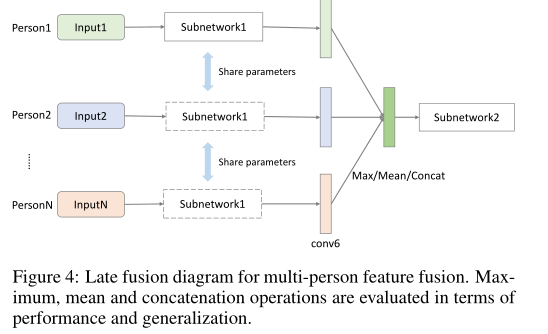
  
- **实验结果**

  - **Multi-person Feature Fusion**

    **所有后期融合方法都优于早期融合方法。**原因可能是不同的人的特征在高级语义空间中比在原始输入空间中更一致，因此更兼容。在三种后期融合实现中，**元素最大化操作达到了最佳精度。**这是由于单人动作零填充的副作用造成的。也就是说，与多人样本相比，在串联和元素平均两种情况下，单人样本的特征都会因填充零而减弱。而元素方面的最大值不会受到这个问题的影响。（NTU RGB+D ）

    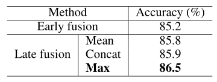

  - NTU RGB+D数据下与其他先进模型对比

    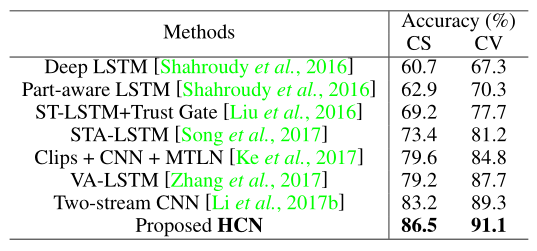

- **最后文章思考**

  促使我们探索不同层次的情境聚合的原因是，我们要弄清楚在动作识别中对关节点之间的交互进行建模的重要性。给定一个或多个受试者的特定类型的动作，关节的全部或部分交互作用是否有助于地球上的认知？从我们的实验中得到的答案最初是反直觉的，但有意义的，这已经被许多类似的工作所证明。所谓的**背景语境是提高任务绩效的关键因素**，在动作识别中也是如此。为了识别一个特定的动作，例如打电话，**不感兴趣的关节，比如脚踝，扮演着与背景语境相似的角色，**其贡献用CNN隐式编码。这正是我们的方法从中受益的见解。

##### 4.3.4.4 TSRJI（2019 SIBGRAPI）

> Skeleton Image Representation for 3D Action Recognition Based on Tree Structure and Reference Joints


##### 4.3.4.5 PoseC3D（2021 arXiv）

> Revisiting Skeleton-based Action Recognition

[PoseC3D: 基于人体姿态的动作识别新范式 - 知乎 (zhihu.com)](https://zhuanlan.zhihu.com/p/395588459)

- **出发点：**

  - **问题：**许多基于骨架的动作识别方法都采用图卷积网络（GCN）来提取人体骨架上的特征。尽管在以前的工作中取得了积极的成果，但基于GCN的方法**在鲁棒性、互操作性和可扩展性方面受到限制**。
    1. **鲁棒性：**GCN直接处理人体关节坐标时，其识别能力受到**坐标分布偏移的影响**，而在应用不同的姿态估计量获取时，往往会发生这种情况协调。因此，坐标中的小扰动常常导致完全不同的预测。
    2.  **互操作性：**以前的工作表明，来自不同模式的表示，如RGB、光流和骨架是互补的。因此，这种模式的有效组合往往会导致行动承认的业绩提高。然而，**骨架表示的图形形式使其难以与其他模式融合**，特别是在早期或低层次阶段，从而限制了组合的有效性。
    3.  **可扩展性：**此外，由于GCN将每个人体关节视为节点，GCN的复杂性与人员数量呈线性关系，**限制了GCN对涉及多人的任务的适用性**，例如组活动识别。
  - 在这项工作中，我们提出了一种新的基于骨架的动作识别方法PoseC3D，它依赖于**3D热图堆栈**而不是图形序列作为人体骨架的基本表示。与基于GCN的方法相比，PoseC3D在学习时空特征方面更有效，对姿态估计噪声更具鲁棒性，并且在跨数据集环境下具有更好的通用性。此外，PoseC3D可以在**不增加计算成本的情况下处理多人场景**，其功能**可以在早期融合阶段轻松与其他模式集成**，这为进一步提高性能提供了巨大的设计空间。

- **人体姿态估计**

  我们主要关注2D姿势，而不是3D姿势，因为需求中的姿势与现有3D姿势提取器估计的姿势之间存在**质量差距**。 

  我们选择自上而下的方法，尤其是在COCO关键点上训练的**HRNet**作为我们的姿势提取工具

- **模型**

  - 基于提取好的 2D 姿态，我们需要堆叠**T**张形状为**（KxHxW）**的二维关键点热图以生成形状为**（KxTxHxW）**的 3D 热图堆叠作为输入。

    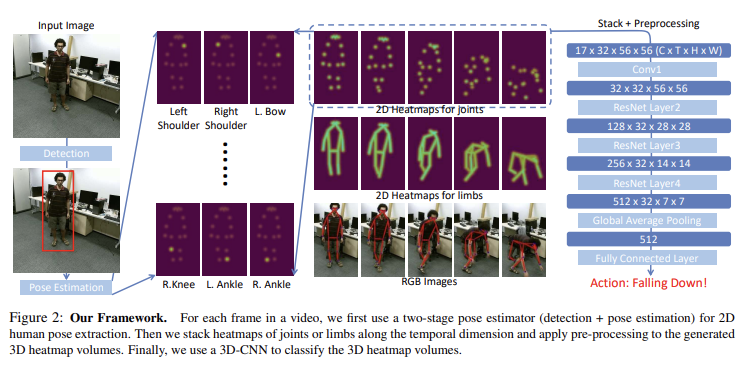

  - 若我们事先将 2D 姿态存储成坐标形式，则需要先生成以 **(x,y)** 为中心的二维高斯热图。

    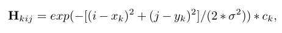

- 我们进一步应用两种**预处理**技术来减少3D热图卷的冗余。

  - **以主题为中心的裁剪**。使热图与框架一样大是低效的，尤其是当所有人只出现在一个小区域时。因此，在这种情况下，我们首先找到最小的边界框，该边界框包含了跨帧的所有2D姿势。然后，我们根据找到的框裁剪所有帧，并将它们调整为目标大小，以便3D热图体积的大小沿空间维度减小。
  
  - **均匀抽样。**由于整个视频长度过长，难以处理，通常选取一个仅包含部分帧的子集构成一个片段，作为 3D-CNN 的输入。基于 RGB 模态的方法，通常只在一个较短的时间窗内采帧构成 3D-CNN 的输入（如 SlowFast 在一个长仅为 64 帧的时间窗内采帧）。由于这种采帧方式难以捕捉整个动作，因此在骨骼行为识别中，我们采用了均匀采样的方式：**需要采 N 帧时，我们先将整个视频均分为长度相同的N 段，并在每段中随机选取一帧。**在实验中，我们发现这样的采帧方式对骨骼行为识别尤其适用。
  
  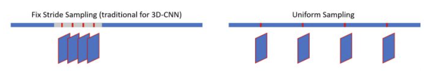
  
  
  
- 本文设计了两个基于3D CNN的网络，即Pose-SlowOnly和RGBPose-SlowFast

  🍳An instantiation of the **RGBPose-SlowFast** network

  T×S^2，C表示时间、空间、通道数。Pose Pathway需要更密集的输入，对应于**SlowFast**中的快速路径。我们使用的主干是ResNet50。GAP表示全球平均池。 

  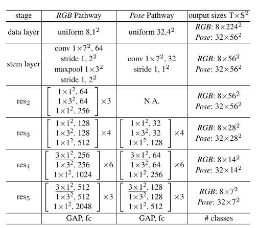

- **Pose-SlowOnly**

  详细架构见上图Pose Pathway，与原始版本对比没有下采样操作、res2层被移除、通道宽度减少到其原始值的一半。

- **RGBPose-SlowFast**

  - RGBPose SlowFast用于**人类骨骼和RGB帧的早期融合**，这是由于在基于骨骼的动作识别中使用了3D CNN实现的。
  - 其中RGB Pathway以**小帧速率和大通道宽度**实例化，Pose Pathway是以**大帧率和小通道宽度**实例化的。此外，时间步长卷积被用作两条路径之间的横向连接，因此**不同模式的语义可以充分交互。**
  - 在RGBPose SlowFast中进行了一些调整，以更好地适应这两种模式的特点。具体来说，姿势路径的res2被移除，侧连接只在res3和res4之前添加，我们使用**双向侧连接**，而不是单向连接，因为它们连接两个非常不同的模式，不同于最初的SlowFast。除了横向连接，两条通路的预测也以后期融合的方式结合在一起，这导致我们的实证研究进一步改进。最后，我们训练RGBPose-SlowFast，**每个通路分别有两个单独的损失，因为从两种模式中联合学习的单个损失会导致严重的过度拟合**。

- **实验结果**

  - 姿态：2D骨架**VS**3D骨架质量

    我们在两个数据集：NTU-60（第1行）和FineGYM（第2行）上可视化3D骨骼（通过传感器收集或使用最先进的估计器估计）和估计2D骨骼。3D骷髅偏移严重，而2D骨架具有优异的质量。 

    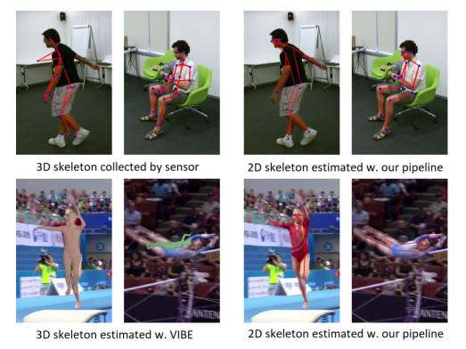

    使用MSG3D[22]（基于骨架的动作识别的最新GCN），对2D和3D关键点使用相同的配置和训练，在动作识别中，**估计的2D关键点（即使是低质量的）始终优于3D关键点（传感器收集或估计）。**

    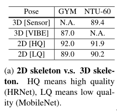

  - 预处理相关

    均匀采样优于固定步长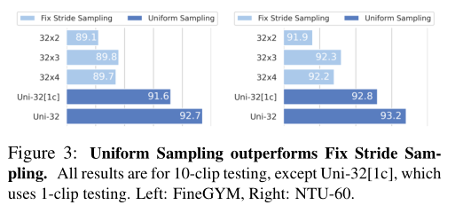

    而且均匀采样主要提高了数据集中较长视频的识别性能。

    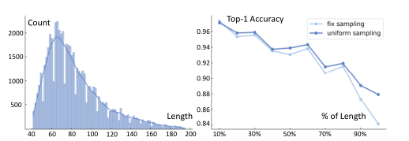

    热图关节还是四肢？根据我们保存的坐标，我们可以生成关节和肢体的伪热图。总的来说，我们发现关节的伪热图是3D-CNN更好的输入，而**四肢的伪热图会导致类似或较差的性能**。将两个分别在肢体和关节热图上训练的模型进行融合，可以进一步提高性能。

  - **为了测试这PoseC3D模型的稳健性，我们可以在输入中删除一部分关键点，看看这种扰动将如何影响最终的精度**。并与其模型比较，通过在每一帧中以概率p随机删除1个肢体关键点来测试：

    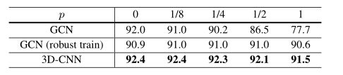

  - PoseC3D（Pose-Pathway） is better or comparable to previous state-of-the-arts.

  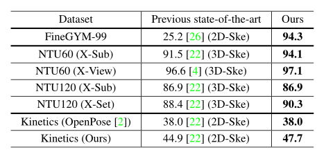

- **补充**

  PoseC3D也可以处理3D骨骼数据。例如，分别使用（x，y）、（y，z）和（x，z）将三维骨架（x，y，z）划分为三个二维骨架。

#### 4.3.5 GCN-based

##### 4.3.5.1 ST-GCN（2018 AAAI）

> Spatial Temporal Graph Convolutional Networks for Skeleton Based Action Recognition
>
> https://github.com/open-mmlab/mmskeleton

- **出发点：**传统的骨架建模方法通常依赖于手工制作的零件或遍历规则，因此表达能力有限，难以推广**。人类骨架数据本质上是拓扑图，而图神经网络在处理非欧数据上的突出表现。**在这项工作中，我们提出了一种新的动态骨架模型，称为时空图卷积网络（ST-GCN），它通过从数据中自动学习空间和时间模式，超越了以往方法的局限性。
- **本文贡献：**
  - 提出了ST-GCN，这是一种基于图形的通用动态骨架建模公式，这是**第一个将基于图神经网络应用于这项任务**的公式。
  - 提出了在ST-GCN中设计卷积核的几个原则，以满足骨架建模的具体要求。
  -  在两个大规模的基于骨架的动作识别数据集上，与以前使用手工零件或遍历规则的方法相比，该模型实现了更高的性能，而人工设计的工作量大大减少。
- **骨架时空图：**该模型建立在一系列骨架图之上，其中每个节点对应于人体的一个关节。有两种类型的边，即符合关节自然连接性的**空间边**和跨连续时间步连接相同关节的**时间边**。在此基础上构造了多个时空图卷积层，使得信息能够沿空间和时间维度进行集成。

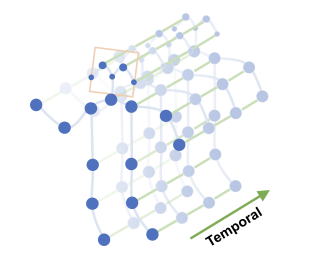

- **分区策略**

  在图卷积网络中，每个相邻节点上的特征向量将具有具有相同权重向量的内积。考虑**通过分区策略来给不同的邻近节点分配不同的权重W**。

  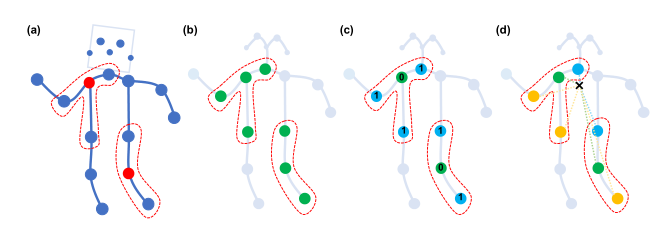

  - （a）输入框架的示例。身体关节用蓝点绘制。D=1的滤镜的感受野用红色虚线圆圈绘制。**（注意，权重W☞后面gcn中W）**

  - （b）**Uni-labeling partitioning**，其中邻域中的所有节点都具有相同的标签（绿色）。**（1个权重W）**

  - （c） **Distance partitioning**。这两个子集是距离为0（绿色）的根节点本身和距离为1的其他相邻点。（蓝色）。**（D+1个权重W）**

  - （d）**Spatial configuration partitioning**。根据节点到骨架重心（黑色十字）的距离（与根节点（绿色）的距离相比）对节点进行标记。向心节点的距离比根节点短（蓝色），而离心节点的距离比根节点长（黄色）。

    这一策略的灵感来自这样一个事实：身体部位的运动可以大致分为同心运动和偏心运动 **（3个权重W）**

    1. 根节点本身
    2. 向心群：比根节点更靠近骨骼重心的相邻节点；
    3. 离心组。

- **输入：**(N , C, T, V, M)，N是batch_size；C是通道数（3个坐标）；T是帧数；V是关键节点数；M是单个帧中骨架数。

- **模型**

  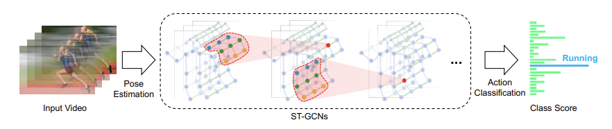
  
  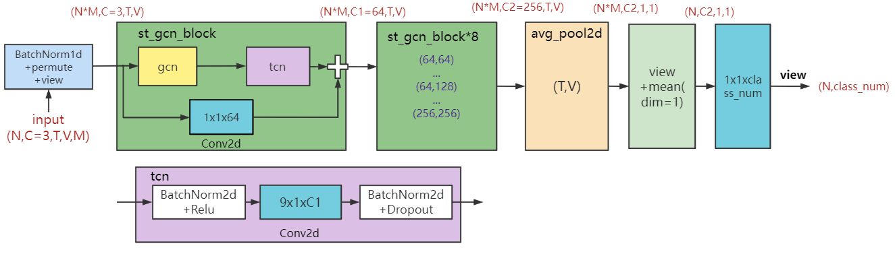
  
  我们对视频进行姿势估计，并在骨架序列上构建时空图。将应用多层时空图卷积（ST-GCN），并逐步在图上生成更高级别的特征图。然后，它将由标准Softmax分类器分类为相应的行为类别。
  
  - Conv2d中数字表示**卷积核的大小与输出通道数**
  
  - permute操作是改变维度位置，如开始M从第4为改变到第一维
  
  - st_gcn_block中的残差连接是可选择的，如果为FALSE，则卷积变为全0输出函数（相对于没有）；如果输入通道数与输出通道数一致，则直接连接，不经过卷积。
  
  - st_gcn_block一共9个，具体输入输出通道如下：
  
    ```python
    # (intput_channels,output_channels,..)
    self.st_gcn_networks = nn.ModuleList((
        st_gcn_block(in_channels, 64, kernel_size, 1, residual=False, **kwargs0),
        st_gcn_block(64, 64, kernel_size, 1, **kwargs),
        st_gcn_block(64, 64, kernel_size, 1, **kwargs),
        st_gcn_block(64, 64, kernel_size, 1, **kwargs),
        st_gcn_block(64, 128, kernel_size, 2, **kwargs),
        st_gcn_block(128, 128, kernel_size, 1, **kwargs),
        st_gcn_block(128, 128, kernel_size, 1, **kwargs),
        st_gcn_block(128, 256, kernel_size, 2, **kwargs),
        st_gcn_block(256, 256, kernel_size, 1, **kwargs),
        st_gcn_block(256, 256, kernel_size, 1, **kwargs),
    ))
    ```
  
  - **tcn**是提取时间特征，只在T维度上进行卷积运算
  
  - **gcn**是提取空间特征，只在单帧骨架中单独进行。**根据分区策略的不同，gcn计算也不同。**
  
    - **Uni-labeling partitioning**（单个权重分区策略）
  
      与一般图卷积运算一致。**Λ**表示归一化矩阵，**W**是可学习矩阵，并节点间共享。
  
      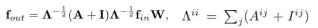
  
    - 对于具有多个权重的分区策略，**即距离分区和空间配置分区**
  
      α 为0.01，防止归一化矩阵为0。
  
      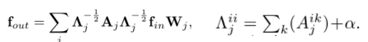
  
      现在邻接矩阵被分解成几个矩阵**Aj**，其中**A+I=Aj之和**。例如，**在距离分割策略中，A0=I和A1=A** 。
  
    - **优化：**实现可学习的边缘重要性权重很简单。对于每个邻接矩阵，我们附带一个**可学习的权重矩阵M**。我们将等式中的矩阵A+I和矩阵Aj替换为（A+I）⊗ M和Aj⊗ M、 分别。在这里⊗ 表示两个矩阵之间的元素乘积。掩码M被初始化为一个全一矩阵。
  
- **实验结果**

  - **Kinetics-Skeleton dataset**

    - Ablation Study

      ST-GCN中**分区策略的效果对比**，多个权重的分区会比单标记分区好。一些说明：distance partitioning*表示使用分区策略，但W1=-W0（相对于只有一个可学习权重）；ST-GCN + Imp表示使用(A + I) ⊗ M优化后的结果。

      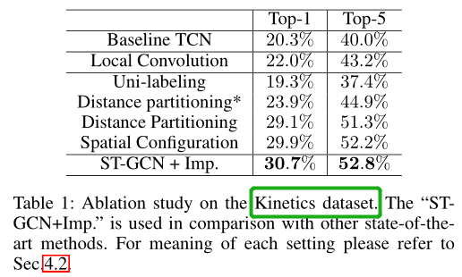

    

  - **NTU RGB+D**

    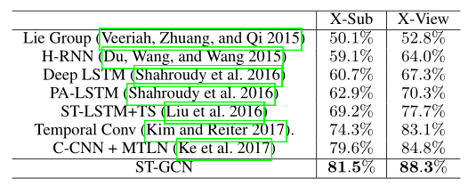

##### 4.3.5.2 A-GCN（2019 CVPR）

> Two-stream adaptive graph convolutional networks for skeleton-based action recognition

- **出发点：**

  - **问题：**在现有的基于GCN的方法中，**图形的拓扑是手动设置的，并且在所有层和输入样本上都是固定的。**这对于GCN的层次结构和动作识别任务中的不同样本可能不是最优的。**图结构应该是数据相关的**。

    此外，ST-GCN每个顶点上附着的特征向量只包含关节的二维或三维坐标，可以看作骨架数据的一阶信息。但是，**表示两个关节之间骨骼特征的二阶信息没有被利用。**通常，骨骼的长度和方向自然更具信息性，并且对动作识别更具辨别力。

  - 我们提出了一种新的用于基于骨架的动作识别的**双流自适应图卷积网络**（2s AGCN）。我们的模型中的**图的拓扑可以通过BP算法以端到端的方式统一或单独地学习。**这种数据驱动的方法增加了图形构造模型的灵活性，并带来了更大的通用性，以适应各种数据样本。

    为了利用骨架数据的二阶信息，将骨骼的长度和方向表示为从骨骼源关节指向目标关节的矢量。与一阶信息相似，将矢量输入自适应图卷积网络中，对动作标签进行预测。同时，**提出了一种二流框架，将一阶和二阶信息融合起来，**进一步提高了性能。

- 图构造同ST-GCN，其中关节表示为顶点，其在人体中的自然连接表示为空间边。对于时间维度，两个相邻帧之间的对应关节与时间边连接。**每个关节的坐标向量设置为对应顶点的属性。** 

- **自适应图卷积层** 

  - 为了使图形结构自适应，我们提出了一种自适应图卷积层。它以端到端学习的方式，将图的拓扑结构与网络的其他参数一起优化。**对于不同的层和样本，该图是唯一的**，这大大增加了模型的灵活性。自适应图卷积公式：✨

    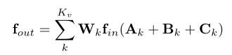

  - 主要区别在于图的邻接矩阵，它分为**三部分：Ak、Bk和Ck：**
    - 第一部分**（Ak）**与原始**归一化N×N邻接矩阵Ak相同**，它代表了人体的物理结构。

    - 第二部分**（Bk）**也是一个**N×N邻接矩阵**。与Ak相比，Bk的元素在训练过程中与其他参数一起被参数化和优化。Bk的值没有限制，这意味着图形完全是**根据训练数据学习的**。通过这种数据驱动的方式，该模型可以学习完全针对识别任务的图形，并且对于不同层中包含的不同信息更加个性化。请注意，矩阵中的元素可以是任意值。它不仅表明两个接头之间存在连接，还表明连接的强度。

    - 第三部分**（Ck）**是一个**数据相关图，它为每个样本学习一个唯一的图。**为了确定两个顶点之间是否存在连接以及连接的强度，我们应用归一化嵌入高斯函数来计算**两个顶点的相似性**：

      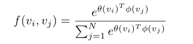

      **其中N是顶点的总数。我们使用点积来衡量嵌入空间中两个顶点的相似性。**具体地说，给定尺寸为**C~in~×T×N**的输入特征映射f~in~，我们首先使用两个嵌入函数，**即θ和φ，**将其嵌入到**Ce×T×N**中。在这里，通过大量实验，我们选择了一个1×1卷积层作为嵌入函数。这两个嵌入的特征映射被重新排列和重塑为一**个N×Ce\*T 矩阵和一个Ce\* T×N 矩阵。然后将它们相乘，得到N×N相似矩阵Ck**，其元素**C^ij^ k表示顶点vi和顶点vj的相似性。**矩阵的值被归一化为0− 1，用作两个顶点的软边。由于归一化高斯函数配备了SOFTMAX运算，我们可以根据计算Ck：

  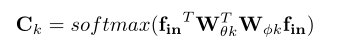

  - **自适应图卷积层的图示。**每一层共有三种图形，即Ak、Bk和Ck。**橙色框表示该参数是可学习的**。（1×1）表示卷积的核大小。Kv表示子集的数量。⊕ 表示元素相加。⊗ 表示matirx乘法。仅当Cin与Cout不同时，才需要残差框（虚线）。

    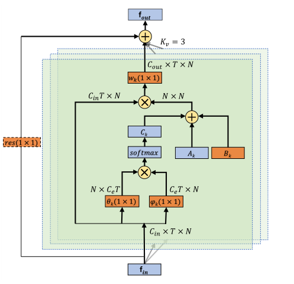

  - **补充**📢

    **我们没有直接用Bk或Ck替换原来的Ak，而是将它们添加到Ak中。**Bk的值以及θ和φ的参数初始化为0。这样可以在不降低原有性能的前提下增强模型的灵活性。

- **自适应图卷积块 **

  **时间维度的卷积与ST-GCN相同**，即在C×T×N特征图上执行Kt×1卷积。在空间GCN和时间GCN之后是批量标准化（BN）层和ReLU层。一个基本块是一个空间GCN（Convs）、一个时间GCN（Convt）和另一个丢弃层的组合，丢弃率设置为0.5。为了稳定训练，为每个区块添加一个残差连接 。

  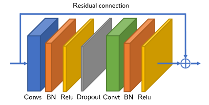

- **自适应图卷积网络 **

  自适应图卷积网络（A-GCN）是基本块的堆栈，总共有9个街区。每个块的输出通道数为64、64、64、128、128、256、256和256。在开始处添加数据BN层，以规范化输入数据。在末端执行**全局平均池层**，以将不同样本的特征映射池到相同大小。最终输出被发送到Softmax分类器以获得预测。**（每个块的三个数字分别代表输入通道数、输出通道数和步幅。）**

  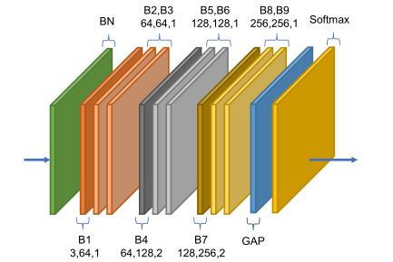

- **双流网络**

  **输入：**

  1. 一阶信息——**关节坐标**。
  2. 二阶信息——**骨骼信息**。由于每个骨骼都与两个关节绑定，因此我们定义**靠近骨骼重心的关节为源关节，远离重心的关节为目标关节。**每个骨骼都表示为一个从源关节指向目标关节的向量，该向量不仅包含长度信息，还包含方向信息。例如，给定一个骨骼，其源关节v1=（x1，y1，z1）和目标关节v2=（x2，y2，z2），该骨骼的向量计算为**e~v1,v2~=（x2− x1，y2− y1，z2− z1）。**

  **补充：**由于骨骼数据的图形没有循环，因此可以为每个骨骼指定唯一的目标关节。**关节数比骨骼数多一个，**因为中心关节未指定给任何骨骼。为了简化网络的设计，**我们向中心关节添加一个值为0的空骨骼。**通过这种方式，骨骼的图形和网络可以与关节的图形和网络设计相同，因为每个骨骼都可以与唯一的关节绑定。

  **模型：**我们分别使用J-Stream和B-Stream来表示关节和骨骼的网络。整体架构（2sAGCN）如图。给定一个样本，我们首先根据关节数据计算骨骼数据。然后，将关节数据和骨骼数据分别输入J-Stream和B-Stream。最后，**将两个流的SOFTMAX分数相加，得到融合分数并预测动作标签。**

  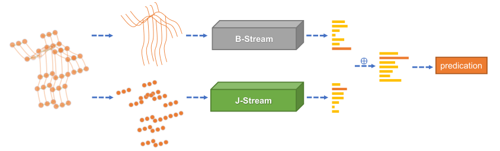

- **实验结果**

  (使用NTU-RGBD数据集上的X-View基准测试)

  - **Adaptive graph convolutional block**

    自适应图卷积块中有3种类型的图，即A、B和C。我们**手动删除其中一种图，并在选项卡中显示它们的性能。**（wo/X表示删除X模块。）

    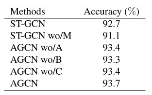

  - **Visualization of the learned graphs**

    左矩阵是NTU-RGBD数据集中第二个子集的**原始邻接矩阵**。右矩阵是我们的模型学**习到的相应自适应邻接矩阵**的一个例子

    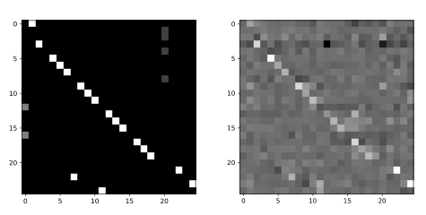

  - **一个样本不同层的骨架图可视化**

    这些骨架是根据人体的物理联系绘制的。每个圆代表一个关节，它的大小代表我们模型的学习自适应图中当前关节和第25个关节之间的连接强度。研究表明，传统的人体物理连接并不是动作识别任务的最佳选择，**不同的层次需要具有不同拓扑结构的图形。**

    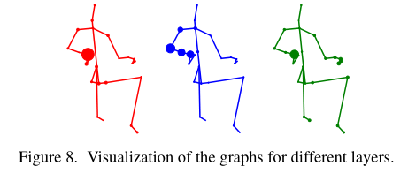

  - **相同层不同样本的骨架可视化**

    从模型第五层的第二个子集中提取学习到的邻接矩阵。结果表明，即使对于同一卷积子集和同一层，我们的模型**对不同样本学习到的图结构也是不同的**。它验证了我们的观点，即不同的样本需要不同的图拓扑，**数据驱动的图结构优于固定的图结构。** 

    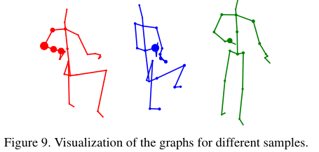

  - **Two-stream framework**

    比较单独使用每种类型的输入数据的性能，显然，两流方法优于基于一流的方法。 

    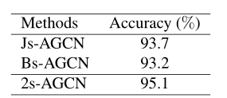

##### 4.3.5.3 AS-GCN（2019 CVPR）

> Actional-Structural Graph Convolutional Networks for Skeleton-based Action Recognition


##### 4.3.5.4 Shift-GCN（2020 CVPR）

> Skeleton-Based Action Recognition with Shift Graph Convolutional Network
>
>  https://github.com/kchengiva/Shift-GCN

- **出发点：**

  - **问题：**基于gcn的方法有两个缺点。(1)**计算复杂度过高**。例如，ST-GCN为一个动作样本花费16.2 GFLOPs1。由于引入增量模块和多流融合策略，最近的一些工作甚至达到了100个GFLOPs。(2)**空间图和时间图的接收域都不灵活**。虽然一些研究通过引入增量自适应模块来增强空间图的表达能力，但我们的实验表明，它们的表达性仍然受到常规GCN结构的限制。
  - 受到移位CNN的启发，我们提出了**移位图卷积网络**(Shift-GCN)来解决这两个缺点。它使用一种轻量级的移位操作作为2D卷积的替代，可以**通过简单地改变移位距离来调整接收域。**算法由**空间移位图卷积**和**时间移位图卷积**两部分组成：
    - 针对空间骨架图建模提出了两种空间移位图操作（局部移位图运算和非局部移位图运算）。我们的非局部空间位移图运算具有较高的计算效率和较强的性能。
    - 提出了两种用于时态骨架图建模的时态移位图操作（朴素时态移位图操作和自适应时态移位图操作）。我们的自适应时间转移图运算能够自适应地调整接受域，并且在计算量小的情况下优于常规时间模型。
    - 在三个基于骨架的动作识别数据集上，所提出的移位GCN以超过10×更少的计算成本超过了最先进的方法。

- **Shift-CNNs**

  > Shift: A Zero FLOP, Zero Parameter Alternative to Spatial Convolutions（2018 CVPR）

  - shift卷积过程相当于将原输入的矩阵在某个方向进行平移，这也是为什么该操作称之为shift的原因。虽然简单的平移操作似乎没有提取到空间信息，但是考虑到我们之前说到的，**通道域是空间域信息的层次化扩散**。因此通过设置不同方向的shift卷积核，可以将输入张量不同通道进行平移，随后配合1x1卷积实现跨通道的信息融合，即可实现空间域和通道域的信息提取。

  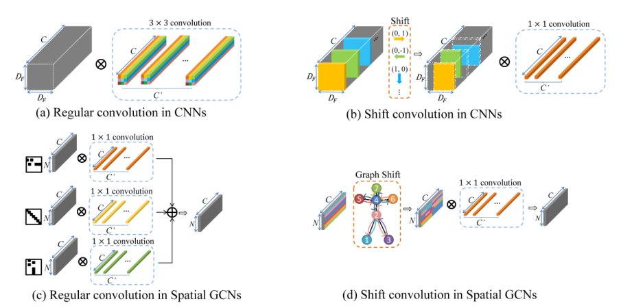

  - CNN中的规则卷积核可以被视为几个逐点卷积核的融合，其中每个核在指定的位置上运行，如图（A）中不同颜色的显示。例如，一个3×3卷积核是9个逐点卷积核的融合。

  - 空间GCN中的规则卷积核是3个逐点卷积核的融合，每个核在指定的空间分区上运行，如图（c）中的不同颜色所示。如ST-GCN，空间分区由3个不同的相邻矩阵指定，分别表示“向心”、“根”、“离心”。
  - CNNs中的移位卷积包含**移位运算**和**逐点卷积核**，其中接收域由移位运算指定，如图2（b）所示。

- **Spatial shift graph convolution**

  移位图操作的主要思想是将**相邻节点的特征转移到当前卷积节点。**具体来说，我们提出了两种移位图卷积：局部移位图卷积和非局部移位图卷积。

  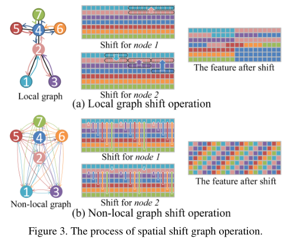

  - **局部移位图卷积**

    对于局部移位图卷积，**感受野由人体的物理结构指定**，该结构由骨架数据集预定义。

    在此设置中，移位图操作在身体物理图的相邻节点之间执行。因为身体关节之间的连接不像CNN特征那样有序，不同的节点有不同数量的邻居。设v表示一个节点，Bv={B^1^v，B^2^v，···，B^n^v}表示其相邻节点集，其中**n表示v的相邻节点数**。我们将**节点v的通道平均划分为n+1个分区**。我们让**第一个分区保留v的特征。其他n个分区分别从B1v、B2v、···、Bnv转移**。F维度**(N,C)**。我们在F的每个节点上进行移位操作 ：

    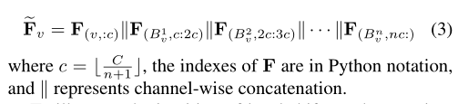

  - **局部移位图卷积有两个缺点：**

    1. **没有利用某些信息。**如节点3中的最后四分之一通道在轮班操作期间被直接放弃。这是因为不同的节点有不同数量的邻居。
    2. 最近的研究表明，**仅考虑局部连接并不是骨骼动作识别的最佳选择。**例如，双手之间的关系对于识别“鼓掌”和“阅读”等动作很重要，但双手在身体结构中彼此距离较远。

  - **非局部移位图卷积**

    - 针对局部两个缺点，非局部移位图运算**使每个节点的感受野覆盖整个骨架图**。

    - **步骤：**给定一个空间骨架特征图F（维度N×C），**第i个通道的移位距离为i mod N**。移位出的通道用于填充相应的空白。非局部移位后，该特征看起来像一个螺旋，使每个节点从所有其他节点获取信息，将**非局部移位图运算与逐点卷积相结合**，得到非局部移位图卷积。

    - **改进：**在非局部移位图卷积中，**不同节点之间的连接强度是相同的。**但人类骨骼的重要性是不同的。因此，我们引入了一种**自适应非局部移位机制**。我们计算移位特征和可学习掩码之间的元素乘积： 

      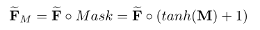

- **Temporal shift graph convolution**

  给定骨架序列特征F（维度：**N×T×C**）

  - **朴素时间移位图卷积图**

    图的时间方面是通过连接时间维度上的连续帧来构造的。因此，**CNN中的移位操作可以直接扩展到时域。**我们将通道平均划分为2u+1个分区，每个分区的**时间偏移距离**分别为−u，−u+1，··，0，··，u− ，u。移出的通道被截断，空通道被零填充。在移位操作之后，每个帧从其相邻帧获取信息。通过将这种时态移位操作与时态逐点卷积相结合，我们得到了简单的时态移位图卷积。

  - **朴素时间移位图卷积图缺点：**

    虽然朴素的时间移位图卷积是轻量级的，但其**超参数u的设置是手动的**。这导致了两个缺点：

    1. 在视频分类任务中，**不同层次**需要不同的时间感受野。对u的所有可能组合进行彻底搜索是很难的。

    2. **不同的数据集**可能需要不同的时间感受野，这限制了原始时间移位图卷积的泛化能力。

       （这两个缺点也存在于常规时间卷积中，其内核大小是手动设置的。）

  - **自适应时间移位图卷积** 

    每个通道都有一个**可学习的时间移位参数Si**，i=1,2，···，C。我们将时间移位参数从整数约束放宽为实数。非整数移位可通过线性插值计算：

    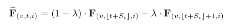

    **λ=Si− ⌊Si⌋**. 这种操作是可微的，可以通过反向传播进行训练。

- **Spatiotemporal shift GCN**

  使用最先进的方法的主干（ST-GCN）来构建时空移位GCN。ST-GCN主干由一个输入块和9个残差时空图卷积块组成，其中每个块包含一个规则的空间卷积和一个规则的时间卷积。我们用**空间移位运算和空间逐点卷积来代替规则的空间卷积**。我们用**时间移位操作和时间逐点卷积来代替常规的时间卷积**。

  将移位运算与逐点卷积相结合有两种模式：shift-Conv和shift-Conv-Shift。Shift Conv Shift模式具有更大的感受野，实验证明可获得更好的性能。

  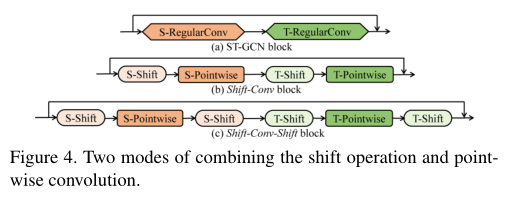

- **实验结果**

  - **Ablation Study**（NTU RGB+D X-view）

    1. **Spatial shift graph convolution**

       我们将ST-GCN中的规则空间卷积替换为简单的点卷积，构建了一个轻量级的点式空间基线。我们的空间移位GCN和该逐点基线之间的唯一区别是插入空间移位操作。**非局部移位图操作比局部移位图操作更有效。**

       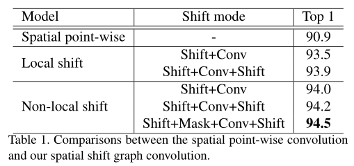

    2. **Temporal shift graph convolution**

       我们将空间模型固定为ST-GCN的规则空间卷积，并评估不同时间模型的有效性和效率 。我们对常规时间卷积和朴素时间移位操作的最佳感受野进行了详尽的搜索。**我们的自适应时间移位操作不需要麻烦的穷举搜索，并且优于其他两种方法的最佳结果。**（Kt是卷积核大小）

       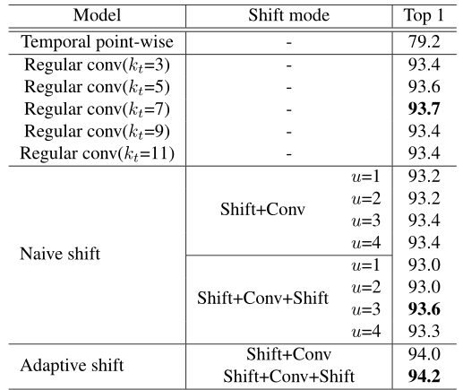

  - **Comparison with the SOTA**

    - 许多最先进的方法利用多流融合策略。为了进行公平比较，我们采用了相同的多流融合策略，即**使用4个流**。
      1. 第一个流使用原始骨架坐标作为输入，称为“关节流”；
      2. 第二个流使用空间坐标的差分作为输入，称为“骨骼流”；
      3. 第三和第四个流使用时间维度上的差分作为输入，分别称为“关节运动流”和“骨骼运动流”。

    - **将多个流的softmax分数相加以获得融合分数。**我们的时空移位GCN（shift-GCN）有三种设置：1-stream，它只使用联合流；2-stream，同时使用关节流和骨流；4-stream，它使用所有4个流。

    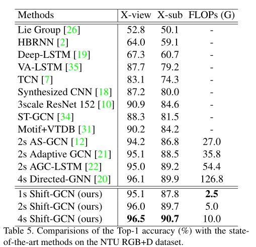

##### 4.3.5.5 CTR-GCN （ICCV 2021）

> Channel-wise Topology Refinement Graph Convolution for Skeleton-Based Action Recognition


#### 4.3.6 Transformer-based

##### 4.3.6.1 TS-SAN（2020 WACV）

> Self-Attention Network for Skeleton-based Human Action Recognition


##### 4.3.6.2 ST-TR（2021 CVIU）

> Skeleton-based action recognition via spatial and temporal transformer networks
>
> https://github.com/Chiaraplizz/ST-TR

- 本文可以理解是在**ST-GCN**（参考前述）基础上结合Transformer Self-attention做改进。

- **出发点：**

  - **目前问题：**
    - 目前对三维骨架潜在信息的有效编码仍然是一个有待解决的问题，尤其是在从关节运动模式及其相关性中提取有效信息时。
    - 表示人体的图形的拓扑结构对于所有层和所有动作都是**固定**的；这可能会阻止提取时间段内骨架运动的丰富表示，尤其是在图形链接有方向且信息只能沿预定义路径流动的情况下。（ST-GCN）
    - 空间和时间卷积都是从标准的二维卷积开始实现的，学习到的局部特征受卷积内核大小的限制。 
    - **人体骨骼中没有连接的身体关节之间的相关性**，例如左手和右手，即使与“鼓掌”等动作相关，也会被低估。
  - 基于Transforer的灵活性、建模长期依赖性及其他优秀特点。我们提出了一种新的时空变换网络（ST-TR），该网络使用**Transforer**自我注意机制来建模关节之间的依赖关系。在我们的ST-TR模型中，空间自注意模块（SSA）用于理解帧内不同身体部位之间的相互作用，时间自注意模块（TSA）用于建模帧间相关性。二者结合在一个双流网络中。

- **本文贡献：**

  - 提出了一种新的基于双流**Transformer**的骨骼活动识别模型，在空间和时间维度上都采用了自我注意。
  - 我们设计了一个空间自我注意（SSA）模块，以动态建立骨骼关节之间的联系，代表人体各部位之间的关系，以动作为条件，**独立于自然的人体结构。**
  - 在时间维度上，我们引入了时间自我注意（TSA）模块来研究关节随时间的动力学。

- **自注意力**

  [Vision Transformer 超详细解读 (原理分析+代码解读) (一) - 知乎 (zhihu.com)](https://zhuanlan.zhihu.com/p/340149804)

  其中Q、K和V是分别包含预测查询、键向量和值向量的矩阵，dk是键向量的**通道维度**。除√dk是为了在训练期间**增加梯度稳定性**。为了获得更好的表现，通常会采用一种称为多头注意的机制，该机制包括使用不同的可学习参数多次应用注意，即一个头部，然后将结果合并 。

  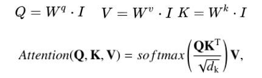

- **模型**

  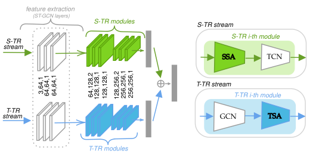

  - 输入**(N , C, T, V, M)**，N是batch_size；C是通道数（3个坐标）；T是帧数；V是关键节点数；M是单个帧中骨架数。相关处理同ST-GCN，==>>**(N*M , C, T, V,)**

  - ST-GCN layer由一个GCN与TCN组成。

    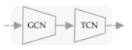

    TCN是卷积核为（K,1）的二维卷积操作；GCN有两种选择：

    - **ST-GCN**

      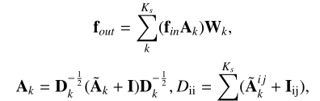

    - **A-GCN**

      > Two-stream adaptive graph convolutional networks for skeleton-based action recognition（2019 CVPR）

      ST-GCN图形结构是预定义的，邻接矩阵是固定的。为了使其具有适应性。A-GCN做改进，其中Ak与等式1中的相同，Bk在训练期间学习，Ck通过相似性函数确定两个顶点是否连接 。

      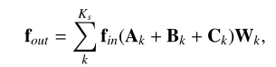

  - **S-TR/T-TR**

    Kt是时间维度（TCN）上具有内核，根据输入顺序不同可能是（Kt,1）

    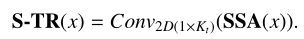

    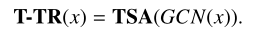

- **Spatial Self-Attention (SSA)**

  空间自我注意模块在每个**帧内**应用自我注意，提取嵌入身体部位之间关系的低层特征。这是通过**独立计算每一帧中每对关节之间的相关性**来实现的。单个样本维度**（1,C,V）**

  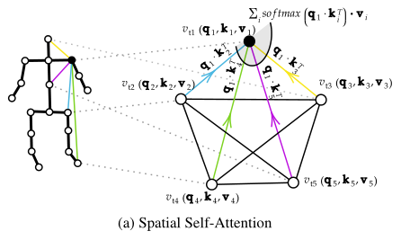

  SSA模块的图示。通过在批次维度中**移动T**（T相当于batch_size）来重塑输入，从而使自我注意在每个时间帧上分别运作。SSA实现为矩阵乘法，其中Q、K和V分别是查询矩阵、键矩阵和值矩阵，以及⊗ 表示矩阵乘法。

  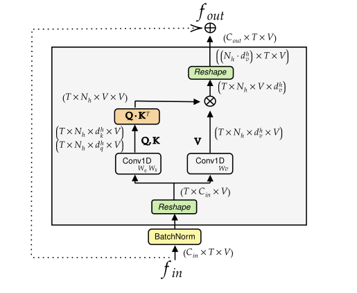

- **Temporal Self-Attention (TSA)**

  使用时间自我注意（TSA）模块，沿着所有框架分别研究每个关节的动力学，即**每个关节被视为独立的**，通过比较同一身体关节沿时间维度嵌入的变化来计算框架之间的相关性，在时间上提取节点之间的帧间关系。单个样本维度**（1,C,T）**

  **TSA的实现是同上面SSA图，唯一的区别是尺寸V对应于T和反之亦然**

  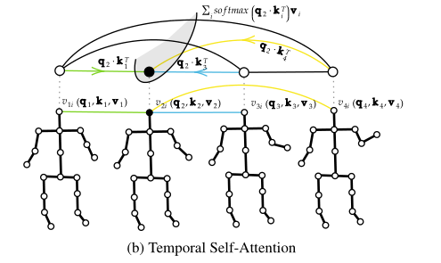

- **实验结果**

  - **Ablation Study**

    - 我们首先使用仅包含联合信息的输入数据来分析S-TR流、T-TR流及其组合的性能。**(a)**

    - 在**(b)**实验中，SSA（TSA）从第一层开始在S-TR（T-TR）流上替代GCN（TCN）。（命名为S-TR-alllayers）中报告的配置性能比表**a**中相应的配置差，但仍优于基线ST-GCN）。

    - 当SSA和TSA组合在一个单流体系结构中时，我们测试了模型的效率（称为**S-TR-1s**）。在此配置中，特征提取仍由原始GCN和TCN模块执行，**而从第四层开始，每一层由SSA和TSA组成，**即ST-TR-1s（x）=TSA（SSA（x））。

  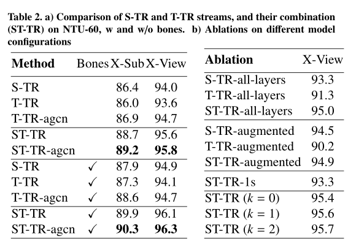

  - **NTU RGB+D**

  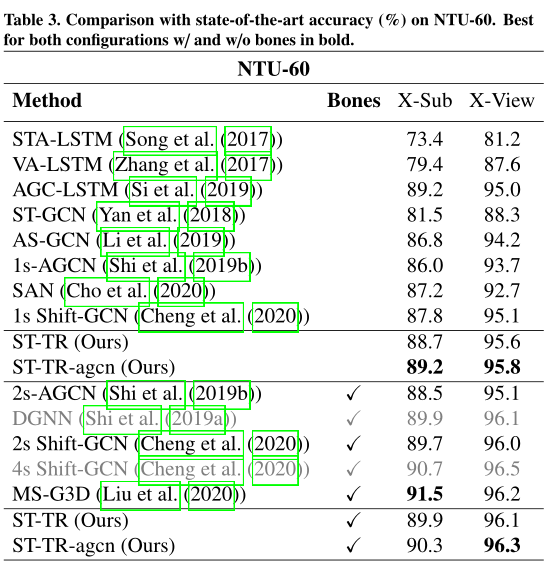

- **总结：**

  提出了一种新的方法，在骨骼活动识别中**引入Transformer自我注意，作为图形卷积的替代**。通过对NTU-60、NTU-120和动力学的大量实验，我们证明了我们的空间自我注意模块（SSA）可以取代图形卷积，实现更灵活和动态的表示。类似地，时间自注意模块（TSA）克服了标准卷积的严格局部性，能够提取动作的长期依赖性。

##### 4.3.6.3 MTT（2022 SPL）

> MTT: Multi-Scale Temporal Transformer for Skeleton-Based Action Recognition


#### 4.3.7 Self-supervision

##### 4.3.7.1 MS2L: Multi-Task Self-Supervised Learning for Skeleton Based Action Recognition（2020 ACM Multimedia）


##### 4.3.7.2 Self-supervised 3D Skeleton Action Representation Learning with Motion Consistency and Continuity（2021 ICCV）


##### 4.3.7.3 Motion-transformer: self-supervised pre-training for skeleton-based action recognition（2021 ACM Multimedia）


##### 4.3.7.4 Contrastive Self-Supervised Learning for Skeleton Action Recognition（2021）


### 4.4 基于RGB视频的行为识别数据集

#### 4.4.1 Kinetics-400

- 迄今为止最大的无约束动作识别数据集
- 包含约**30万**个从YouTube检索到的视频片段。这些视频涵盖多达**400个动作类**，从日常活动、运动场景到复杂的互动动作。动画中的每个片段持续约**10秒**。此动力学数据集仅提供未包含骨架数据的原始视频片段。
- 我们按照数据集作者的建议，通过排名**top-1**和**top-5**的分类精度来评估识别性能。该数据集提供了24万个剪辑的训练集和2万个验证集。我们在训练集上训练比较模型，并在验证集上报告精度。
- 在Kinetics上，视频通常是通过手持设备拍摄的，导致摄像头大幅移动。

#### 4.4.2 UCF101

### 4.5 基于骨骼关键节点的行为识别数据集

#### 4.5.1 Kinetics-Skeleton dataset（Skeleton Based Action Recognition）

[Kinetics-Skeleton dataset Benchmark (Skeleton Based Action Recognition) | Papers With Code](https://paperswithcode.com/sota/skeleton-based-action-recognition-on-kinetics)

- 可以理解由**Kinetics-400**经过
- 在这**ST-GCN**中，使用像素坐标系中估计的关节位置作为输入，并丢弃原始RGB帧。为了获得关节位置，我们首先将所有视频的分辨率调整为340×256，并将帧速率转换为30 FPS。然后，我们使用公开的**OpenPose**工具箱来估计剪辑每一帧上18个关节的位置。工具箱给出像素坐标系中的二维坐标（X，Y）和18个人体关节的置信度C。因此，我们用一个**（X，Y，C）**元组表示每个关节，并将一个骨架帧记录为一个由18个元组组成的数组。对于多人情况，我们在每个片段中选择**两个**关节平均置信度最高的人。通过这种方式，一个带有T帧的片段被转换成这些元组的骨架序列。实际上，我们用（3，T，18，2）维的张量表示剪辑。为了简单起见，我们通过从开始到T=300重放序列来填充每个片段。

#### 4.5.2 NTU RGB+D

[NTU RGB+D Benchmark (Skeleton Based Action Recognition) | Papers With Code](https://paperswithcode.com/sota/skeleton-based-action-recognition-on-ntu-rgbd?metric=Accuracy (CS))

https://blog.csdn.net/weixin_51450749/article/details/111768242

- 是目前最大的用于人体行为识别任务的3D关节注释数据集，摄像头是固定的（有约束）。
- 该数据集包含**60个动作类**中的**56880**个动作片段，这些剪辑都是由**40名**志愿者在受限的实验室环境中拍摄的。该数据集由微软 Kinect v2传感器采集得到，同时记录了**三个摄像头视图**。采集的数据形式包括深度信息、3D骨骼信息、RGB帧以及红外序列。其中骨架的注释由Kinect深度传感器检测到的**摄像机坐标系中的三维关节位置（X、Y、Z）**。
- NTU数据集在划分训练集和测试集时采用了两种不同的划分标准。

  1. **Cross-Subject**
     Cross-Subject按照人物ID来划分训练集和测试集，训练集40320个样本，测试集16560个样本，其中将人物ID为 1, 2, 4, 5, 8, 9, 13, 14, 15,16, 17, 18, 19, 25, 27, 28, 31, 34, 35, 38的20人作为训练集，剩余的作为测试集。
  2. **Cross-View**
     按相机来划分训练集和测试集，相机1采集的样本作为测试集，相机2和3作为训练集，样本数分别为18960和37920。

#### 4.5.3 NTU RGB+D++


#### 4.5.4 SBU Kinect Interaction

SBU Kinect交互数据集是一个Kinect捕获的人类活动识别数据集，描述了两人交互。数据集较小，它包含8类的282个骨架序列和6822帧。每个骨架有15个关节。对于评估，可以使用独立于受试者的5倍交叉验证。

## 5. 应用落地

应用：视频监控、人机交互、智能驾驶、机器人技术以及体育赛事辅助等

### 5.1 体育赛事辅助

[足球、篮球、花样滑冰、乒乓球四大运动的动作识别通用方案开源了 (paddlepaddle.org.cn)](https://www.paddlepaddle.org.cn/support/news?action=detail&id=2782)

- 统计分析每个球得失分的原因、使用了什么技术，成功率又是多少。
- 将动作识别出来后可用于犯规判断
- 识别动作智能评分等

### 5.2 视频监控

- 社区安全应用：老人儿童摔倒等
- 监狱场景应用：实时分析并警报是否有人员逃逸、斗殴等情况；
- 校园周边安防应用：实时分析并警报是否有学生斗殴、外人入侵等情况；
- 医院周边安防应用：实时分析并警报是否有暴动伤医、危险人员等情况；


## 6. 其他

### 6.1 损失函数

#### 6.1.1 Huber loss

[机器学习（十）：损失函数 - 知乎 (zhihu.com)](https://zhuanlan.zhihu.com/p/136047113)

MSE 损失收敛快但容易受 outlier 影响，MAE 对 outlier 更加健壮但是收敛慢。

**Huber Loss**则是一种将 MSE 与 MAE 结合起来，取两者优点的损失函数，也被称作 Smooth Mean Absolute Error Loss 。其原理很简单，就是在**误差接近 0 时使用 MSE，误差较大时使用 MAE**，公式为

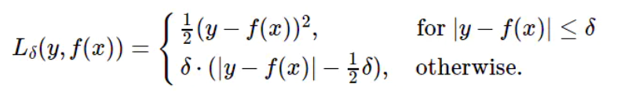

> 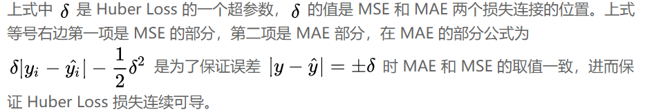


### 6.2 自监督学习

#### 6.2.1 对比学习

A simple framework for contrastive learning of visual representations

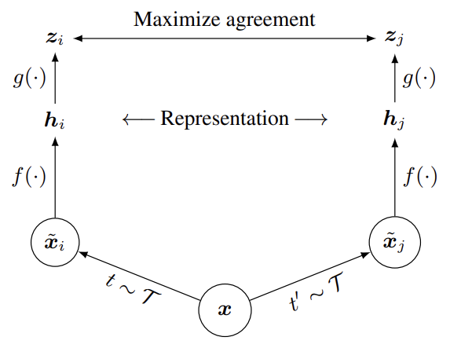

### 6.3 网络优化

#### 6.3.1 Shift操作

[解读模型压缩4：你一定从未见过如此通俗易懂的模型压缩Shift操作解读 - 知乎 (zhihu.com)](https://zhuanlan.zhihu.com/p/312348288)

