# 2D人体姿态估计

## 1. 综述

- 与分类、检测和语义分割不同，人体姿态估计需要处理身体部位之间的细微差异，尤其是在不可避免的截断、拥挤和遮挡情况下。为了实现这一点，已经探索和设计了**身体结构模型、多尺度特征融合、多级管道、从粗到精的细化、多任务学习等。**
  - 2D姿态估计（2D Pose Estimation）：从RGB图像估计每个关节的2D Pose（x，y）坐标。
  - 3D姿态估计（3D Pose Estimation）：从RGBD图像或RGB图像中估计每个关节的3D Pose（x，y，z）坐标。

- 根据任务类型，可分为**单人**人体姿态估计方法、 **多人**人体姿态估计方法。
- 多人人体姿态估计划分为：**自顶向下**的方法与**自底向上**的方法
  - **Top-down:** （从人到关键点）先使用detector找到图片中的所有人的bounding box，然后在对单个人进行SPPE。这个方法是Detection+SPPE，往往可以得到更好的精度，但是速度较慢。
  - **Bottom-up:** （从关键点到人）先使用一个model检测（locate）出图片中所有关键点，然后把这些关键点分组（group）到每一个人。这种方法往往速度可以实时，但是精度较差。
- 根据方法和输出的基本原理，又可分为基于**回归**的方法与基于**热图**的方法、基于**人体模型**的方法与**无模型方法**、**多阶段**方法与**端到端**方法。
- **论文集合：**
  - [zczcwh/DL-HPE (github.com)](https://github.com/zczcwh/DL-HPE)
  - [wangzheallen/awesome-human-pose-estimation: Human Pose Estimation Related Publication (github.com)](https://github.com/wangzheallen/awesome-human-pose-estimation#2d-pose-estimation)
- **综述解读：**
  - [基于深度学习的单目2D/3D姿态估计综述（2021） - 知乎 (zhihu.com)](https://zhuanlan.zhihu.com/p/369493483)
  - [重新思考人体姿态估计 Rethinking Human Pose Estimation - 知乎 (zhihu.com)](https://zhuanlan.zhihu.com/p/72561165)

### 1.1 Recent Advances in Monocular 2D and 3D Human Pose Estimation: A Deep Learning Perspective（2021 arXiv）

#### 1.1.1 骨骼表示

- **基于关键点的人体表示**
  1. **2D/3D关键点坐标**。身体关键点可以通过2D/3D坐标明确描述。如图（a）所示，关键点按照固有的车身结构连接。身体部位的方向可以从这些相连的肢体推导出来。
  2. **2D/3D热图**。为了使坐标更适合用卷积神经网络进行回归，许多方法以热图的方式表示关键点坐标。如图（b）所示，**每个关键点的高斯热图在相应的2D/3D坐标上具有高响应值，在其他位置具有低响应值。**
  3. **方位图**。有些方法将身体关键点的方向图作为热图的辅助表示。OpenPose开发了众所周知的零件关联字段（PAF），以表示肢体之间的二维方向。如图（c）所示，PAF是将肢体的两个关键点关联起来的2D向量场。场中的每个像素都包含一个2D向量，该向量从肢体的一部分指向另一部分。Orinet进一步将其发展为3D方向图，可以明确地建模肢体方向。
  4. **分层骨向量**。层次化骨骼表示的2D版本是在**合成人体姿态（CHP）**中提出的，这是关节和骨骼向量的组合。如图（d）所示，3D人体骨骼由一组骨骼向量表示。每个骨骼向量都沿着运动学树从父关键点指向子关键点。每个父关键点都与局部球面坐标系相关联。在这个系统中，骨骼向量可以用球坐标表示。 

- **基于模型的人体表示**

  基于模型的表示是根据人体固有的结构特征发展起来的。它提供了比基于关键点的描述更丰富的身体信息。

  1. 基于零件的体积模型。开发基于零件的体积模型是为了应对现实中的挑战。如图（e）的蓝色模型所示，每个肢体都表示为圆柱体。通过将顶部和底部曲面中心与肢体的3D关键点对齐来定位每个圆柱体。类似地，如图（e）的粉红色模型所示，提出了一种椭圆体模型，将椭球体作为身体部位的基本单位。它比圆筒更灵活。
  2. 详细的统计3D人体模型。与基于零件的体积模型相比，统计三维人体网格描述了更详细的信息，包括身体姿态和形状。我们介绍了应用最广泛的皮肤多人线性模型（SMPL），这是一种骨架驱动的人体模型。SMPL分离人体的形状和姿态，并将3D网格编码为低维参数。它建立了一个有效映射M（β，θ；Φ）：R |θ|×|β| 7→ R3×6890。从形状β和姿态θ到带有6890个顶点的三角网格，其中Φ表示人体的统计先验。形状参数β∈ R10是10种基本形状的线性组合权重。姿态参数θ∈ R3×23表示轴角度表示中23个关节的相对三维旋转。然后是线性回归∈ R6890×24用于推导预选的身体关节J∈ 通过J=M（β，θ；Φ）R，从人体网格的6890个顶点得到R3×24。该回归器的线性组合运算保证关节位置相对于形状β和姿态θ参数是可微的。

  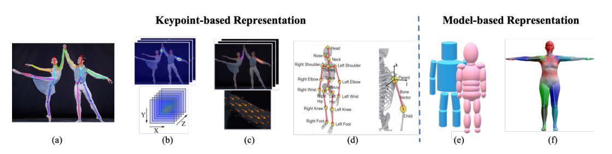

#### 1.1.2 最先进的方法

​			2D（顶部）和3D（底部）姿态估计从**2014到2021**。 

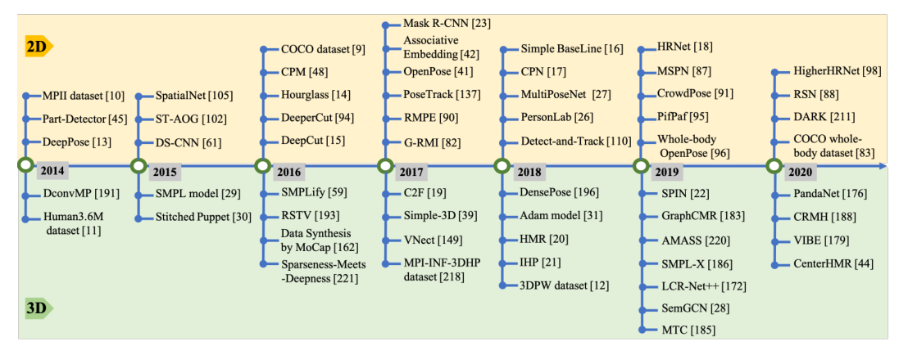

#### 1.1.3 网络架构

- 大多数流行的**单人姿态估计网络**可被视为由**姿态编码器（也称为特征提取器）和姿态解码器**组成。前者的目标是通过从高分辨率到低分辨率的过程来提取高层特征。后者以基于检测或基于回归的方式估计目标输出、2D/3D关键点位置或3D网格。

- 对于多人场景，为了估计每个人的2D或3D姿态，现有作品采用**自上而下或自下而上**的模式。自上而下的框架首先检测人物区域，然后从中提取边界框级别的特征。这些特征用于估计每个人的姿态结果。相比之下，自下而上的范式**首先检测所有目标输出**，然后通过**分组或抽样**将它们分配给不同的人。这两种模式也依赖于基于姿态编码器和解码的架构，网络输入要么是检测到的边界框，要么是整个图像。

  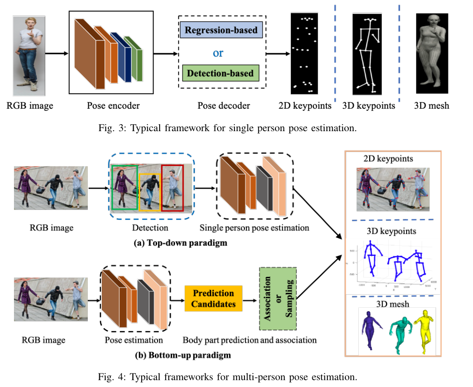

#### 1.1.4 单目二维姿态估计

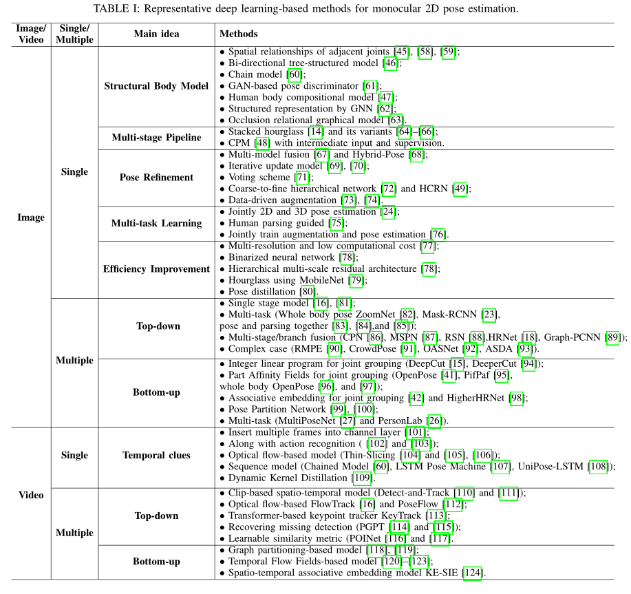

##### 基于RGB图片的2D姿态估计

- **单人**

  - **DeepPose**，这是最早的基于深度卷积神经网络（DCNNs）的人体姿态估计方法之一,将关键点估计公式化为一个回归问题。

    > Deeppose: Human pose estimation via deep neural networks（2014 CVPR）

  - **CHP**提出了合成姿态回归，即身体结构感知。

    > Compositional human pose regression（2017 ICCV）

    如下分类：

    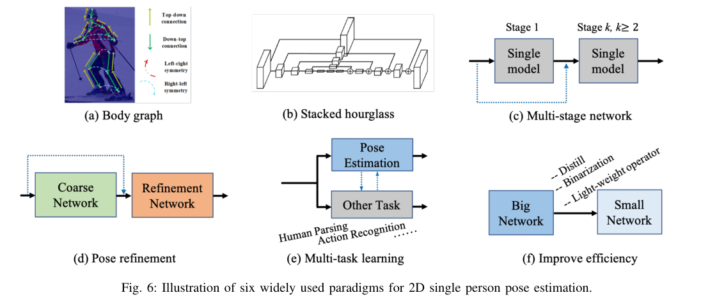

  - **Structural Body Model**：（上图**a**）除了基于DCNN的全身特征表示外，还探索了图形模型，以描述具有空间关系的结构和局部部位。

    - **[45]**通过一种混合DCNN架构提出了卷积网络部分检测器。他们**将身体部位的空间位置分布描述为类似马尔可夫随机场的模型**，这有助于消除解剖学上不正确的姿态预测。

      > Joint training of a convolutional network and a graphical model for human pose estimation（2014 NeurIPS）

    - **[58]**使用DCNN学习**身体部位存在的条件概率及其在图像块中的空间关系**。

      > Articulated pose estimation by a graphical model with image dependent pairwise relations（2014 NeurIPS）

    - **[46]**首先在特征层面上研究部位之间的关系。提出的端到端学习框架通过可学习的几何变换核和双向树结构模型来**获取人体关节之间的结构信息。**

      > Structured feature learning for pose estimation（2016 CVPR）

    - **[60]**提出了一个链式序列到序列模型，除了依赖于关于关节条件分布的任何假设之外，以**基于之前预测的所有身体部位顺序预测每个身体部位**。

      > Chained predictions using convolutional neural networks（2016 ECCV）

    - **[61]**中的工作提出了一种结构感知网络，**隐式利用人体的几何约束先验。**它通过条件生成对抗网络（GANs）设计鉴别器来区分真实姿态和虚假姿态。

      > Adversarial posenet: A structure-aware convolutional network for human pose estimation（2017 ICCV）

    - **[47]**提出了深入学习的组成模型（DLCM），**进一步了解人体的组成性。**该模型在多个语义层次上具有自下而上/自上而下的推理阶段。在自下而上阶段，较高级别的部分由其子级递归估计，而在自上而下阶段，较低级别的部分由其父级递归细化。

      > Deeply learned compositional models for human pose estimation（2018 ECCV）

    - **[133]**建议学习相关部件的特定功能。此外，与手动定义的身结构关系不同，他们提出了一种**数据驱动的方法，根据共享的信息量对相关部位进行分组。**

      > Does learning specific features for related parts help human pose estimation（2019 CVPR）

    - **[63]ORGM**提出了一种遮挡关系图形模型来同时表示自遮挡和对象-人遮挡，该模型对人体部位和对象之间的交互进行了区分编码，**用于处理遮挡问题。**

      > Orgm: Occlusion relational graphical model for human pose estimation（2017 TIP）

  - **Multi-stage Pipeline**：已经证明**多阶段管道和多层次特征融合（上图c）对于捕捉人体细节非常有用。**

    - **[14]stacked hourglass network**是代表性工作之一（上图**b**）。**每个沙漏网络由自下而上处理（从高分辨率到低分辨率）和自上而下处理（从低分辨率到高分辨率）之间的对称分布组成。**它使用带有跳过层的单一管道，以在每个分辨率下保留空间信息。结合中间监控，整个网络连续地将多个沙漏模块堆叠在一起。

      > Stacked hourglass networks for human pose estimation（2016 ECCV）

    - **[64]**提出将设计的**金字塔残差模块插入沙漏网络，**该网络可以处理**人体各部位之间的比例变化。**

      > Learning feature pyramids for human pose estimation（2017 ICCV）

    - **[65]**中的工作设计了**沙漏剩余单元（HRU）**，以增加堆叠沙漏网络的接收场。同时，利用多上下文注意机制实现了从局部区域到全局语义一致空间的不同粒度表示。

      > Multi-context attention for human pose estimation（2017 CVPR）

    - **[134]**为了利用结构信息和多分辨率特征，提出的方法利用了叠加沙漏框架上的**多尺度监督、多尺度回归和结构感知损失。**

      > Multi-scale structureaware network for human pose estimation（2018 ECCV）

    - **[48]CPM**使用中间输入和监督来学习隐式空间模型，而无需显式图形模型。它的顺序多级卷积结构日益完善对关键点位置的预测 

      > Convolutional pose machines（2016 CVPR）

  - **Pose Refinement**：对网络输出进行细化可以提高最终的姿态估计性能。（上图**d**）显示了普通粗精加工管道的框架。

    - **[67]**建立了一个**多源深度模型，从不同的信息源中提取非线性表示**，包括视觉外观评分、外观混合类型和变形。所有信息源的表示被融合去进行姿态估计。可以将其视为姿态估计结果的后处理。

      > Multi-source deep learning for human pose estimation（2014 CVPR）

    - **[68]**混合姿态采用了两个分支的堆叠沙漏网络——用于姿态细化的**细化网络**（RNet）和用于姿态校正的**校正网络**（CNet）。RNet水平细化每个沙漏阶段的关键点位置。CNet以混合方式指导细化和融合热图。

      > Hybrid refinementcorrection heatmaps for human pose estimation（2020 TMM）

    - **[69]**中的工作使用了一个迭代更新模块来逐步改进姿态估计。

      > Human pose estimation with iterative error feedback（2016 CVPR）

    - **[70]**引入了一种**递归卷积神经网络，**以迭代提高性能。

      > Recurrent human pose estimation（2017 FG）

    - **[71]**提出了一种**最佳姿态配置投票方案，**其中图像中的每个像素都投票选择每个关键点的最佳位置。

      > Human pose estimation using deep consensus voting（2016 ECCV）

    - **[72]**提出了一个由多个分支组成的精细层次网络。通过对多分辨率特征图的多级监控，多个分支被统一起来预测最终的关键点。

      > A coarse-fine network for keypoint localization（2017 ICCV）

    - **[49]HCRN**是一个层次化的上下文细化网络，在该网络中，**不同复杂性的关键点在不同的层上进行处理**。HCRN通过利用上下文细化单元将信息上下文从简单的连接转移到困难的连接，处于单阶段管道中。

      > Hierarchical contextual refinement networks for human pose estimation（2019 TIP）

    - **[73]和[74]**中的工作不同于为前端粗网络添加额外网络以进行端到端训练，它们采用了类似的细化策略，将RGB图像和粗略预测的关键点都作为输入。然后，细化网络通过联合推理输入输出空间，直接预测细化后的姿态。这种独立的细化网络采用数据驱动的增广训练，可以应用于任何现有的方法。

      > Learning to refine human pose estimation（2018 CVPRW）
      >
      > Posefix: Model-agnostic general human pose refinement network（2019 CVPR）

  - **Multi-task Learning**：（上图**e**）通过利用相关任务的补充信息，多任务学习可以为姿态估计提供额外的线索。

    - **[24]**提出了一个多任务框架，用于从视频序列中**联合进行2D/3D姿态估计和人体动作识别。**

      > 2d/3d pose estimation and action recognition using multitask deep learning（2018 CVPR）

    - **[75]**中的方法**使用人体部位解析学习**者来利用部位分割信息，并提供补充特征来辅助姿态估计。

      > Human pose estimation with parsing induced learner（2018 CVPR）

    - **[76]**中利用了对抗性数据扩充，以解决网络训练期间随机数据扩充的局限性。它还设计了一种奖惩策略，用于联合训练增强网络和目标（姿态估计）网络。 

      > Jointly optimize data augmentation and network training: Adversarial data augmentation in human pose estimation（2018 CVPR）

  - **Improving Efficiency**：随着模型性能的发展，如何提高模型的速度也引起了人们的广泛关注。（上图**f**）显示了提高模型效率的常用框架，包括使用轻量级算子、网络二值化、模型蒸馏等。

    - **[77]**提出了一种**多分辨率轻量级网络，**探索了较低的计算要求。

      > An efficient convolutional network for human pose estimation（2016 BMVC）

    - **[78]**中**二值化神经网络**首次被用来设计计算资源有限的轻量级网络。具体来说，基于对各种设计选择的详尽评估，提出了一种分层、并行和多尺度的剩余体系结构。

      > Binarized convolutional landmark localizers for human pose estimation and face alignment with limited resources（2017 ICCV）

    - **[79]**中的方法研究了**MobileNet和沙漏网络的结合**，以设计一种轻量级的体系结构。

      > Adapting mobilenets for mobile based upper body pose estimation（2018 AVSS）

    - **[80]**中的工作提出了一个姿态提取（FPD）模型，该模型基于**知识提取的思想**训练一个高速姿态网络。 

      > Fast human pose estimation（2019 CVPR）

- **多人-Top-down**

  这种方法首先检测并裁剪图像中的每个人。然后，给定一个只包含一个人的裁剪图像块，他们使用单人姿态估计模型，然后进行后处理，如姿态非最大抑制（NMS），以预测每个人的最终关键点输出。理论上，**前面中介绍的单人方法可以在裁剪图像块后应用。**然而，与单人场景相比，**多人场景需要处理截断、环境遮挡、人物遮挡和小目标。**因此，有代表性的自上而下的方法不仅注重挖掘CNN的潜力，探索丰富的上下文信息融合或交换来设计网络，还注重复杂场景。🤔

  - **Single stage model**

    - **[81]**提出了第一个基于深度学习的两阶段自上而下的管道，名为**G-RMI**，他们使用**Faster RCNN检测器来检测每个人**，然后利用完全卷积的ResNet来联合预测关键点的密集热图和偏移。他们还引入了基于关键点的NMS，而不是盒子级NMS，以提高关键点的可信度。

      > Towards accurate multi-person pose estimation in the wild（2017 CVPR）

    - **[16] Simple BaseLine**提供了一个简单有效的模型，该模型由一个ResNet主干和三个反卷积层组成，以提高空间分辨率。它表明，一个设计良好的简单自上而下的模型可以取得令人惊讶的效果。

      > Simple baselines for human pose estimation and tracking（2018 ECCV）

  - **Multi-task**

    ==多任务学习：通过在姿态估计相关任务之间共享特征，多任务学习可以为姿态估计提供更好的特征表示。==

    - **[23]MaskRCNN**可以检测人员边界框，然后裁剪相应提议的特征图，以预测人类关键点。

      > Mask r-cnn（2017 ICCV）

    - **[82]ZoomNet**将人体姿态估计器、手/脸检测器和手/脸姿态估计器统一到一个网络中。该网络首先定位身体关键点，然后放大手/脸区域，以预测具有更高分辨率的关键点。它可以处理人体不同部位之间的尺度差异。

      > Whole-body human pose estimation in the wild（2020 ECCV）

  - **pose and parsing together**

    - **[83]–[85]**鉴于**人类关键点和人类语义部分是相互关联和互补的**，设计了多任务网络来联合预测关键点并分割语义部分。

      > Multi-task human analysis in still images: 2d/3d pose, depth map, and multi-part segmentation（2019 FG）
      >
      > Joint multi-person pose estimation and semantic part segmentation（2017 CVPR）
      >
      > Look into person: Joint body parsing pose estimation network and a new benchmark（2018 TPAMI）

  - **Multi-stage/branch fusion**

    - **[17]**中的工作提出了**级联金字塔网络（CPN）**，该网络由全局网络和细化网络组成，以逐步细化关键点预测。它还提出了一种在线硬关键点挖掘（OHKM）方法来处理硬关键点。

      > Cascaded pyramid network for multi-person pose estimation（2018 CVPR）

    - **[86]**中的工作通过**引入通道洗牌模块和空间通道注意剩余瓶颈改进了CPN**，以增强原始模型。

      > Multi-person pose estimation with enhanced channel-wise and spatial information（2019 CVPR）

    - **[87]MSPN**将CPN扩展到**多阶段管道中**。它以CPN的全局网络为每个单级模块，通过跨级特征聚合融合不同阶段的特征，并通过从粗到细的损失函数对整个网络进行监控。

      > Rethinking on multi-stage networks for human pose estimation（2019 arXiv）

    - **[18]HRNet**指出高分辨率表示对于硬键点检测很重要。HRNet在整个网络中保持高分辨率的表示，并逐渐添加高分辨率到低分辨率的子网络，形成**多分辨率特征**。它已经成为姿态估计和许多其他计算机视觉任务的可靠且优越的模型。

      > Deep high-resolution representation learning for human pose estimation（2019 CVPR）

    - **[89]Graph-PCNN**考虑**关键点的关系和细化粗略的预测**，通过模型不可知的两阶段框架提出了图形姿态细化模块。

      > Graph-pcnn: Two stage human pose estimation with graph pose refinement（2020 ECCV）

    - **[88]**利用了一个带有残差阶梯网络（**RSN**）模块的多级管道来聚合内部级别的功能。利用从RSN中获得的精细局部表示，提出了一种姿态优化机器（PRM）模块，以进一步平衡局部/全局表示并优化输出关键点。

      > Learning delicate local representations for multiperson pose estimation（2020 ECCV）

  - **Complex case**

    - **[90]RMPE**为了**消除不准确的人检测的影响**，设计了对称的空间变换网络来检测每个人，设计了参数化姿态NMS来过滤冗余姿态，并设计了姿态引导的人类建议生成器来增强多人姿态估计的网络容量。

      > RMPE: Regional multi-person pose estimation（2017 ICCV）

    - **[91]**为了**解决拥挤场景中的问题**，首先在每个裁剪的边界框中获得联合候选，然后在图模型中解决联合关联问题。

      > Crowdpose: Efficient crowded scenes pose estimation and a new benchmark（2019 CVPR）

    - **[135]**中的工作研究了**拥挤和遮挡监控场景中的姿态估计问题**。它建议增加一个额外的网络分支来检测被遮挡的关键点。

      > Human pose estimation for real-world crowded scenarios（2019 AVSS）

    - **[92]OASNet**利用**Siamese网络的注意机制**来消除遮挡感知歧义，并重建无遮挡特征。

      > Occlusion-aware siamese network for human pose estimation（2020 ECCV）

    - **[93]**为了扩大挑战性案例的训练集，提出通过梳理分割的身体部位来模拟挑战性案例来增强图像。生成网络用于动态调整增广参数，生成最混乱的训练样本。

      > Adversarial semantic data augmentation for human pose estimation（2020 ECCV）

- **多人-Bottom-up**：与依赖人体检测器的自上而下方法不同，自下而上方法直接预测图像中的所有关键点，然后将关键点候选分组到每个人中。除了为了**更准确地检测关键点**而进行的网络设计之外，**如何对关键点之间的连接信息进行编码**是将关键点分组给不同的人的核心。表中按照**关键点分配策略**划分：

  - **Integer linear program for joint grouping**

    - **DeepCut[15]**通过Faster RCNN预测所有关键点，并**将关键点分配问题表述为整数线性规划（ILP）**。

      > Deepcut: Joint subset partition and labeling for multi person pose estimation（2016 CVPR）

    - **DeeperCut[94]**通过引入更强的零件检测器来改进DeepCut。此外，它还提出了一个图像条件成对项，探索关键点的几何和外观约束。然而，**ILP仍然是一个耗时的NP难问题。**

      > Deepercut: A deeper, stronger, and faster multi-person pose estimation model（2016 ECCV）

  - **Part Affinity Fields for joint grouping**

    - **OpenPose[41]**提出通过部分亲和场**（PAF）联合学习关键点位置及其关联。**PAF通过一组2D向量场对肢体的位置和方向进行编码。PAF的方向从肢体的一部分指向另一部分。然后，多人关联执行二部匹配，以使用PAF关联关键点候选。通过两个分支和多级架构，OpenPose实现了**与图像中的人数无关的实时性能。**

      > Realtime multi-person 2d pose estimation using part affinity fields（2017 CVPR）

    - **PifPaf Net[95]**中，PAF用于关联身体部位。此外，**部位强度场（PIF）设计用于定位身体部位。**PIF和PAF是在利用拉普拉斯损耗处理低分辨率和遮挡场景的同时联合产生的。

      > Pifpaf: Composite fields for human pose estimation（2019 CVPR）

  - **whole body OpenPose**

    - **[96]**提出了第一种用于**全身多人姿态估计**的单网络方法，该方法可以同时定位图像中的身体、面部、手和脚关键点。

      > Single-network whole-body pose estimation（2019 ICCV）

    - **[97]**中的工作设计了一个身体部位感知的PAF来编码关键点之间的连接，并通过注意机制和焦点L2丢失改进了堆叠沙漏网络。 

      > Simple pose: Rethinking and improving a bottom-up approach for multi-person pose estimation（2020 AAAI）

  -  **Associative embedding for joint grouping**

    ==Associative Embedding是一种检测和分组方法，它**检测关键点并将其分组为具有嵌入特征或标签的人。**==

    - **[42]**提出生成**关键点热图及其嵌入标签**，用于多人姿态估计。对于身体的每个关节，网络产生检测**热图**，同时预测**Associative Embedding标签**。它们对每个关节进行顶部检测，并将其与共享相同嵌入标签的其他检测进行匹配，以生成最终的一组单独姿态预测。

      > Associative embedding: End-to-end learning for joint detection and grouping（2017 NeurIPS）

    - **HigherHRNet[98]**也使用了关联嵌入，它从高分辨率特征金字塔中学习尺度感知表示。HigherHRNet利用HRNet中的聚合特征，以及通过转置卷积向上采样的高分辨率特征，很好地处理了尺度变化，并实现了自下而上姿态估计的新技术状态。

      > Higherhrnet: Scale-aware representation learning for bottomup human pose estimation（2020 CVPR）

  - **Pose Partition Network**

    - **[99]**提出了一种姿态分割网络（PPN），它对所有候选关键点使用质心嵌入。

      > Pose partition networks for multi-person pose estimation（2018 ECCV）

    - **[100]**介绍了结构化姿态表示（SPR）。它利用根关节来指示不同的人，并将关键点的位置编码为对应根的位移。

      > Single-stage multiperson pose machines（2019 CVPR）

  - **Multi-task**

    - **MultiPoseNet[27]**还提出了一个**多任务模型**，可以联合处理人物检测、关键点检测和人物分割。MultiPoseNe提出了一种姿态残差网络（PRN），通过测量预测的关键点和检测到的人物边界框的位置相似性来分配它们。

      > Multiposenet: Fast multiperson pose estimation using pose residual network（2018 ECCV）

    - **PersonLab[26]**也是一个多任务网络，它可以联合预测关键点热图和人物分割图。在PersonLab中，短程偏移和中程成对偏移用于对人类关键点进行分组。同时，利用长距离偏移量和人体姿态检测来区分人体分割模板。 

      > Personlab: Person pose estimation and instance segmentation with a bottom-up, part-based, geometric embedding model（2018 ECCV）

##### 基于视频的2D姿态估计/跟踪

不同于基于图像的姿态估计，视频姿态估计必须**考虑帧间的时间关系，以消除运动模糊和几何不一致性。**因此，直接将现有的基于图像的姿态估计方法应用于视频可能会产生次优结果。在这一部分中，我们可以根据视频中的单人/多人姿态估计方法**如何利用时空信息**进行分类。

- **单人**

  对于视频中的单人姿态估计，大多数工作**探索跨帧传播时间线索**，以细化单帧姿态结果。

  - **Insert multiple frames into channel layer** 

    - **[101]**作为视频中基于深度学习的姿态估计的首批工作之一，利用时间信息，将多个帧插入数据颜色通道，以替换基于图像的网络中输入的三通道RGB图像。

      > Deep convolutional neural networks for efficient pose estimation in gesture videos（2014 ACCV）

    ==接下来的工作从四个主要类别，即用于**相互学习的动作识别任务**、**基于光流的时间传播模型**、**序列模型**和**蒸馏模型**，进一步探讨了时间传播。==

  - **Pose Estimation with Action Recognition**

    - **[102]**提出了一种spatial-temporal And-Or Graph（**ST-AOG**）模型，将**视频姿态估计与行为识别**相结合。通过添加基于光流和外观特征的额外活动识别分支，这两项任务可以相互受益。

      > Joint action recognition and pose estimation from video（2015 CVPR）

    - **[103]**中的工作表明，可以通过使用**动作条件下的图形结构模型结合活动优先级来实现动作预测**，而不是额外的动作识别分支。 

      > Pose for action - action for pose（2017 FG）

  - **Optical Flow-based Feature Propagation**

    - **[105]**提出了一种时空网络，它通过光流将相邻帧的热图临时扭曲到当前帧。之后，他们还利用一个参数池层将对齐的热图组合成一个池信任热图。

      > Flowing convnets for human pose estimation in videos（2015 ICCV）

    - **[106]**中的工作提出了一种个性化的ConvNet姿态估计器，它可以**通过空间图像匹配和光流传播在整个视频中传播高质量的自动姿态注释。**传播的新注释用于微调通用ConvNet姿态估计器。

      > Personalizing human video pose estimation（2016 CVPR）

    - **Thin-Slicing[104]**提出通过**计算相邻帧之间的密集光流来传播关键点。**它们执行基于流的扭曲层，将之前的热图与当前帧对齐，然后是时空推断层。时空传播利用具有空间和时间关系的姿态配置图的迭代消息传递。 

      > Thin-slicing network: A deep structured model for pose estimation in videos（2017 CVPR）

  - **Sequence Model-based Feature Propagation**

    - **Chained Model[60]**采用**序列到序列的递归模型**来解决视频中的结构化姿态预测问题。在递归模型中，**每个身体关键点的预测依赖于所有之前预测的关键点。**

      > Chained predictions using convolutional neural networks（2016 ECCV）

    - **LSTM Pose Machine [107]**探索了通过记忆增强的LSTM框架捕捉视频中的时间依赖性。给定一帧，**the Encoder-RNN-Decoder pipelines**首先通过编码器学习高级图像表示，然后通过RNN单元传播时间信息并产生隐藏状态。他们最终通过解码器预测当前帧的关键点，解码器将隐藏状态作为输入。

      > LSTM pose machines（2018 CVPR）

    - **UniPose-LSTM[108]**采用了类似的概念，它利用LSTM模块传播UniPose网络中多分辨率Atrus空间池架构生成的先前热图。

      >  Unipose: Unified human pose estimation in single images and videos（2020 CVPR）

  - **Distillation Model**

    - **[109]**与需要大网络的光流或顺序RNN不同，引入了一个**动态核蒸馏（DKD）模型**，以一次性前馈方式传递姿态知识。具体来说，小型网络DKD通过鉴别器利用一种临时对抗性训练策略来生成临时一致的姿态核，并预测视频中的关键点。 

      > Dynamic kernel distillation for efficient pose estimation in videos（2019 ICCV）

  ==视频中的多人姿势估计需要在多人遮挡、运动模糊、姿势和外观变化的情况下识别和定位关键点。为了利用时间线索，**多人姿态估计通常与关节跟踪相关联。**==

- **多人-Top-down**

  自上而下的方法**遵循检测跟踪范式**。它们首先检测每个帧中的人物和关键点，然后在帧之间传播边界框或关键点。

  - **Clip-based spatio-temporal model**

    - **3D Mask R-CNN在Detect and Track[110]**中提出，利用全3D卷积网络来检测视频剪辑中每个人的关键点。然后使用关键点跟踪器通过**比较检测到的边界框的距离来链接预测。**

      > Detectand-track: Efficient pose estimation in videos（2018 CVPR）

    - **[111]**中进一步利用了基于剪辑的跟踪器，该跟踪器通过精心设计的3D卷积层扩展了HRNet，以了解关键点之间的时间对应关系。接下来，设计了一个时空合并过程，通过时空平滑来估计最佳关键点输出。这个模型结合了片段跟踪网络和合并过程，能够很好地处理复杂场景中的故障检测，这些场景具有严重的遮挡和高度纠缠的人。

      > Combining detection and tracking for human pose estimation in videos（2020 CVPR）

  - **Optical flow-based FlowTrack**

    - **[16]**中的工作**独立地建立在单帧检测的基础上**，并利用基于**光流的时间姿势相似性**来关联不同帧中的关键点。

      > Simple baselines for human pose estimation and tracking（2018 ECCV）

    - **PoseFlow [112]**

      > Pose flow: Efficient online pose tracking（2018 BMVC）

  - **Transformer-based keypoint tracker KeyTrack**

    - **KeyTrack[113]**提出了一种基于**Transformer的跟踪器**，它只依赖于15个关键点。基于变压器的网络利用二元分类来预测一个姿势是否在时间上跟随另一个姿势。 

      > 15 keypoints is all you need（2020 CVPR）

  - **Recovering missing detection**

    - **PGPT[114]**为了**应对单个帧中的缺失检测**，提出将基于图像的检测器与在线人员位置预测器相结合，以补偿缺失的边界框。同时，PGPT引入了一个层次化的姿势引导图卷积网络，该网络利用人的结构关系来增强人的表示和数据关联。

      > Poseguided tracking-by-detection: Robust multi-person pose tracking（2020 TMM）

    - **[115]**中的工作提出了**自监督关键点对应**，它不仅可以恢复丢失的姿势检测，还可以跨帧关联检测到的和恢复的姿势。

      > Self-supervised keypoint correspondences for multi-person pose estimation and tracking in videos（2020 ECCV）

  - **Learnable similarity metric (POINet [116] and [117].**

    - **POINet[116]**为了实现高效的数据关联，探索了一种姿势引导的ovonic insight网络，以在统一的端到端网络中学习特征提取、相似性度量和身份分配。

      > POINet: pose-guided ovonic insight network for multi-person pose tracking（2019 ACM MM）

    - **[117]**是可学习相似性度量的另一项工作，时间关键点匹配和关键点细化分别用于关键点关联和姿势校正。它们都是可学习的，并被整合到姿势估计网络中。

      > Temporal keypoint matching and refinement network for pose estimation and tracking（2020 ECCV）

- **多人-Bottom-up**

  这类方法通常使用**单帧姿态估计**来预测每帧中的所有关键点，然后**以时空优化的方式跨帧分配关键点**。

  - **Graph partitioning-based model**

    - **[118]、[119]、[137]**中基于图分割的方法首先扩展了图像级自底向上的多人姿势估计。然后，他们建立了一个时空图，将关键点候选点在空间和时间上连接起来，可以将其表述为一个线性规划问题

      > Posetrack: Joint multi-person pose estimation and tracking（2017 CVPR）
      >
      > Arttrack: Articulated multi-person tracking in the wild（2017 CVPR）
      >
      > Posetrack: A benchmark for human pose estimation and tracking（2018 CVPR）

      ==图的时空划分通常会导致大量计算和非在线求解。==

  - **Temporal Flow Fields-based model**

    - **[120]–[123]**中的作品利用**时间流场**来指示不同帧中关键点的传播方向。

      > Jointflow: Temporal flow fields for multi person pose tracking（2018 BMVC）
      >
      > Learning to detect and track visible and occluded body joints in a virtual world（2018 ECCV） 
      >
      > Pose estimator and tracker using temporal flow maps for limbs（2019 IJCNN）
      >
      > Efficient online multiperson 2d pose tracking with recurrent spatio-temporal affinity fields（2019 CVPR）

  - **Spatio-temporal associative embedding model**

    - **[124]**在基于图像的自底向上关键点关联策略中使用的**Associative embedding**中也进行了扩展，以构建时空嵌入。它将关键点与嵌入特征相关联，以实现时间一致性。 

      > Multi-person articulated tracking with spatial and temporal embeddings（2019 CVPR）

### 1.2 Deep Learning-Based Human Pose Estimation: A Survey（2022 arXiv）


## 2. 传统算法

#### Modec（2013 CVPR）

> Modec: Multimodal decomposable models for human pose estimation

#### Human pose estimation using a joint pixel-wise and part-wise formulation（2013 CVPR）


## 3. 基于RGB图片的2D姿态估计

### 3.1 单人

#### Deeppose（2014 CVPR）

> Deeppose: Human pose estimation via deep neural networks

#### Stacked Hourglass Networks（2016 ECCV）

> Stacked hourglass networks for human pose estimation

#### CPM（2016 CVPR）

> Convolutional pose machines

#### CHP（2017 ICCV）

> Compositional human pose regression

#### Adversarial posenet（2017 ICCV）

> Adversarial posenet: A structure-aware convolutional network for human pose estimation


#### 2D-3D-Softargmax（2018 CVPR）

> 2d/3d pose estimation and action recognition using multitask deep learning


#### Posefix（2019 CVPR）

> Posefix: Model-agnostic general human pose refinement network

#### FPD（2019 CVPR）

> Fast human pose estimation

#### Soft-gated Skip Connections（2020 FG）

> Toward fast and accurate human pose estimation via soft-gated skip connections


#### PRTR（2021 CVPR）

> Pose Recognition with Cascade Transformers


#### TransPose（2021 ICCV）

> TransPose: Keypoint Localization via Transformer

#### TokenPose（2021 ICCV）

> TokenPose:Learning Keypoint Tokens for Human Pose Estimation


#### Poseur（2022 arXiv）

> Poseur: Direct Human Pose Regression with Transformers

### 3.2 多人-Top-down

#### Simple baselines（2018 ECCV）

> Simple baselines for human pose estimation and tracking

#### CPN（2018 CVPR）

> Cascaded pyramid network for multi-person pose estimation

#### HRNet（2019 CVPR）

> Deep high-resolution representation learning for human pose estimation

#### MSPN（2019 arXiv）

> Rethinking on multi-stage networks for human pose estimation

#### Graph-PCNN（2020 ECCV）

> Graph-pcnn: Two stage human pose estimation with graph pose refinement

#### RSN（2020 ECCV）

> Learning delicate local representations for multiperson pose estimation

#### OASNet（2020 ECCV）

> Occlusion-aware siamese network for human pose estimation

### 3.3 多人-Bottom-up

#### Deepcut（2016 CVPR）

> Deepcut: Joint subset partition and labeling for multi person pose estimation

#### OpenPose（2017 CVPR）

> Realtime multi-person 2d pose estimation using part affinity fields


#### Associative embedding（2017 NeurIPS）

> Associative embedding: End-to-end learning for joint detection and grouping

#### Multiposenet（2018 ECCV）

> Multiposenet: Fast multiperson pose estimation using pose residual network（2018 ECCV）

#### SPR（2019 CVPR）

> Single-stage multiperson pose machines

#### Higherhrnet（2020 CVPR）

> Higherhrnet: Scale-aware representation learning for bottomup human pose estimation


## 4. 基于视频的2D姿态估计/跟踪

### 4.1 单人

#### ST-AOG（2015 CVPR）

> Joint action recognition and pose estimation from video

#### Personalizing ConvNet（2016 CVPR）

> Personalizing human video pose estimation（2016 CVPR）

#### Thin-slicingNet（2017 CVPR）

> Thin-slicing network: A deep structured model for pose estimation in videos


#### LSTM-PM（2018 CVPR）

> LSTM pose machines


#### DKD（2019 ICCV）

> Dynamic kernel distillation for efficient pose estimation in videos

#### UniPose（2020 CVPR）

>  Unipose: Unified human pose estimation in single images and videos


### 4.2 多人-Top-down

#### Detectand-track（2018 CVPR）

> Detectand-track: Efficient pose estimation in videos（2018 CVPR）

#### PoseFlow （2018 BMVC）

> Pose flow: Efficient online pose tracking

#### POINet（2019 ACM MM）

> POINet: pose-guided ovonic insight network for multi-person pose tracking

#### KeyTrack（2020 CVPR）

> 15 keypoints is all you need

#### PGPT（2020 TMM）

> Poseguided tracking-by-detection: Robust multi-person pose tracking

####  DetTrack（2020 CVPR）

> Combining detection and tracking for human pose estimation in videos

#### BlazePose（2020 CVPR）

> BlazePose: On-device Real-time Body Pose tracking

### 4.3 多人-Bottom-up

#### PoseTrack（2017 CVPR）

> PoseTrack: A Benchmark for Human Pose Estimation and Tracking


#### Jointflow（2018 BMVC）

> Jointflow: Temporal flow fields for multi person pose tracking


#### Spatio-temporal associative embedding（2019 CVPR）

> Multi-person articulated tracking with spatial and temporal embeddings

## 5. 2D-HPE数据集

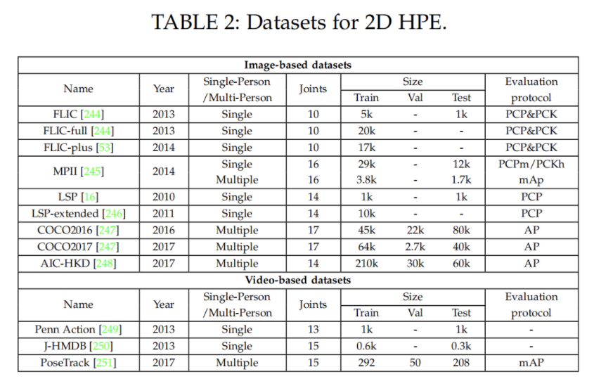

### 5.1 MPII

==Image-level 2D Single Person Dataset==

MPII是**单人人体关键点检测的主要数据集**。包含丰富的活动和多样性捕获环境，包括室内和室外。它是从Y ouTube的3913个视频中收集的，涉及491个不同的活动。从收集的视频中总共提取了24920帧。注释由亚马逊机械土耳其公司（AMT）的内部工作人员进行。注释包括**16**个关键点的二维位置、完整的三维躯干和头部方向、关键点的遮挡标签以及活动标签。相邻的视频帧也可用于运动信息。最后，**40522人被贴上标签，其中28821人用于培训，11701人用于测试。**MPII数据集已被广泛用于姿势估计和其他与姿势相关的任务。由于姿态相对容易，检测到的2D关键点的精度较高，性能接近饱和。

### 5.2 COCO

==Image-level 2D Multi-Person Dataset==

COCO是**多人关键点检测的主要数据集**。包含用于对象检测、全景分割和关键点检测的注释。这些图片来自谷歌、必应和Flickr等网站。注释由亚马逊的Mechanical Turk（AMT）上的工人执行。该数据集包含超过20万张图像和25万个人实例。自2016年以来，除了数据集，COCO关键点检测的挑战每年都会举行。数据集有两个版本。区别在于训练集和验证集的划分。在2017年的最新版本中，**training/val images拆分为118K/5K，**而不是之前的83K/41K。测试集包含20K图像，注释由官方测试服务器提供。此外，还发布了120K未标记图像，它们与标记图像遵循相同的类别分布。它们可以用于半监督学习。对于关键点检测，将标记**17**个关键点以及可见性标记、边界框和身体分割区域。COCO数据集是一个广泛使用的评估基准，并作为姿势相关任务的辅助数据，

### 5.3 J-HMDB

==Video-level 2D Single Person Dataset==

J-HMDB数据集是关节注释HMDB的缩写，是**HMDB51数据库的子集**，该数据库包含51个人类动作的5100多个片段。J-HMDB数据集包含**928个剪辑，包含21个动作类别**。每个动作类包含36-55个片段。**每个剪辑包括15-40帧。**31838张图片通过亚马逊 2D puppet model进行注释。最多可标记**15**个可见的身体关键点，以及比例、视点、分割、遮罩和流。训练和测试图像的数量比例大约为7:3。J-HMDB数据集已广泛应用于视频中的**姿势估计和动作识别。** 

### 5.4 PoseTrack Dataset

==Video-level 2D Multi-Person Dataset==

PoseTrack数据集是**第一个大规模多人姿态估计和跟踪数据集**。它是从MPII多人姿势数据集中的未标记视频中收集的。它有两个版本，即PoseTrack 2017和PoseTrack 2018。PoseTrack 2017包含550个视频，**分为292、50和208个视频，分别用于训练、验证和测试**。共有23000帧使用153615个姿势标签进行注释。PoseTrack 2018是其扩展版。**它包含593个训练视频、170个验证视频和375个测试视频**。对于训练集中的每个视频，中间的30帧都会被注释。对于验证集和测试集，中间的30帧以及每四帧被注释。标签包含**15个二维关键点**、一个唯一的个人ID和每个人的头部边界框。PoseTrack具有挑战性，因为视频包含各种姿势外观和比例变化，以及身体部位的遮挡和截断。

## 6. 2D-HPE评价标准

[人体姿态估计-评价指标 - 知乎 (zhihu.com)](https://zhuanlan.zhihu.com/p/270619106)

二维姿态估计的评估旨在测量预测的二维位置的准确性。根据数据集的特点，广泛使用的评估指标包括：

- 正确部位百分比**（PCP）**
- 正确关键点百分比**（PCK）**
- 关键点相似度（**OKS**）
- 平均精度**（AP）**

### 6.1 PCP

建议使用正确部位百分比（PCP）来衡量身体部位预测的准确性。如果**相应肢体的估计两个端点在真实值端点的阈值（50%）内，则身体部位预测是准确的**。PCP有一个缺点，即前缩短会影响不同视图和范围内身体部位的正确测量。 

### 6.2 PCK

- 正确关键点百分比（PCK）是衡量2D关键点预测准确性的一个广泛使用的指标。在17年比较广泛使用，现在基本不再使用。

- **计算检测的关键点与其对应的groundtruth间的归一化距离小于设定阈值的比例。**
  - FLIC数据集中是以躯干直径(torso size) 作为归一化参考.
  - MPII数据集中是以头部长度(head length) 作为归一化参考，即**PCKh**.

- **例如：**
  - PCK@0.2表示以躯干直径作为参考，如果归一化后的距离小于阈值0.2，则认为预测正确。
  - **PCKh@0.5表示以头部长度作为参考，如果归一化后的距离小于阈值0.5，则认为预测正确。**

- **计算：**

  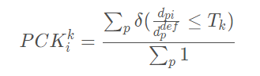

  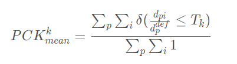

  > 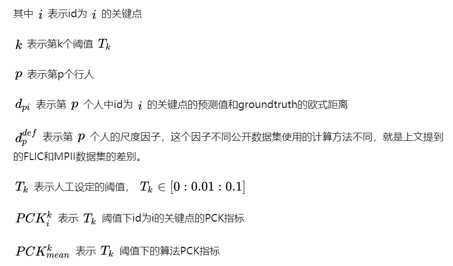

- **code:**

  ```python
  def compute_pck_pckh(dt_kpts,gt_kpts,refer_kpts):
      """
      pck指标计算
      :param dt_kpts:算法检测输出的估计结果,shape=[n,h,w]=[行人数，２，关键点个数]
      :param gt_kpts: groundtruth人工标记结果,shape=[n,h,w]
      :param refer_kpts: 尺度因子，用于预测点与groundtruth的欧式距离的scale。
      　　　　　　　　　　　pck指标：躯干直径，左肩点－右臀点的欧式距离；
      　　　　　　　　　　　pckh指标：头部长度，头部rect的对角线欧式距离；
      :return: 相关指标
      """
      dt=np.array(dt_kpts)
      gt=np.array(gt_kpts)
      assert(len(refer_kpts)==2)
      assert(dt.shape[0]==gt.shape[0])
      ranges=np.arange(0.0,0.1,0.01)
      kpts_num=gt.shape[2]
      ped_num=gt.shape[0]
      #compute dist
      scale=np.sqrt(np.sum(np.square(gt[:,:,refer_kpts[0]]-gt[:,:,refer_kpts[1]]),1))
      dist=np.sqrt(np.sum(np.square(dt-gt),1))/np.tile(scale,(gt.shape[2],1)).T
      #compute pck
      pck = np.zeros([ranges.shape[0], gt.shape[2]+1])
      for idh,trh in enumerate(list(ranges)):
          for kpt_idx in range(kpts_num):
              pck[idh,kpt_idx] = 100*np.mean(dist[:,kpt_idx] <= trh)
          # compute average pck
          pck[idh,-1] = 100*np.mean(dist <= trh)
      return pck
  ```

### 6.3 OKS

- **OKS**（object keypoint similarity），**关键点相似度**，在人体关键点评价任务中,对于网络得到的关键点好坏,并不是仅仅通过简单的欧氏距离来计算的,而是有一定的尺度加入,来计算两点之间的相似度。这个指标启发于目标检测中的**IoU**指标，主要是用在多人姿态估计任务当中。

  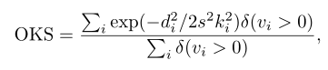

- **说明**

  - **i**表示关键点下标；
  - **d**表示检测的关键点与真实关键点之间的欧氏距离；
  - **S**表示groundtruth人的尺度因子，其值为行人检测框面积的平方根：
  - **v**表示关键点可见性，参考COCO数据集，v=0表示关键点未标记，可能的原因是图片中不存在，或者不确定在哪；v=1表示关键点无遮挡并且已经标注，v=2表示关键点有遮挡但已标注；
  - **δ**表示符合条件为1
  - **σ**表示i**关键点归一化因子**，这个因子是通过对所有的样本集中的groundtruth关键点由人工标注与真实值存在的标准差，σ越大表示此类型的关键点越难标注。对coco数据集中的5000个样本统计出17类关键点的归一化因子，σ的取值可以为：**{鼻子：0.026，眼睛：0.025，耳朵：0.035，肩膀：0.079，手肘：0.072，手腕：0.062，臀部：0.107，膝盖：0.087，脚踝：0.089}**，因此此值可以当作常数看待，但是使用的类型仅限这个里面。如果使用的关键点类型不在此当中，可以使用另外一种统计方法计算。

### 6.4 AP

- 指标是作为COCO数据集的指标，既可以用在单人姿态估计，也可以用在多人姿态估计，他针对的是计算测试集精度百分比，这就是平均准确率（AP）。AP是通过**测量对象关键点相似性（OKS）来计算的**。

  ==😆存疑：多人姿态计算只是recall？AP应该使用PR曲线面积来计算。p理解为多个样本好点？==

- **单人姿态估计AP**

  计算出groundtruth与检测得到的关键点的相似度**oks**为一个标量，然后人为的给定一个阈值**T**，然后可以通过所有图片的**oks**计算**AP**：

  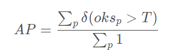

- **多人姿态估计AP**

  - 多人姿态估计，如果采用的检测方法是**自顶向下**，先把所有的人找出来再检测关键点，那么其AP计算方法**如同单人姿态估计AP**。

  - 如果采用的检测方法是**自底向上**，先把所有的关键点找出来然后再组成人，那么假设**一张图片中共有M个人，预测出N个人**，由于不知道预测出的N个人与groundtruth中的M个人的一一对应关系，因此需要计算groundtruth中每一个人与预测的N个人的oks，那么可以获得一个大小为**M × N** 的矩阵，矩阵的每一行为groundtruth中的一个人与预测结果的N个人的oks，**然后找出每一行中oks最大的值作为当前GT的oks**。最后每一个GT行人都有一个标量oks，然后人为的给定一个阈值T，然后可以通过所有图片中的所有行人计算AP：

    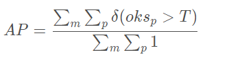

- **说明：**

  给定所有标记关键点的OKS，可以计算平均精度（AP）和平均召回率（AR）。通过调整OKS值，可以计算精度召回曲线。不同OKS下的AP和AR可以全面反映测试算法的性能。 

  - **AP^0.5^**（OKS=0.50时的AP）
  - **AP^0.75^**
  - **mAP**（10个值的AP得分平均值，**OKS=0.50:0.05:0.95**）
  - 中等对象的**AP^M^**，大对象的**AP^L^**
  - **AR^0.5^**，**AR^0.75^**，**AR**，**AR^M^**适用于中型对象，**AR^L^**适用于大型对象。

  

## 7. 其他

