# 2D人体姿态估计

## 1. 综述

- 与分类、检测和语义分割不同，人体姿态估计需要处理身体部位之间的细微差异，尤其是在不可避免的截断、拥挤和遮挡情况下。为了实现这一点，已经探索和设计了**身体结构模型、多尺度特征融合、多级管道、从粗到精的细化、多任务学习等。**
  - 2D姿态估计（2D Pose Estimation）：从RGB图像估计每个关节的2D Pose（x，y）坐标。
  - 3D姿态估计（3D Pose Estimation）：从RGBD图像或RGB图像中估计每个关节的3D Pose（x，y，z）坐标。

- 根据任务类型，可分为**单人**人体姿态估计方法、 **多人**人体姿态估计方法。
- 多人人体姿态估计划分为：**自顶向下**的方法与**自底向上**的方法
  - **Top-down:** （从人到关键点）先使用detector找到图片中的所有人的bounding box，然后在对单个人进行SPPE。这个方法是Detection+SPPE，往往可以得到更好的精度，但是速度较慢。
  - **Bottom-up:** （从关键点到人）先使用一个model检测（locate）出图片中所有关键点，然后把这些关键点分组（group）到每一个人。这种方法往往速度可以实时，但是精度较差。
- 根据方法和输出的基本原理，又可分为基于**回归**的方法与基于**热图**的方法、基于**人体模型**的方法与**无模型方法**、**多阶段**方法与**端到端**方法。
- **论文集合：**
  - [zczcwh/DL-HPE (github.com)](https://github.com/zczcwh/DL-HPE)
  - [wangzheallen/awesome-human-pose-estimation: Human Pose Estimation Related Publication (github.com)](https://github.com/wangzheallen/awesome-human-pose-estimation#2d-pose-estimation)
- **综述解读：**
  - [基于深度学习的单目2D/3D姿态估计综述（2021） - 知乎 (zhihu.com)](https://zhuanlan.zhihu.com/p/369493483)
  - [重新思考人体姿态估计 Rethinking Human Pose Estimation - 知乎 (zhihu.com)](https://zhuanlan.zhihu.com/p/72561165)

### 1.1 Recent Advances in Monocular 2D and 3D Human Pose Estimation: A Deep Learning Perspective（2021 arXiv）

#### 1.1.1 骨骼表示

- **基于关键点的人体表示**
  1. **2D/3D关键点坐标**。身体关键点可以通过2D/3D坐标明确描述。如图（a）所示，关键点按照固有的车身结构连接。身体部位的方向可以从这些相连的肢体推导出来。
  2. **2D/3D热图**。为了使坐标更适合用卷积神经网络进行回归，许多方法以热图的方式表示关键点坐标。如图（b）所示，**每个关键点的高斯热图在相应的2D/3D坐标上具有高响应值，在其他位置具有低响应值。**
  3. **方位图**。有些方法将身体关键点的方向图作为热图的辅助表示。OpenPose开发了众所周知的零件关联字段（PAF），以表示肢体之间的二维方向。如图（c）所示，PAF是将肢体的两个关键点关联起来的2D向量场。场中的每个像素都包含一个2D向量，该向量从肢体的一部分指向另一部分。Orinet进一步将其发展为3D方向图，可以明确地建模肢体方向。
  4. **分层骨向量**。层次化骨骼表示的2D版本是在**合成人体姿态（CHP）**中提出的，这是关节和骨骼向量的组合。如图（d）所示，3D人体骨骼由一组骨骼向量表示。每个骨骼向量都沿着运动学树从父关键点指向子关键点。每个父关键点都与局部球面坐标系相关联。在这个系统中，骨骼向量可以用球坐标表示。 

- **基于模型的人体表示**

  基于模型的表示是根据人体固有的结构特征发展起来的。它提供了比基于关键点的描述更丰富的身体信息。

  1. **基于部位的体积模型。**开发基于零件的体积模型是为了应对现实中的挑战。如图（e）的蓝色模型所示，每个肢体都表示为圆柱体。通过将顶部和底部曲面中心与肢体的3D关键点对齐来定位每个圆柱体。类似地，如图（e）的粉红色模型所示，提出了一种椭圆体模型，将椭球体作为身体部位的基本单位。它比圆筒更灵活。
  2. **详细的统计3D人体模型。**与基于零件的体积模型相比，统计三维人体网格描述了更详细的信息，包括身体姿态和形状。我们介绍了应用最广泛的皮肤多人线性模型（SMPL），这是一种骨架驱动的人体模型。SMPL分离人体的形状和姿态，并将3D网格编码为低维参数。它建立了一个有效映射M（β，θ；Φ）：R |θ|×|β| 7→ R3×6890。从形状β和姿态θ到带有6890个顶点的三角网格，其中Φ表示人体的统计先验。形状参数β∈ R10是10种基本形状的线性组合权重。姿态参数θ∈ R3×23表示轴角度表示中23个关节的相对三维旋转。然后是线性回归∈ R6890×24用于推导预选的身体关节J∈ 通过J=M（β，θ；Φ）R，从人体网格的6890个顶点得到R3×24。该回归器的线性组合运算保证关节位置相对于形状β和姿态θ参数是可微的。

  

#### 1.1.2 最先进的方法

​			2D（顶部）和3D（底部）姿态估计从**2014到2021**。 


#### 1.1.3 网络架构

- 大多数流行的**单人姿态估计网络**可被视为由**姿态编码器（也称为特征提取器）和姿态解码器**组成。前者的目标是通过从高分辨率到低分辨率的过程来提取高层特征。后者以基于检测或基于回归的方式估计目标输出、2D/3D关键点位置或3D网格。

- 对于多人场景，为了估计每个人的2D或3D姿态，现有作品采用**自上而下或自下而上**的模式。自上而下的框架首先检测人物区域，然后从中提取边界框级别的特征。这些特征用于估计每个人的姿态结果。相比之下，自下而上的范式**首先检测所有目标输出**，然后通过**分组或抽样**将它们分配给不同的人。这两种模式也依赖于基于姿态编码器和解码的架构，网络输入要么是检测到的边界框，要么是整个图像。

  

#### 1.1.4 单目二维姿态估计


##### 基于RGB图片的2D姿态估计

- **单人**

  - **DeepPose**，这是最早的基于深度卷积神经网络（DCNNs）的人体姿态估计方法之一,将关键点估计公式化为一个回归问题。

    > Deeppose: Human pose estimation via deep neural networks（2014 CVPR）

  - **CHP**提出了合成姿态回归，即身体结构感知。

    > Compositional human pose regression（2017 ICCV）

    如下分类：

    

  - **Structural Body Model**：（上图**a**）除了基于DCNN的全身特征表示外，还探索了图形模型，以描述具有空间关系的结构和局部部位。

    - **[45]**通过一种混合DCNN架构提出了卷积网络部分检测器。他们**将身体部位的空间位置分布描述为类似马尔可夫随机场的模型**，这有助于消除解剖学上不正确的姿态预测。

      > Joint training of a convolutional network and a graphical model for human pose estimation（2014 NeurIPS）

    - **[58]**使用DCNN学习**身体部位存在的条件概率及其在图像块中的空间关系**。

      > Articulated pose estimation by a graphical model with image dependent pairwise relations（2014 NeurIPS）

    - **[46]**首先在特征层面上研究部位之间的关系。提出的端到端学习框架通过可学习的几何变换核和双向树结构模型来**获取人体关节之间的结构信息。**

      > Structured feature learning for pose estimation（2016 CVPR）

    - **[60]**提出了一个链式序列到序列模型，除了依赖于关于关节条件分布的任何假设之外，以**基于之前预测的所有身体部位顺序预测每个身体部位**。

      > Chained predictions using convolutional neural networks（2016 ECCV）

    - **[61]**中的工作提出了一种结构感知网络，**隐式利用人体的几何约束先验。**它通过条件生成对抗网络（GANs）设计鉴别器来区分真实姿态和虚假姿态。

      > Adversarial posenet: A structure-aware convolutional network for human pose estimation（2017 ICCV）

    - **[47]**提出了深入学习的组成模型（DLCM），**进一步了解人体的组成性。**该模型在多个语义层次上具有自下而上/自上而下的推理阶段。在自下而上阶段，较高级别的部分由其子级递归估计，而在自上而下阶段，较低级别的部分由其父级递归细化。

      > Deeply learned compositional models for human pose estimation（2018 ECCV）

    - **[133]**建议学习相关部件的特定功能。此外，与手动定义的身结构关系不同，他们提出了一种**数据驱动的方法，根据共享的信息量对相关部位进行分组。**

      > Does learning specific features for related parts help human pose estimation（2019 CVPR）

    - **[63]ORGM**提出了一种遮挡关系图形模型来同时表示自遮挡和对象-人遮挡，该模型对人体部位和对象之间的交互进行了区分编码，**用于处理遮挡问题。**

      > Orgm: Occlusion relational graphical model for human pose estimation（2017 TIP）

  - **Multi-stage Pipeline**：已经证明**多阶段管道和多层次特征融合（上图c）对于捕捉人体细节非常有用。**

    - **[14]stacked hourglass network**是代表性工作之一（上图**b**）。**每个沙漏网络由自下而上处理（从高分辨率到低分辨率）和自上而下处理（从低分辨率到高分辨率）之间的对称分布组成。**它使用带有跳过层的单一管道，以在每个分辨率下保留空间信息。结合中间监控，整个网络连续地将多个沙漏模块堆叠在一起。

      > Stacked hourglass networks for human pose estimation（2016 ECCV）

    - **[64]**提出将设计的**金字塔残差模块插入沙漏网络，**该网络可以处理**人体各部位之间的比例变化。**

      > Learning feature pyramids for human pose estimation（2017 ICCV）

    - **[65]**中的工作设计了**沙漏剩余单元（HRU）**，以增加堆叠沙漏网络的接收场。同时，利用多上下文注意机制实现了从局部区域到全局语义一致空间的不同粒度表示。

      > Multi-context attention for human pose estimation（2017 CVPR）

    - **[134]**为了利用结构信息和多分辨率特征，提出的方法利用了叠加沙漏框架上的**多尺度监督、多尺度回归和结构感知损失。**

      > Multi-scale structureaware network for human pose estimation（2018 ECCV）

    - **[48]CPM**使用中间输入和监督来学习隐式空间模型，而无需显式图形模型。它的顺序多级卷积结构日益完善对关键点位置的预测 

      > Convolutional pose machines（2016 CVPR）

  - **Pose Refinement**：对网络输出进行细化可以提高最终的姿态估计性能。（上图**d**）显示了普通粗精加工管道的框架。

    - **[67]**建立了一个**多源深度模型，从不同的信息源中提取非线性表示**，包括视觉外观评分、外观混合类型和变形。所有信息源的表示被融合去进行姿态估计。可以将其视为姿态估计结果的后处理。

      > Multi-source deep learning for human pose estimation（2014 CVPR）

    - **[68]**混合姿态采用了两个分支的堆叠沙漏网络——用于姿态细化的**细化网络**（RNet）和用于姿态校正的**校正网络**（CNet）。RNet水平细化每个沙漏阶段的关键点位置。CNet以混合方式指导细化和融合热图。

      > Hybrid refinementcorrection heatmaps for human pose estimation（2020 TMM）

    - **[69]**中的工作使用了一个迭代更新模块来逐步改进姿态估计。

      > Human pose estimation with iterative error feedback（2016 CVPR）

    - **[70]**引入了一种**递归卷积神经网络，**以迭代提高性能。

      > Recurrent human pose estimation（2017 FG）

    - **[71]**提出了一种**最佳姿态配置投票方案，**其中图像中的每个像素都投票选择每个关键点的最佳位置。

      > Human pose estimation using deep consensus voting（2016 ECCV）

    - **[72]**提出了一个由多个分支组成的精细层次网络。通过对多分辨率特征图的多级监控，多个分支被统一起来预测最终的关键点。

      > A coarse-fine network for keypoint localization（2017 ICCV）

    - **[49]HCRN**是一个层次化的上下文细化网络，在该网络中，**不同复杂性的关键点在不同的层上进行处理**。HCRN通过利用上下文细化单元将信息上下文从简单的连接转移到困难的连接，处于单阶段管道中。

      > Hierarchical contextual refinement networks for human pose estimation（2019 TIP）

    - **[73]和[74]**中的工作不同于为前端粗网络添加额外网络以进行端到端训练，它们采用了类似的细化策略，将RGB图像和粗略预测的关键点都作为输入。然后，细化网络通过联合推理输入输出空间，直接预测细化后的姿态。这种独立的细化网络采用数据驱动的增广训练，可以应用于任何现有的方法。

      > Learning to refine human pose estimation（2018 CVPRW）
      >
      > Posefix: Model-agnostic general human pose refinement network（2019 CVPR）

  - **Multi-task Learning**：（上图**e**）通过利用相关任务的补充信息，多任务学习可以为姿态估计提供额外的线索。

    - **[24]**提出了一个多任务框架，用于从视频序列中**联合进行2D/3D姿态估计和人体行为识别。**

      > 2d/3d pose estimation and action recognition using multitask deep learning（2018 CVPR）

    - **[75]**中的方法**使用人体部位解析学习**者来利用部位分割信息，并提供补充特征来辅助姿态估计。

      > Human pose estimation with parsing induced learner（2018 CVPR）

    - **[76]**中利用了对抗性数据扩充，以解决网络训练期间随机数据扩充的局限性。它还设计了一种奖惩策略，用于联合训练增强网络和目标（姿态估计）网络。 

      > Jointly optimize data augmentation and network training: Adversarial data augmentation in human pose estimation（2018 CVPR）

  - **Improving Efficiency**：随着模型性能的发展，如何提高模型的速度也引起了人们的广泛关注。（上图**f**）显示了提高模型效率的常用框架，包括使用轻量级算子、网络二值化、模型蒸馏等。

    - **[77]**提出了一种**多分辨率轻量级网络，**探索了较低的计算要求。

      > An efficient convolutional network for human pose estimation（2016 BMVC）

    - **[78]**中**二值化神经网络**首次被用来设计计算资源有限的轻量级网络。具体来说，基于对各种设计选择的详尽评估，提出了一种分层、并行和多尺度的剩余体系结构。

      > Binarized convolutional landmark localizers for human pose estimation and face alignment with limited resources（2017 ICCV）

    - **[79]**中的方法研究了**MobileNet和沙漏网络的结合**，以设计一种轻量级的体系结构。

      > Adapting mobilenets for mobile based upper body pose estimation（2018 AVSS）

    - **[80]**中的工作提出了一个姿态提取（FPD）模型，该模型基于**知识提取的思想**训练一个高速姿态网络。 

      > Fast human pose estimation（2019 CVPR）

- **多人-Top-down**

  这种方法首先检测并裁剪图像中的每个人。然后，给定一个只包含一个人的裁剪图像块，他们使用单人姿态估计模型，然后进行后处理，如姿态非最大抑制（NMS），以预测每个人的最终关键点输出。理论上，**前面中介绍的单人方法可以在裁剪图像块后应用。**然而，与单人场景相比，**多人场景需要处理截断、环境遮挡、人物遮挡和小目标。**因此，有代表性的自上而下的方法不仅注重挖掘CNN的潜力，探索丰富的上下文信息融合或交换来设计网络，还注重复杂场景。🤔

  - **Single stage model**

    - **[81]**提出了第一个基于深度学习的两阶段自上而下的管道，名为**G-RMI**，他们使用**Faster RCNN检测器来检测每个人**，然后利用完全卷积的ResNet来联合预测关键点的密集热图和偏移。他们还引入了基于关键点的NMS，而不是盒子级NMS，以提高关键点的可信度。

      > Towards accurate multi-person pose estimation in the wild（2017 CVPR）

    - **[16] Simple BaseLine**提供了一个简单有效的模型，该模型由一个ResNet主干和三个反卷积层组成，以提高空间分辨率。它表明，一个设计良好的简单自上而下的模型可以取得令人惊讶的效果。

      > Simple baselines for human pose estimation and tracking（2018 ECCV）

  - **Multi-task**

    ==多任务学习：通过在姿态估计相关任务之间共享特征，多任务学习可以为姿态估计提供更好的特征表示。==

    - **[23]MaskRCNN**可以检测人员边界框，然后裁剪相应提议的特征图，以预测人类关键点。

      > Mask r-cnn（2017 ICCV）

    - **[82]ZoomNet**将人体姿态估计器、手/脸检测器和手/脸姿态估计器统一到一个网络中。该网络首先定位身体关键点，然后放大手/脸区域，以预测具有更高分辨率的关键点。它可以处理人体不同部位之间的尺度差异。

      > Whole-body human pose estimation in the wild（2020 ECCV）

    - **[83]–[85]**鉴于**人类关键点和人类语义部分是相互关联和互补的**，设计了多任务网络来联合预测关键点并分割语义部分。

      > Multi-task human analysis in still images: 2d/3d pose, depth map, and multi-part segmentation（2019 FG）
    >
      > Joint multi-person pose estimation and semantic part segmentation（2017 CVPR）
      >
      > Look into person: Joint body parsing pose estimation network and a new benchmark（2018 TPAMI）
  
  - **Multi-stage/branch fusion**

    - **[17]**中的工作提出了**级联金字塔网络（CPN）**，该网络由全局网络和细化网络组成，以逐步细化关键点预测。它还提出了一种在线硬关键点挖掘（OHKM）方法来处理硬关键点。

      > Cascaded pyramid network for multi-person pose estimation（2018 CVPR）

    - **[86]**中的工作通过**引入通道洗牌模块和空间通道注意剩余瓶颈改进了CPN**，以增强原始模型。

      > Multi-person pose estimation with enhanced channel-wise and spatial information（2019 CVPR）

    - **[87]MSPN**将CPN扩展到**多阶段管道中**。它以CPN的全局网络为每个单级模块，通过跨级特征聚合融合不同阶段的特征，并通过从粗到细的损失函数对整个网络进行监控。

      > Rethinking on multi-stage networks for human pose estimation（2019 arXiv）

    - **[18]HRNet**指出高分辨率表示对于硬键点检测很重要。HRNet在整个网络中保持高分辨率的表示，并逐渐添加高分辨率到低分辨率的子网络，形成**多分辨率特征**。它已经成为姿态估计和许多其他计算机视觉任务的可靠且优越的模型。

      > Deep high-resolution representation learning for human pose estimation（2019 CVPR）

    - **[89]Graph-PCNN**考虑**关键点的关系和细化粗略的预测**，通过模型不可知的两阶段框架提出了图形姿态细化模块。

      > Graph-pcnn: Two stage human pose estimation with graph pose refinement（2020 ECCV）

    - **[88]**利用了一个带有残差阶梯网络（**RSN**）模块的多级管道来聚合内部级别的功能。利用从RSN中获得的精细局部表示，提出了一种姿态优化机器（PRM）模块，以进一步平衡局部/全局表示并优化输出关键点。

      > Learning delicate local representations for multiperson pose estimation（2020 ECCV）

  - **Complex case**

    - **[90]RMPE**为了**消除不准确的人检测的影响**，设计了对称的空间变换网络来检测每个人，设计了参数化姿态NMS来过滤冗余姿态，并设计了姿态引导的人类建议生成器来增强多人姿态估计的网络容量。

      > RMPE: Regional multi-person pose estimation（2017 ICCV）

    - **[91]**为了**解决拥挤场景中的问题**，首先在每个裁剪的边界框中获得联合候选，然后在图模型中解决联合关联问题。

      > Crowdpose: Efficient crowded scenes pose estimation and a new benchmark（2019 CVPR）

    - **[135]**中的工作研究了**拥挤和遮挡监控场景中的姿态估计问题**。它建议增加一个额外的网络分支来检测被遮挡的关键点。

      > Human pose estimation for real-world crowded scenarios（2019 AVSS）

    - **[92]OASNet**利用**Siamese网络的注意机制**来消除遮挡感知歧义，并重建无遮挡特征。

      > Occlusion-aware siamese network for human pose estimation（2020 ECCV）

    - **[93]**为了扩大挑战性案例的训练集，提出通过梳理分割的身体部位来模拟挑战性案例来增强图像。生成网络用于动态调整增广参数，生成最混乱的训练样本。

      > Adversarial semantic data augmentation for human pose estimation（2020 ECCV）

- **多人-Bottom-up**：与依赖人体检测器的自上而下方法不同，自下而上方法直接预测图像中的所有关键点，然后将关键点候选分组到每个人中。除了为了**更准确地检测关键点**而进行的网络设计之外，**如何对关键点之间的连接信息进行编码**是将关键点分组给不同的人的核心。表中按照**关键点分配策略**划分：

  - **Integer linear program for joint grouping**

    - **DeepCut[15]**通过Faster RCNN预测所有关键点，并**将关键点分配问题表述为整数线性规划（ILP）**。

      > Deepcut: Joint subset partition and labeling for multi person pose estimation（2016 CVPR）

    - **DeeperCut[94]**通过引入更强的零件检测器来改进DeepCut。此外，它还提出了一个图像条件成对项，探索关键点的几何和外观约束。然而，**ILP仍然是一个耗时的NP难问题。**

      > Deepercut: A deeper, stronger, and faster multi-person pose estimation model（2016 ECCV）

  - **Part Affinity Fields for joint grouping**

    - **OpenPose[41]**提出通过部分亲和场**（PAF）联合学习关键点位置及其关联。**PAF通过一组2D向量场对肢体的位置和方向进行编码。PAF的方向从肢体的一部分指向另一部分。然后，多人关联执行二部匹配，以使用PAF关联关键点候选。通过两个分支和多级架构，OpenPose实现了**与图像中的人数无关的实时性能。**

      > Realtime multi-person 2d pose estimation using part affinity fields（2017 CVPR）

    - **PifPaf Net[95]**中，PAF用于关联身体部位。此外，**部位强度场（PIF）设计用于定位身体部位。**PIF和PAF是在利用拉普拉斯损耗处理低分辨率和遮挡场景的同时联合产生的。

      > Pifpaf: Composite fields for human pose estimation（2019 CVPR）

    - **[96]**提出了第一种用于**全身多人姿态估计**的单网络方法，该方法可以同时定位图像中的身体、面部、手和脚关键点。

      > Single-network whole-body pose estimation（2019 ICCV）

    - **[97]**中的工作设计了一个身体部位感知的PAF来编码关键点之间的连接，并通过注意机制和焦点L2丢失改进了堆叠沙漏网络。 

      > Simple pose: Rethinking and improving a bottom-up approach for multi-person pose estimation（2020 AAAI）

  -  **Associative embedding for joint grouping**

    ==Associative Embedding是一种检测和分组方法，它**检测关键点并将其分组为具有嵌入特征或标签的人。**==

    - **[42]**提出生成**关键点热图及其嵌入标签**，用于多人姿态估计。对于身体的每个关节，网络产生检测**热图**，同时预测**Associative Embedding标签**。它们对每个关节进行顶部检测，并将其与共享相同嵌入标签的其他检测进行匹配，以生成最终的一组单独姿态预测。

      > Associative embedding: End-to-end learning for joint detection and grouping（2017 NeurIPS）

    - **HigherHRNet[98]**也使用了关联嵌入，它从高分辨率特征金字塔中学习尺度感知表示。HigherHRNet利用HRNet中的聚合特征，以及通过转置卷积向上采样的高分辨率特征，很好地处理了尺度变化，并实现了自下而上姿态估计的新技术状态。

      > Higherhrnet: Scale-aware representation learning for bottomup human pose estimation（2020 CVPR）

  - **Pose Partition Network**

    - **[99]**提出了一种姿态分割网络（PPN），它对所有候选关键点使用质心嵌入。

      > Pose partition networks for multi-person pose estimation（2018 ECCV）

    - **[100]**介绍了结构化姿态表示（SPR）。它利用根关节来指示不同的人，并将关键点的位置编码为对应根的位移。

      > Single-stage multiperson pose machines（2019 CVPR）

  - **Multi-task**

    - **MultiPoseNet[27]**还提出了一个**多任务模型**，可以联合处理人物检测、关键点检测和人物分割。MultiPoseNe提出了一种姿态残差网络（PRN），通过测量预测的关键点和检测到的人物边界框的位置相似性来分配它们。

      > Multiposenet: Fast multiperson pose estimation using pose residual network（2018 ECCV）

    - **PersonLab[26]**也是一个多任务网络，它可以联合预测关键点热图和人物分割图。在PersonLab中，短程偏移和中程成对偏移用于对人类关键点进行分组。同时，利用长距离偏移量和人体姿态检测来区分人体分割模板。 

      > Personlab: Person pose estimation and instance segmentation with a bottom-up, part-based, geometric embedding model（2018 ECCV）

##### 基于视频的2D姿态估计/跟踪

不同于基于图像的姿态估计，视频姿态估计必须**考虑帧间的时间关系，以消除运动模糊和几何不一致性。**因此，直接将现有的基于图像的姿态估计方法应用于视频可能会产生次优结果。在这一部分中，我们可以根据视频中的单人/多人姿态估计方法**如何利用时空信息**进行分类。

- **单人**

  对于视频中的单人姿态估计，大多数工作**探索跨帧传播时间线索**，以细化单帧姿态结果。

  - **Insert multiple frames into channel layer** 

    - **[101]**作为视频中基于深度学习的姿态估计的首批工作之一，利用时间信息，将多个帧插入数据颜色通道，以替换基于图像的网络中输入的三通道RGB图像。

      > Deep convolutional neural networks for efficient pose estimation in gesture videos（2014 ACCV）

    ==接下来的工作从四个主要类别，即用于**相互学习的行为识别任务**、**基于光流的时间传播模型**、**序列模型**和**蒸馏模型**，进一步探讨了时间传播。==

  - **Pose Estimation with Action Recognition**

    - **[102]**提出了一种spatial-temporal And-Or Graph（**ST-AOG**）模型，将**视频姿态估计与行为识别**相结合。通过添加基于光流和外观特征的额外活动识别分支，这两项任务可以相互受益。

      > Joint action recognition and pose estimation from video（2015 CVPR）

    - **[103]**中的工作表明，可以通过使用**行为条件下的图形结构模型结合活动优先级来实现行为预测**，而不是额外的行为识别分支。 

      > Pose for action - action for pose（2017 FG）

  - **Optical Flow-based Feature Propagation**

    - **[105]**提出了一种时空网络，它通过光流将相邻帧的热图临时扭曲到当前帧。之后，他们还利用一个参数池层将对齐的热图组合成一个池信任热图。

      > Flowing convnets for human pose estimation in videos（2015 ICCV）

    - **[106]**中的工作提出了一种个性化的ConvNet姿态估计器，它可以**通过空间图像匹配和光流传播在整个视频中传播高质量的自动姿态注释。**传播的新注释用于微调通用ConvNet姿态估计器。

      > Personalizing human video pose estimation（2016 CVPR）

    - **Thin-Slicing[104]**提出通过**计算相邻帧之间的密集光流来传播关键点。**它们执行基于流的扭曲层，将之前的热图与当前帧对齐，然后是时空推断层。时空传播利用具有空间和时间关系的姿态配置图的迭代消息传递。 

      > Thin-slicing network: A deep structured model for pose estimation in videos（2017 CVPR）

  - **Sequence Model-based Feature Propagation**

    - **Chained Model[60]**采用**序列到序列的递归模型**来解决视频中的结构化姿态预测问题。在递归模型中，**每个身体关键点的预测依赖于所有之前预测的关键点。**

      > Chained predictions using convolutional neural networks（2016 ECCV）

    - **LSTM Pose Machine [107]**探索了通过记忆增强的LSTM框架捕捉视频中的时间依赖性。给定一帧，**the Encoder-RNN-Decoder pipelines**首先通过编码器学习高级图像表示，然后通过RNN单元传播时间信息并产生隐藏状态。他们最终通过解码器预测当前帧的关键点，解码器将隐藏状态作为输入。

      > LSTM pose machines（2018 CVPR）

    - **UniPose-LSTM[108]**采用了类似的概念，它利用LSTM模块传播UniPose网络中多分辨率Atrus空间池架构生成的先前热图。

      >  Unipose: Unified human pose estimation in single images and videos（2020 CVPR）

  - **Distillation Model**

    - **[109]**与需要大网络的光流或顺序RNN不同，引入了一个**动态核蒸馏（DKD）模型**，以一次性前馈方式传递姿态知识。具体来说，小型网络DKD通过鉴别器利用一种临时对抗性训练策略来生成临时一致的姿态核，并预测视频中的关键点。 

      > Dynamic kernel distillation for efficient pose estimation in videos（2019 ICCV）

  ==视频中的多人姿态估计需要在多人遮挡、运动模糊、姿态和外观变化的情况下识别和定位关键点。为了利用时间线索，**多人姿态估计通常与关节跟踪相关联。**==

- **多人-Top-down**

  自上而下的方法**遵循检测跟踪范式**。它们首先检测每个帧中的人物和关键点，然后在帧之间传播边界框或关键点。

  - **Clip-based spatio-temporal model**

    - **3D Mask R-CNN在Detect and Track[110]**中提出，利用全3D卷积网络来检测视频剪辑中每个人的关键点。然后使用关键点跟踪器通过**比较检测到的边界框的距离来链接预测。**

      > Detectand-track: Efficient pose estimation in videos（2018 CVPR）

    - **[111]**中进一步利用了基于剪辑的跟踪器，该跟踪器通过精心设计的3D卷积层扩展了HRNet，以了解关键点之间的时间对应关系。接下来，设计了一个时空合并过程，通过时空平滑来估计最佳关键点输出。这个模型结合了片段跟踪网络和合并过程，能够很好地处理复杂场景中的故障检测，这些场景具有严重的遮挡和高度纠缠的人。

      > Combining detection and tracking for human pose estimation in videos（2020 CVPR）

  - **Optical flow-based FlowTrack**

    - **[16]**中的工作**独立地建立在单帧检测的基础上**，并利用基于**光流的时间姿态相似性**来关联不同帧中的关键点。

      > Simple baselines for human pose estimation and tracking（2018 ECCV）

    - **PoseFlow [112]**

      > Pose flow: Efficient online pose tracking（2018 BMVC）

  - **Transformer-based keypoint tracker KeyTrack**

    - **KeyTrack[113]**提出了一种基于**Transformer的跟踪器**，它只依赖于15个关键点。基于变压器的网络利用二元分类来预测一个姿态是否在时间上跟随另一个姿态。 

      > 15 keypoints is all you need（2020 CVPR）

  - **Recovering missing detection**

    - **PGPT[114]**为了**应对单个帧中的缺失检测**，提出将基于图像的检测器与在线人员位置预测器相结合，以补偿缺失的边界框。同时，PGPT引入了一个层次化的姿态引导图卷积网络，该网络利用人的结构关系来增强人的表示和数据关联。

      > Poseguided tracking-by-detection: Robust multi-person pose tracking（2020 TMM）

    - **[115]**中的工作提出了**自监督关键点对应**，它不仅可以恢复丢失的姿态检测，还可以跨帧关联检测到的和恢复的姿态。

      > Self-supervised keypoint correspondences for multi-person pose estimation and tracking in videos（2020 ECCV）

  - **Learnable similarity metric (POINet [116] and [117].**

    - **POINet[116]**为了实现高效的数据关联，探索了一种姿态引导的ovonic insight网络，以在统一的端到端网络中学习特征提取、相似性度量和身份分配。

      > POINet: pose-guided ovonic insight network for multi-person pose tracking（2019 ACM MM）

    - **[117]**是可学习相似性度量的另一项工作，时间关键点匹配和关键点细化分别用于关键点关联和姿态校正。它们都是可学习的，并被整合到姿态估计网络中。

      > Temporal keypoint matching and refinement network for pose estimation and tracking（2020 ECCV）

- **多人-Bottom-up**

  这类方法通常使用**单帧姿态估计**来预测每帧中的所有关键点，然后**以时空优化的方式跨帧分配关键点**。

  - **Graph partitioning-based model**

    - **[118]、[119]、[137]**中基于图分割的方法首先扩展了图像级自底向上的多人姿态估计。然后，他们建立了一个时空图，将关键点候选点在空间和时间上连接起来，可以将其表述为一个线性规划问题

      > Posetrack: Joint multi-person pose estimation and tracking（2017 CVPR）
      >
      > Arttrack: Articulated multi-person tracking in the wild（2017 CVPR）
      >
      > Posetrack: A benchmark for human pose estimation and tracking（2018 CVPR）

      ==图的时空划分通常会导致大量计算和非在线求解。==

  - **Temporal Flow Fields-based model**

    - **[120]–[123]**中的作品利用**时间流场**来指示不同帧中关键点的传播方向。

      > Jointflow: Temporal flow fields for multi person pose tracking（2018 BMVC）
      >
      > Learning to detect and track visible and occluded body joints in a virtual world（2018 ECCV） 
      >
      > Pose estimator and tracker using temporal flow maps for limbs（2019 IJCNN）
      >
      > Efficient online multiperson 2d pose tracking with recurrent spatio-temporal affinity fields（2019 CVPR）

  - **Spatio-temporal associative embedding model**

    - **[124]**在基于图像的自底向上关键点关联策略中使用的**Associative embedding**中也进行了扩展，以构建时空嵌入。它将关键点与嵌入特征相关联，以实现时间一致性。 

      > Multi-person articulated tracking with spatial and temporal embeddings（2019 CVPR）

### 1.2 Deep Learning-Based Human Pose Estimation: A Survey（2022 arXiv）


## 2. 传统算法

#### Modec（2013 CVPR）

> Modec: Multimodal decomposable models for human pose estimation

#### Human pose estimation using a joint pixel-wise and part-wise formulation（2013 CVPR）

#### Pose Machines（2014 ECCV）

> Pose Machines: Articulated Pose Estimation via Inference Machines

## 3. 基于RGB图片的2D姿态估计

### 3.1 单人

#### Deeppose（2014 CVPR）

> Deeppose: Human pose estimation via deep neural networks

#### Stacked Hourglass Networks（2016 ECCV）

> Stacked hourglass networks for human pose estimation

#### CPM（2016 CVPR）

> Convolutional pose machines

- **出发点：** **Pose Machines**构建了一个用于学习丰富隐空间模型的序列化预测框架。本文将**卷积神经网络合并到姿态机框架**中来学习图像特征和基于图像的空间模型，该系统化的设计用于姿态识别任务。

  - 使用级联（sequential）卷积结构学习隐式空间模型，它以之前阶段输出的**belief maps**为输入，一级级地生成越来越准确的骨架估计，而不需要显式地进行图形化模型推理。 
  - 网络**mutil-stage**。提出了一个自然的目标函数来加强**中间阶段的监督**，从而补充了反向传播的梯度，解决了训练中经常出现的**梯度消失**难题，调节了学习过程。

- **模型**

  - **Pose Machines**如插图（a）和（b）所示。使用boosted随机森林来做分类器；每个阶段的图像特征固定，即 **x'=x**；跨阶段捕获上下文信息的函数也固定。
  - **CPM网络**如插图（c）和（d）所示。将PM中的特征提取和上下文信息提取用CNN来实现了，以heatmap的形式表示预测结果（能够保留空间信息），在全卷积的结构下使用中间监督进行端到端的训练和测试，极大提高了关键点检测的准确率。
  - 下面的插图（e）中，我们展示了图像（以左膝为中心）上的**有效感受野**，其中较大的感受野使模型能够捕捉长距离的空间依赖性，例如头部和膝盖之间的空间依赖性。

  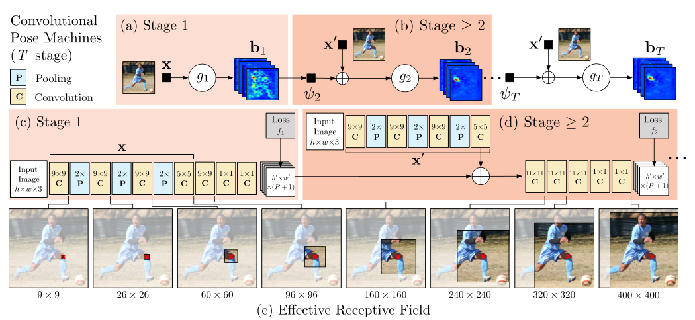

  - **stage1：** 输入是原图，经过卷积网络提取图像卷积特征X，后接两个1×1卷积输出**heatmaps（shape为h'×w'×（P+1））**，**P+1**通道表示heatmaps上每个像素位置是P个关键点（关节）+1个背景的得分socre。

  - **stage2：**

    - **出发点：**

      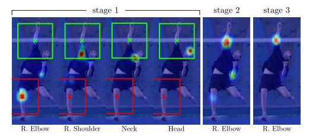

    - 来自易于检测零件的信念图的空间上下文可以为定位难以检测的零件提供强有力的线索。肩部、颈部和头部的空间背景有助于在后续阶段消除右肘信念图上的错误（红色）和正确（绿色）估计。

    -  利用“**各个关键点以一致的几何配置出现**”这一事实，后续阶段的预测器可以使用图像上位置z周围区域的带噪heatmaps生成空间上下文信息来提高预测结果。

    - 第二阶段网络**输出层的感受野必须足够大**，以保证网络具有**学习各个关键点间复杂和长距离关系**的潜力。大的感受野可以通过**池化操作得到**（但要牺牲精度），也可以通过**增大卷积核的尺寸**来实现（会增加参数数量），也可以通过增**加卷积层层数**实现（训练的时候可能会遇到梯度消失的风险）。

    - **输入包含三部分**，（1）原图（2）stage1输出的heatmap（3）每个目标的中心约束map（见下图中的small center map）； 输出的是P+1通道的heatmaps。

  - 后面stage同stage2...

    ==可以认为后一阶段输出的heatmap是对上一阶段heatmap的refine，且每一阶段的输出heatmap都对应有GT来计算损失函数，完成中间监督。==

- **详细模型结构**

  （参考https://zhuanlan.zhihu.com/p/102468356)

  stage1和stage2都输入了原图，stage3开始不再输入原图进行图像特征的计算，而是直接对**stage2的中间卷积特征进行再卷积**来计算图像特征，实际实现的结构示意图如下图所示：

  其中stage2之后输入的small center map是使用图像中**各个目标中心位置**（关键点的x，y坐标中min与max平均）处高斯分布生成的**，用于约束各个目标的位置。**（只使用在训练阶段）

  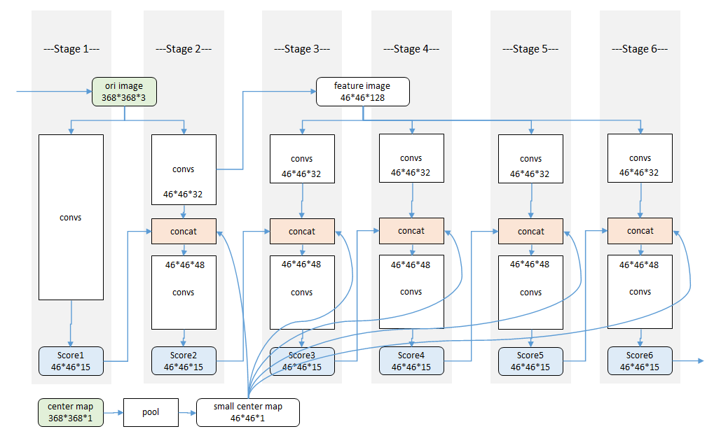

- **训练细节**

  - **输入：**为了达到一定的精度，我们将输入的裁剪图像规格化为**368×368**。

  - **损失函数：**上述姿态机器的设计产生了一个可以有大量层的深层架构。训练这样一个具有许多层的网络可能容易出现梯度消失的问题，使用中间监督。p部分的**belief-map**写为**b^p^∗（Yp=z）**，通过将高斯峰置于每个身体部位p的地面真值位置来创建。因此，我们旨在使每个级别的**每个阶段的输出最小化的成本函数**如下所示： 

    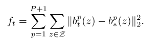

    **整个架构的总体目标**是通过增加每个阶段的损失来实现的，具体如下所示： 

    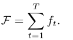

    

  - 我们制作了**两套belief-map**进行训练：一套包括**每个人在主要受试者附近出现的所有峰值**，另一种是我们**只为主要受试者**放置峰值。由于初始阶段仅依赖于局部图像证据进行预测，因此我们在第一阶段为损失层提供了第一组belief-map。我们将第二种类型的belief-map提供给后续阶段。

    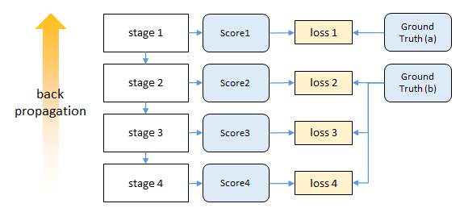

- **实验结果**

  - **感受野**

    我们发现**准确率会随着感受野的尺寸增大而提高**，在FLIC数据集上，我们通过对归一化尺寸为304×304的输入图像进行一系列的实验，发现检测准确率随着感受野的变化而增大，在大约250像素的时候趋于饱和，而这个数字恰好是归一化后的目标（人）的大小。当然在这一对比实验过程中我们通过改变结构来保证参数数量不发生太大变化。

    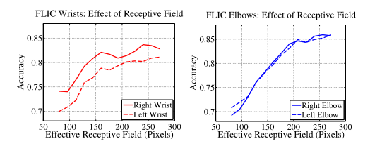

  - **中间监督处理消失梯度**

    下图展示了**（是/否）带有中间监督的情况下**，训练过程中不同网络深度处的梯度强度对比。在训练初期，最后一层的梯度分布方差都还挺大，若没有中间监督，越往前（层数越小）**梯度都集中在0附近（梯度消失）**；若有中间监督，浅层的梯度分布方差也挺大，表明中间监督确实对梯度消失问题有帮助。训练后期，没有中间监督时层数越浅，梯度消失仍然越严重；而有中间监督的情况下，**浅层的梯度分布方差没有训练初期那么大（但是也没消失），这表明了模型的收敛。**

    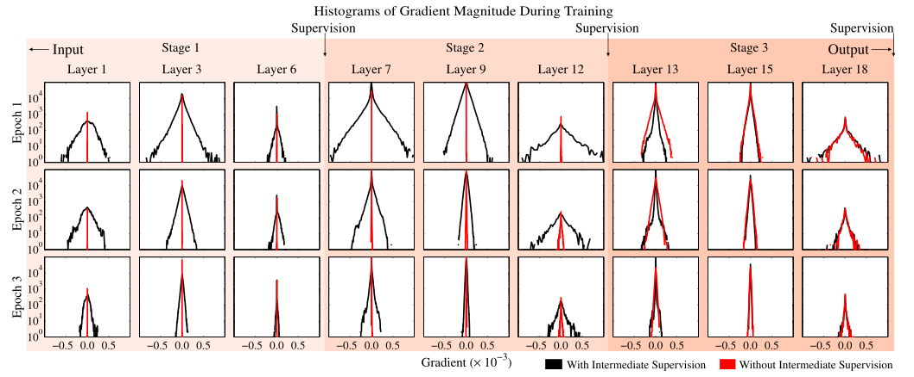

#### CHP（2017 ICCV）

> Compositional human pose regression

#### Adversarial posenet（2017 ICCV）

> Adversarial posenet: A structure-aware convolutional network for human pose estimation


#### 2D-3D-Softargmax（2018 CVPR）

> 2d/3d pose estimation and action recognition using multitask deep learning

- **出发点：**行为识别和人体姿态估计密切相关，但在文献中，这两个问题通常作为不同的任务处理。
  
  - 相关任务可以相互受益，在这项工作提出了一个**多任务框架**。用于从静止图像中联合估计二维和三维姿态，以及从视频序列中识别人体行为。
  - 因为大多数姿态估计方法都执行热图预测。这些基于检测的方法需要使用**不可微的argmax函数**来恢复关节坐标，作为后处理阶段，这打破了端到端学习所需的反向传播链。我们建议通过扩展**可微soft-argmax**来解决这个问题，用于关节二维和三维姿态估计。这使我们能够在姿态估计的基础上叠加行为识别，从而形成一个**端到端可训练**的多任务框架。
  - 所提出的体系结构可以无缝地**同时使用来自不同类别的数据进行训练。**在四个数据集（MPII、Human3.6M、Penn Action和NTU）上报告的结果证明了我们的方法对目标任务的有效性。 
  
- **整体结构**

  一种用于姿态估计和行为识别的多任务方法。从单个图像或帧序列中提供2D/3D姿态估计。姿态和视觉信息用于在统一的框架中预测行为。

  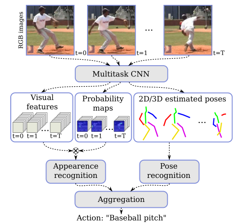

- **Human pose estimation**

  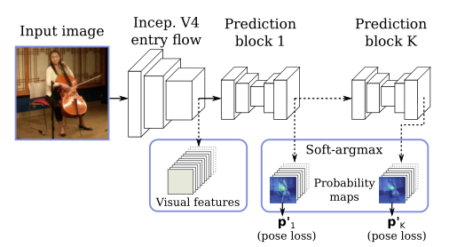

  - 网络体系结构的入口流程基于**Inception-V4**，用于提供基本特征提取。

  - K个预测块被用于**细化估计**，从中我们使用最后一个预测p^k^作为我们的估计姿态p。每个预测块由八个残差深度方向的卷积组成，**分成三个不同的分辨率**。作为副产品，我们还可以访问低级视觉特征和中间联合概率图。

  - 这些都是通过**soft-argmax层**间接学习到的。

    - 给定输入信号，主要思想是考虑u参数可以在输入信号的归一化后近似于具有分布性质。事实上，对于一个足够尖锐（轻量级）的分布，**期望值应该接近最大后验概率（MAP）估计**。

    - 使用标准化指数函数（**Softmax**），因为它减轻了低于最大值的值的不良影响，并增加了结果分布的“**尖锐性**”。对于作为输入的2D热图，归一化信号可以解释为**关节处于位置（x，y）的概率图，**并且关节位置的期望值由归一化信号上的期望值给出： 

      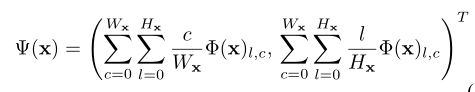

      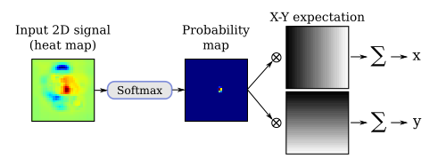

      其中，x是维数为Wx×Hx的输入热图，Φ是Softmax归一化函数。

  - **3D姿态估计：**通过将**二维热图扩展到体积表示**，我们将二维姿态回归扩展到三维场景。我们定义了与深度分辨率相对应的**Nd**叠加二维热图。（x，y）坐标中的预测是通过对平均热图应用Soft-argmax操作来执行的，而z分量是通过对x和y维度中的平均体积表示应用一维Soft argmax来回归的。

    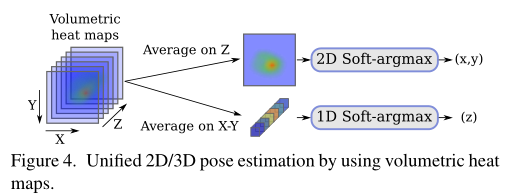

  - **详细模型结构**

    - 基于深度可分离卷积SC的可分离残差模块**（SR）**，输入与输出通道不等则选左边，相等右边。

      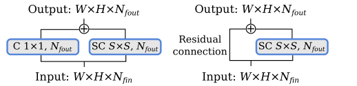

    - 基于**Inception-V4**的共享网络（入口流）。C：卷积，SR：可分离残差模块。

      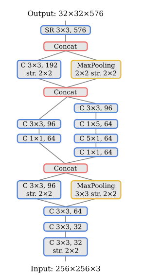

    - 姿态估计的**预测块**，其中Nd是每个关节的深度热图数，NJ是身体关节数。C：卷积，SR：可分离残差模块。

      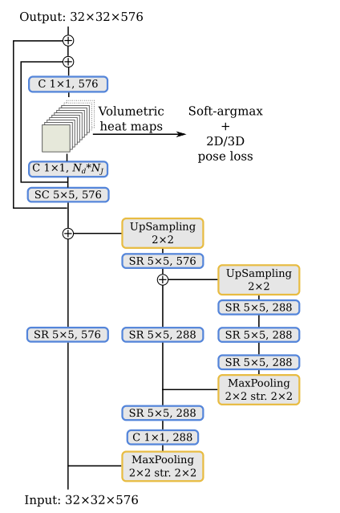

- **Human action recognition**
  提议的行为识别方法分为两部分，一部分基于身体关节坐标序列，我们称之为**基于姿态的识别**，另一部分基于视觉特征序列，我们称之为**基于外观的识别**。将每个部分的结果结合起来，以估计最终行动标签。

  - **Pose-based recognition**

    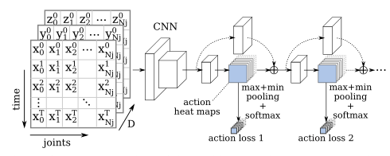

    - 为了探索身体关节位置编码的高级信息，我们将一系列**具有NJ关节的T姿态转换为类似图像的表示**。我们选择将时间维度编码为垂直轴，将关节编码为水平轴，并将每个点的坐标（（x，y）编码为2D，（x，y，z）编码为3D）作为通道。

    - 通过这种方法，我们可以使用**经典的二维卷积直接从身体关节的时间序列中提取模式**。由于姿态估计方法基于静止图像，我们使用时间分布的抽象来处理视频片段，这是一种处理单个图像和视频序列的简单技术。

    - 为了产生视频剪辑每个行为的输出概率，必须在行为图上执行一个池操作。为了对每个行为的最强响应更敏感，我们使用**max plus min pooling**，然后使用Softmax激活。此外，受人体姿态回归方法的启发，我们通过在**K个预测块中使用具有中间监督的堆叠结构来细化预测**。然后将每个预测块的行为热图重新注入下一个行为识别块。

    - **详细模型结构**

      用于行为识别的网络架构。行为预测块可以重复**K**次。**同样的架构用于姿态和外观识别**，除了姿态，每个卷积使用这里显示的特征数量的一半。T表示帧数，**Na表示行为数**。 

      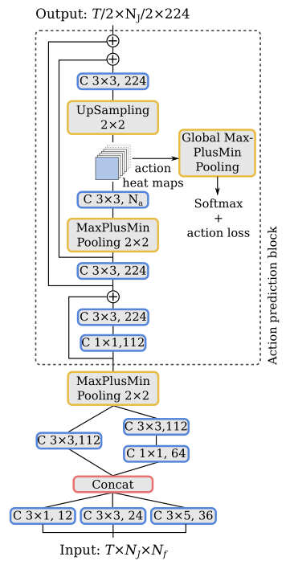

  - **Appearance-based recognition**

    - 外观特征被输入行为识别网络，**类似于基于姿态的动作识别块**，不同之处在于它依赖于局部外观特征，而不是关节坐标，即视觉特征取代身体关节的坐标。

      ==构建外观特征输入==

      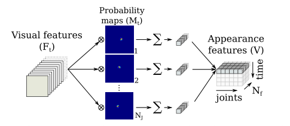

    - 为了提取局部外观特征，我们将视觉特征的**张量Ft**（Wf×Hf×Nf）与全局最后获得的**概率图M t**（Wf×Hf×NJ）**相乘**，其中Wf×Hf是特征图的大小，Nf是特征的数量，NJ是关节的数量。

    - 我们没有像克罗内克乘积那样单独乘以每个值，**而是将每个通道相乘**，得到大小为**（Wf×Hf×NJ×Nf）的张量**。然后，空间维度被一个**和折叠**，从而得到**一个时间t的外观特征**，大小为**（NJ×Nf）**。对于一系列帧，我们将t={0，1，…，t}的每个外观特征连接起来，从而得到**视频片段外观特征V（T×NJ×Nf）**。

    - 我们的多任务框架**对于基于外观的部分有两个好处：**

      1. 第一，由于大部分计算是共享的，因此它在计算上非常高效。
      2. 第二，提取的视觉特征更加健壮，因为它们针对不同的任务和不同的数据集同时进行训练。 

  - **Action aggregation**

    - **一些动作很难仅通过高水平的姿态表示来区分。**例如，如果我们只考虑身体关节，喝水和打电话的动作非常相似，但如果我们有与杯子和电话对应的视觉信息，则很容易将其分离。另一方面，**其他动作与视觉信息没有直接关系，但与身体动作有关，**如敬礼和触摸胸部，在这种情况下，姿态信息可以提供补充信息。
    - 为了探索姿态和外观模型的贡献，我们使用一个**完全连接的层和Softmax激活将各自的预测结合起来，**从而给出我们模型的最终预测。 

- **训练过程**

  - 我们使用RMSprop优化器**优化姿态回归部分，**初始学习率为0.001，当验证分数稳定时，初始学习率降低了0.2倍，并批量生成24幅图像。
  - 对于动作识别任务，我们使用**预先训练好的姿态估计模型**同时训练姿态和外观模型，**初始权重为冻结。**在这种情况下，我们使用了一个经典的SGD优化器，Nesterov动量为0.98，初始学习率为0.0002，在验证平稳时减少了0.2倍，并使用了一批2个视频剪辑。
  - **当验证准确性停滞时**，我们将最终学习率除以10，并**对整个网络进行微调**，使其持续5个epochs以上。

- **损失函数**

  - 对于姿态估计任务，我们在预测姿态上使用弹性净损失函数对网络进行训练：

    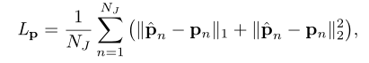

    ==式中，ˆpn和pn分别是第n个关节的估计位置和真值位置。==

  - 对于动作识别任务，我们使用**分类交叉熵损失**训练网络。

    在训练中，我们从视频样本中**随机选择带有T帧的固定大小片段**。在测试中，我们报告单剪辑或多剪辑的结果。

- **实验结果**

  - **Ablation study**

    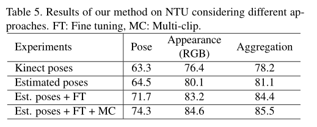

    我们的方法的有效性依赖于三个主要特征：

    1. 首先，多个预测块提供了对动作准确性的持续改进，
    2. 其次，由于我们的完全可微架构，我们可以将模型从RGB帧微调到预测动作，从而显著提高准确性。
    3. 第三，所提出的方法还受益于互补的外观和姿态信息，这些信息在聚合后可以提高分类精度。 

#### Posefix（2019 CVPR）

> Posefix: Model-agnostic general human pose refinement network

#### FPD（2019 CVPR）

> Fast human pose estimation

#### Soft-gated Skip Connections（2020 FG）

> Toward fast and accurate human pose estimation via soft-gated skip connections


#### SCNet (2020 CVPR)

#### UDP (2020 CVPR)


#### LiteHRNet (2021 CVPR)

> Lite-HRNet: A Lightweight High-Resolution Network

- **出发点：**人体姿势估计**需要高分辨率表示才能实现高性能**。基于对模型效率的日益增长的需求，本文研究了**在计算资源有限的情况下开发高效高分辨率模型**的问题。

  - 现有的**高效网络**主要从两个角度进行设计：
    - 一种是**借用分类网络的设计**，如MobileNet和ShuffleNet，以减少矩阵向量乘法中的冗余，其中卷积运算占主要成本。
    - 另一种是通过各种技巧来**调解空间信息丢失**，例如编码器-解码器架构和多分支架构。

- **本文贡献：**

  - 我们首先通过**简单地结合ShuffleNet中的shuffle块和HRNet中的高分辨率设计模式**来研究一个简单的轻量级网络。在位置敏感问题中，HRNet在大型模型中表现出更强的能力，例如语义分割、人体姿势估计和目标检测。目前尚不清楚高分辨率是否有助于小型模型。我们的经验表明，**直接组合优于ShuffleNet、MobileNet和Small HRNet1。**
  - 为了进一步实现更高的效率，我们引入了一个**高效的单元**，称为**conditional channel weighting**，用于执行跨信道的信息交换，以**取代shuffle块中代价高昂的逐点（1×1）卷积**。引入高效单元后网络称为 **Lite-HRNet**。性能优于shuffle块和HRNet的简单组合（naive-Lite-HRNet）。
    - conditional channel weighting非常有效：其**复杂度与信道数呈线性关系**，低于**逐点卷积的二次时间复杂度**。例如，利用64×64×40和32×32×80的多分辨率特性，conditional channel weighting 单元可以将shuffle块的整体计算复杂度降低80%。
    - 我们的解决方案**从所有通道和多个分辨率中学习权重**，这些分辨率在HRNet的并行分支中随时可用。它使用权重作为桥梁，在通道和分辨率之间交换信息，补偿逐点（1×1）卷积所起的作用。

- **Naive Lite-HRNet**

  - **Shuffle blocks**

    ShuffleNet V2中的shuffle块首先将通道分割为两个分区。一个分区经过1×1卷积、3×3深度卷积和1×1卷积序列，输出与另一个分区连接。最后，串接的通道被shuffle。下图a。

    > 其中的DWConv表示的是Depthwise convolution，其输入和输入通道数相同，并且每个卷积核只与一个特征通道进行卷积，其使用线性激活函数。DWConv实现时将groups属性设置为和out_channels相同即可。
    >
    > 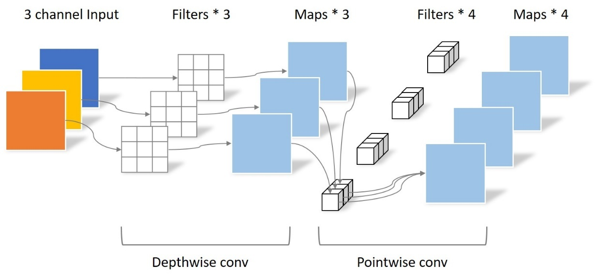

    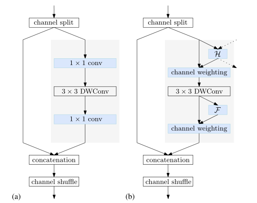

    （a）shuffle块。（b） 我们的conditional channel weighting块。虚线表示其他分辨率的表示以及分配给其他分辨率的权重。H=交叉分辨率加权函数。F=空间加权函数。 

  - **Small HRNet-W16**

    它由一个高分辨率的stem（由两个步幅为2的3×3的卷积组成）作为第一级，逐渐增加高分辨率到低分辨率的流作为主体。主体有一系列阶段，每个阶段包含平行的多分辨率流和重复的多分辨率融合。

    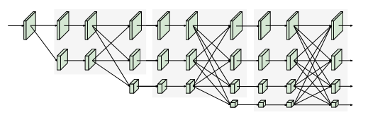

  - **Simple combination**

    我们采用Shuffle blocks替换small HRNet主干中的**第二个3×3卷积**，并替换所有正常的**residual blocks**（由两个3×3卷积组成）。多分辨率融合中的正常卷积被可**分离卷积**所取代，从而形成了一个 **naive Lite-HRNet**。 

- **1×1 convolution is costly**

  1×1卷积相对于信道数（C）具有二次时间复杂度（Θ（C^2^））。3×3 DWconv具有线性时间复杂度（Θ（9C）。在shuffle块中，两个1×1卷积的复杂度远高于深度卷积：对于通常情况C>5，Θ（2C2）>Θ（9C）。

  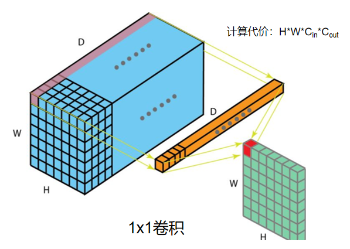

- **Conditional channel weighting**

  我们建议在naive Lite HRNet中使用**元素加权操作来代替1×1卷积**，后者在第s阶段具有s分支。第s解析分支的元素加权操作写为：

  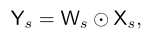

  其中，Ws是一个权重图，一个大小为**Ws×Hs×Cs**的三维张量，以及⊙ 是**按元素的乘法运算符**。复杂度与通道数Θ（C）成线性关系，远低于shuffle块中的1×1卷积。我们通过使用**单个分辨率**的通道和**所有分辨率**的通道来计算权重Ws，如上图（b）所示，并表明权重在通道和分辨率之间起着交换信息的作用。 

  两种条件通道加权（即两种计算Ws方法）：

  - **Cross-resolution weight computation**

    - 考虑到第s级，有s个平行分辨率和s个权重图W1，W2，Ws，每个都对应于相应的分辨率。我们使用一个轻量级函数Hs（·）计算所有通道在不同分辨率下的s权重图：

    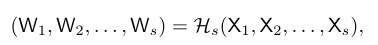

    - 轻量级函数Hs（·）实现：

      1. 其中{X1，…，Xs}是s分辨率的输入映射**。X1对应于最高分辨率，Xs对应于第s个最高分辨率**。我们在{X1，X2，…，Xs−1}上执行**自适应平均池（AAP）** ：**X′1=AAP（X1）**，X′2=AAP（X2），X's−1=AAP（Xs−1） ，其中AAP将任何输入大小合并为给定的**输出大小Ws×Hs**。然后我们连接{X′1，X′2，…，X′s−1} 和Xs一起。

      2. 然后经过如下运输，Conv是**1x1 Conv**：

         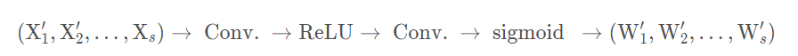

         **生成由s分区**、W′1、W′2，W‘s（每种分辨率对应一种)。

      3. s− 1权重图，W′1，W′2，W's−1，被**上采样到相应的分辨率**，输出W1，W2，Ws−1，用于后续的元素通道加权。 

    - **优点：**
      1. 位置i处的权重向量wsi的每个元素（来自权重映射Ws）从**在所有分辨率下，从同一位置的所有输入通道接收信息。**
      2. Hs（·）应**用于小分辨率，因此计算复杂度很低。**

  - **Spatial weight computation**

    对于每个分辨率，我们还计算与空间位置一致的空间权重：所有位置的权重向量wsi都是相同的。**权重取决于单个分辨率中输入通道的所有像素：** 

    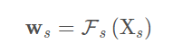

    这里，函数Fs（·）被实现如下。全局平均池（GAP）操作符用于从所有位置收集空间信息。数据维度(1\*1\*C)=GAP(H\*W\*C)

    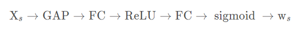

- **实例**

  Lite HRNet由高分辨率stem和主体组成，以保持高分辨率表示。茎部有一个步幅2的3×3卷积，和一个shuffle块，作为第一阶段。主体部分有一系列模块化模块。 每个模块包括两个条件信道加权块和一个多分辨率融合。每个分辨率分支的通道尺寸分别为C、2C、4C和8C。Lite-HRNet-N中的N表示层数。( ccw = conditional channel weight)

  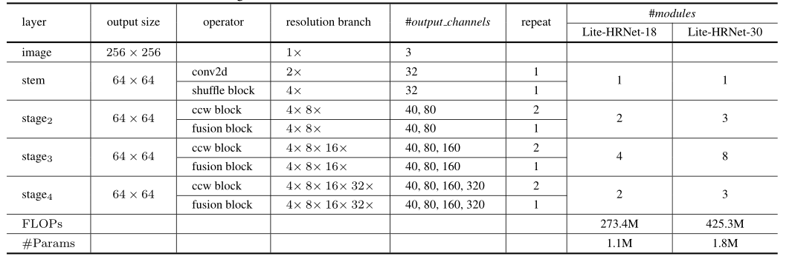

- **计算复杂度比较 **

  存疑🤔

  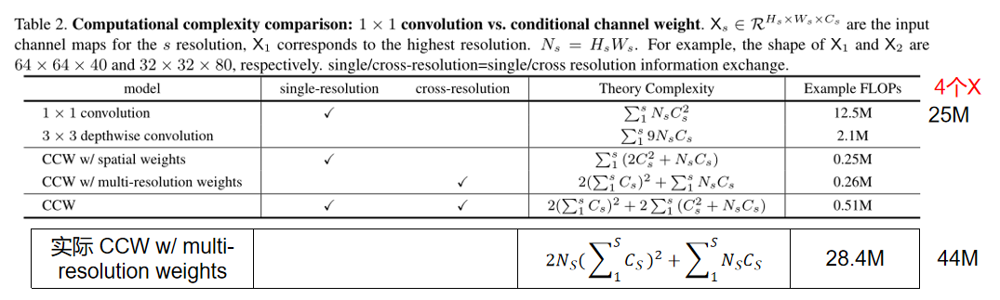

- **参数计算：**

  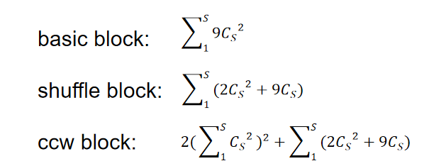

- **实验结果**

  我们的Lite-HRNet-30达到69.7 AP分数。它明显**优于小型网络**，并且在GFLOP和参数方面更有效。与大型网络相比，我们的Lite-HRNet-30优于Mask RCNN、G-RMI和Integral Pose Regression。虽然与一些大型网络存在性能差距，但我们的网络的GFLOP和参数要低得多。 

  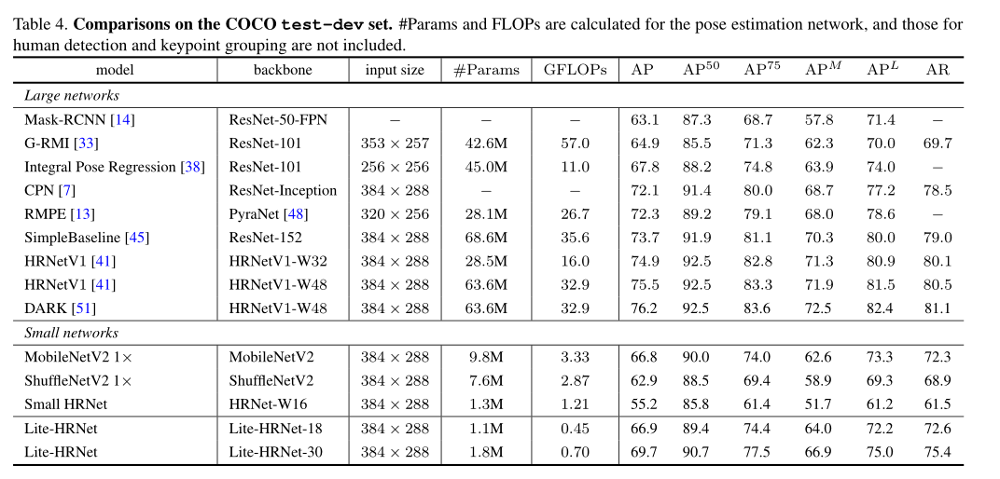

- **Ablation Study**

  - **Lite-HRNet vs. Small HRNet/ Naive Lite-HRNet**

    wider naive Lite-HRNet是增加层使参数与small HRNet-W16一致作比较。

  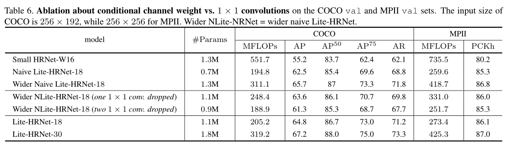

  - **Spatial and multi-resolution weights**

    我们通过改变空间加权和交叉分辨率加权的排列顺序进行了实验，获得了类似的性能。仅使用两个空间权重或两个交叉分辨率权重的实验几乎会导致0.3的下降。 

    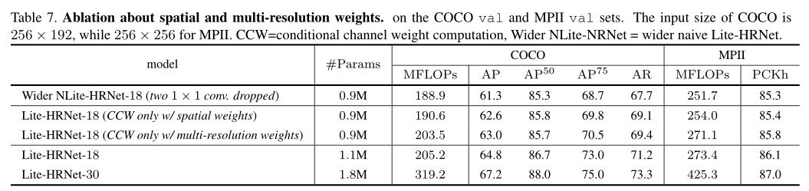

#### ViPNAS (2021 CVPR)


#### PRTR（2021 CVPR）

> Pose Recognition with Cascade Transformers


#### TransPose（2021 ICCV）

> TransPose: Keypoint Localization via Transformer

#### TokenPose（2021 ICCV）

> TokenPose:Learning Keypoint Tokens for Human Pose Estimation


#### Poseur（2022 arXiv）

> Poseur: Direct Human Pose Regression with Transformers

### 3.2 多人-Top-down

#### Simple baselines（2018 ECCV）

> Simple baselines for human pose estimation and tracking

#### CPN（2018 CVPR）

> Cascaded pyramid network for multi-person pose estimation

#### HRNet（2019 CVPR）

> Deep high-resolution representation learning for human pose estimation
>
> Deep High-Resolution Representation Learning for Visual Recognition

**解读：**https://zhuanlan.zhihu.com/p/134253318

**code：**[HRNet (github.com)](https://github.com/HRNet)

- **当前网络局限：**

  - 大多数现有方法通过网络传递输入，通常由**串联的高到低分辨率子网络组成，然后提高分辨率。**
  - 最新开发的分类网络，包括AlexNet、VGGNet、GoogleNet、ResNet等，都遵循LeNet-5的设计规则。该规则如图（a）所示：逐渐减小特征地图的空间大小，将高分辨率到低分辨率的卷积**串联**起来，形成**低分辨率**表示，并进一步处理以进行分类。
  - **位置敏感任务需要高分辨率表示**，例如语义分割、人体姿势估计和目标检测。先前最先进的方法采用**高分辨率恢复过程**，以从图（b）所示的分类或类分类网络输出的低分辨率表示提高表示分辨率，例如 SegNet , DeconvNet , U-Net and Hourglass , encoder-decoder  and SimpleBaseline 。此外，dilated convolutions用于移除一些下采样层，从而产生中等分辨率表示。

  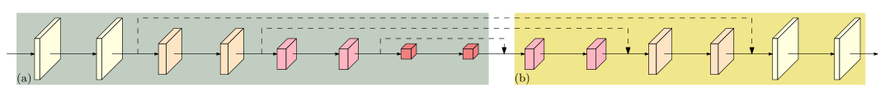

  基于高到低和低到高框架的典型姿势估计网络的图示。（a） Hourglass .Cascaded pyramid networks. (c) SimpleBaseline(d) Combination with dilated convolutions 

  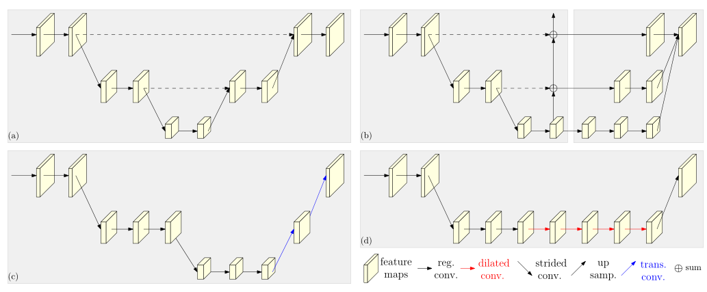

- **本文贡献：**

  我们提出了一种新的体系结构，即高分辨率网络（**HRNet**）。

  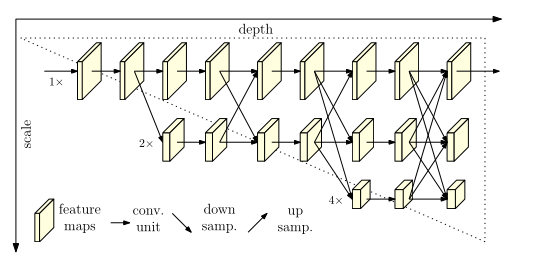

  - 我们的方法是**并行**连接高分辨率到低分辨率的子网络，而不是像大多数现有解决方案那样串联。因此，我们的方法能够**保持高分辨率，而不是通过从低到高的过程恢复分辨率，因此预测的热图在空间上可能更精确。**
  - 大多数现有的融合方案聚合了低级和高级表示。相反，我们通过**重复的多尺度融合**，在相同深度和相似级别的低分辨率表示的帮助下**提高高分辨率表示**，反之亦然。从而使高分辨率表示也有丰富的姿势估计。因此，我们预测的热图可能更准确。
  - 我们通过网络输出的**高分辨率表示来估计关键点。**

- **网络**

  该网络由一个**stem、主体（HRNet）、representation head **组成。

  - 该stem由两个降低分辨率的跨步卷积组成；我们将图像输入一个stem，该stem由**两个步长为2的 3×3卷积组成**，将分辨率降低到1/4，然后**主体以相同的分辨率输出表示（1/4）**。

  - **主体以与其输入特征图相同的分辨率输出特征图**；
  - representation head 选择进行后续任务预测的高分辨率特征图（或低分辨率），即用于估计选择关键点位置并转换为全分辨率的热图。 

- **主体——HRNet（网络实例化 ）**

  - 主体部分包含**四个阶段**和**四个并行卷积流**。分辨率分别为1/4、1/8、1/16和1/32。**当分辨率降低到一半，宽度（通道数）增加到两倍。**即四种分辨率的卷积宽度（通道数）分别为C、2C、4C和8C。 

  - 第一阶段包含4个residual units ，其中每个单元（与ResNet-50相同）由通道数为64的 **bottleneck** 形成，然后是一个3×3卷积，将特征映射的宽度减小到**C**。

  - 第二、第三、第四阶段分别包含**1、4、3个exchange block（或称 模块化块）**。一个交换块包含4个 **residual units**（basicblock）和一个**exchange unit**在分辨率之间，其中每个单元在每个分辨率中包含两个3×3卷积。综上所述，共有8个exchange unit，即进行了8次多尺度融合。 

  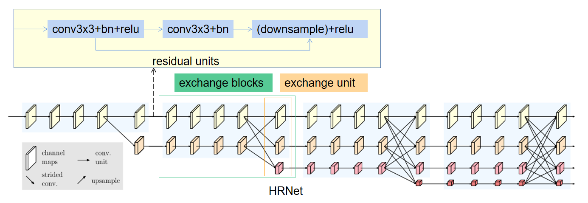

  

  🐱‍🏍**注意：**在我们的实验中，我们研究了一个小网络和一个大网络：**HRNet-W32和HRNet-W48**，其中32和48分别代表最后三个阶段的**高分辨率子网络的通道数（C）**。对于HRNet-W32，其他三个并行子网的宽度分别为64、128、256，对于HRNet-W48，宽度分别为96、192、384。

- **重复多分辨率融合**

  融合模块的目标是在多分辨率表示中交换信息。

  - 同分辨率的层直接复制。

  - 需要升分辨率的使用bilinear upsample （或  nearest neighbor up-sampling） + **1x1卷积将channel数统一**。

  - 需要降分辨率的使用strided为2 的 3x3 卷积。

    > 至于为何要用strided 3x3卷积，这是因为卷积在降维的时候会出现信息损失，使用strided 3x3卷积是为了通过学习的方式，降低信息的损耗。所以这里没有用maxpool或者组合池化。

  - 三个feature map融合的方式是**相加**。

    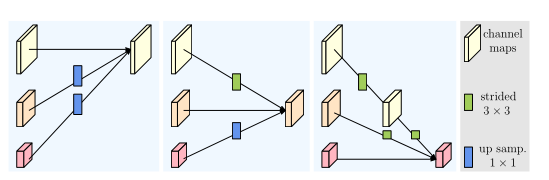

- **Representation Head**

  我们有三种表示头，如图4所示，分别称为HRNetV1、HRNetV2和HRNetV2p。

  - **HRNetV1：**输出是**仅来自高分辨率流的表示**。其他三种表述被忽略。如图（a）所示。
  - **HRNetV2：**我们通过双线性上采样重新调整低分辨率表示尺度，而不将通道数更改为高分辨率，并将四种表示**拼接**起来，然后进行1×1卷积以混合四种表示。如图（b）所示。
  - **HRNetV2p**：我们通过将HRNetV2的高分辨率表示输出降采样到多个级别来构造多级表示。如图（c）所示。

  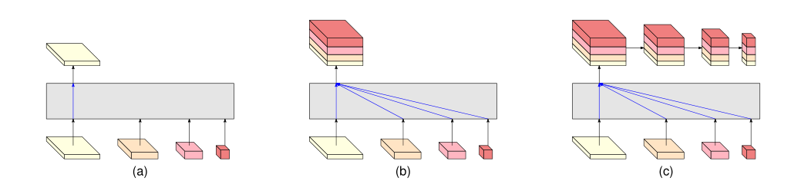

  **在本文中，我们将展示将HRNetV1应用于人体姿势估计、HRNetV2应用于语义分割和HRNetV2p应用于对象检测的结果。**

  如下主要用于分类网络：

  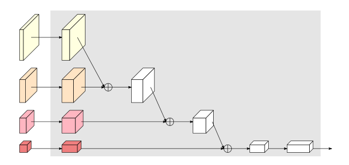

-  **分析**

  我们分析了模块化块，它分为两部分：**多分辨率并行卷积**（图a）和**多分辨率融合**（图b）。

  - **多分辨率并行卷积**类似于**群卷积**。它将输入通道划分为几个通道子集，并分别在不同的空间分辨率上对每个子集执行规则卷积，而**在组卷积中，分辨率是相同的。**这种联系意味着多分辨率并行卷积可以享受群卷积的一些好处。
  - **多分辨率融合单元**类似于规则卷积的多分支全连接形式，如图c所示。
    - 规则卷积可分为多个小卷积。输入通道被划分为几个子集，输出通道也被划分为几个子集。**输入和输出子集以完全连接的方式连接，每个连接都是一个规则卷积。**输出通道的每个子集是每个输入通道子集上卷积输出的**总和**。
    - 不同之处在于，我们的**多分辨率融合需要处理分辨率的变化**。多分辨率融合和规则卷积之间的联系为探索HRNetV2和HRNetV2p中的所有四种分辨率表示提供了证据。 

  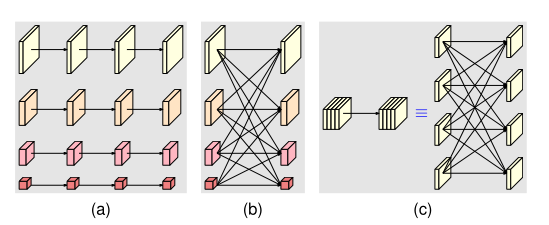

- **实验结果**

  - **重复多尺度融合消融实验**。我们实证分析了重复多尺度融合的效果。我们研究了网络的三种变体。（a） 没有中间交换单元（1个融合）：除最后一个交换单元外，多分辨率子网之间没有交换。（b） 跨级交换单元（3个熔合）：每个级内的并行子网之间没有交换。（c） 跨级和级内交换单元（共8个融合）：这是我们提出的方法。所有的网络都是从零开始训练的。表给出的COCO验证集的结果表明，多尺度融合是有帮助的，更多融合会带来更好的性能。 

    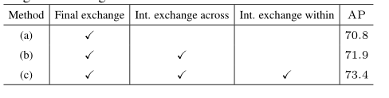

  - 我们从两个方面研究了**表征分辨率对姿态估计性能的影响**：

    - **从高到低检查由每个分辨率的特征图估计的热图的质量**，我们通过为ImageNet分类预先训练的模型来训练我们的大小网络。我们的网络输出从高到低的四个响应图。较低分辨率的热图预测质量太低，AP分数低于10分。如图比较表明，**分辨率确实会影响关键点预测质量。** 

      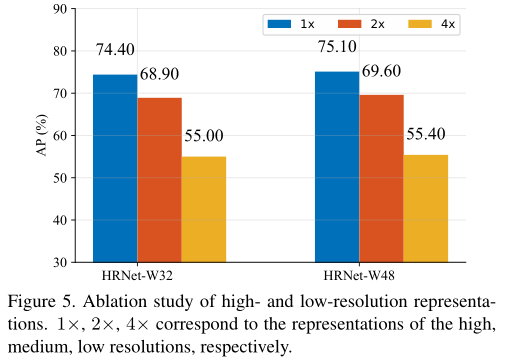

    - 图显示了与SimpleBaseline（ResNet-50）相比，**输入大小如何影响性能。**由于在整个过程中保持了高分辨率，较小输入尺寸的改善比较大输入尺寸的改善更为显著。

    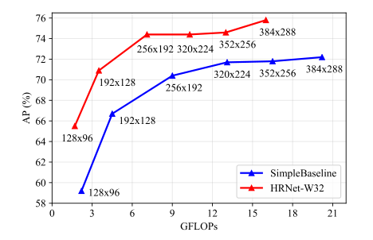

  - COCO测试集的比较

    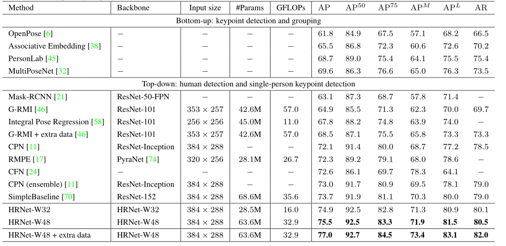


#### MSPN（2019 arXiv）

> Rethinking on multi-stage networks for human pose estimation


#### Graph-PCNN（2020 ECCV）

> Graph-pcnn: Two stage human pose estimation with graph pose refinement

#### RSN（2020 ECCV）

> Learning delicate local representations for multiperson pose estimation

#### OASNet（2020 ECCV）

> Occlusion-aware siamese network for human pose estimation

### 3.3 多人-Bottom-up

#### Deepcut（2016 CVPR）

> Deepcut: Joint subset partition and labeling for multi person pose estimation

#### OpenPose（2017 CVPR）

> Realtime multi-person 2d pose estimation using part affinity fields


#### Associative embedding（2017 NeurIPS）

> Associative embedding: End-to-end learning for joint detection and grouping

#### Multiposenet（2018 ECCV）

> Multiposenet: Fast multiperson pose estimation using pose residual network（2018 ECCV）

#### SPR（2019 CVPR）

> Single-stage multiperson pose machines

#### Higherhrnet（2020 CVPR）

> Higherhrnet: Scale-aware representation learning for bottomup human pose estimation


## 4. 基于视频的2D姿态估计/跟踪

### 4.1 单人

#### ST-AOG（2015 CVPR）

> Joint action recognition and pose estimation from video

#### Personalizing ConvNet（2016 CVPR）

> Personalizing human video pose estimation（2016 CVPR）

#### Thin-slicingNet（2017 CVPR）

> Thin-slicing network: A deep structured model for pose estimation in videos


#### LSTM-PM（2018 CVPR）

> LSTM pose machines


#### DKD（2019 ICCV）

> Dynamic kernel distillation for efficient pose estimation in videos

#### UniPose（2020 CVPR）

>  Unipose: Unified human pose estimation in single images and videos


#### BlazePose（2020 CVPRW）

> BlazePose: On-device Real-time Body Pose tracking

- **出发点：**提出一种用于人体姿态估计的轻量级卷积神经网络体系结构——BlazePose，专门用于移动设备上的实时推理。

  - 热图选择可以以最小的开销扩展到多人，但它使单人的模型比适用于移动电话实时推理的模型大得多。与基于热图的技术相比，基于回归的方法虽然**计算要求较低且更具可扩展性**，但却试图预测平均坐标值，通常无法解决潜在的模糊性。
  - 在我们的工作中，我们扩展了**参数数量较少，叠层沙漏结构也能显著提高预测质量**的想法，并使用编码器-解码器网络架构来预测所有关节的热图，然后使用另一个编码器直接回归到所有关节的坐标。我们工作背后的关键洞见是，在推理过程中**可以丢弃热图分支，使其足够轻，**可以在移动设备上运行。 

- **Inference pipeline**

  我们的管道由一个**轻量级身体姿态检测器**和一个**姿态跟踪器**网络组成。跟踪器预测关键点坐标、当前帧上的人物以及当前帧的精细感兴趣区域。当跟踪器显示没有人在场时，我们在下一帧重新运行探测器网络 

  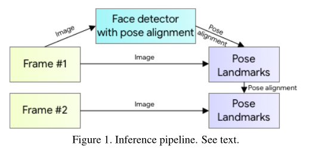

- **Person detector**

  - **出发点：**大多数现代**目标检测**解决方案的最后一个后处理步骤都依赖于非最大抑制（NMS）算法。这**适用于自由度很少的刚性对象**。然而，这种算法在包含高度关节化姿态（如人类的姿态）的场景中会失效，例如人们挥手或拥抱。这是因为多个不明确的框满足NMS算法的联合交集（IoU）阈值。

  - 为了克服这一局限性，我们着重于检测**相对刚性身体部位（如人脸或躯干）的边界框**。

    - 我们观察到，在许多情况下，向神经网络发送的有关躯干位置的最强信号是人的脸（因为它具有高对比度特征，外观变化较少）。**为了使这样的人检测器快速、轻便，**我们提出了一个强有力的**假设**，即在我们的单人用例中，**人的头部应该始终可见**，但对于AR应用程序来说，这是有效的。
    - 因此，我们使用**快速设备人脸检测器作为个人检测器的代理**。该面部检测器可预测其他特定于人的对齐参数：人的臀部之间的中点、环绕整个人的圆圈的大小，以及倾斜度（连接两个肩部中点和臀部中点的线条之间的角度）。  

    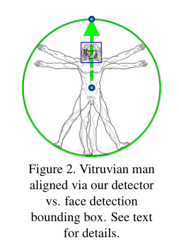

- **Topology**

  我们利用BlazeFace、BlazePalm和Coco使用的超集，提出了一种新的拓扑结构，使用人体上的**33**个点。这使我们能够与各自的数据集和推理网络保持一致。

  

- **神经网络结构**

  - 我们系统的姿势估计组件预测所有33个人关键点的位置，并**使用管道第一阶段提供的个人定位**建议。

  - 我们采用了**组合热图、偏移和回归方法**。我们仅在训练阶段使用热图和补偿损失，并在运行推理之前从模型中**删除**相应的输出层。因此，我们有效地使用热图来监督轻量级嵌入，然后由回归编码器网络使用。

  - 我们叠加了一个基于热图的微型编码器-解码器网络和一个随后的**回归编码器网络**。我们积极利用网络所有阶段之间的跳过连接，以实现高级和低级功能之间的平衡。然而，**回归编码器的梯度不会传播回经过热图训练的特征**（请注意图中的梯度停止连接）。我们发现，这不仅改善了热图预测，而且大大提高了坐标回归的精度。 

    

- **数据集**

  与大多数使用热图检测关键点的现有姿势估计解决方案相比，我们基于跟踪的解决方案需要初始姿势对齐。我们将数据集限制在可以**看到整个人**，或者**可以自信地标注髋部和肩部关键点的情况下**。为了确保模型支持数据集中不存在的严重遮挡，我们使用了大量遮挡模拟增强。我们的训练数据集由60K图像和25K图像组成，其中场景中有一个或几个人摆出普通姿势，场景中有一个人进行健身锻炼。所有这些图像都是由人类注释的。 

- **Alignment and occlusions augmentation**

  在增强和训练数据准备期间，我们故意**限制角度、比例和平移的支持范围**。这允许我们降低网络容量，使网络更快，同时需要更少的计算资源，从而减少主机设备上的能源。

  - 基于检测阶段或之前的帧关键点，我们对齐人，使**髋部之间的点位于作为神经网络输入传递的方形图像的中心**。我们将旋转估计为**髋部中点和肩部中点之间的线L，并旋转图像，使L平行于y轴。**对比例进行估计，以便所有身体点都适合在身体周围的方形边界框中。
  - 我们还应用了**10%的缩放和移位增强**，以确保跟踪器处理帧间的身体运动和扭曲的对齐。
  - 为了**支持对不可见点的预测**，我们在训练期间模拟遮挡（填充各种颜色的随机矩形），**并引入逐点可见性分类器，以指示特定点是否被遮挡，**以及位置预测是否被认为不准确。这使得即使是在严重遮挡的情况下，也可以持续跟踪一个人。

- **实验结果**

  - 我们手动注释了两个包含1000张图像的内部数据集，每个图像中有1-2人。第一个数据集被称为**AR数据集**，由各种各样的野外人体姿势组成，而第二个数据集仅由**瑜伽/健身姿势**组成。为了保持一致性，我们**只使用了MS Coco拓扑，17个点用于评估**，这是OpenPose和BlazePose的共同子集。

  - 作为评估指标，我们使用20%公差的正确点百分比(**PCK@0.2**)（如果2D欧几里德误差小于相应人躯干尺寸的20%，我们假设该点被正确检测到）。
  - 为了验证人类基线，我们要求两名注释员独立地重新注释AR数据集，并获得手工注释平均值**PCK@0.2=97.2**。
  - 我们训练了两个不同能力的模型：**BlazePose Full（6.9 MFlop，3.5 M参数）**和**BlazePose Lite（2.7 MFlop，1.3 M参数）**。

  虽然我们的模型显示的性能比OpenPose模型稍差 AR数据集BlazePose Full在Yoga/健身用例上的表现优于OpenPose。同时，BlazePose在单个中端手机CPU上的性能比在20核桌面CPU上的OpenPose快**25-75倍**

  

### 4.2 多人-Top-down

#### Detect-and-track（2018 CVPR）

> Detectand-track: Efficient pose estimation in videos（2018 CVPR）

#### PoseFlow （2018 BMVC）

> Pose flow: Efficient online pose tracking

#### POINet（2019 ACM MM）

> POINet: pose-guided ovonic insight network for multi-person pose tracking

#### KeyTrack（2020 CVPR）

> 15 keypoints is all you need

#### PGPT（2020 TMM）

> Poseguided tracking-by-detection: Robust multi-person pose tracking

####  DetTrack（2020 CVPR）

> Combining detection and tracking for human pose estimation in videos


### 4.3 多人-Bottom-up

#### PoseTrack（2017 CVPR）

> PoseTrack: A Benchmark for Human Pose Estimation and Tracking


#### Jointflow（2018 BMVC）

> Jointflow: Temporal flow fields for multi person pose tracking


#### Spatio-temporal associative embedding（2019 CVPR）

> Multi-person articulated tracking with spatial and temporal embeddings

## 5. 2D-HPE数据集


### 5.1 MPII

==Image-level 2D Single Person Dataset==

MPII是**单人人体关键点检测的主要数据集**。包含丰富的活动和多样性捕获环境，包括室内和室外。它是从Y ouTube的3913个视频中收集的，涉及491个不同的活动。从收集的视频中总共提取了24920帧。注释由亚马逊机械土耳其公司（AMT）的内部工作人员进行。注释包括**16**个关键点的二维位置、完整的三维躯干和头部方向、关键点的遮挡标签以及活动标签。相邻的视频帧也可用于运动信息。最后，**40522人被贴上标签，其中28821人用于培训，11701人用于测试。**MPII数据集已被广泛用于姿态估计和其他与姿态相关的任务。由于姿态相对容易，检测到的2D关键点的精度较高，性能接近饱和。

### 5.2 COCO

==Image-level 2D Multi-Person Dataset==

COCO是**多人关键点检测的主要数据集**。包含用于对象检测、全景分割和关键点检测的注释。这些图片来自谷歌、必应和Flickr等网站。注释由亚马逊的Mechanical Turk（AMT）上的工人执行。该数据集包含超过20万张图像和25万个人实例。自2016年以来，除了数据集，COCO关键点检测的挑战每年都会举行。数据集有两个版本。区别在于训练集和验证集的划分。在2017年的最新版本中，**training/val images拆分为118K/5K，**而不是之前的83K/41K。测试集包含20K图像，注释由官方测试服务器提供。此外，还发布了120K未标记图像，它们与标记图像遵循相同的类别分布。它们可以用于半监督学习。对于关键点检测，将标记**17**个关键点以及可见性标记、边界框和身体分割区域。COCO数据集是一个广泛使用的评估基准，并作为姿态相关任务的辅助数据，

### 5.3 J-HMDB

==Video-level 2D Single Person Dataset==

J-HMDB数据集是关节注释HMDB的缩写，是**HMDB51数据库的子集**，该数据库包含51个人类行为的5100多个片段。J-HMDB数据集包含**928个剪辑，包含21个行为类别**。每个行为类包含36-55个片段。**每个剪辑包括15-40帧。**31838张图片通过亚马逊 2D puppet model进行注释。最多可标记**15**个可见的身体关键点，以及比例、视点、分割、遮罩和流。训练和测试图像的数量比例大约为7:3。J-HMDB数据集已广泛应用于视频中的**姿态估计和行为识别。** 

### 5.4 PoseTrack Dataset

==Video-level 2D Multi-Person Dataset==

PoseTrack数据集是**第一个大规模多人姿态估计和跟踪数据集**。它是从MPII多人姿态数据集中的未标记视频中收集的。它有两个版本，即PoseTrack 2017和PoseTrack 2018。PoseTrack 2017包含550个视频，**分为292、50和208个视频，分别用于训练、验证和测试**。共有23000帧使用153615个姿态标签进行注释。PoseTrack 2018是其扩展版。**它包含593个训练视频、170个验证视频和375个测试视频**。对于训练集中的每个视频，中间的30帧都会被注释。对于验证集和测试集，中间的30帧以及每四帧被注释。标签包含**15个二维关键点**、一个唯一的个人ID和每个人的头部边界框。PoseTrack具有挑战性，因为视频包含各种姿态外观和比例变化，以及身体部位的遮挡和截断。

## 6. 2D-HPE评价标准

[人体姿态估计-评价指标 - 知乎 (zhihu.com)](https://zhuanlan.zhihu.com/p/270619106)

二维姿态估计的评估旨在测量预测的二维位置的准确性。根据数据集的特点，广泛使用的评估指标包括：

- 正确部位百分比**（PCP）**
- 正确关键点百分比**（PCK）**
- 关键点相似度**（OKS）**
- 平均精度**（AP）**

### 6.1 PCP

建议使用正确部位百分比（PCP）来衡量身体部位预测的准确性。如果**相应肢体的估计两个端点在真实值端点的阈值（50%）内，则身体部位预测是准确的**。PCP有一个缺点，即前缩短会影响不同视图和范围内身体部位的正确测量。 

### 6.2 PCK

- 正确关键点百分比（PCK）是衡量2D关键点预测准确性的一个广泛使用的指标。在17年比较广泛使用，现在基本不再使用。

- **计算检测的关键点与其对应的groundtruth间的归一化距离小于设定阈值的比例。**
  - FLIC数据集中是以躯干直径(左肩到右臂的欧式距离) 作为归一化参考.
  - MPII数据集中是以头部长度(头部直径) 作为归一化参考，即**PCKh**.

- **例如：**
  
  - PCK@0.2表示以躯干直径作为参考，如果归一化后的距离小于阈值0.2，则认为预测正确。
  - **PCKh@0.5表示以头部长度作为参考，如果归一化后的距离小于阈值0.5，则认为预测正确。**
  
- **计算：**

  

  

  > 

- **code:**

  ```python
  def compute_pck_pckh(dt_kpts,gt_kpts,refer_kpts):
      """
      pck指标计算
      :param dt_kpts:算法检测输出的估计结果,shape=[n,h,w]=[行人数，２，关键点个数]
      :param gt_kpts: groundtruth人工标记结果,shape=[n,h,w]
      :param refer_kpts: 尺度因子，用于预测点与groundtruth的欧式距离的scale。
      　　　　　　　　　　　pck指标：躯干直径，左肩点－右臀点的欧式距离；
      　　　　　　　　　　　pckh指标：头部长度，头部rect的对角线欧式距离；
      :return: 相关指标
      """
      dt=np.array(dt_kpts)
      gt=np.array(gt_kpts)
      assert(len(refer_kpts)==2)
      assert(dt.shape[0]==gt.shape[0])
      ranges=np.arange(0.0,0.1,0.01)
      kpts_num=gt.shape[2]
      ped_num=gt.shape[0]
      #compute dist
      scale=np.sqrt(np.sum(np.square(gt[:,:,refer_kpts[0]]-gt[:,:,refer_kpts[1]]),1))
      dist=np.sqrt(np.sum(np.square(dt-gt),1))/np.tile(scale,(gt.shape[2],1)).T
      #compute pck
      pck = np.zeros([ranges.shape[0], gt.shape[2]+1])
      for idh,trh in enumerate(list(ranges)):
          for kpt_idx in range(kpts_num):
              pck[idh,kpt_idx] = 100*np.mean(dist[:,kpt_idx] <= trh)
          # compute average pck
          pck[idh,-1] = 100*np.mean(dist <= trh)
      return pck
  ```

### 6.3 OKS

- **OKS**（object keypoint similarity），**关键点相似度**，在人体关键点评价任务中,对于网络得到的关键点好坏,并不是仅仅通过简单的欧氏距离来计算的,而是有一定的尺度加入,来计算两点之间的相似度。这个指标启发于目标检测中的**IoU**指标，主要是用在多人姿态估计任务当中。

  

- **说明**

  - **i**表示关键点下标；
  - **d**表示检测的关键点与真实关键点之间的欧氏距离；
  - **S**表示groundtruth人的尺度因子，其值为行人检测框面积的平方根：
  - **v**表示关键点可见性，参考COCO数据集，v=0表示关键点未标记，可能的原因是图片中不存在，或者不确定在哪；v=1表示关键点无遮挡并且已经标注，v=2表示关键点有遮挡但已标注；
  - **δ**表示符合条件为1
  - **σ**表示i**关键点归一化因子**，这个因子是通过对所有的样本集中的groundtruth关键点由人工标注与真实值存在的标准差，σ越大表示此类型的关键点越难标注。对coco数据集中的5000个样本统计出17类关键点的归一化因子，σ的取值可以为：**{鼻子：0.026，眼睛：0.025，耳朵：0.035，肩膀：0.079，手肘：0.072，手腕：0.062，臀部：0.107，膝盖：0.087，脚踝：0.089}**，因此此值可以当作常数看待，但是使用的类型仅限这个里面。如果使用的关键点类型不在此当中，可以使用另外一种统计方法计算。

### 6.4 AP

- 指标是作为COCO数据集的指标，既可以用在单人姿态估计，也可以用在多人姿态估计，他针对的是计算测试集精度百分比，这就是平均准确率（AP）。AP是通过**测量对象关键点相似性（OKS）来计算的**。

  ==😆存疑：多人姿态计算只是recall？AP应该使用PR曲线面积来计算。p理解为多个样本好点？==

- **单人姿态估计AP**

  计算出groundtruth与检测得到的关键点的相似度**oks**为一个标量，然后人为的给定一个阈值**T**，然后可以通过所有图片的**oks**计算**AP**：

  

- **多人姿态估计AP**

  - 多人姿态估计，如果采用的检测方法是**自顶向下**，先把所有的人找出来再检测关键点，那么其AP计算方法**如同单人姿态估计AP**。

  - 如果采用的检测方法是**自底向上**，先把所有的关键点找出来然后再组成人，那么假设**一张图片中共有M个人，预测出N个人**，由于不知道预测出的N个人与groundtruth中的M个人的一一对应关系，因此需要计算groundtruth中每一个人与预测的N个人的oks，那么可以获得一个大小为**M × N** 的矩阵，矩阵的每一行为groundtruth中的一个人与预测结果的N个人的oks，**然后找出每一行中oks最大的值作为当前GT的oks**。最后每一个GT行人都有一个标量oks，然后人为的给定一个阈值T，然后可以通过所有图片中的所有行人计算AP：

    

- **说明：**

  给定所有标记关键点的OKS，可以计算平均精度（AP）和平均召回率（AR）。通过调整OKS值，可以计算精度召回曲线。不同OKS下的AP和AR可以全面反映测试算法的性能。 

  - **AP^0.5^**（OKS=0.50时的AP）
  - **AP^0.75^**
  - **mAP**（10个值的AP得分平均值，**OKS=0.50:0.05:0.95**）
  - 中等对象的**AP^M^**，大对象的**AP^L^**
  - **AR^0.5^**，**AR^0.75^**，**AR**，**AR^M^**适用于中型对象，**AR^L^**适用于大型对象。

  

## 7. 其他

#### 7.1 Group Convolution分组卷积

- Group Convolution分组卷积，最早见于AlexNet——2012年Imagenet的冠军方法，Group Convolution被用来切分网络，主要是解决显存不足问题，**使其在**2个GPU上并行运行。
- Group Convolution顾名思义，则是对**输入feature map进行分组，然后每组分别卷积。**假设输入feature map的尺寸仍为C∗H∗W，输出feature map的数量为N个，如果设定要分成G个groups，则每组的输入feature map数量为C/G，每组的输出feature map数量为N/G，每组卷积核的尺寸为N/G∗C/G∗K∗K，所有组卷积核的总参数量为N∗C/G∗K∗K，可见，总参数量减少为原来的 **1/G**。


#### 7.2 Depth-wise Convolution

[Depth-wise Convolution - 知乎 (zhihu.com)](https://zhuanlan.zhihu.com/p/149564248)

Separable Convolution可以分成spatial separable convolution和depthwise separable convolution

depth-wise卷积的FLOPs更少没错，但是在相同的FLOPs条件下，depth-wise卷积**需要的IO读取次数是普通卷积的100倍**，因此，由于depth-wise卷积的小尺寸，相同的显存下，我们能放更大的batch来让GPU跑满，但是此时**速度的瓶颈已经从计算变成了IO**。自然desired小尺寸卷积应该有的快速的特性，也无法实现。

