# Action Quality Assessment

## 1. 综述

#### A Survey of Video-based Action Quality Assessment（2021 INSAI）

- **定义**

  **行动质量评估（AQA）旨在评估特定行动的执行情况**，近年来受到了越来越多的关注，因为它在许多现实世界的应用中起着至关重要的作用，包括体育、医疗和其他。 

  **与行为识别不同，AQA更具挑战性，因为它需要模型从描述相同动作的视频中预测细粒度分数。**

- **运用领域**

  医疗康复、体育运动（跳水、体操、滑冰等）、日常行为或者技能评估

- **AQA基本架构**

  AQA框架由视频**特征提取模块和评估模块**组成：

  - 在特征提取阶段，传统方法首先完成时空关键点的提取和选择，然后采用离散傅立叶变换（DFT）、离散余弦变换（DCT）或线性组合完成特征融合。然而，深度学习方法通常采用深度卷积网络（DCNs）和递归神经网络。

  - 评估模块的形式与评估任务的类型高度相关。

  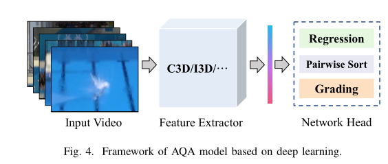

- **AQA任务分类**

  1. **Regression scoring**

     回归评分的形式通常出现在**体育运动**中。由于裁判员在体育赛事AQA数据集中给出视频的地面真实分数，因此可以通过大型体育赛事的广播视频构建数据集，获取难度较小。采用支持向量回归（SVR）模型或全连通网络（FCN）直接完成分数预测。**均方误差（MSE）通常用作回归评分的指标**： 

     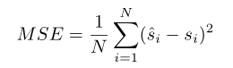

  2. **Grading**

     分级的形式通常出现在**医疗技能操作评估任务**中。操作员的操作将分为特定级别，**如新手、中级和专家**。因此，行动质量评估被转化为一个**分类问题**。通常采用**分类准确度作为度量标准**。 

  3. **Pairwise sorting**

     成对排序任务从视频库中获取任意两个视频，以评估动作质量。假设视频数据集包含N个视频，那么总共有$C^2_n$个组合。标签矩阵M可以根据以下规则构造： 

     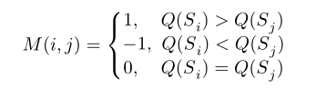

     评价指标使用**pairwise accuracy (% of correctly ordered pairs)** 

- **挑战**

  - 医疗服务中的动作具有高时间复杂度、语义丰富性和低容错性的特点，这对AQA系统的语义理解能力提出了更高的要求。
  - 运动领域的QA任务主要面临身体变形和运动模糊等问题
  - 在各个领域都存在一些共有常见的挑战，如效率、视图遮挡、模型可解释性等。

- **未来工作展望**

  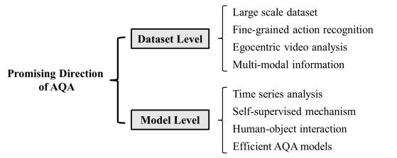

## 2. 相关工作

### 2.1 基于人体骨骼

#### Assessing the quality of actions（2014 ECCV）

#### Dynamical Regularity for Action Analysis（2015 BMVA）

#### Skeleton-Free Body Pose Estimation from Depth Images for Movement Analysis（2015 ICCVW）

#### A comparative study of pose representation and dynamics modelling for online motion quality assessment（2016 CVIU）

#### CogniLearn: A Deep Learning-based Interface for Cognitive Behavior Assessment（2017 IUI）

#### A-MAL: Automatic Motion Assessment Learning from Properly Performed Motions in 3D Skeleton Videos（2019 ICCVW）

#### Action Assessment by Joint Relation Graphs（2019 ICCV）

- **出发点**

  以往的作品主要关注整个场景，包括表演者的身体和背景，但**忽略了详细的关节互动**。这对于细粒度和准确的动作评估是不够的，因为每个关节的动作质量取决于其相邻关节。因此，我们建议根据关节关系学习详细的关节运动。我们建立了可训练的关节关系图，并在其上分析关节运动。我们提出了两个新的关节运动学习模块，即**关节共性模块**和**关节差异模块**。

  相邻（局部连接）关节的运动共性反映了某个身体部位的**一般运动**，而相邻关节之间的运动差异反映了**动作协调**。一个良好的动作必须有熟练的详细动作和良好的关节协调。

- **模型**

  为了建模关节运动之间的关系，我们提出了一种基于图的动作评估网络，其中图的节点对应于关节运动。我们定义了：

  **两个可学习的关系图：**空间关系图用于建模一个时间步内的关节关系，时间关系图用于建模两个即时时间步之间的关节关系。

  基于这两个图形，我们开发了**两个运动学习模块**，即关节共性模块和关节差异模块。关节通用性模块通过在空间图中聚合关节运动来提取特定时间步的身体部位动力学信息。关节差分模块通过将每个关节与其在空间图和时间图中的局部连接邻居进行比较来提取协调信息。

  输入视频被统一划分为**T个时间步**。我们的模型给出了每个时间步的评估结果。我们将整个场景和局部patch视频作为输入，在**关节周围裁剪局部patch**。我们提取了整个场景视频和局部补丁视频的特征。然后，提出的关节共性模块和关节差异模块在关系图上学习关节运动，给出四个学习特征。然后将学习到的特征反馈给回归模块。我们的模型给出了每个时间步的部分结果和整个视频的整体结果。 

  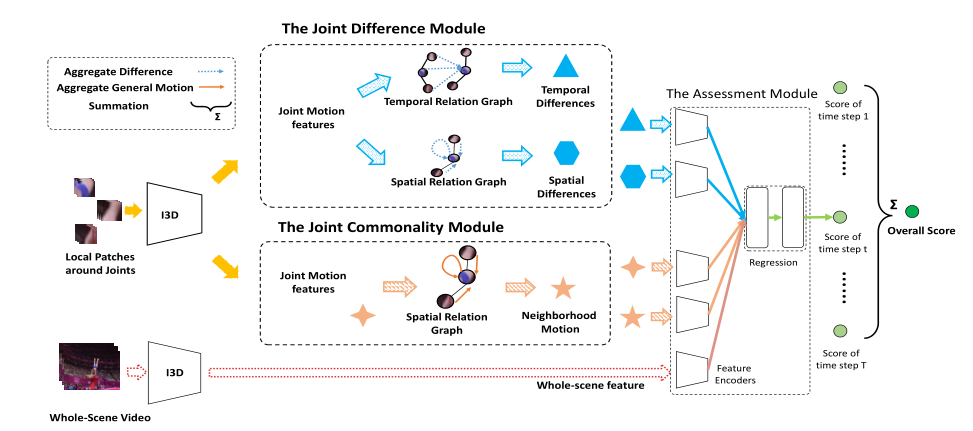

  - **预处理**

    使用基于**Mask-RCNN的姿势估计方法提取人体姿势和检测框**。我们利用Kinetics上的I3D预训练来提取RGB和opticalflow的联合特征。通过整体图像获得整个场景特征，通过关节周围裁剪局部面片获得关节运动特征。我**们将视频分成10段，每段中均匀地抽取16帧作为I3D的输入** 。

  - **The Joint Commonality Module**

    **空间关系图表示每个邻居在每个时间步长内对某个关节的运动有多大影响。**我们将空间关系图的相邻矩阵表示为$A_s∈ R^{J×J}$，其中J是骨架关节的总数。相邻矩阵中的元素As（i，j）表示第i个关节对第j个关节的影响程度**。As中的元素是非负的和可学习的**，但不相关的关节对的元素除外，它们被设置为零。训练开始时，可学习元素在[0，1]范围内随机初始化。

    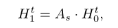

    c∈ {0，1}表示是否执行了图卷积。其中$H_t^0，H_t^1∈ R^{J×M}$。这里，J表示关节总数，M表示隐藏状态的特征尺寸。特别地，隐藏状态包含卷积前关节的运动特征，即$H_t^0=F_t$，其中$F_t∈ R^{J×M}$表示第t个时间步的关节运动特征。

    然后，**模块将所有节点的隐藏状态聚合为通用特征**，其中t是时间步长 。功能聚合是平均池，可以写为： 

    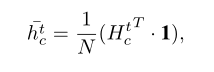

  - **The Joint Difference Module**

    我们将时间关系图的邻接矩阵表示为Ap，其中$A_p∈ R^{J×J}$。时间关系图还模拟相邻关节之间的关系，但跨越两个即时时间步。Ap（i，j）的元素表示对第i个关节的影响程度**（在前一时间步t− 1） 在第j个关节上有（目前为步骤t）**。与As类似，相邻矩阵Ap也是非负的且可学习的。训练开始时，可训练权重在[0，1]上随机初始化。 

    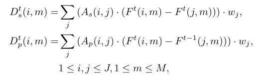

    邻域聚合中的权重表示为wj，wj是可学习的，表示联合j对其他人的影响。然后通过均值池融合每个关节的聚合运动差异，形成差异特征（$\overline d^t_p与\overline d^t_s$相同）：

    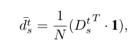

  - **Regression Module**

    输入的5个特征通过特征编码器（400x512 FC层+Relu）进行编码，然后由功能池层聚合，形成一个整体功能vt ：

    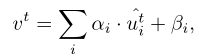

    最后，我们得到了两个完全连通层（第一个FC为512×128形状，具 	有ReLU激活，第二个FC为128×1形状的线性层）的评估结果。总体评估结果如下： 

    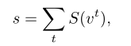

- **实验**

  我们的模型的结果与最先进的方法和基线进行了比较。我们的模型实现了最先进的性能，并且在六个动作中的每一个都优于基线。 （AQA-7）

  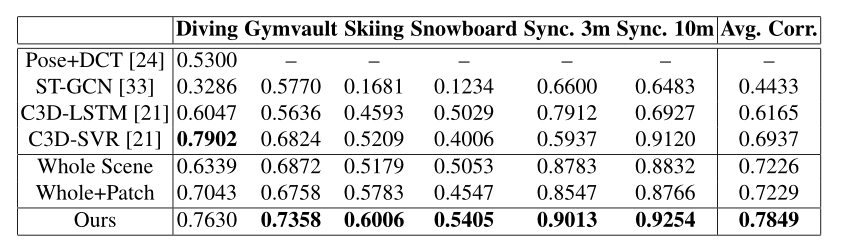

  **消融实验：**

  联合共性模块和联合差异模块都对模型性能有贡献。在融合学习特征的方法中，特征编码器和特征池层是必要的。

  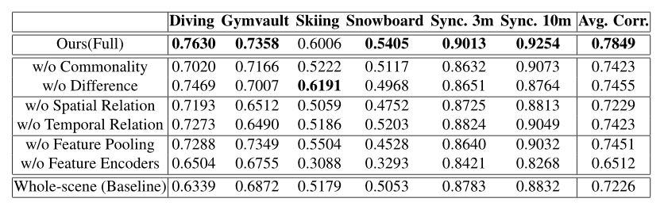

#### Efficient and Robust Skeleton-Based Quality Assessment and Abnormality Detection in Human Action Performance（2020 JBHI）

### 2.2 基于RGB视频流


#### Learning to Score Olympic Events（2017 CVPRW）

#### ScoringNet: Learning Key Fragment for Action Quality Assessment with Ranking Loss in Skilled Sports（2018 ACCV）

#### S3D: Stacking Segmental P3D for Action Quality Assessment（2018 ICIP）

#### End-To-End Learning for Action Quality Assessment（2018 PCM）

#### Action Quality Assessment Across Multiple Actions（WACV 2019）

- **出发点**

  **三个问题：**

  - 不同的行动之间是否有共同的行动质量要素？

  - 如果是这样的话，在各种行动中训练/预先训练一个模型会有帮助吗（而不是按照当前的方法训练一个特定的行动）？

  - 一个受过各种动作训练的模型能否衡量一个看不见的动作的质量？

  **三个实验：**

  在本文中，**新发布一个AQA数据集**，包含7个动作类型。主要设计了三个实验，以观察在行动质量评估（AQA）环境中知识转移是否可行。

  1. 检查是否有可能学习一个所有行动模型，如果有，比较我们提出的所有行动模型与行动特定模型的性能**（All-Action vs. Single-Action Models）**
  2. 评估所有动作模型如何量化看不见的行动类别的质量**（ Zero-Shot AQA）**
  3. 评估所有动作模型对新动作类的泛化 **（Fine-tuning to a Novel Action Class）**

- **AQA数据集**

  - **介绍**

    - 参考下文

  - **共同的动作质量元素**

    AQA-7运动有类似的动作元素，包括滑步和扭转（图1）。因此，行动的质量也以类似的方式进行评估。例如，在跳水和体操跳马中，裁判希望运动员在长矛姿势（执行质量方面）时双腿完全伸直，难度与扭转和空翻的次数成正比。同样，在滑雪和滑雪板大型空中项目中，难度与垂直和水平旋转的次数有关。在所有的运动项目中，都有一个完美落地的期望，最终得分会有很高的冲击力（一个飞溅或“撕裂”最小的项目就是跳水）。这些相似之处背后的原因是，在保持双腿伸直的同时，必须完成更多的翻筋斗、扭转或旋转（难度方面），并且在起跳到着陆的有限时间内，身体处于紧密的抱膝或长矛姿势（执行质量方面），这使其更难实现，因此，值得裁判多加分（相当于质量更高）。**最终得分是执行质量和难度的函数**。在某些情况下，如跳水，这将是结果函数，在另一种情况下，如Gymault，这将是总和，而其他动作（BigAir事件）可能使用更全面的组合方法。考虑到行动的相似性，人们相信，**了解一个行动中应该重视哪些方面有助于衡量另一个行动的质量。** 

- **模型**

  - 模型首先使用**C3D网络**提取特征，然后是一个**256维LSTM层**和一个**完全连接（FC）层**，输出最终AQA分数。

  - 视频以**16帧**的片段进行处理，以在FC-6层生成C3D特征，FC-6层连接到LSTM层，用于时间特征聚合。

  - C3D网络在训练期间保持冻结状态，因此仅调整LSTM和最终FC层参数。将预测得分与真实得分之间的欧氏距离作为要最小化的损失函数。

  - 这项工作的主要区别不是为每个动作建立一个单独的模型（我们称之为**特定动作或单个动作模型**），而是通过使用所有/多个动作的样本进行训练来学习单个模型（我们称我们的模型为**所有动作或多个动作模型**）。

    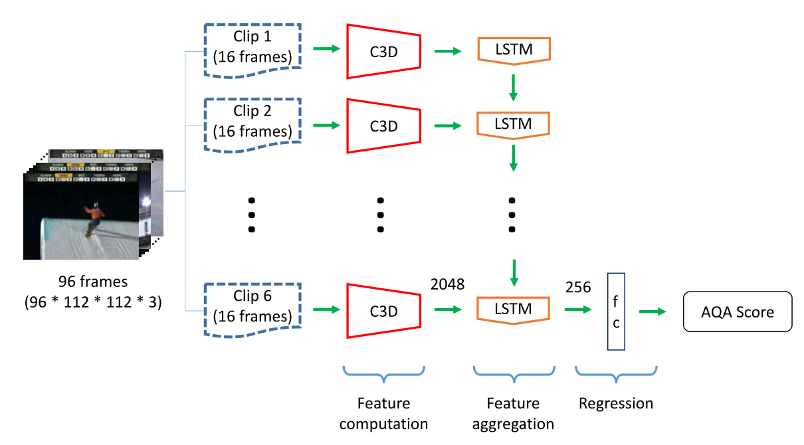

- **实验🎯**

  - **数据准备（标准化及数据增强）**

    由于**不同动作的得分范围不同**，我们将所有动作的**原始得分除以相应动作的训练标准差**。在测试时，我们将预测得分乘以相应操作的标准偏差，得到最终的判断值。

    实验只在六个动作类上进行，因为它们的长度很短。所有视频在需要时，通过对第一帧进行零填充，标准化为**103帧**的固定大小。**蹦床被排除在实验之外**，因为650帧的平均长度要长得多，并且由多个“技巧”组成该模型使用803个视频进行训练，并在其余303个视频上进行测试。

    在训练过程中，使用时间数据增强来获得同一视频样本的**六**个不同副本，其中**一个帧开始时间不同**（实际上是4818个训练样本）。 

  - **实现细节**

    C3D网络在UCF-101上预训练，预训练后，C3D被冻结并用作特征提取器。我们使用90个clips的批量大小（15个完整视频样本）。 

  - **实验一（All-Action vs. Single-Action Models）**

    **All-Action模型**的基线是**Single-Action C3D-LSTM**，因为两者使用相同的特征聚合方法（LSTM）和回归模块（FC层）。很明显，时空特征的使用（C3D网络、FC-6层激活）比pose+DCT有所改善。在六个动作中的五个动作中，提议的全动作模型优于单动作模型，但单板滑雪的成绩低于0.14。平均而言，所有动作模型都将Spearman的等级关联性能提高了**0.03**，而**无需更改网络，而是利用所有动作的数据样本。**

    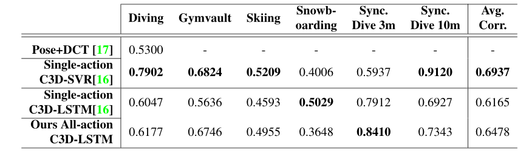

  - **实验二（ Zero-Shot AQA）**

    在**Multi-action**中，模型在五个动作类上进行训练，并在剩余的动作类上进行测试（按列）。在**单动作模型行**中，对角线条目显示同一动作的训练和测试结果。

    通过随机初始化，AQA系统无法以任何可靠性执行，如斯皮尔曼的秩相关接近零值所示。

    相比之下，全动作版本显示出一些正相关。我们认为，全动作模型性能更好的原因是，**使用多个动作可以提供良好的初始化，因为存在公共/共享的动作质量元素。**此外，使用“所有动作模型”还有一个优势，即**可以访问更多的培训视频进行学习**。尽管在四个动作中，我们的所有动作都比随机初始化效果更好，但有两个动作——体操跳马和滑雪——似乎提供的指示很弱。

    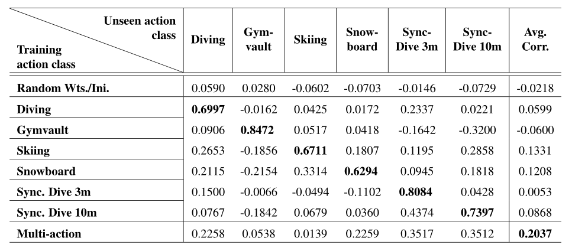

  - **实验三（Fine-tuning to a Novel Action Class）**

    所有动作模型都是对**五个动作进行预训练**，并对剩余的看不见的动作进行微调，数据点最少。对于数据丰富的动作（跳水、体操跳马、滑雪和滑雪板），使用{25、75、125}个训练样本，而对于数据贫乏的动作（同步跳水3米/10米），仅使用{15、25、35}个训练样本进行微调。对剩余的**50个样本进行所有动作的测试**。

    我们发现在18个案例中，有16个案例的所有动作都更好。请注意，即使在体操跳马和滑雪的情况下，似乎所有动作的初始化都很差（实验二中zero-shot AQA实验）

    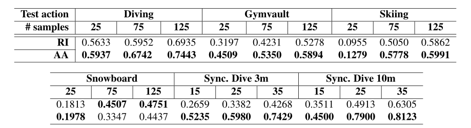

- **结论**

  这项工作表明，与许多其他计算机视觉任务（如对象分类或动作识别）一样，**动作质量评估（AQA）可以通过跨多个动作的样本训练共享模型，从知识转移/共享中获益。**我们在新引入的数据集AQA-7上实验证明了这一点。实验表明：

  1. 通过考虑多个动作，可以更好地利用有限的每动作数据来提高每动作性能（**更有效地利用数据**）
  2. **多动作预训练可以更好地初始化新动作**，暗示行动中质量概念的基本一致性（证明所有行动模型都比单一行动模型更具普遍性）。

#### Manipulation-Skill Assessment from Videos with Spatial Attention Network（2019 ICCVW）


#### What and How Well You Performed? A Multitask Learning Approach to Action Quality Assessment（2019 CVPR）

- **出发点**

  **是否可以通过对行动及其质量的描述来提高行动质量评估（AQA）任务的绩效？**当前的AQA和技能评估方法建议学习只服务于一项任务的特征——估计最终得分。在本文中，我们建议学习解释三个相关任务的时空特征——细粒度动作识别、注释生成和AQA分数估计。收集了一个新的**MTL-AQA数据集**（参考下文），这是迄今为止最大的数据集，由1412个潜水样本组成。

- **多任务AQA概念 **

  MTL是一种机器学习范式，其中一个模型可以满足多个任务。例如，将道路标志、道路和车辆识别在一起，而STL方法需要为每个对象类型建立单独的模型。**MTL任务的选择通常是这样的，即它们彼此相关，**并且它们的网络有一个共同的主体，分支成特定于任务的输出头。**总网络损失是单个任务损失的总和**（加权和）。当端到端优化后，网络能够在公共身体部分学习更丰富的表示，因为它必须能够服务/解释所有任务。通过使用与主任务互补的相关辅助任务，更丰富的表示往往有助于提高主任务的性能。

  总的来说，不仅仅是跳水，动作质量还取决于**执行了什么动作**以及**该动作执行得有多好**。这使得选择辅助任务变得自然：**详细的动作识别是对“什么”部分的回答**，而**注释是一种口头描述，包含动作执行的优缺点，是对“如何”部分的回答。**AQA可以看作是找到一个将输入视频映射到AQA分数的函数。Caruana将辅助任务的监督信号视为一种归纳偏差（假设）。归纳偏差可以被认为是在发现AQA函数时限制假设/搜索空间的约束。通过归纳偏差，MTL提供了比STL更好的泛化能力。

  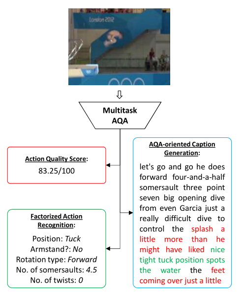

两个模型：

- **Averaging as aggregation (C3D-AVG)**

  **主干网络：**由**C3D网络**组成，直至第五个池层。将视频（96帧）分成小片段（16帧），然后聚合片段级表示以获得视频级描述。

  **聚合方案：**使用平均值作为线性组合。网络针对所有三项任务进行了端到端优化。平均层以上的C3D-AVG网络可被视为编码器，它将输入视频剪辑编码为表示，平均后（在特征空间中）将对应于运动员收集的总AQA点。后续层可以看作是单个任务的解码器。

  **特定于任务的头部：**对于动作识别和AQA任务，片段级pool-5特征按元素平均，以生成视频级表示。由于字幕是一项顺序到顺序的任务，因此在平均之前，各个片段级特征会输入到字幕分支（单个片段级特征在实践中比用于字幕的平均片段级特征工作得更好）。 

  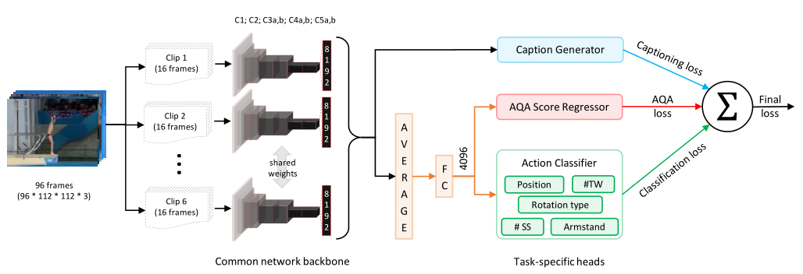

- **Multiscale Context Aggregation with Dilated Convolutions (MSCADC)**

  Nibali等人的研究表明，多尺度上下文聚合和扩展卷积（MSCADC）可以改善跳水分类。鉴于MSCADC在辅助任务上的强大性能，它被选为MTL。

  **主干网络：**MSCADC网络基于C3D网络，并结合了一些改进，如使用批量归一化，以提供更好的正则化，这在数据非常有限的AQA中是必需的。此外，从C3D的最后两个卷积组中删除池，而是使用2的膨胀率。该主干结构在所有MTL任务之间共享。

  **特定于任务的头部：**我们使用单独的输出头，头部由一个上下文网络和几个附加层组成。

  与C3D-AVG网络不同，我们**将整个动作降采样为仅16帧的短序列**（类似于关键动作快照），可以显著减少网络参数和内存的数量，而这些参数和内存可以用来提高空间分辨率。 

  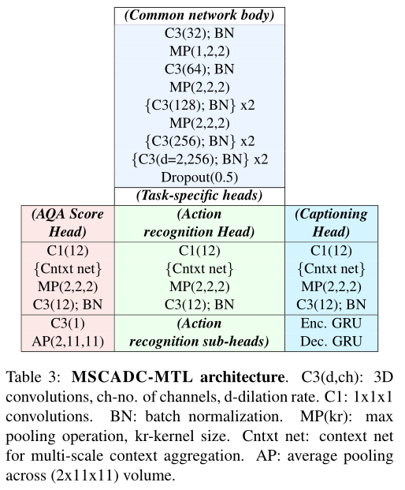

- **实现细节**

  在UCF101动作识别数据集上对公共网络主干进行预训练，批次大小设置为三个样本。

  其他特定于体系结构的实现细节如下：C3D-AVG：该模型通过171×128像素输入视频的**112×112**中心裁剪进行端到端训练。每个潜水样本的时间标准化长度为96帧。MSCADC：由于此体系结构不包含完全连接的层，并且所有视频都降采样到16帧，因此模型参数较少，允许使用更高分辨率的视频输入。帧的大小调整为640×360像素，并使用**180×180**中心裁剪。

- **实验**

  - **Single-task vs. Multi-task approach：**本实验首先考虑了STL方法对AQA任务的处理，然后测量了包含辅助任务的效果。下表总结了评估结果。我们观察到，对于这两个网络，**MTL方法的性能都优于STL方法**。（Cls-行为识别，Caps-评论生成。第一行显示STL结果，其余行显示MTL结果。 ）

    **C3D-AVG在STL和MTL方面都优于MSCADC**，而MSCADC的优势是速度快，内存需求比C3D-AVG低

    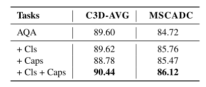

  - **本文的模型与现有的方法进行比较**：我们获得了数据集上所有现有方法的结果。C3D-SVR是中表现最好的方法，但似乎没有从增加的训练样本数量中获益。在之前工作中由于训练数据量不足，C3D-LSTM的表现比C3D-SVR差。而在扩展训练数据的情况下，表现确实优于C3D-SVR。我们的MSCADC-STL比大多数现有方法工作得更好，而**我们的C3D-AVG-STL比所有现有方法的性能更好。**

    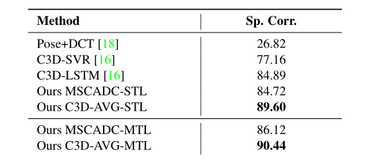

  - **Generalization provided by MTL：**为了确定MTL提供了更多的泛化，我们**使用更少的数据点来训练C3DAVG-STL和C3D-AVG-MTL模型。**我们看到，MTL始终优于STL，而且随着训练样本的减少，差距似乎也在扩大 。

    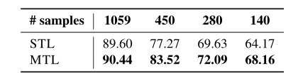

- **结论**

  **本文将多任务学习方法引入AQA，并表明MTL的性能优于STL，**因为它具有更好的泛化能力，这在AQA和技能评估中尤其重要，因为数据集很小。

#### The Pros and Cons: Rank-Aware Temporal Attention for Skill Determination in Long Videos（2019 CVPR）

#### A Deep Learning Framework for Assessing Physical Rehabilitation Exercises（2020 TNSRE）

#### USDL（2020 CVPR）

> Uncertainty-aware Score Distribution Learning for Action Quality Assessment

- **出发点**

  现有的大多数方法只是将AQA视为一个回归问题，以便直接预测行动得分。不幸的是，他们的表现确实有限。这种限制的根源在于，这种处理忽视了**行动分数标签的潜在模糊性**，这是AQA的关键问题之一。在实际中这种歧义是由**动作标签的生成方式引起的**。

  对于跳水比赛，当运动员以3.8的难度完成动作时，七名裁判给出的分数为{9.0、8.5、9.0、8.0、9.0、8.5、9.0}。剔除前两名和后两名得分后，最终得分计算为：sf最终=（9.0+9.0+8.5）×3.8=100.70。**这表明了不同的裁判所造成的最终分数固有的不确定性**。此外，**每个法官的主观评价也可能给最终得分带来不确定性。**除了跳水比赛外，体操跳马、花样滑雪等许多其他运动中也存在这种现象。复杂的分数不确定性使得准确的AQA非常困难。因此，需要设计一个鲁棒模型来处理AQA的不确定性。

- **解决思路**

  为了解决这个问题，我们提出了一种**不确定性感知分数分布学习（USDL）方法**，该方法利用**不同分数的分布作为监控信号**，而不是单个分数。采用的分数分布可以更好地描述AQA分数的概率，从而可以很好地处理上述不确定性问题。我们**基于广泛使用的高斯函数生成真实分数分布，其中的平均值设置为分数标签。**同时，将动作视频输入3D ConvNets，以生成其预测的分数分布。然后，我们优化了groundtruth得分分布和预测得分分布之间的**Kullback-Leibler散度**。

  此外，一旦细**粒度分数标签可用**（例如，一个动作的难度或来自不同评委的多个分数），我们进一步设计了一种**多路径不确定性感知分数分布学习（MUSDL）方法**，以充分探索最终分数的这些分离组件。在推理过程中，我们严格遵循博弈规则，将多个预测分数进行融合，得到最终分数。

  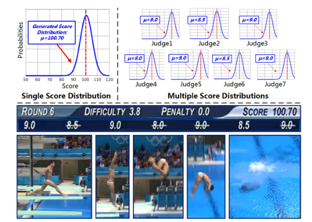

- **Score Distribution Generation**

  在训练阶段，给定与标记分数s相关的视频，首先生成一个高斯函数，其平均值为s，标准偏差为σ： 

  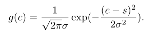

  这里σ是一个超参数，用作评估行动的不确定性水平。通过**将分数区间统一离散为一组分数**c=[c1，c2，…，cm]，使用一个向量来描述**每个分数的程度**，即gc=[g（c1），g（c2），…，g（cm）]。最终得分分布标签pc=[p（c1），p（c2），…，p（cm）]通过**规范化gc生成**，如下所示：  

  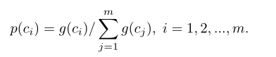

  在我们的实验中，我们对两个数据集中的最终总分和MTL-AQA中的七个评判分数进行了归一化。对于最终总分，由于是浮点数，我们将其归一化为： 

  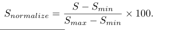

  此处Smax和Smin表示数据集中的最大和最小分数。对于MTL-AQA数据集中的评判分数，**由于这些分数本质上是离散的，但不是整数，因此我们通过将原始分数的值加倍来对其进行归一化，以获得整数。**

- **USDL**

  - 对于L帧的给定输入视频，我们利用滑动窗口将其分割为**N个**重叠片段，其中**每个片段包含M(16)个连续帧**。使用在Kinetics dataset上预训练的**I3D模型**作为特征提取器。它将包含16帧的动作序列作为输入，并输出**1024维的特征**。然后是三个完全连接的层（两个隐藏层FC（256，ReLU）和FC（128，ReLU），从而生成**N个特征**。
  - **完全连接层的权重在不同片段之间共享。**将获得的特征通过时间池进行融合，并通过softmax层生成预测分布。我们得到的最终预测得分为$s_{pre}=[s_{pre}（c_1），s_{pre}（c_2），…，s_{pre}（c_m）]$。 

  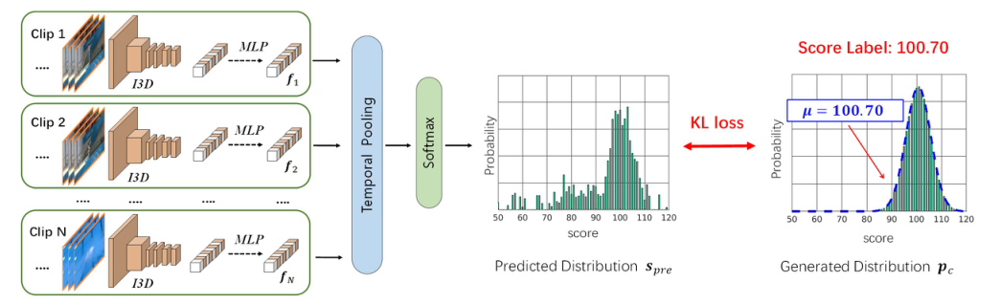

- **训练与预测**

  最后，将学习损失计算为spre和pc之间的**Kullback-Leibler（KL）散度：**

  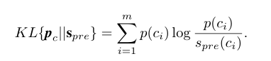

  从分数分布推断：在推断阶段，我们将输入的测试视频转发到我们的优化模型中，以获得相应的预测分数分布spre。通过选择**具有最大概率的分数**获得最终评估： 

  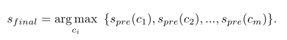

- **MUSDL**

  - 在训练阶段，我们**将K个评委的分数建模为不同的高斯分布**，并使用类似的策略来训练包含K个子网络的模型。在测试阶段，我们根据K预测分数和运动规则获得最终评估。 

    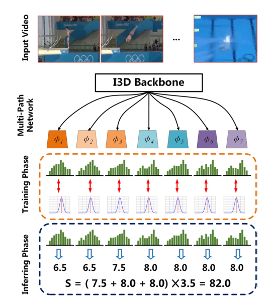

  - 如图，对于每一条路径，我们使用与我们的USDL方法相同的管道。**不同路径的完全连接层分别进行训练**，I3D主干在路径之间共享。在训练阶段，假设我们有一组分数来自K个不同的评委。首先按照递增的顺序对分数进行排序，以训练代表不同严格程度法官的子网络。给定一个训练视频，我们首先通过I3D主干将其馈送，并获得N个特征{f 1，f 2，…f N}。然后将特征馈入K个子网络，以获得K最终预测分布，如下所示： 

  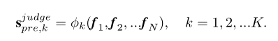

  - 然后，总培训损失计算为： 

    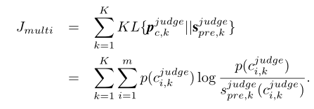

  - **基于规则的多径推理：**在推理阶段，我们通过我们的多径模型转发每个测试视频，并获得最终预测分数。根据跳水比赛的具体规则，我们可以得到最终分数： 

    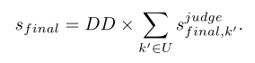

    这里，U表示{1，2，…，K}的子集（例如，跳水比赛将放弃给出前2名和最后2名分数的裁判），**DD表示将提前发布的输入动作视频的难度**。事实上，即使在推理期间没有提供DD，我们仍然可以通过在训练期间为模型引入侧网络分支来训练模型来预测DD。在推理过程中，预测的DD直接用于公式。🧲

- **实验**

  - **说明**

    **Regression：**大多数现有作品都采用了这种策略。我**们修改了USDL中最后一个fc层的维度，以生成一个预测分数**。在训练阶段，我们优化了预测分数和地面真实分数之间的L2损失。 

    **MUSDL and MUSDL∗：**提出的方法，难度DD分别使用了测试期间的真实值和预测值。

    **$USDL_{DD}:$**在训练阶段，我们使用了七位评委的分数。根据跳水的得分规则，前两名和后两名将被淘汰。我们将剩下的三个评判分数相加，得到一个新的分数标签，并应用USDL学习这个新标签。在推理阶段，我们将预测得分与难度DD的基本真理相乘，生成最终结果。**(分解难度与评委评分)**

  - **AQA-7**

    我们的方法的实验结果以及与其他AQA方法的比较。

    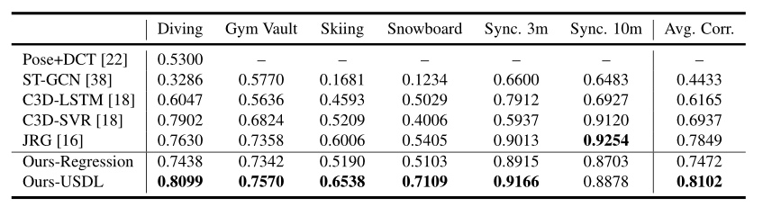

  - **MTL-AQA**

    现有技术和我们的MUSDL模型相比，竞争结果优于列出的所有其他方法。这些实验结果有力地说明了我们方法的有效性。

    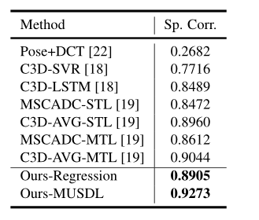

  - **消融实验**

    MUSDL*方法在之前的MUSDL方法的基础上添加了一个额外的分支，以执行多任务学习。

    从结果中，我们可以看到，$USDL_{DD}$的表现优于USDL，为1.7%，这表明DD是潜水得分评估的一个重要因素。我们认为，**使用DD可以提高性能的原因是它“解开”了问题，使主要管道在视频质量评估方面更加专业化。**MUSDL的性能比单路径方法高出0.4%，这表明细粒度评分可以进一步提高网络的性能 。

    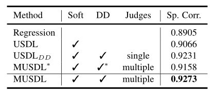


#### Hybrid Dynamic-static Context-aware Attention Network for Action Assessment in Long Videos（2020 ACM MM）

#### Learning to Score Figure Skating Sport Videos（2020 TCSVT）

#### An asymmetric modeling for action assessment（2020 ECCV）

#### TSA-Net: Tube Self-Attention Network for Action Quality Assessment（2021 ACM MM）

#### Auto-Encoding Score Distribution Regression for Action Quality Assessment（2021）

#### CoRe（2021 ICCV）

> Group-aware Contrastive Regression for Action Quality Assessment

- **出发点**

  - 由于视频之间的细微差异和分数的巨大差异，评估动作质量很有挑战性。**现有的大多数方法都是通过从单个视频中回归质量分数来解决这个问题**，这会受到视频间分数变化较大的影响。

  - 本文表明，视频之间的关系可以为训练和推理过程中更准确的动作质量评估提供重要线索。具体而言，我们**将动作质量评估问题重新表述为参考另一个具有共同属性（例如类别和难度）的视频回归相对分数**，而不是学习未参考的分数。

- **解决思路**

  - 我们提出了一个新的**对比回归（CoRe）框架**，通过成对比较来学习相对分数，该框架突出了视频之间的差异，并指导模型学习评估的关键提示。我们借鉴了对比学习的概念。对比学习旨在学习一个更好的表示空间，其中两个相似样本X，XA之间的距离dA被强制为较小，而不同样本X，XB之间的距离dB被鼓励为较大。因此，**表示空间中的距离已经可以反映两个样本之间的语义关系**（即，如果它们来自同一类别）。类似地，在AQA的背景下，我们的目标是学习一个模型，该模型可以将输入视频映射到分数空间，在该空间中，**动作质量之间的差异可以通过相对分数来衡量(∆A.∆B）** 。与以往直接预测分数的工作不同，我们建议回归输入视频和多个示例视频之间的相对分数作为参考。 

    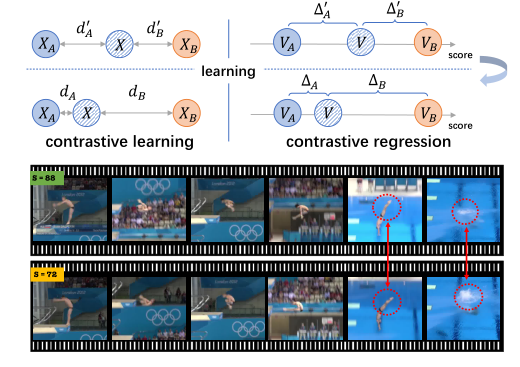

  - 作为更准确的分数预测的一步，我们设计了一个**组感知回归树（GART）**，将相对分数回归转换为两个更简单的子问题：（1）**从粗到细的分类**。我们首先将相对分数的范围划分为几个不重叠的区间（即组），然后使用二叉树通过逐步分类将相对分数分配给某个组；（2） **小间隔内的回归**。我们在相对得分所在的组内进行回归，并预测最终得分。
  - 作为另一个贡献，我们设计了一个新的度量，称为**相对L2距离（R-l2）**，通过考虑类内方差来更精确地衡量行动质量评估的绩效。
  - 为了验证我们的方法的有效性，为了证明CoRe的有效性，我们在三个主流AQA数据集上进行了广泛的实验，包括**AQA-7、MTL-AQA和JIGSAWS**。我们的方法大大优于以前的方法，并在所有三个基准上建立了新的最先进水平。 

- **模型**

  我们首先根据动作的类别和难度为每个输入视频采样一个示例视频。然后，我们将视频对馈送到共享的I3D主干中，以**提取时空特征，并将这两个特征与示例视频的参考分数相结合**。最后，我们将组合特征传递给**群体感知回归树**，并获得两个视频之间的**得分差异**。在推理过程中，可以通过平均多个不同样本的结果来计算最终得分。 

  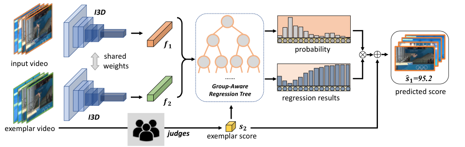

  - **特征提取**

    让$v_m$表示输入视频，$v_n$表示带有分数标签$s_n$的示例视频。我们的目标是回归输入视频和参考视频之间的分数差异 ，**回归问题**可以写为： 

    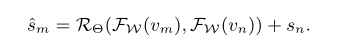

    为了使输入和示例具有可比性，我们倾向于**选择与输入视频共享某些属性（例如类别和难度）的视频作为示例**。形式上，给定一个输入视频vm和相应的示例vn，**首先使用I3D提取特征{fn，fm}，**然后将它们与示例sn的分数相加 ：

  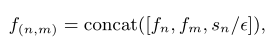

  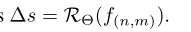

  - **Group-Aware Regression Tree**

    虽然对比回归框架可以预测相对得分∆s，**∆s通常取值范围很广（例如，对于潜水，∆s∈ [−30, 30])**。 因此，预测∆s直接还是很困难的。为此，我们设计了一个群体感知回归树（GART），以**分而治之**的方式解决这个问题。

    具体来说，首先划分∆s分为$2^{d-1}$非重叠间隔（即“组”）。然后，我们构造了一个具有d层，其中叶子代表$2^{d-1}$组，群体感知回归树的决策过程遵循从粗到细的方式：在第一层，我们判断输入视频是否比示例视频好或坏；在下面的几层中，我们逐渐对输入视频的好坏程度做出更准确的预测。一旦到达叶节点，我们就可以知道输入**视频应该分类到哪一组**，然后我们可以**在相应的小间隔内执行回归**。 

    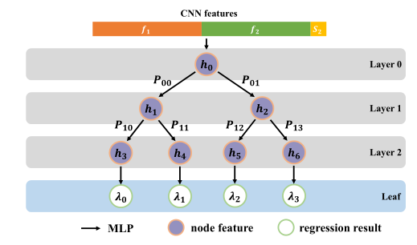

    我们采用二叉树结构来执行回归任务。首先，我们执行一个到f（n，m）的MLP，并将输出用作根节点特性的初始化。然后，我们以自顶向下的方式执行回归。每个节点将其父节点的输出特征作为输入，并与更新的特征一起生成二进制概率。**每个叶节点的概率可以通过将沿根路径的所有概率相乘来计算。**我们使用Sigmoid将每个叶节点的输出映射到[0，1]，这是对应组的预测得分差。 

    ```python
    # https://github.com/yuxumin/CoRe/blob/master/models/RegressTree.py
    class RegressTree(nn.Module):
        def __init__(self,in_channel,hidden_channel,depth):
            super(RegressTree, self).__init__()
            self.depth = depth
            self.num_leaf = 2**(depth-1)
    
            self.first_layer = nn.Sequential(
                nn.Linear(in_channel, hidden_channel),
                nn.ReLU(inplace=True)
            )
    
            self.feature_layers = nn.ModuleList([self.get_tree_layer(2**d, hidden_channel) for d in range(self.depth - 1)])
            self.clf_layers = nn.ModuleList([self.get_clf_layer(2**d, hidden_channel) for d in range(self.depth - 1)])
            self.reg_layer = nn.Conv1d(self.num_leaf * hidden_channel, self.num_leaf, 1, groups=self.num_leaf)
        @staticmethod
        def get_tree_layer(num_node_in, hidden_channel=256):
            return nn.Sequential(
                nn.Conv1d(num_node_in * hidden_channel, 
                          num_node_in * 2 * hidden_channel,
                          1, groups=num_node_in),
                nn.ReLU(inplace=True)
            )
        @staticmethod
        def get_clf_layer(num_node_in, hidden_channel=256):
            return nn.Conv1d(num_node_in * hidden_channel, 
                             num_node_in * 2, 
                             1, groups=num_node_in)
    
        def forward(self, input_feature):
            out_prob = []
            x = self.first_layer(input_feature)
            bs = x.size(0)
            x = x.unsqueeze(-1)
            for i in range(self.depth - 1):
                prob = self.clf_layers[i](x).squeeze(-1)
                x = self.feature_layers[i](x)
                # print(prob.shape,x.shape)d
                if len(out_prob) > 0:
                    prob = F.log_softmax(prob.view(bs, -1, 2), dim=-1)
                    pre_prob = out_prob[-1].view(bs, -1, 1).expand(bs, -1, 2).contiguous()
                    prob = pre_prob + prob
                    out_prob.append(prob)
                else:
                    out_prob.append(F.log_softmax(prob.view(bs, -1, 2), dim=-1))  # 2 branch only
            delta = self.reg_layer(x).squeeze(-1)
            # leaf_prob = torch.exp(out_prob[-1].view(bs, -1))
            # assert delta.size() == leaf_prob.size()
            # final_delta = torch.sum(leaf_prob * delta, dim=1)
            return out_prob, delta
    ```

    - **划分策略**

      定义每个组的边界。首先，我们收集所有可能的训练视频对的得分差异列表δ=[δ1，…，δT]。然后，我们按照升序对列表进行排序，以获得δ∗ = [δ∗1.δ∗T]。给定**组数R**，分区算法给出每个区间I R=（ζrleft，ζrright）的界限，如下所示： 

      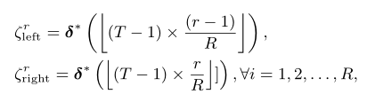

      分区策略非常重要。如果我们简单地将整个范围统一划分为多个组，那么训练集中得分差异位于某个组的视频对可能是不平衡的。不同划分策略下训练集得分差异的分布。（a） 统一分区。我们可以观察到不同群体之间的频率差异很大。（b） 方程式中提出的分组策略。每组的训练对是平衡的。 

      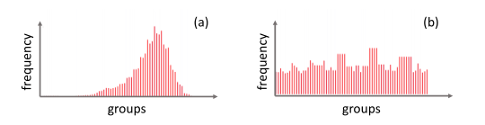

    - **训练**

      我们将GART的深度设置为d=5，节点特征维度设置为256

      **输入对的真值得分差δ**在第i组，即δ∈ （ζileft，ζiright）。对于分类标签{lr}和回归标签{σr}的训练数据中的每个视频对，分类任务和回归任务的目标函数可以写成： 

      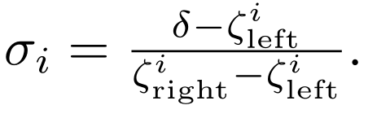

      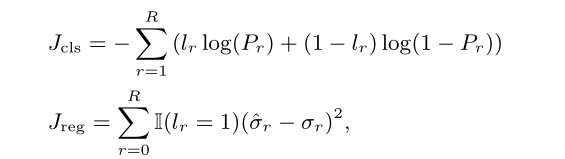

      其中{Pr}和{$\overline σ_r$}是预测的叶概率和回归结果。视频对的最终目标函数是： 

      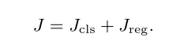

    - **预测**

      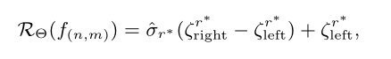

      此处**r∗ 是概率最高的组**。在我们的实现中，我们还采用了多样本投票策略。给定一个输入视频vtest，我们从训练数据中选择**M个样本**，使用这些M个不同的样本{vmtrain}Mm=1构建M对，其得分为{strain}Mm=1。多示例投票的过程可以总结为： 

      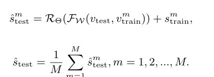

- **实验**

  - **AQA-7**

    本文模型在在AQA-7的几乎所有类别上都取得了最好的结果。

    

  - **回归树深度的影响 与 投票样本数量的影响 **

    （Diving class of AQA-7 dataset）

    当深度为**5和6**时，我们的模型性能更好，其中组的总数为32和64。

    随着M的增加，性能变得更好，方差更低。当M超过**10**时，Sp.Corr.的改善不太显著。

  

  - **MTL-AQA**

    表2显示了现有方法和我们的方法在MTL-AQA数据集上的性能。由于MTL-AQA中的潜水动作可以使用难度（DD）注释，我们还验证了**DD对该数据集的影响**。

    **使用DD标签（动作难度）训练效果变化原因推测：**一个是我们可以选择更合适的样本，另一个是我们的方法可以从难度中挖掘更多关于动作的信息。 

    

  - **消融实验**

    通过比较I3D+MLP和I3D+GART，我们可以看到，当使用我们的组感知回归树替换MLP时，在Spearman的秩度量和R-'2度量下，性能分别提高了0.0022和0.028，这证明了GART设计的有效性。当使用我们提出的核心框架替换I3D基线时，性能得到进一步提高。**以上结果证明了我们方法的两个组成部分的有效性。** 

    

  - **样例展示**

    基于输入和样本之间的比较，回归树从粗到细确定相对分数。回归树的第一层尝试确定哪个视频更好，下面的层尝试使预测更准确。图中的第一种情况显**示输入和示例之间的差异较大时的行为**，第二种情况**显示差异较小时的行为**。每对示例和输入视频具有相同的难度（DD）。在这两种情况下，我们的模型都能给出令人满意的预测。 

    

  - **可解释性探讨**

    为了进一步证明我们的方法的有效性，我们在MTL-AQA上使用**Grad CAM**可视化了基线模型（I3D+MLP）和我们的最佳模型（CoRe+GART），我们观察到，我们的方法可以聚焦于某些区域（手、身体等），这表明我们的对比回归框架可以减轻背景造成的影响，并更加关注区分部分。 

    

#### Improving Action Quality Assessment using Weighted Aggregation（2022 IbPRIA）

#### FineDiving: A Fine-grained Dataset for Procedure-aware Action Quality Assessment（2022 CVPR）

- **跳水动作解释**

  > [跳水的动作代码代表什么含义？ - 知乎 (zhihu.com)](https://www.zhihu.com/question/33632730)

  

#### Domain Knowledge-Informed Self-Supervised Representations for Workout Form Assessment（2022）


## 3. 数据集

#### 概述

- **分类**

  主要有运动、医疗、日常生活三个场景


- **相关工作以及对应数据集与评价指标**


#### 3.1 AQA-7

> Action Quality Assessment Across Multiple Actions（WACV 2019）
>
> http://rtis.oit.unlv.edu/datasets.html

- **介绍**

  AQA-7数据集共包含来自**7个运动项目**的**1189个视频**：370个来自单人跳水-10米跳台，176个来自体操跳马，175个来自大型空中滑雪，206个来自大型空中滑雪板，88个来自同步跳水-3米跳板，91个来自同步跳水-10米跳台，83个来自蹦床。遵循了提出该数据集的论文中的设置，排除了蹦床类，因为蹦床类的视频比其他类别的视频长得多。共有803个训练片段和303个测试片段。**得分一般由多个因素决定：动作难度、执行情况等 。**


- **该数据集上相关工作**


- **数据样本**

  

#### 3.2 MTL-AQA

> What and How Well You Performed? A Multitask Learning Approach to Action Quality Assessment（2019 CVPR）
>
> http://rtis.oit.unlv.edu/datasets.html

- **介绍**

  MTL-AQA数据集是**目前AQA最大的数据集**。MTL-AQA中有**1412个细粒度样本**，来自16个不同的events，具有不同的视图。该数据集涵盖了个人和同步潜水员、男女运动员、3米跳板和10米跳台设置的项目。在该数据集中，提供了不同类型的注释，以支持对不同任务的研究，包括**行动质量评估、行动识别和评论生成**。此外，七位评委的原始分数注释和难度（DD）可用于每个动作。按照提出该数据集的论文中建议的评估协议，将数据集分为**1059个大小的训练集和353个大小的测试集**。 

  

  动作识别包括**五个细粒度的跳水子识别任务**：识别位置和旋转类型，检测臂架，计算翻腾和扭转。

  

- **该数据集上相关工作**

  （人类专家水平96%）


- **数据样本**

  

#### 3.3 FineDiving

> FineDiving: A Fine-grained Dataset for Procedure-aware Action Quality Assessment（2022 CVPR）

- **介绍**

- **该数据集上相关工作**

  

- **数据样本**

#### 3.4 Squat Dataset

> Temporal Distance Matrices for Squat Classification（2019 CVPRW）

- **介绍**

  ==分类、基于骨骼==

  提供了四个视频数据集，用于分类好的蹲姿和不同的坏蹲姿：单个个体、多个个体、背景变化和YouTube数据集。如下总结了四者之间的差异。 

  

  **Single Individual Dataset：**每个标签的视频数量，分为测试、培训和验证子集。 

  

- **数据样本**

  **

#### 3.5 Fitness-AQA（未公开）

> Domain Knowledge-Informed Self-Supervised Representations for Workout Form Assessment（2022）

- **介绍**

  

## 4. 评价指标

#### 4.1 Spearman's rank correlation coefficient

斯皮尔曼排序相关系数相关介绍：[斯皮尔曼等级相关系数Spearman's rank correlation coefficient - 知乎 (zhihu.com)](https://zhuanlan.zhihu.com/p/339079547)


**p和q**分别表示真实和预测得分序列的排名。**ρ**取值范围为**[-1,1]**，越大效果越好。**Fisher’s z-value**被用于去衡量多个行为的平均效果。 

**Fisher transformation**

> [费雪变换_百度百科 (baidu.com)](https://baike.baidu.com/item/费雪变换/23156580)


平均后再逆变换：


#### 4.2  relative L2-distance (R-l2)

> Group-aware Contrastive Regression for Action Quality Assessment（2021 ICCV）


其中$s_k$和$ˆs_k$分别表示第k个样本的地面真值得分和预测。我们使用$R-l_2$代替传统的L2距离，**因为不同的动作有不同的得分间隔**。比较和平均不同类别动作之间的距离是毫无意义和令人困惑的。$R-l_2$与斯皮尔曼的相关性不同：斯皮尔曼的相关性更关注预测得分的排序，而$R-l_2$关注的是数值。 


