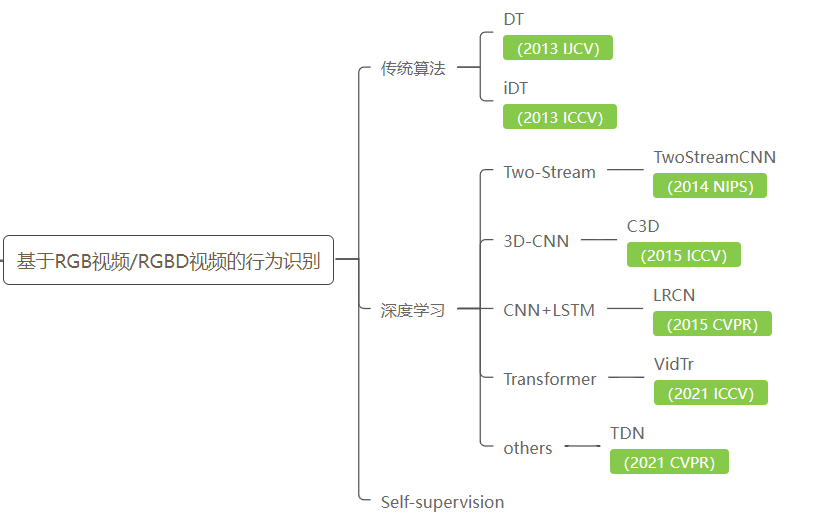
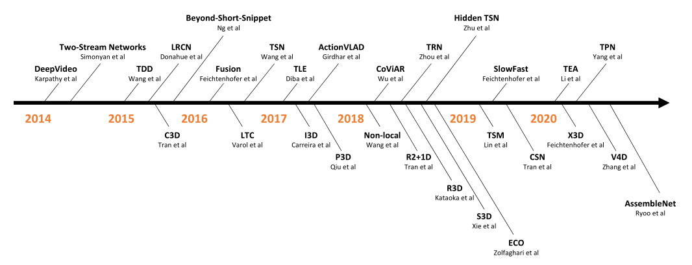
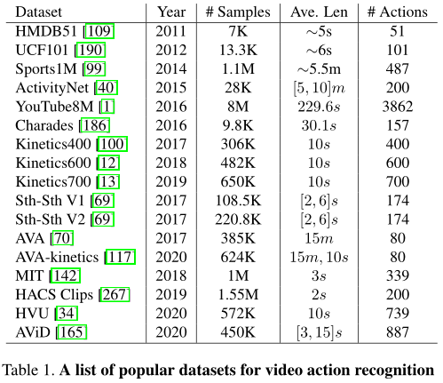
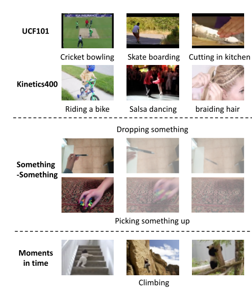

# 基于RGB视频的行为识别

## 1. 综述

**行为识别Action Recognition**是指对视频中人的行为行为进行识别，即读懂视频。

- 类型划分：
  - **Hand gesture**：集中于处理视频片段中单人的手势
  - **Action**：短时间的行为行为，场景往往是短视频片段的单人行为，比如Throw，catch，clap等
  - **Activity**：持续时间较长的行为，场景往往是较长视频中的单人或多人行为

- 任务划分：
  
  - **Classification**：给定预先裁剪好的视频片段，预测其所属的行为类别✨
  - **Detection：**视频是未经过裁剪的，需要先进行人的检测where和行为定位（分析行为的始末时间）when，再进行行为的分类what。（行为检测）
  
- 解读：

  [一文了解通用行为识别ActionRecognition：了解及分类 - 知乎 (zhihu.com)](https://zhuanlan.zhihu.com/p/103566134)

- 框架：

  [open-mmlab/mmaction2: OpenMMLab's Next Generation Video Understanding Toolbox and Benchmark (github.com)](https://github.com/open-mmlab/mmaction2)

- 3D-Conv与CNN+LSTM算法参考代码（PyTorch）

  [MRzzm/action-recognition-models-pytorch: The models of action recognition with pytorch (github.com)](https://github.com/MRzzm/action-recognition-models-pytorch)

- 基于RGB-D的行为识别综述

  [基于RGB-D的深度学习人体运动识别：|调查深爱 (deepai.org)](https://deepai.org/publication/rgb-d-based-human-motion-recognition-with-deep-learning-a-survey)
  
- 深度学习分类不绝对，涉及到融合模型🍳

  

### 1.1 A Comprehensive Study of Deep Video Action Recognition（2020 ArXiv）

#### 行为识别模型在深度学习方向的三种趋势：

1. 第一种趋势始于关于**双流网络**的开创性论文，它增加了第二条路径，通过在光流上训练卷积神经网络来学习视频中的时间信息。它的巨大成功激发了大量后续论文。
2. 第二个趋势是使用**3D卷积**核对视频时间信息建模。
3. 第三种趋势**侧重于计算效率**，以扩展到更大的数据集，以便在实际应用中采用。

- 介绍17种数据集，部分总结在**5.** 

#### 在开发有效的视频行为识别算法方面有几个主要挑战:

- ##### 在数据集方面：

  - 首先，定义用于训练行为识别模型的标签空间非常重要。这是因为**人类行为通常是复合概念**，这些概念的层次结构没有很好的定义。
  - 其次，**为行为识别添加视频注释是一项艰巨的任务**（例如，需要观看所有视频帧），而且模棱两可。（例如，很难确定行动的确切开始和结束）。
  - 第三，一些流行的基准数据集（如Kinetics系列）只发布供用户下载的视频链接，而不是实际的视频，这导致了在不同数据上评估方法的情况。在方法之间进行公平的比较并获得见解是不可能的。

- ##### 在建模方面：

  - 首先，**捕捉人类行为的视频具有强烈的类内和类间差异**。人们可以在不同的视角下以不同的速度执行相同的行为。此外，有些行为有着相似的行为模式，很难区分。
  - 其次，识别人类行为需要**同时理解短期特定行为的运动信息和长期时间信息。**我们可能需要一个的模型来处理不同的视角（perspectives），而不是使用单一的卷积神经网络。
  - 第三，**训练和推理的计算成本都很高**，阻碍了行为识别模型的开发和部署。

#### **深度学习在视频行为识别中的应用** 🐱‍🏍

这一部分回顾了2014年至2020基于深度学习的视频行为识别方法，并介绍了相关的早期工作。

#####  1. From hand-crafted features to CNNs

1. **IDT：**手工制作的特征，尤其是改进的密集轨迹，由于其高精度和良好的鲁棒性，在2015年之前主导了视频理解文献。

   > Action Recognition with Improved Trajectories（2013 ICCV）

2. **DeepVideo：**深度学习在行为识别开创性工作提出在每个视频帧上单独使用一个2D CNN模型，效果较差。

   > Large-Scale Video Classification with Convolutional Neural Networks（2014 CVPR）

##### 2. Two-stream networks

**TwoStreamCNN：**，包括空间流和时间流，空间流以原始视频帧作为输入来捕获视觉外观信息。时间流以一堆光流图像作为输入，以捕获视频帧之间的运动信息。**基于CNN的方法首次实现了与之前最好的手工制作功能IDT类似的性能。**

自此出现了许多关于twostream网络的后续论文，极大地推动了视频行为识别的发展。将它们分为几个类别： 

- **Using deeper network architectures**

  双流网络使用了相对较浅的网络架构。因此，**对双流网络的自然扩展需要使用更深的网络。**

  1. **DeepTwoStream ：**引入了一系列良好的实践，包括跨模态初始化、同步批处理规范化、角点裁剪和多尺度裁剪数据增强、大Dropout率等，以防止更深层次的网络过度拟合。通过这些良好的实践，能够使用VGG16模型来训练双流网络，在UCF101上的表现大大优于常规双流。

     > Towards Good Practices for Very Deep Two-Stream ConvNets（2015 arXiv preprint）

  2. **TSN：**时间段网络对网络体系结构进行了彻底的研究，如VGG16、ResNet、Inception，并证明更深的网络通常可以实现更高的视频行为识别准确率。

     > Temporal Segment Networks: Towards Good Practices for Deep Action Recognition（2016 ECCV）

- **Two-stream fusion**

  由于双流网络中有两个流，**早期融合有助于两个流学习更丰富的功能，**并比后期融合提高性能。

  1. **TwostreamFusion：**研究早期融合范例的几篇论文中的第一篇，包括如何执行空间融合（例如，使用sum、max、双线性、卷积和级联等运算符），在何处融合网络（例如，早期交互发生的网络层），以及如何执行时间融合（例如，在网络的后期使用2D或3D卷积融合）。表明，早期融合有助于两个流学习更丰富的功能，并比后期融合提高性能。

     > Convolutional Two-Stream Network Fusion for Video Action Recognition（2016 CVPR）

  2. **ST-ResNet + IDT：**通过引入两条流之间的剩余连接，将ResNet推广到了时空域。

     > Spatiotemporal Residual Networks for Video Action Recognition（2016 NeurIPS）

  3. **STM Network+IDT：**进一步提出了一种用于剩余网络的乘法选通函数，以更好地学习时空特征。

     > Spatiotemporal Multiplier Networks for Video Action Recognition（2017 CVPR）

  4. **STPN：**采用时空金字塔来执行两个流之间的分层早期融合。 

     > Spatiotemporal Pyramid Network for Video Action Recognition（2017 CVPR）

- **Recurrent neural networks**

  由于视频本质上是一个时间序列，研究人员探索了用于视频内部时间建模的递归神经网络（RNN），特别是长短时记忆（LSTM）的使用。

  1. **LRCN和Beyond Short Snippets：**是在双流网络环境下使用LSTM进行视频行为识别的几篇论文中的第一篇。他们将CNN的特征图作为深层LSTM网络的输入，并将帧级CNN特征聚合为视频级预测。请注意，它们分别在两个流上使用LSTM，最终结果仍然是通过后期融合获得的。

  2. **分层多粒度LSTM网络：**根据CNN-LSTM框架，提出了几种变体，分层多粒度LSTM网络是其中一种。（还有双向LSTM、CNN-LSTM融合）

     >  Action Recognition by Learning Deep MultiGranular Spatio-Temporal Video Representation（2016 ICMR）

  3. **VideoLSTM：**包括基于相关性的空间注意机制和基于轻量级运动的注意机制。不仅展示了改进的行为识别结果，还展示了如何通过仅依赖行为类标签将学习到的注意力用于行为定位。

     > VideoLSTM Convolves, Attends and Flows for Action Recognition（2018 CVIU）

  4. **Lattice LSTM：**通过学习单个空间位置的记忆单元的独立隐态转换来扩展LSTM，因此它可以精确地模拟长期和复杂的运动。

     > Lattice Long Short-Term Memory for Human Action Recognition（2017 ICCV）

  5. **ShuttleNet：**是一项并行工作，它考虑RNN中的前馈和反馈连接，以了解长期依赖关系。

     > Learning Long-Term Dependencies for Action Recognition With a Biologically-Inspired Deep Network（2017 ICCV）

  6. **FAST-GRU：**从昂贵的主干网和廉价的主干网聚合剪辑级功能。该策略降低了冗余片段的处理成本，从而加快了推理速度。

- **Segment-based methods**

  由于光流，双流网络能够推断帧之间的短期运动信息。然而，它们仍然无法捕获远程时间信息。

  1. **TSN：**能够建模长期时间结构，因为模型可以看到整个视频中的内容。此外，这种稀疏采样策略降低了长视频序列的训练成本，但保留了相关信息。

  2. **DVOF：**深度局部视频特征建议将在局部输入上训练的深度网络作为特征提取器，并训练另一个编码函数，以将全局特征映射到全局标签。

     > Deep Local Video Feature for Action Recognition（2017 CVPRW）

  3. **TLE：**时间线性编码网络与DVOF同时出现，但编码层被嵌入网络中，因此整个管道可以进行端到端的训练。

     > Deep Temporal Linear Encoding Networks（2017 CVPR）

  4. **VLAD3和ActionVLAD：**他们将NetVLAD层扩展到视频域，以执行视频级编码，而不是使用紧凑双线性编码。

     > VLAD3: Encoding Dynamics of Deep Features for Action Recognition（2016 CVPR）
     >
     > ActionVLAD: Learning SpatioTemporal Aggregation for Action Classification（2017 CVPR）

  5. **TRN：**为了提高TSN的时间推理能力，时间关系网络TRN来学习和推理多时间尺度下视频帧之间的时间依赖关系。

     > Temporal Relational Reasoning in Videos（2018 ECCV）

  6. **TSM：**最新最先进的高效模型，也是基于分段的，将在后续讨论。 

- **Multi-stream networks**

  从本质上讲，多流网络是一种多模态学习方法，它使用不同的线索作为输入信号来帮助视频行为识别。

  

##### 3. The rise of 3D CNNs

预计算光流计算量大，存储要求高，不利于大规模训练或实时部署。从概念上讲，理解视频的一种简单方法是将其视为具有两个空间维度和一个时间维度的3D张量。因此，这导致使用3D CNN作为处理单元来模拟视频中的时间信息。

1. **开创性工作：**使用3D CNN进行行为识别的开创性工作。尽管令人振奋，但该网络的深度还不足以展示其潜力。

   > 3D Convolutional Neural Networks for Human Action Recognition（2012 PAMI）

1. **C3D：**扩展到一个更深层的3D网络，遵循模块化设计，可以将其视为VGG16网络的3D版本。它在标准基准测试中的性能并不令人满意，但显示出**强大的泛化能力**，可以用作各种视频任务的通用特征提取器。然而，3D网络很难优化。为了更好地训练3D卷积滤波器，人们需要一个具有不同视频内容和行为类别的大规模数据集。幸运的是，有一个数据集Sports1M，它足够大，可以支持深度3D网络的训练。然而，**C3D的训练需要数周时间才能完成。**尽管C3D很受欢迎，但大多数用户只是将其用作不同用例的功能提取器，而不是修改/微调网络。这也是基于2D CNN的双流网络在2014年至2017年间主导视频行为识别领域的部分原因。 

2. **I3D：**将视频剪辑作为输入，并通过堆叠的3D卷积层将其转发。视频剪辑是一系列视频帧，通常使用16或32帧。I3D的主要贡献是：1）它采用了成熟的图像分类体系结构，用于3D CNN；2） 对于模型权重，它采用了为初始化光流网络而开发的方法，将ImageNet预先训练的2D模型权重膨胀到3D模型中的对应权重。因此，**I3D绕过了3D CNN必须从头开始训练的困境。**通过对一个新的大规模数据集Kinetics400进行预训练，I3D在UCF101和HMDB51上的得分分别为95.6%和74.8%。I3D终结了不同方法在UCF101和HMDB512等小型数据集上报告数字的时代。**（最终的I3D模型是3D CNN和twostream网络的组合。）**

   > Quo Vadis, Action Recognition? A New Model and the Kinetics Dataset（2017 CVPR）

**3D CNN并没有取代两个流网络，它们也不是相互排斥的。**他们只是用不同的方法来模拟视频中的时间关系。

- **Mapping from 2D to 3D CNNs**

  2D CNN享受着大规模图像数据集（如ImageNet和Places205）带来的预训练的好处，这些数据集甚至无法与当今最大的视频数据集相匹配。大量的工作致力于寻找更准确、更通用的2D CNN架构并借鉴优点用于3D-CNN.

  1. **ResNet3D：**直接采用2D ResNet，并用3D内核替换所有2D卷积滤波器。他们相信，通过将深度3D CNN与大规模数据集结合使用，可以利用ImageNet上2D CNN的成功。

     > Can Spatiotemporal 3D CNNs Retrace the History of 2D CNNs and ImageNet? （2018 CVPR）

  2. **MFNet：**受ResNeXt的启发，提出了一种多光纤结构，将复杂的神经网络分割成一个轻量级网络（光纤）的集合，以促进光纤之间的信息流动，同时降低计算成本。

     > Multi-Fiber Networks for Video Recognition（2018 ECCV）

  3. **STCNet：**受SENet的启发，提出在3D块内集成信道信息，以捕获整个网络中的空间信道和时间信道相关信息。 

     > Spatio-Temporal Channel Correlation Networks for Action Classification（2018 ECCV）

- **Unifying 2D and 3D CNNs**

  主要是为了降低3D网络训练的复杂性

  1. **P3D和R2+1D：**探索了3D分解的概念。具体来说，一个3D内核（例如3×3×3）可以分解为两个独立的操作，一个2D空间卷积（例如1×3×3）和一个1D时间卷积（例如3×1×1）。P3D和R2+1D之间的区别在于它们如何安排两个因式分解操作，以及如何形成每个剩余块。

  2. **TrajectoryCNN：**遵循这一思想，但对时间分量使用可变形卷积来更好地处理运动。

  3. **MiCT：**简化3D CNN的另一种方法是在单个网络中**混合2D和3D卷积**，MiCTNet集成了2D和3D CNN，以生成更深入、信息更丰富的特征地图，同时降低了每一轮时空融合的训练复杂性。

     > MiCT: Mixed 3D/2D Convolutional Tube for Human Action Recognition（2018 CVPR）

  4. **ARTNet：**通过使用新的构建块引入了一个外观和关系网络。构建块由使用二维CNN的空间分支和使用三维CNN的关系分支组成。

     > Appearance-and-Relation Networks for Video Classification（2018 CVPR）

  5. **S3D：**结合了上述方法的优点。首先用二维核函数代替网络底部的三维卷积，发现这种顶重网络具有更高的识别精度。然后S3D将剩余的3D核分解为P3D和R2+1D，以进一步减小模型大小和训练复杂度。

     > Rethinking Spatiotemporal Feature Learning: Speed-Accuracy Trade-offs in Video Classification（2018 ECCV）

  6. **ECO：**也采用了这样一个重上加重的网络来实现在线视频理解。 

     > ECO: Efficient Convolutional Network for Online Video Understanding（2018 ECCV）

- **Long-range temporal modeling**

  在3D CNN中，可以通过叠加多个短时间卷积（例如，3×3×3滤波器）来实现远程时间连接。然而，有用的时间信息可能会在深度网络的后期丢失，尤其是对于相距较远的帧。为了进行长期时间建模，

  1. **LTC：**引入并评估了大量视频帧上的长期时间卷积。然而，由于GPU内存的限制，他们不得不牺牲输入分辨率来使用更多的帧。

     > Longterm Temporal Convolutions for Action Recognition（2018 PAMI）

  2. **T3D：**采用了一种紧密连接的结构，以尽可能完整地保留原始时间信息，从而进行最终预测。

     > Temporal 3D ConvNets: New Architecture and Transfer Learning for Video Classification（2017 arXiv preprint）

  3. **Non-Local：**引入了一种新的构造块，“非局部”是一种类似于“自我注意”的通用操作，它可以以即插即用的方式用于许多计算机视觉任务。他们在随后的残差块之后使用**时空非局部模块来捕获空间和时间域中的长期依赖性，**并在没有钟声和哨声的情况下实现了基线性能的改进。

     > Non-Local Neural Networks（2018 CVPR）

  4. **LFB：**提出了一种特征库表示法，将整个视频的信息嵌入到一个存储单元中，以进行上下文感知预测。

     > Long-Term Feature Banks for Detailed Video Understanding（2019 CVPR）

  5. **V4D：**提出了视频级4D CNN，用4D卷积来模拟长距离时空表示的演化。 

     > V4D:4D Convolutional Neural Networks for Video-level Representation Learning（2020 ICLR）

- **Enhancing 3D efficiency**

  为了进一步提高3D CNN的效率（即在GFLOP、模型参数和延迟方面），3D CNN的许多变体开始出现。受高效2D网络发展的推动，研究人员开始采用通道可分离卷积，并将其扩展到视频分类[111,203]。

  1. **CSN：**通过分离通道相互作用和时空相互作用来分解3D卷积是一种很好的做法，并且能够获得最先进的性能，同时比以前的最佳方法快2到3倍。

     > Video Classification With Channel-Separated Convolutional Networks（2019 ICCV）

  2. **SlowFast：**是一种具有慢路径和快路径的高效网络。慢速路径以低帧速率运行以捕获详细的语义信息，而快速路径以高时间分辨率运行以捕获快速变化的运动。为了整合运动信息，例如在两个流网络中，SlowFast采用横向连接来融合每个路径学习到的表示。由于快速通道可以通过降低其通道容量而变得非常轻量级，因此SlowFast的整体效率大大提高。**尽管SlowFast有两条路径，但它不同于两条流网络[187]，因为这两条路径旨在模拟不同的时间速度，而不是空间和时间建模。**

     > SlowFast Networks for Video Recognition（2019 ICCV）

  3. **X3D：**同时使用多种途径来平衡准确性和效率，它沿着多个网络轴逐步扩展2D图像分类体系结构，如时间持续时间、帧速率、空间分辨率、宽度、瓶颈宽度和深度。X3D将3D模型修改/因子分解推到了极致，是一系列高效的视频网络，以满足目标复杂性的不同要求。

     > X3D: Expanding Architectures for Efficient Video Recognition（2020 CVPR）

  4. **A3D：**也利用了多种网络配置。然而，A3D联合训练这些配置，并且在推理过程中只部署一个模型。这最终使模型更加有效。

     > A3d: Adaptive 3d networks for video action recognition（2020）

（下一节继续讨论高效的视频建模，但不基于3D卷积。） 

##### 4. Efficient Video Modeling

随着数据集大小的增加和部署的需要，效率成为一个重要的关注点。基于双流网络的方法中，**光流量的预计算很大**，**同时存储所有光流图像需要巨大的空间**，这将使I/O成为训练过程中最紧密的瓶颈；基于3D CNN的方法中，**3D CNN很难训练和部署。**在训练方面，需要很长的训练周期和巨大的计算成本，在部署方面，不同平台对3D卷积的支持不如2D卷积。此外，3D CNN需要更多的视频帧作为输入，这增加了额外的IO成本。

因此，从2018年开始，研究人员开始研究其他替代方法，以了解它们如何能够同时提高视频行为识别的准确性和效率。我们将在下面的几个类别中回顾最近有效的视频建模方法： 

- **Flow-mimic approaches**

  双流网络的主要缺点之一是需要光流。预计算光流的计算成本很高，存储要求很高，对于视频行为识别来说，它不是端到端可训练的。如果我们能找到一种**不使用光流编码运动信息的方法**，至少在推理过程中，这是很有吸引力的。

  1. **ActionFlowNet：**是学习估计网络内部光流以进行视频行为识别的早期尝试。虽然这种方法在推理过程中不需要光流，但它在训练过程中需要光流来训练流量估计网络。

     > ActionFlowNet: Learning Motion Representation for Action Recognition（2018 WACV）

  2. **Hidden Two-Stream：**提出了MotionNet来取代传统的光流计算。MotionNet是一个轻量级的网络，用于以无监督的方式学习运动信息，当与时间流连接时，它是端到端可训练的。因此，隐藏的双流CNN只将原始视频帧作为输入，直接预测行为类别，而无需显式计算光流，无论是在训练阶段还是推理阶段。

     > Hidden Two-Stream Convolutional Networks for Action Recognition（2018 ACCV）

  3. **PAN：**通过计算连续特征图之间的差异来模拟光流特征。

     > Pan:Towards fast action recognition via learning persistence of appearance（2020）

  4. 按照这个方向，下述论文继续研究端到端可训练CNN，**从数据中学习类似opticalflow的特征。**他们直接从光流的定义中得出这些特征。

     > Optical Flow Guided Feature: A Fast and Robust Motion Representation for Video Action Recognition（2018 CVPR）
     >
     > End-to-End Learning of Motion Representation for Video Understanding（2018 CVPR）
     >
     > Motion Feature Network: Fixed Motion Filter for Action Recognition（2018 ECCV）
     >
     > Representation Flow for Action Recognition（2019 CVPR）

  5. **MARS和D3D：**使用知识蒸馏将两个流网络组合成一个流，例如，通过调整空间流来预测时间流的输出。

     > MARS: Motion-Augmented RGB Stream for Action Recognition（2019 CVPR）
     >
     > D3D: Distilled 3D Networks for Video Action Recognition（2020 WACV）

  6. **MotionSqueeze：**提出MotionSqueeze模块来估计运动特征。提议的模块是端到端可培训的，可以插入任何网络。

     > Motionsqueeze: Neural motion feature learning for video understanding（2020 ECCV）

- **Temporal modeling without 3D convolution**

  一个简单而自然的选择是使用3D卷积来模拟帧之间的时间关系。然而，要实现这一目标，还有很多选择。在这里，我们将回顾一些最近的工作，这些**工作在没有三维卷积的情况下执行时间建模。**

  1. **TSM：**称为时间移位模块。TSM**将移位操作扩展到视频理解。**它沿着时间维度移动部分通道，从而促进相邻帧之间的信息交换。为了保持空间特征的学习能力，他们在残差块的残差分支中加入了时间移位模块。因此，在通过身份映射进行时间转移后，原始激活中的所有信息仍然可以访问。TSM的最大优点是，它可以插入2D CNN中，以实现零计算和零参数的时间建模。

     > TSM: Temporal Shift Module for Efficient Video Understanding（2019 ICCV）

  2. **TIN：**与TSM类似，TIN引入了一个时间隔行模块来模拟时间卷积。

     > Temporal interlacing network（2020）

     📢最近有几种2D CNN方法利用**注意力进行长期时间建模**，注意，这些基于注意的方法不同于**Non-Local**，因为它们使用通道注意，而非局部使用空间注意。

  3. **STM：**提出了一个通道方向的时空模块来呈现时空特征，以及一个通道方向的运动模块来高效地编码运动特征。

     > STM: SpatioTemporal and Motion Encoding for Action Recognition（2019 ICCV）

  4. **TEA：**与STM类似，但受SENet的启发，TEA使用运动特征来重新校准时空特征，以增强运动模式。具体来说，TEA有两个组件：运动激励和多时间聚集，第一个组件处理短距离运动建模，第二个组件有效地扩大了长距离时间建模的时间感受野。它们是互补的，重量都很轻，因此TEA能够在保持尽可能多的2D CNN的同时，与以前的最佳方法取得竞争性结果。

     > TEA: Temporal Excitation and Aggregation for Action Recognition（2020 CVPR）

  5. **TEINet：**也开始关注增强时间建模。

     > TEINet: Towards an Efficient Architecture for Video Recognition（2020 AAAI）

     

##### 5. Miscellaneous

在本节中，我们将展示过去十年中视频行为识别的几个**流行方向**：

- **Trajectory-based methods**

  虽然基于CNN的方法已经显示出其优越性，并逐渐取代了传统的手工制作方法，但传统的局部特征管道仍有其不可忽视的优点，如轨迹的使用。这里，**轨迹被定义为在时间维度上跟踪像素的路径。**

  1. **Trajectory-Pooled：**轨迹约束池，将深度卷积特征聚合为有效的描述符，他们称之为TDD。这种新的视频表现形式既有手工制作的功能，也有深入学习的功能。

     > Action Recognition With Trajectory-Pooled Deep-Convolutional Descriptors（2015 CVPR）

  2. 同时，Lan等人将独立子空间分析（ISA）和密集轨迹结合到标准的双流网络中，并展示了数据独立和数据驱动方法之间的互补性。

  3. **TrajectoryCNN：**没有将CNN视为固定的特征提取器，而是提出了轨迹卷积，利用轨迹沿时间维度学习特征。

     > Trajectory Convolution for Action Recognition（2018 NeurIPS）

- **Rank pooling**

  还有另一种在视频中建模时间信息的方法，称为排名池（又称学习排名）。

  1. **VideoDarwin：**这一领域的开创性工作，它使用排序机器来了解外观随时间的演变，并返回一个排序函数。排名函数应该能够在时间上对视频帧进行排序，因此它们使用该排名函数的参数作为新的视频表示。VideoDarwin不是一种基于深度学习的方法，但其性能和效率相当。

     > Modeling Video Evolution For Action Recognition（2015 CVPR）

  2. **End2endRP：**为了使秩池适应深度学习，引入了一个可微秩池层来实现端到端的特征学习。

     > Learning End-to-end Video Classification with Rank-Pooling（2016 ICML）

  3. **DINet：**对视频的原始图像像素应用秩池，为每个视频生成单个RGB图像，称为动态图像。

     > Dynamic Image Networks for Action Recognition（2016 CVPR）

  4. **DHRP：**通过叠加多级时间编码，将秩池扩展到分层秩池。

     > Discriminative Hierarchical Rank Pooling for Activity Recognition（2016 CVPR）

  5. **GRP：**使用子空间表示法对原始Rank Pooling公式进行了推广，并表明它可以显著更好地表示行为的动态演化，同时计算成本较低。

     > Generalized Rank Pooling for Activity Recognition（2016 CVPR）

- **Compressed video action recognition**

  大多数视频行为识别方法使用原始视频（或解码视频帧）作为输入。然而，使用原始视频有几个缺点，例如数据量大和时间冗余度高。视频压缩方法通常通过重用另一帧（即i帧）的内容来存储一个帧，并且由于相邻帧相似，因此仅存储差异（即P帧和B帧）。这里，**I帧是原始RGB视频帧，P帧和B帧包括运动矢量和残差，**用于存储差异。受视频压缩领域发展的推动，研究人员开始**采用压缩视频表示作为输入来训练有效的视频模型。**

  1. **EMV-CNN：**由于运动矢量结构粗糙，可能包含不准确的运动，EMV-CNN采用了**知识提取**来帮助基于运动矢量的时间流模拟基于光流的时间流。 然而，他们的方法需要提取和处理每一帧。他们获得了与标准双流网络相当的识别精度，但速度快了27倍。

     > Real-time Action Recognition with Enhanced Motion Vector CNNs（2016 CVPR）

  2. **CoViAR：**在I帧中使用了重量级CNN，在P帧中使用了轻量级CNN。这要求通过累加将每个P帧的运动矢量和残差引用回I帧。

     > Compressed Video Action Recognition（2018 CVPR）

  3. **DMC-Net：**是CoViAR使用对抗性损失的后续工作。它采用了一个轻量级的生成器网络来帮助运动矢量捕捉精细的运动细节，而不是像[256]中那样进行知识提取。

     > DMC-Net: Generating Discriminative Motion Cues for Fast Compressed Video Action Recognition（2019 CVPR）

  4. **SCSampler：**也采用压缩视频表示法对显著片段进行采样，我们将在**Frame/Clip sampling**中讨论。

     👀**由于增加了复杂性，目前还没有一种压缩方法能够处理B帧。** 

- **Frame/Clip sampling**

  前面提到的大多数深度学习方法都会平等地对待每一个视频帧/片段进行最终预测。然而，有判别性行为只会在几分钟内发生，而且大多数其他视频内容与标记的行为类别无关或弱相关。这种模式有几个缺点。首先，使用大量不相关的视频帧进行训练可能会影响性能。第二，这种均匀抽样在推理过程中是无效的。在一定程度上，受人类在整个视频中只需几次浏览就能理解视频的启发，人们提出了许多方法**来对信息量最大的视频帧/片段进行采样，以提高性能，并在推理过程中提高模型的效率。**

  1. **KVM：**是最早提出端到端框架的尝试之一，该框架可以同时识别关键卷并进行操作分类。

     > A Key V olume Mining Deep Framework for Action Recognition（2016 CVPR）

  2. **AdaScan：**以在线方式预测每个视频帧的重要性分数，他们称之为自适应时间池。

     >  AdaScan: Adaptive Scan Pooling in Deep Convolutional Neural Networks for Human Action Recognition in Videos（2017 CVPR）

     这两种方法都提高了性能，但它们仍然采用标准的评估方案，在推理过程中没有显示出效率。最近的方法更注重效率：

  3. **AdaFrame：**使用基于强化学习的方法来搜索信息量更大的视频剪辑。

     > AdaFrame: Adaptive Frame Selection for Fast Video Recognition（2019 CVPR）

  4. **使用教师-学生框架，**也就是说，一个全视老师可以用来训练一个计算效率很低的学生。他们证明，高效的学生网络可以减少30%的推理时间和大约90%的失败次数，而性能下降可以忽略不计。

     > Efficient Video Classification Using Fewer Frames（2019 CVPR）

  5. **SCSampler：**训练了一个轻量级网络，以基于压缩视频表示对最显著的视频片段进行采样，并在Kinetics400和Sports1M数据集上实现最先进的性能。他们还从经验上证明，这种基于显著性的采样不仅有效，而且比使用所有视频帧具有更高的准确性。 

     > SCSampler: Sampling Salient Clips From Video for Efficient Action Recognition（2019 ICCV）

- **Visual tempo**

  视觉节奏是一个**描述行为速度的概念。**许多行为类有不同的视觉节奏。在大多数情况下，区分它们的关键是它们的视觉节奏，因为它们在视觉外观上可能有着高度的相似性，比如走路、慢跑和跑步。有几篇论文探讨了**不同的时间速率（节拍）**来改进时间建模。

  1. 最初的尝试通常通过以**多种速率对原始视频进行采样并构建输入级帧金字塔**来捕捉视频节奏。

     > Bidirectional Multirate Reconstruction for Temporal Modeling in Videos（2017 CVPR）
     >
     > Temporal Difference Networks for Video Action Recognition（2018 WACV）
     >
     > Random Temporal Skipping for Multirate Video Analysis（2018 ACCV）

  2. **SlowFast：**利用视觉节奏的特点设计了一个双通道网络，以实现更好的准确性和效率权衡。

  3. **CIDC：**提出了方向性时间建模以及用于视频时间建模的本地主干。

     > Directional temporal modeling for action recognition（2020 ECCV）

  4. **TPN：**将节奏建模扩展到了特征级别，并显示出与之前方法相比的持续改进。

     > Temporal Pyramid Network for Action Recognition（2020 CVPR）

#### 评价和基准

## 2. 传统算法

### 2.1 DT（2013 IJCV）

> Dense Trajectories and Motion Boundary Descriptors for Action Recognition

[行为识别笔记：improved dense trajectories算法（iDT算法） - 知乎 (zhihu.com)](https://zhuanlan.zhihu.com/p/27528934)

- **解读：**

  框架包括密集采样点特征、特征点轨迹跟踪和基于轨迹的特征提取三部分，后续再进行特征编码和分类。

  在得到视频对应的特征后，DT算法采用SVM分类器进行分类，采用one-against-rest策略训练多类分类器。

- **模型：**

  

### 2.2 iDT（2013 ICCV）

> Action Recognition with Improved Trajectories

- iDT算法的基本框架和DT算法相同，主要改进在于对光流图像的优化，特征正则化方式的改进以及特征编码方式的改进。
- 通过估计相机运动估计来消除背景上的光流以及轨迹
  - 对于HOF,HOG和MBH特征采取了与DT算法（L2范数归一化）不同的方式——L1正则化后再对特征的每个维度开平方
- 使用效果更好的Fisher Vector特征编码

## 3. 深度学习方法

### 3.1 Two-Stream

Two-Stream将行为识别中的特征提取分为两个分支，一个是RGB分支提取空间特征，另一个是光流分支提取时间上的光流特征，最后结合两种特征进行行为识别。

- 解读：

  [论文笔记——基于深度学习的视频行为识别/行为识别（一） - 知乎 (zhihu.com)](https://zhuanlan.zhihu.com/p/40964492)

#### TwoStreamCNN（2014 NeurIPS）

> Two-stream convolutional networks for action recognition in videos

- **解读：**
- 多任务学习
  
- [(1条消息) 【论文学习】Two-Stream Convolutional Networks for Action Recognition in Videos_I am what i am-CSDN博客](https://blog.csdn.net/liuxiao214/article/details/78377791)

#### LRCN（2015 CVPR）

> Long-term recurrent convolutional networks for visual recognition and description

这种方法通常使用CNN提取空间特征，使用RNN（如LSTM）提取时序特征，进行行为识别。

#### Beyond short snippets（2015 CVPR）

> Beyond Short Snippets: Deep Networks for Video Classification

#### TwoStreamFusion（2016 CVPR）

> Convolutional Two-Stream Network Fusion for Video Action Recognition

- **解读：**

  - 解决two stream的两个问题，一是不能在空间和时间特征之间学习像素级的对应关系，二是空域卷积只在单RGB帧上时域卷积只在堆叠的L个时序相邻的光流帧上，时间规模非常有限。
  - 该文章通篇谈的是融合(Fusion)，关键阐释的是如何去融合空域卷积网络与时域卷积网络、在哪里融合这两个网络、如何在时域上融合网络三个问题。
  - [【论文】Convolutional Two-Stream Network Fusion for Video Action Recognition_安静-CSDN博客](https://blog.csdn.net/u013588351/article/details/102074562?spm=1001.2101.3001.6650.1&utm_medium=distribute.pc_relevant.none-task-blog-2~default~OPENSEARCH~Rate-1.pc_relevant_aa&depth_1-utm_source=distribute.pc_relevant.none-task-blog-2~default~OPENSEARCH~Rate-1.pc_relevant_aa&utm_relevant_index=2)

  

#### TSN（2016 ECCV）

> Temporal segment networks: Towards good practices for deep action recognition

- **解读：**

  - [TSN(Temporal Segment Networks)算法笔记_AI之路-CSDN博客_tsn模型](https://blog.csdn.net/u014380165/article/details/79029309)

  - [视频理解-Temporal Segment Network TSN - 知乎 (zhihu.com)](https://zhuanlan.zhihu.com/p/84598874)

  

#### STPN（2017 CVPR）

> Spatiotemporal Pyramid Network for Video Action Recognition

#### Lattice LSTM（2017 ICCV）

> Lattice Long Short-Term Memory for Human Action Recognition

#### TRN（2018 ECCV）

> Temporal Relational Reasoning in Videos

- **解读：**

  - 时间关系推理（Temporal relational reasoning）是指理解物体／实体在时间域的变化关系的能力。
  - 本文对TSN最后融合方式做一个改进，TSN每个snippet独立地预测，而TRN在预测前先进行snippet间的特征融合。另外TRN的输入用的是不同帧数的snippet(different scale)。
  - [【论文笔记】视频分类系列 Temporal Relational Reasoning in Videos （TRN）_elaine_bao的专栏-CSDN博客](https://blog.csdn.net/elaine_bao/article/details/80753506)

  

#### TSM（2019 ICCV）

> TSM: Temporal Shift Module for Efficient Video Understanding

#### LGD（2019 CVPR）

> Learning Spatio-Temporal Representation with Local and Global Diffusion

### 3.2 3D-Conv

3D convolution 直接将2D卷积扩展到3D（添加了时间维度），直接提取包含时间和空间两方面的特征。

- 解读：

  [论文笔记——基于的视频行为识别/行为识别算法笔记(三) - 知乎 (zhihu.com)](https://zhuanlan.zhihu.com/p/41659502)

#### C3D（2015 ICCV）

> Learning spatiotemporal features with 3d convolutional networks

#### I3D（2017 CVPR）

> Quo Vadis, Action Recognition? A New Model and the Kinetics Dataset

#### P3D（2017 ICCV）

> Learning spatio-temporal representation with pseudo-3d residual networks

#### S3D（2018 ECCV）

> Rethinking Spatiotemporal Feature Learning: Speed-Accuracy Trade-offs in Video Classification

#### R(2+1)D（2018 CVPR）

> A Closer Look at Spatiotemporal Convolutions for Action Recognition

#### ResNet3D（2018 CVPR）

> Can Spatiotemporal 3D CNNs Retrace the History of 2D CNNs and ImageNet?

#### Non-Local（2018 CVPR）

> Non-Local Neural Networks

#### SlowFast（2019 ICCV）

> SlowFast Networks for Video Recognition

#### X3D（2020 CVPR）

> X3D: Expanding Architectures for Efficient Video Recognition
>

### 3.3 Efficient Video Modeling

#### Hidden Two-Stream（2018 ACCV）

> Hidden Two-Stream Convolutional Networks for Action Recognition

#### MARS（2019 CVPR）

> MARS: Motion-Augmented RGB Stream for Action Recognition

#### TEA（2020 CVPR）

> TEA: Temporal Excitation and Aggregation for Action Recognition

### 3.4 Miscellaneous

#### GRP（2016 CVPR）

> Generalized Rank Pooling for Activity Recognition

####  AdaScan（2017 CVPR）

>  AdaScan: Adaptive Scan Pooling in Deep Convolutional Neural Networks for Human Action Recognition in Videos

#### TrajectoryCNN（2018 NeurIPS）

> Trajectory Convolution for Action Recognition

#### CoViAR（2018 CVPR）

> Compressed Video Action Recognition

#### TPN（2020 CVPR）

> Temporal Pyramid Network for Action Recognition

### 3.5 Transformer-based

#### VidTr（2021 ICCV）

> VidTr: Video Transformer Without Convolutions

#### ViViT（2021 ICCV）

> ViViT: A Video Vision Transformer

#### MViT-B, 32x3（2021 ICCV）

> Multiscale Vision Transformers

#### Mformer-HR（2021NeurIPS）

> Keeping Your Eye on the Ball: Trajectory Attention in Video Transformers

#### MViT-L/B（2021）

> Improved Multiscale Vision Transformers for Classification and Detection

#### X-Vit（2021 NeurIPS）

> Space-time Mixing Attention for Video Transformer

#### RSANet-R50（2021 NeurIPS）

> Relational Self-Attention: What's Missing in Attention for Video Understanding

#### UniFormer（2022 ICLR）

> UniFormer: Unified Transformer for Efficient Spatial-Temporal Representation Learning

### 3.6 others（最新）

#### OmniSource（2020 ECCV）

> Omni-sourced Webly-supervised Learning for Video Recognition

#### HATNet（2020 ECCV）

> Large Scale Holistic Video Understanding

#### SMART（2021 AAAI）

> SMART Frame Selection for Action Recognition

#### MorphMLP（2021）

> MorphMLP: A Self-Attention Free, MLP-Like Backbone for Image and Video

#### ACTION-Net（2021 CVPR）

> ACTION-Net: Multipath Excitation for Action Recognition

#### MoViNets（2021 CVPR）

> MoViNets: Mobile Video Networks for Efficient Video Recognition

#### TDN（2021 CVPR）

> TDN: Temporal Difference Networks for Efficient Action Recognition

#### SELFYNet-TSM-R50En（2021 ICCV）

> Learning Self-Similarity in Space and Time as Generalized Motion for Video Action Recognition

#### CT-Net（2021 ICLR）

> CT-Net: Channel Tensorization Network for Video Classification

## 4. 自监督/对抗学习/多模态等

### 4.1 DEEP-HAL with ODF+SDF（2021 ACM MM）

> Self-supervising Action Recognition by Statistical Moment and Subspace Descriptors

### 4.2 VideoMoCo（2021 CVPR）

> VideoMoCo: Contrastive Video Representation Learning with Temporally Adversarial Examples

### 4.3 VIMPAC（2021）

> VIMPAC: Video Pre-Training via Masked Token Prediction and Contrastive Learning

### 4.4 MaskFeat（2021）

> Masked Feature Prediction for Self-Supervised Visual Pre-Training

## 5. RGB数据集

对于视频行为识别任务，数据集通常是通过以下过程构建的：

（1）定义一个行为列表，将以前行为识别数据集的标签组合起来，并根据用例添加新的类别。

（2） 通过将视频标题/副标题与行为列表匹配，从各种来源获取视频，如YouTube和电影。

（3） 手动提供时间注释，以指示操作的开始和结束位置；

（4）通过重复数据消除和过滤掉嘈杂的类/样本，最终清理数据集。

### 5.1 HMDB-51

于2011年推出。它主要来自电影，还有一小部分来自公共数据库，如Prelinger archive、Y ouTube和谷歌视频。该数据集包含**6849**个剪辑，分为**51**个行为类别，每个类别至少包含101个剪辑。该数据集有三个官方拆分。大多数以前的论文要么报告**top-1精度**，要么报告**三次分类的平均精度。** 

### 5.2 UCF-101

目前行为识别最常使用的数据集之一，于2012年推出，是之前UCF50数据集的扩展。它包含了13320个来自Y ouTube的视频，涵盖101类人类行为。该数据集有三个类似于HMDB51的官方拆分，也以相同的方式进行评估。

### 5.3 Something-Something V1/V2

2017年推出了V1，2018年推出了V2。这个家族是另一个流行的基准，由**174**个行为类组成，描述人类对日常物品执行基本行为。V1中有108499个视频，V2中有220847个视频。注意，Something-Something数据集**需要强大的时间建模**，因为大多数活动不能仅基于空间特征推断（例如打开某物、用某物覆盖某物）。

### 数据集特征分析

流行视频行为数据集的视觉示例

**不同数据集有不同特征：**

- 在前两行中，我们从**UCF101和Kinetics400数据集**中选择行为类。有趣的是，我们发现，这些**行为有时可以由上下文或场景单独决定**。例如，该模型可以预测骑自行车的行为，只要它在视频帧中识别出一辆自行车。该模型还可以预测板球保龄球的行为，如果它能识别板球场。因此，对于这些类别，视频行为识别可能成为一个对象/场景分类问题，而不需要推理运动/时间信息。
- 在中间的两行中，我们从**something-something v2数据集**中挑选行为类。该数据集侧重于人机交互，因此更细粒度，**需要强大的时间建模，不能仅通过第一帧来区分这两个行为。**例如，如果我们只看丢东西和捡东西的第一帧，而不看其他视频帧，就不可能区分这两个行为。
- 在最下面一行中，我们从Moments in time数据集中选择行为类。该数据集不同于大多数视频行为识别数据集，其设计目的是具有较大的类间和类内变化，以表示不同抽象级别的动态事件。即在不同的环境中，同样的行动可能会有不同的参与者。 例如，行为攀岩可以在不同的环境（楼梯或树）中有不同的参与者（人或动物） 

## 6. 其他

### 6.1 光流

- **光流**是空间运动物体在**观察成像平面**上的像素运动的**瞬时速度**，是利用图像序列中像素在时间域上的变化以及相邻帧之间的**相关性**来找到上一帧跟当前帧之间存在的对应关系，从而计算出相邻帧之间物体的运动信息的一种方法。

- 光流之所以生效是依赖于这几个假设：

  1. 物体的像素强度不会在连续帧之间改变；
  2. 一张图像中相邻的像素具有相似的运动。

- **光流的计算方法**

  假设第一帧图像中的像素 *I(x, y, t)* 在时间 *dt* 后移动到第二帧图像的 *(x+dx, y+dy)* 处。根据上述第一条假设：灰度值不变，我们可以得到：

  

  对等号右侧进行泰勒级数展开，消去相同项，两边都除以 *dt* ，得到如下方程：

  

  

  fx,fy均可由图像数据求得，而**(u,v)即为所求光流矢量**。

  上述一个等式中有两个未知数。有几个方法可以解决这个问题，其中的一个是 Lucas-Kanade 法 。增加有一个假设：

  这里就要用到上面提到的第二个假设条件，领域内的所有像素点具有相同的运动。Lucas-Kanade法就是利用一个3x3的领域中的9个像素点具有相同的运动，就可以得到9个点的光流方程(即上述公式)，用这些方程来求得*(u, v)* 这两个未知数，显然这是个约束条件过多的方程组，不能解得精确解，一个好的解决方法就是使用最小二乘来拟合。

  opencv提供函数计算，参考[OpenCV小例程——光流法_xiao_lxl的专栏-CSDN博客_opencv 光流算法](https://blog.csdn.net/xiao_lxl/article/details/95330541)

