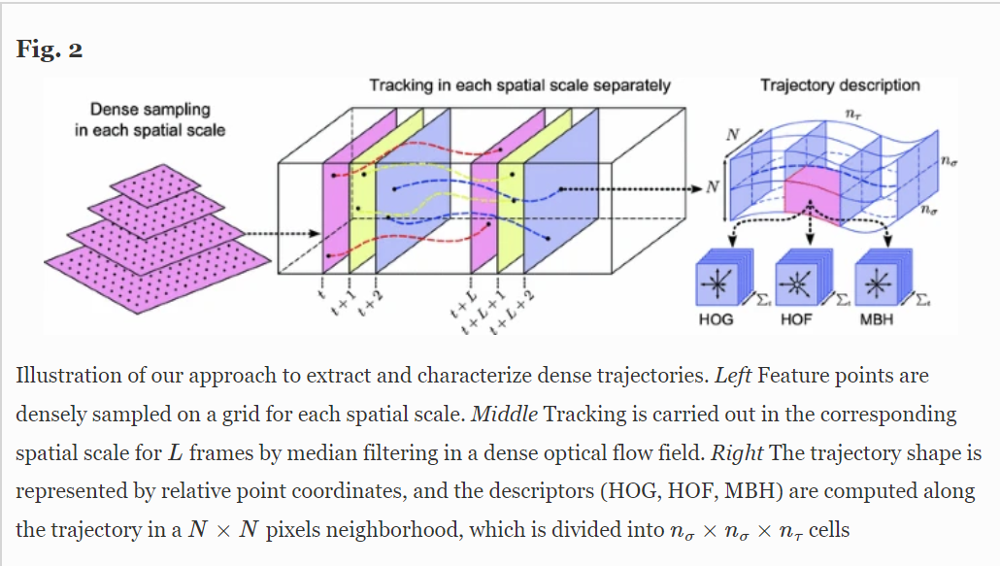
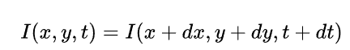
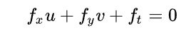
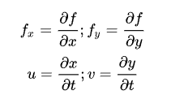

# 基于RGB视频的行为识别

## 1. 综述

**行为识别Action Recognition**是指对视频中人的行为动作进行识别，即读懂视频。

- 类型划分：
  - **Hand gesture**：集中于处理视频片段中单人的手势
  - **Action**：短时间的行为动作，场景往往是短视频片段的单人行为，比如Throw，catch，clap等
  - **Activity**：持续时间较长的行为，场景往往是较长视频中的单人或多人行为

- 任务划分：
  
  - **Classification**：给定预先裁剪好的视频片段，预测其所属的行为类别✨
  - **Detection：**视频是未经过裁剪的，需要先进行人的检测where和行为定位（分析行为的始末时间）when，再进行行为的分类what。（行为检测）
  
- 解读：

  [一文了解通用行为识别ActionRecognition：了解及分类 - 知乎 (zhihu.com)](https://zhuanlan.zhihu.com/p/103566134)

- 框架：

  [open-mmlab/mmaction2: OpenMMLab's Next Generation Video Understanding Toolbox and Benchmark (github.com)](https://github.com/open-mmlab/mmaction2)

- 3D-Conv与CNN+LSTM算法参考代码（PyTorch）

  [MRzzm/action-recognition-models-pytorch: The models of action recognition with pytorch (github.com)](https://github.com/MRzzm/action-recognition-models-pytorch)

- 基于RGB-D的行为识别综述

  [基于RGB-D的深度学习人体运动识别：|调查深爱 (deepai.org)](https://deepai.org/publication/rgb-d-based-human-motion-recognition-with-deep-learning-a-survey)
  
- 深度学习分类不绝对，今年来大部分使用融合模型🍳

### 1.1 A Comprehensive Study of Deep Video Action Recognition（2020）

## 2. 传统算法

### 2.1 DT（2013 IJCV）

> Dense Trajectories and Motion Boundary Descriptors for Action Recognition

[行为识别笔记：improved dense trajectories算法（iDT算法） - 知乎 (zhihu.com)](https://zhuanlan.zhihu.com/p/27528934)

- **解读：**

  框架包括密集采样点特征、特征点轨迹跟踪和基于轨迹的特征提取三部分，后续再进行特征编码和分类。

  在得到视频对应的特征后，DT算法采用SVM分类器进行分类，采用one-against-rest策略训练多类分类器。

- **模型：**

  

### 2.2 iDT（2013 ICCV）

> Action Recognition with Improved Trajectories

- iDT算法的基本框架和DT算法相同，主要改进在于对光流图像的优化，特征正则化方式的改进以及特征编码方式的改进。
- 通过估计相机运动估计来消除背景上的光流以及轨迹
  - 对于HOF,HOG和MBH特征采取了与DT算法（L2范数归一化）不同的方式——L1正则化后再对特征的每个维度开平方
- 使用效果更好的Fisher Vector特征编码

## 3. 深度学习方法

### 3.1 Two-Stream

Two-Stream将动作识别中的特征提取分为两个分支，一个是RGB分支提取空间特征，另一个是光流分支提取时间上的光流特征，最后结合两种特征进行动作识别。

- 解读：

  [论文笔记——基于深度学习的视频行为识别/动作识别（一） - 知乎 (zhihu.com)](https://zhuanlan.zhihu.com/p/40964492)

#### 3.1.1 TwoStreamCNN（2014 NeurIPS）

> Two-stream convolutional networks for action recognition in videos

- **解读：**

  - 多任务学习

  - [(1条消息) 【论文学习】Two-Stream Convolutional Networks for Action Recognition in Videos_I am what i am-CSDN博客](https://blog.csdn.net/liuxiao214/article/details/78377791)

#### 3.1.2 TwoStreamFusion（2016 CVPR）

> Convolutional Two-Stream Network Fusion for Video Action Recognition

- **解读：**

  - 解决two stream的两个问题，一是不能在空间和时间特征之间学习像素级的对应关系，二是空域卷积只在单RGB帧上时域卷积只在堆叠的L个时序相邻的光流帧上，时间规模非常有限。
  - 该文章通篇谈的是融合(Fusion)，关键阐释的是如何去融合空域卷积网络与时域卷积网络、在哪里融合这两个网络、如何在时域上融合网络三个问题。
  - [【论文】Convolutional Two-Stream Network Fusion for Video Action Recognition_安静-CSDN博客](https://blog.csdn.net/u013588351/article/details/102074562?spm=1001.2101.3001.6650.1&utm_medium=distribute.pc_relevant.none-task-blog-2~default~OPENSEARCH~Rate-1.pc_relevant_aa&depth_1-utm_source=distribute.pc_relevant.none-task-blog-2~default~OPENSEARCH~Rate-1.pc_relevant_aa&utm_relevant_index=2)

  

#### 3.1.3 TSN（2016 ECCV）

> Temporal segment networks: Towards good practices for deep action recognition

- **解读：**

  - [TSN(Temporal Segment Networks)算法笔记_AI之路-CSDN博客_tsn模型](https://blog.csdn.net/u014380165/article/details/79029309)

  - [视频理解-Temporal Segment Network TSN - 知乎 (zhihu.com)](https://zhuanlan.zhihu.com/p/84598874)

  

#### 3.1.4 Two-Stream I3D（2017 CVPR）

> Quo Vadis, Action Recognition? A New Model and the Kinetics Dataset

#### 3.1.5 TRN（2018 ECCV）

> Temporal Relational Reasoning in Videos

- **解读：**

  - 时间关系推理（Temporal relational reasoning）是指理解物体／实体在时间域的变化关系的能力。
  - 本文对TSN最后融合方式做一个改进，TSN每个snippet独立地预测，而TRN在预测前先进行snippet间的特征融合。另外TRN的输入用的是不同帧数的snippet(different scale)。
  - [【论文笔记】视频分类系列 Temporal Relational Reasoning in Videos （TRN）_elaine_bao的专栏-CSDN博客](https://blog.csdn.net/elaine_bao/article/details/80753506)

  

#### 3.1.6 TSM（2019 ICCV）

> TSM: Temporal Shift Module for Efficient Video Understanding

#### 3.1.7 LGD-3D Two-stream（2019 CVPR）

> Learning Spatio-Temporal Representation with Local and Global Diffusion

#### 3.1.8 SlowFast（2019 ICCV）

> SlowFast Networks for Video Recognition

#### 3.1.9 TPM（2020 CVPR）

> Temporal Pyramid Network for Action Recognition

### 3.2 3D-Conv

3D convolution 直接将2D卷积扩展到3D（添加了时间维度），直接提取包含时间和空间两方面的特征。

- 解读：

  [论文笔记——基于的视频行为识别/动作识别算法笔记(三) - 知乎 (zhihu.com)](https://zhuanlan.zhihu.com/p/41659502)

#### 3.2.1 C3D（2015 ICCV）

> Learning spatiotemporal features with 3d convolutional networks

#### 3.2.2 P3D（2017 ICCV）

> Learning spatio-temporal representation with pseudo-3d residual networks

#### 3.2.3 R(2+1)D（2018 CVPR）

> A Closer Look at Spatiotemporal Convolutions for Action Recognition

#### 3.2.4 ResNeXt-101（2018 CVPR）

> Can Spatiotemporal 3D CNNs Retrace the History of 2D CNNs and ImageNet?

#### 3.2.5 MARS（2019 CVPR）

> MARS: Motion-Augmented RGB Stream for Action Recognition

### 3.3 CNN+LSTM

这种方法通常使用CNN提取空间特征，使用RNN（如LSTM）提取时序特征，进行行为识别。

- 解读：

  [论文笔记——基于深度学习的视频行为识别/动作识别（二） - 知乎 (zhihu.com)](https://zhuanlan.zhihu.com/p/41125934)

#### 3.3.1 LRCN（2015 CVPR）

> Long-term recurrent convolutional networks for visual recognition and description

#### 3.3.2  Beyond short snippets（2015 CVPR）

> Beyond Short Snippets: Deep Networks for Video Classification

#### 3.3.3 TS-LSTM（2017）

> TS-LSTM and Temporal-Inception: Exploiting Spatiotemporal Dynamics for Activity Recognition

### 3.4 Transformer-based

#### 3.4.1 VidTr（2021 ICCV）

> VidTr: Video Transformer Without Convolutions

#### 3.4.2 ViViT（2021 ICCV）

> ViViT: A Video Vision Transformer

#### 3.4.3 MViT-B, 32x3（2021 ICCV）

> Multiscale Vision Transformers

#### 3.4.4 Mformer-HR（2021NIPS）

> Keeping Your Eye on the Ball: Trajectory Attention in Video Transformers

#### 3.4.5 MViT-L/B（2021）

> Improved Multiscale Vision Transformers for Classification and Detection

#### 3.4.6 X-Vit（2021 NeurIPS）

> Space-time Mixing Attention for Video Transformer

#### 3.4.7 RSANet-R50（2021 NeurIPS）

> Relational Self-Attention: What's Missing in Attention for Video Understanding

#### 3.4.8 UniFormer（2022 ICLR）

> UniFormer: Unified Transformer for Efficient Spatial-Temporal Representation Learning

### 3.5 others

#### 3.5.1 OmniSource（2020 ECCV）

> Omni-sourced Webly-supervised Learning for Video Recognition

#### 3.5.2 HATNet（2020 ECCV）

> Large Scale Holistic Video Understanding

#### 3.5.3 SMART（2021 AAAI）

> SMART Frame Selection for Action Recognition

#### 3.5.4 MorphMLP（2021）

> MorphMLP: A Self-Attention Free, MLP-Like Backbone for Image and Video

#### 3.5.5 ACTION-Net（2021 CVPR）

> ACTION-Net: Multipath Excitation for Action Recognition

#### 3.5.6 MoViNets（2021 CVPR）

> MoViNets: Mobile Video Networks for Efficient Video Recognition

#### 3.5.7 TDN ResNet101（2021 CVPR）

> TDN: Temporal Difference Networks for Efficient Action Recognition

#### 3.5.8 SELFYNet-TSM-R50En（2021 ICCV）

> Learning Self-Similarity in Space and Time as Generalized Motion for Video Action Recognition

#### 3.5.9 CT-Net（2021 ICLR）

> CT-Net: Channel Tensorization Network for Video Classification

## 4. 自监督的行为识别

### 4.1 DEEP-HAL with ODF+SDF（2021 ACM MM）

> Self-supervising Action Recognition by Statistical Moment and Subspace Descriptors

### 4.2 VideoMoCo（2021 CVPR）

> VideoMoCo: Contrastive Video Representation Learning with Temporally Adversarial Examples

### 4.3 VIMPAC（2021）

> VIMPAC: Video Pre-Training via Masked Token Prediction and Contrastive Learning

### 4.4 MaskFeat（2021）

> Masked Feature Prediction for Self-Supervised Visual Pre-Training

## 5. RGB数据集

### 5.1 UCF-101

目前行为识别最常使用的数据集之一，共包含101个动作，13320个视频。

### 5.2 HMDB-51

### 5.3 Something-Something V2

### 5.4 Kinetics-700

## 6. 其他

### 6.1 光流

- **光流**是空间运动物体在**观察成像平面**上的像素运动的**瞬时速度**，是利用图像序列中像素在时间域上的变化以及相邻帧之间的**相关性**来找到上一帧跟当前帧之间存在的对应关系，从而计算出相邻帧之间物体的运动信息的一种方法。

- 光流之所以生效是依赖于这几个假设：

  1. 物体的像素强度不会在连续帧之间改变；
  2. 一张图像中相邻的像素具有相似的运动。

- **光流的计算方法**

  假设第一帧图像中的像素 *I(x, y, t)* 在时间 *dt* 后移动到第二帧图像的 *(x+dx, y+dy)* 处。根据上述第一条假设：灰度值不变，我们可以得到：

  

  对等号右侧进行泰勒级数展开，消去相同项，两边都除以 *dt* ，得到如下方程：

  

  

  fx,fy均可由图像数据求得，而**(u,v)即为所求光流矢量**。

  上述一个等式中有两个未知数。有几个方法可以解决这个问题，其中的一个是 Lucas-Kanade 法 。增加有一个假设：

  这里就要用到上面提到的第二个假设条件，领域内的所有像素点具有相同的运动。Lucas-Kanade法就是利用一个3x3的领域中的9个像素点具有相同的运动，就可以得到9个点的光流方程(即上述公式)，用这些方程来求得*(u, v)* 这两个未知数，显然这是个约束条件过多的方程组，不能解得精确解，一个好的解决方法就是使用最小二乘来拟合。

  opencv提供函数计算，参考[OpenCV小例程——光流法_xiao_lxl的专栏-CSDN博客_opencv 光流算法](https://blog.csdn.net/xiao_lxl/article/details/95330541)

